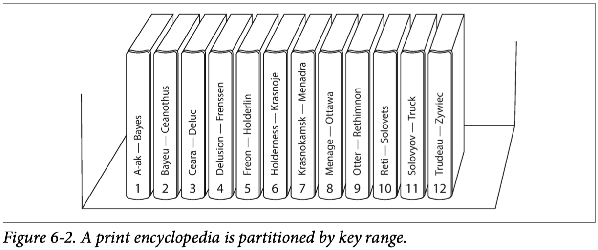

# Part I

# Chapter 1: Reliable, Scalable, and Maintainable Applications

## Availability

Percentage of time a system or service is operational and accessible when needed. It measures how often the system is up compared to the total time it should be available.

- **Downtime Based on Availability**:
  | Availability | Downtime           |
  |--------------|--------------------|
  | 99%          | 3.65 days/year     |
  | 99.9%        | 8.77 hours/year    |
  | 99.99%       | 52.6 minutes/year  |
  | 99.999%      | 5.26 minutes/year  |
  | 100%         | 0 seconds/year     |

  Each additional nine decreases the downtime by an order of magnitude of roughly 10 times.

## Reliability

Measures how consistently and correctly a system performs its intended functions over time without failure.

- **Measurement**:
  - Often assessed using metrics such as Mean Time Between Failures (MTBF) or Mean Time to Failure (MTTF), which quantify how long the system performs correctly before encountering a failure.

## Redundancy

The inclusion of extra components or systems to ensure continued operation in the event of a failure.

- Redundancy Types
    | Type                      | Description                                                                                                                           |
    |---------------------------|---------------------------------------------------------------------------------------------------------------------------------------|
    | **Hardware Redundancy**   | Spare hardware components (e.g., additional servers, power supplies, or network links) that can take over if primary components fail. |
    | **Data Redundancy**       | Replicating data across multiple storage devices or locations to protect against data loss.                                           |
    | **Geographic Redundancy** | Distributing resources across different locations or data centers to protect against site-specific failures.                          |


## Maintainability

Ensuring that various people (engineering and operations) can work on the system productively over time.

| **Factors**      | **Description**                                                         |
|------------------|-------------------------------------------------------------------------|
| **Operability**  | Make it easy for operations teams to keep the system running smoothly.  |
| **Simplicity**   | Make it easy for new engineers to understand the system.                |
| **Evolvability** | Make it easy for engineers to make changes to the system in the future. |


## Fault and Failure

- **Fault**: A deviation of one component from its specification.
- **Failure**: When the system as a whole stops providing the required service to the user.

## Rolling Upgrade

A method of upgrading a system without shutting it down or interrupting its operation.

## Throughput

The amount of work processed by a system or component in a given amount of time.

- Examples:
  - **Systems Performance**: Requests per second (requests/second)
  - **Networks**: Megabits per second (Mbps)
  - **Databases**: Queries per second (queries/second)

## Latency

The time delay between the initiation of a request and the beginning of a response.

## Service Time

The time it takes to process a request, including tasks like authorization and load balancing.

## Response Time

The total time from the initiation of a request until the entire response is received and processed. It encompasses both latency and service time.

- **Metrics**:
  - **Average Response Time**: Often reported as the arithmetic mean, but may not reflect the typical user experience.
  - **Percentiles**: Provide a better understanding of response times, with the median being the halfway point. Percentile algorithms include:
    - Forward Decay
    - T-Digest
    - HDRHistogram

## Scaling

- **Vertical Scaling**: *Scaling up* by improving the hardware of the hosting machine.
- **Horizontal Scaling**: *Scaling out* by adding more machines to handle increased load. Known as a shared-nothing architecture.

## SLA (Service Level Agreement)

Contracts that define the expected performance and availability of a service.

## Telemetry

Monitoring performance metrics and error rates. Essential for understanding system status after deployment.

## Load Parameters

- Examples: 
    - Requests per second.
    - Reads-to-writes ratio.

## Fan-out

- **Note**: Refer to page 29 for detailed information.

## Elastic Systems

Systems that can scale automatically.


# Chapter 2: Data Models and Query Languages

## Relational vs. Document Model

- **Pros and Cons**

  - **SQL Databases**:
    - Pros:
      - Better support for joins, and many-to-one and many-to-many relationships.
      - Reliable for complex transactions and strong consistency.
    - Cons:
      - Splitting a document-like structure into multiple tables can lead to cumbersome schemas and complex application code.

  - **NoSQL Databases**:
    - Pros:
      - Schema flexibility.
      - Better performance due to locality.
      - For some applications, closer to the data structures used by the application.
    - Cons:
      - Document model can become less appealing for applications with many-to-many relationships.

## Data Model

- **SQL Databases**:
  - Relational model with tables, rows, and columns.
  - Accessed via SQL queries.
  - Schema is predefined and changes can be complex.

- **NoSQL Databases**:
  - Varied models including document stores, key-value stores, column-family stores, and graph databases.
  - Flexible schema, allowing for adjustments and hierarchical or nested data structures.

## Schema Flexibility

- **SQL Databases**:
  - Fixed schema.
  - Schema changes require migrations, which can be time-consuming.

- **NoSQL Databases**:
  - Dynamic schema.
  - Easier to store different fields or structures in records without predefined schema changes.

## Consistency and Transactions

- **SQL Databases**:
  - Adhere to ACID (Atomicity, Consistency, Isolation, Durability) properties.
  - Ensure reliable transactions and consistency even in system failures.

- **NoSQL Databases**:
  - May prioritize availability and partition tolerance (CAP theorem) over strict consistency.
  - Often offer eventual consistency instead of strong consistency.
  - Multi-statement transactions might not be as robust.

## Scalability

- **SQL Databases**:
  - Typically scale vertically (adding resources to a single server).

- **NoSQL Databases**:
  - Designed to scale out horizontally (distributing data across multiple servers).
  - Can handle large volumes of data and high-velocity workloads more effectively.

## Query Language

- **SQL Databases**:
  - Use Structured Query Language (SQL).
  - SQL is powerful for complex queries involving multiple tables.

- **NoSQL Databases**:
  - Query mechanisms vary by database type.
  - Document stores might use JSON-based queries; key-value stores use simple key-based lookups.

## Use Cases

- **SQL Databases**:
  - Best for applications needing complex transactions, strong consistency, and well-defined schemas.
  - Examples: Financial systems, traditional enterprise applications.

- **NoSQL Databases**:
  - Ideal for scenarios where scalability, flexibility, and high performance are critical.
  - Examples: Real-time web applications, big data applications, content management systems.

## Document Storage

A document is usually stored as a single continuous string, encoded as JSON, XML, or a binary variant (e.g., MongoDB’s BSON). If your application often needs to access the entire document (e.g., to render it on a web page), there is a performance advantage due to this storage locality.

If data is split across multiple tables, as shown in Figure 2-1, multiple index lookups are required to retrieve it all. This can result in more disk seeks and longer retrieval times. The locality advantage is significant if large parts of the document are needed simultaneously.

## Imperative vs. Declarative Languages

- **Imperative Language**:
  - Specifies the exact operations in a particular order (e.g., JavaScript, Python).
  - Example: Line-by-line instructions on what to do.

- **Declarative Language**:
  - Specifies what the result should be, without detailing how to achieve it (e.g., CSS, React).

## MapReduce

- **Overview**:
  - A programming model for handling large amounts of data across many machines, popularized by Google.
  - A limited form of MapReduce is supported by some NoSQL datastores, including MongoDB and CouchDB, for read-only queries across many documents.
  - Combines `map` and `reduce` functions from functional programming languages.

- **Map Function**:
    ```Python
        # Map
        # Applies a given function to all items in an iterable (like a list) and returns an iterator that produces the results
        
        # Define a function to be applied to each element
        def square(x):
            return x * x
        numbers = [1, 2, 3, 4, 5]
        # Apply the function to each item in the list using map
        squared_numbers = map(square, numbers)
        # Convert the map object to a list and print it
        print(list(squared_numbers))  # Output: [1, 4, 9, 16, 25]

        # Reduce
        # Applies a binary function (a function that takes two arguments) cumulatively to the items of an iterable, from left to right, so as to reduce the iterable to a single value.
        from functools import reduce
        # Define a function to be used for reduction
        def add(x, y):
            return x + y
        numbers = [1, 2, 3, 4, 5]
        # Apply the function cumulatively using reduce
        sum_of_numbers = reduce(add, numbers)

        print(sum_of_numbers)  # Output: 15
      ```

## Graph-Like Data Models

In scenarios where **many-to-many relationships** are prevalent, a graph-like data model can be particularly effective. This model consists of the following key components:

- **Vertices** (also known as **nodes** or **entities**):
  - Represent **individual objects** or **entities** in the graph.
  - Each vertex can contain attributes or properties that describe the entity it represents.
  - Examples: People, locations, products, or any distinct objects.

- **Edges** (also known as **relationships** or **arcs**):
  - Represent the **connections** or **relationships** between vertices.
  - Edges can be **directed** or **undirected**:
    - **Directed edges** have a direction, indicating a one-way relationship (e.g., A → B).
    - **Undirected edges** do not have a direction, indicating a mutual relationship (e.g., A ↔ B).
  - Each edge can also have attributes or properties that describe the relationship.

### Key Characteristics

- **Flexible Schema**:
  - Graph models do not require a rigid schema, allowing the addition of new types of relationships or entities without altering existing data.

- **Efficient Traversal**:
  - Graph databases are optimized for traversing and querying relationships between vertices, making them suitable for applications requiring complex queries over interconnected data.

- **Use Cases**:
  - Social networks (e.g., users, friends, and interactions)
  - Recommendation systems (e.g., users and products)
  - Fraud detection (e.g., transactions and accounts)
  - Network and IT infrastructure (e.g., servers, connections, and configurations)

- Examples
    - **Social Network**:
    - **Vertices**: Users
    - **Edges**: Friendships, messages, posts

    - **Recommendation System**:
    - **Vertices**: Users, Products
    - **Edges**: Purchases, ratings, reviews

### Triple Stores and SPARQL

- **Triple Stores**:
  - Triple Stores are a type of graph database designed to store and manage **RDF (Resource Description Framework)** data, represented as triples. Each triple consists of:
    - **Subject**: The entity being described.
    - **Predicate**: The property or relationship.
    - **Object**: The value or another entity related to the subject.
  - Triple stores are particularly suited for managing semantic data and ontologies.
  
  - **Examples of Triple Stores**:
    - Apache Jena
    - RDF4J
    - Virtuoso

- **SPARQL**:
  - **SPARQL** (SPARQL Protocol and RDF Query Language) is a query language specifically designed for querying RDF data. It allows users to perform complex queries to retrieve and manipulate data stored in triple stores.
  
  - **Basic SPARQL Query Structure**:
    - **SELECT**: Specifies the variables to return.
    - **WHERE**: Contains the pattern to match in the data.
    - **FILTER**: (Optional) Refines the results based on conditions.

  - **Example Query**:
    ```sparql
      PREFIX ex: <http://example.org/>

      SELECT ?person ?email
      WHERE {
        ?person ex:hasEmail ?email .
        FILTER (CONTAINS(?email, "@example.com"))
      }
    ```

### Additional Concepts

- **Normalization**:
  - In databases, normalization means to store the data in such a way that it is **unique** and not duplicated. For example, in LinkedIn, your profile has a city or location, but the database has separate tables for users and cities. If you update the city name in the cities table, all users with that city will have their data updated.

- **Schema-on-Read**:
  - XML databases don't have concrete schemas like relational databases. This doesn't mean they lack structure; the structure is implicit, as the application ensures data validity. Hence, "schema-on-read" is a more accurate term than "schema-less."

- **Heterogeneous Data**:
  - Data that does not follow the same structure across all records. Example: Chocolate chip cookies vary in shape and size.

- **Homogeneous Data**:
  - Data that follows the same structure or pattern across all records. It does not mean all records have identical information, but they adhere to a consistent format.

- **Declarative Language**:
  - Specifies what outcome you want without detailing the steps to achieve it.

- **Imperative Language**:
  - Specifies the exact steps needed to achieve the desired outcome.


# Chapter 3: Storage and Retrieval

## Log

- An append-only sequence of records.
    - Many databases internally use a log, which is an append-only data file.

  - **Application Logs**:
    - These logs record events and activities within an application.
    - Example: Log files capturing user interactions, errors, or system events.

  - **DB Log**:
    
    - Some databases use an internal append-only log to track records.
    
    - **Note**: Consider the example of the world's simplest database using bash commands, which illustrates how a log can be used in this context:
      ```bash
        db_set() {
            echo "$1, $2" >> database
        }
        
        db_get() {
            grep "^$1," database | sed -e 's/^$1,//' | tail -n 1
        }
      ```
    
    - In this example:
      - `db_set` appends a record (key-value pair) to the `database` file.
      - `db_get` retrieves the most recent value associated with a key from the `database` file.

  - **Understanding Logs**:
    - Logs are essential for tracking changes and maintaining a history of operations in databases.
    - The append-only nature of logs ensures that all changes are recorded sequentially, which aids in data recovery and consistency.

## Database Indexing Structures

- **Index**: An additional structure derived from the primary data. It allows faster record searches in the database but can slow down writes.

### Hash Indexes

- **Hash Indexes**: 
  - Imagine our data storage involves only appending to a file. The simplest indexing strategy is to maintain an in-memory hash map where each key maps to a byte offset in the data file, indicating where the value can be found.
  - This is similar to the LeetCode problem *'Encode and Decode Strings'*.

### SSTables and LSM-Trees

- **Sorted String Tables (SSTables)**:
  - Similar to log files used in the *Hash Indexes* example, but with an added detail: segment files are sorted by key, and each key appears only once within each merged segment file (ensured by the compaction process).
  - Merging segments is efficient, akin to the merge sort algorithm, even if the files are larger than available memory.
  - To find a key, you don't need an index of all keys in memory; a sparse in-memory index is sufficient. For example, if you need a key between two in-memory index keys, use the offset of the first key and search from there.
  - Since read requests involve scanning several key-value pairs, grouping records into a block and compressing it before writing to disk is possible.

- **Log-Structured Merge-Tree (LSM-Tree)**:
  - LSM storage engines are based on merging and compacting sorted files.

- **Compaction Strategies**:
  - **Size-Tiered Compaction**: Newer, smaller SSTables are merged into older, larger SSTables.
    - Used by: Cassandra, HBase
  - **Leveled Compaction**: Splits the key range into smaller SSTables and moves older data into separate levels, allowing more incremental compaction and less disk space usage.
    - Used by: LevelDB, RocksDB, Cassandra

- **Advantages**:
  - Sorted data supports efficient range queries, and sequential disk writes enable high write throughput.

### B-Trees

- **B-Trees**:
  - Like SSTables, B-trees keep key-value pairs sorted by key, enabling efficient lookups and range queries. However, B-trees differ significantly in design.

- **Structure**:
  - B-trees use fixed-size blocks or pages (traditionally 4 KB) and read or write one page at a time.
  - **Pages**: Identified using an address, allowing pages to refer to other pages (similar to pointers but on disk).
    - **Leaf Page**: Stores values of the keys in its range without references.
    - **Branching Factor**: Number of references to child pages. Typically several hundred.

- **Operations**:
  - If a leaf page cannot accommodate a new key-value pair, it splits into two pages, and the parent page is updated.

- **Note**:
  - A B-tree with `n` keys has a depth of `O(log n)`. Most databases fit into a B-tree that's three or four levels deep, handling up to 256 TB with a branching factor of 500.

- **Write-Ahead Log (WAL)**:
  - **WAL**: An append-only file where every B-tree modification is written before being applied to the pages. This log restores the B-tree to a consistent state after a crash.

- **Concurrency Control**:
  - Managed with *latches* (lightweight locks) to prevent concurrent access issues.

- **Optimizations**:
  - **Copy-On-Write**: Some databases (e.g., LMDB) use this instead of overwriting pages and maintaining a WAL.
  - **Abbreviated Keys**: Store shorter keys in pages to save space and increase branching factor.
  - **Page Layout**: Aim to lay out leaf pages sequentially on disk, though maintaining this order can be challenging.
  - **Additional Pointers**: Leaf pages may include references to neighboring sibling pages.

- **Comparison with LSM-Trees**:
  - **Rule of Thumb**:
    - LSM-trees are generally faster for writes.
    - B-trees are typically faster for reads.
  - **Advantages of LSM-Trees**:
    - Write amplification: B-trees write data at least twice (WAL and page), while LSM-trees can reduce this through compaction.
    - Better write throughput, particularly on magnetic hard drives due to sequential writes.
    - More effective compression and lower storage overhead, especially with leveled compaction.

  - **Downsides of LSM-Trees**:
    - Compaction can interfere with performance, especially on high write throughput.
    - Disk bandwidth for initial writes and compaction may become a bottleneck.
    - Multiple copies of the same key across segments can occur.

### Other Indexing Structures

- **Key-Value Indexes**: As discussed, similar to a primary key index in the relational model.
- **Secondary Indexes**: Can be created using the `CREATE INDEX` command in relational databases. Both B-trees and log-structured indexes can serve as secondary indexes.

### Storing Values within the Index

- **Heap File**:
  - The index's key is used for queries, while the value can be:
    - The actual row data.
    - A reference to the row stored elsewhere in a *heap file*, which maintains data in no particular order.

- **Clustered Index**:
  - Stores the indexed row directly within the index, optimizing read performance but potentially increasing storage and write overhead.

- **Covering Index**:
  - Stores some columns of a table within the index, allowing queries to be answered by the index alone. This reduces read times but increases storage and write overhead.

### Multi-Column Indexes

- **Concatenated Index**:
  - Combines several fields into one key by appending columns, e.g., (lastname, firstname). Useful for queries involving multiple fields in a specific order.

- **Multi-Dimensional Indexes**:
  - Generalize querying multiple columns, important for geospatial data and other multi-dimensional queries.
    - Examples:
      - Ecommerce: Search products by color (RGB dimensions).
      - Weather Database: Search for temperature observations within a range on specific dates.

## Full-Text Search and Fuzzy Indexes

- Traditional indexes do not support searching for similar keys, such as misspelled words.
- This is known as **fuzzy querying**, which requires different techniques.
- **Lucene**:
    - Lucene allows searching for words within a certain **edit distance**. For instance, an edit distance of 1 means that one letter has been added, removed, or replaced.
    - It uses an SSTable-like structure for its term dictionary. This structure includes a small in-memory index that helps locate the offset in the sorted file where a key can be found.
    - Lucene’s in-memory index is a finite state automaton over the characters in the keys, similar to a trie.
    - This automaton can be converted into a **Levenshtein automaton**, which supports efficient search for words within a given edit distance.

### Keeping Everything in Memory

  - Compared to main memory, disks are more cumbersome to deal with. We use disks because:
    - They are **durable** (data is not lost if the power is turned off).
    - They have a **lower cost per gigabyte** compared to RAM.
  
  - As RAM prices decrease, the cost argument for disks diminishes. Many datasets are manageable within RAM, making it feasible to keep them entirely in memory, sometimes distributed across multiple machines. This has led to the development of **in-memory databases**.
    - Examples: 
        - Memcached
        - Redis
  - Some in-memory key-value stores, like **Memcached**, are designed solely for caching, where data loss upon restart is acceptable.
  
  - Other in-memory databases focus on **durability** through:
    - Special hardware (e.g., battery-powered RAM),
    - Writing a log of changes to disk,
    - Periodic snapshots to disk,
    - Replicating the in-memory state to other machines.
  
  - When an in-memory database restarts, it reloads its state from disk or over the network from a **replica**.
    - The disk acts as an append-only log for durability, while reads are served entirely from memory.
  
  - **In-memory DBs** can be faster as they avoid the overhead of encoding data structures for disk storage.
  
  - **Anti-Caching**: Evicts the least recently used data from memory to disk when memory is insufficient, and reloads it into memory when accessed again.

### Transaction Processing or Analytics?

- **Transaction Processing vs. Analytics**:
  
  - **Transaction**: A logical unit of reads and writes. Transactions do not necessarily need to have ACID properties but should allow low-latency reads and writes.
    - Unlike batch processing jobs, which run periodically (e.g., once per day).
  
  - **OLTP** (*Online Transaction Processing*):
    - Designed to handle a high volume of short online transactions (inserts, updates, queries).
    - Focuses on:
      - Fast query processing,
      - Maintaining data integrity in multi-user environments.
    - Commonly used in applications like retail sales and banking.
  
  - **OLAP** (*Online Analytics Processing*):
    - Optimized for querying and analyzing large volumes of data.
    - Supports complex queries and multidimensional analysis.
    - Often used for business intelligence, reporting, and data mining.

  - **OLTP VS. OLAP**
    | Property                 | Transaction Processing Systems (OLTP)             | Analytic Systems (OLAP)                   |
    |--------------------------|---------------------------------------------------|-------------------------------------------|
    | **Main read pattern**    | Small number of records per query, fetched by key | Aggregate over large number of records    |
    | **Main write pattern**   | Random-access, low-latency writes from user input | Bulk import (ETL) or event stream         |
    | **Primarily used by**    | End user/customer, via web application            | Internal analyst, for decision support    |
    | **What data represents** | Latest state of data (current point in time)      | History of events that happened over time |
    | **Dataset size**         | Gigabytes to terabytes                            | Terabytes to petabytes                    |

    - In the late 1980s and early 1990s, there was a trend for companies to stop using their OLTP systems for analytics purposes, and to run the analytics on a separate database instead. This separate database was called a __*data warehouse*__.


## Data Warehousing

A **data warehouse** is a separate database designed for querying by analysts without affecting OLTP operations.
- Database administrators often prefer not to have analysts interacting with OLTP databases directly.
- The data warehouse contains a read-only copy of data from various OLTP systems within the company.
- **ETL** (*Extract–Transform–Load*):
    - Data is extracted from OLTP databases using either periodic data dumps or continuous updates.
    - The data is then:
      - Transformed into an analysis-friendly schema,
      - Cleaned up,
      - Loaded into the data warehouse.

### The Divergence Between OLTP Databases and Data Warehouses

- **OLTP vs. Data Warehousing**:
  - OLTP databases are optimized for fast, real-time transaction processing and maintain data integrity.
  - Data warehouses are optimized for complex queries and data analysis, supporting historical data and large-scale data processing.

### Stars and Snowflakes: Schemas for Analytics

- **Star Schema**: Central fact tables connected to dimension tables in a star-like pattern. Useful for straightforward querying.
- **Snowflake Schema**: A more normalized form of the star schema where dimension tables are split into multiple related tables. This reduces redundancy but can complicate queries.

### Column-Oriented Storage

In column-oriented storage, values from each column are stored together rather than values from each row.
  
  - **Column Compression**:
    - **Note**: Systems like Cassandra and HBase use column families, but they store columns together within each family and do not use column compression extensively. Thus, they are primarily row-oriented.

  - **Memory Bandwidth and Vectorized Processing**:
    - Column-oriented storage reduces the volume of data loaded from disk and enhances CPU efficiency.
    - Column data can fit in the CPU’s L1 cache, allowing for faster processing through **vectorized processing**.
    - **Vectorized processing** involves executing operations on chunks of compressed column data directly, improving performance.

  - **Writing to Column-Oriented Storage**:
    - **LSM-trees** are effective for writing to column-oriented storage. Writes first go to an in-memory store and are then merged with column files on disk.
    - This method is utilized by systems like Vertica.

  - **Aggregation: Data Cubes and Materialized Views**:
    - **Materialized Views**:
      - Used to cache frequently queried aggregates, reducing the need to recompute them each time.
      - Unlike virtual views, materialized views store actual copies of query results on disk.
      - Updates to the underlying data require refreshing materialized views, which can make writes more expensive but beneficial for read-heavy data warehouses.

[](https://www.youtube.com/watch?v=BIlFTFrEFOI)

- **Memtable**:
  - An in-memory balanced tree data structure, such as a red-black tree, used to manage writes before they are flushed to disk.

- **Bloom Filter**:
  - A memory-efficient data structure used to approximate the contents of a set.
  - It can indicate if a key does not exist in the database, reducing unnecessary disk reads for non-existent keys.

- **Compaction**:
  - Involves removing duplicate keys and retaining only the most recent update for each key to avoid running out of space.
  - Each segment has an in-memory hash table mapping keys to file offsets.
    - To find a key’s value, the most recent segment’s hash map is checked first, followed by older segments if necessary.
  
  - **Tombstone**:
    - A special deletion record appended to the data file to mark a key for deletion.
    - During log segment merges, tombstones instruct the merging process to discard any previous values for the deleted key.

## Storage Engines

- **Log-Structured**:
    - Optimized for write-heavy workloads with mechanisms like LSM-trees.
- **Page-Oriented**:
    - Focuses on reading and writing data in fixed-size pages, often used in traditional B-tree-based systems.


# Chapter 4. Encoding and Evolution

- **Backward Compatibility**
    - Newer code can read data that was written by older code.
        - Relatively easy to achieve.

- **Forward Compatibility**
    - Older code can read data that was written by newer code.
        - Tricky to achieve.

- **REST** 
    - Representational State Transfer
- **RPC**
    - Remote Procedure Calls

- **Message-Passing Systems**: Includes actors and message queues.

## Formats for Encoding Data

- **Encoding**: The translation from the in-memory representation to a byte sequence (also known as __*serialization*__ or __*marshalling*__).

- **Decoding**: The reverse of encoding, translating from a byte sequence to the in-memory representation.
  - Parsing
  - Deserialization
  - Unmarshalling

- **Language-Specific Formats**:
  | Language | Serialization Method     |
  |----------|--------------------------|
  | Python   | Pickle                   |
  | Java     | `java.io.Serializable`   |
  | Ruby     | Marshal                  |
  | Java     | Kryo (TPD)               |

- **JSON, XML, and Binary Variants**:
  - **JSON and XML**:
    - XML and CSV do not inherently distinguish between numbers and strings of digits (except through external schemas).
    - JSON distinguishes strings and numbers but does not differentiate between integers and floating-point numbers, nor does it specify precision.

      - **Precision Issues**: Integers greater than 2^53 cannot be exactly represented in an IEEE 754 double-precision floating-point number, leading to inaccuracies when parsed in languages using floating-point numbers (e.g., JavaScript).
        - **Example**: Twitter uses a 64-bit number for tweet IDs. Their API returns tweet IDs as both a JSON number and a decimal string to handle precision issues.

  - **Unicode Support**:
    - JSON and XML support Unicode character strings (human-readable text) but do not natively support binary strings (sequences of bytes without a character encoding).

  - **CSV**:
    - CSV lacks a schema, so the meaning of each row and column must be defined by the application.

- **Binary Encoding**
  - When data is used only internally within an organization, there is less pressure to use a lowest-common-denominator encoding format.
  
  - **Comparison with JSON and XML**:
    - JSON is less verbose than XML, but both formats still use more space compared to binary formats.

    - This has led to the development of various binary encodings for JSON, including:
      - MessagePack
      - BSON
      - BJSON
      - Smile
    
    - For XML, examples of binary encodings include:
      - WBXML
      - Fast Infoset

- **Thrift and Protocol Buffers**
  - **Apache Thrift** (developed by Facebook) and **Protocol Buffers (protobuf)** (developed by Google) are binary encoding libraries.
  - Both Thrift and Protocol Buffers provide code generation tools that:
    - Take a schema definition and produce classes that implement the schema in various programming languages.
    - Allow application code to call the generated code to encode or decode records based on the schema.

- **Field Tags and Schema Evolution**
  - **Removing Fields**:
    - Removing a field involves similar backward and forward compatibility concerns as adding a field, but with reversed implications.
    - You can only remove a field if it is optional (required fields cannot be removed).
    - Once a tag number is used, it should not be reused to avoid conflicts with existing data that might include the old tag number.

  - **Further Reading**:
    - For additional details on what a tag is in this context, refer to the subsection on tag definitions.

## Datatypes and Schema Evolution

  - **Changing Data Types**:
    - Changing the datatype of a field might be possible but can result in loss of precision or truncation. For example:
      - Changing a 32-bit integer to a 64-bit integer:
        - **New Code**: Can read data written by old code since it can handle the extra bits by filling them with zeros.
        - **Old Code**: Uses a 32-bit variable, so if it reads a 64-bit value, it may be truncated if the value exceeds 32 bits.

  - **Protocol Buffers**:
    - Protocol Buffers do not have a dedicated list or array datatype but use a `repeated` marker for fields.
      - This allows converting an `optional` (single-valued) field into a `repeated` (multi-valued) field without issues.

- **Avro**
    - Apache Avro is another binary encoding format that differs from Protocol Buffers and Thrift.
    - Avro uses schemas to define data structures and supports two schema languages:
      - **Avro IDL**: Intended for human editing.
      - **JSON-Based Schema**: More machine-readable.

  - **Writer’s Schema**:
    - For details on the writer’s schema, refer to the specific subsection.

  - **Dynamically Generated Schemas**:
    - For details on dynamically generated schemas, refer to the specific subsection.

## Dataflow Through Databases

Section talks about how you should write data to the DB in such a way that the future code shouldn't have trouble reading it. It also mentions an example where an ORM might be troublesom when updating DB records if the application code isn't updated (check the image 4-7). 

Lastly, it talks about how __*snapshots*__ are saved for backup and how you could take advantage of the fact they're read only and use an encoder format like parquet for data-warehousing for analytics or use Avro to reduce the snapshot file size.
- **DB migrations**: Rewriting data.

- **Dataflow Through Services: REST and RPC**

  - **Communication Roles**:
    - **Clients**: Connect to servers to make API requests.
    - **Servers**: Expose APIs over the network and may act as clients to other servers.

  - **Services**:
    - The API exposed by the server can impose restrictions on what clients can do, serving as a form of encapsulation.

  - **Ajax**:
    - *Asynchronous JavaScript and XML*: A technique where client-side JavaScript applications use XMLHttpRequest to act as HTTP clients.
      - The server response is typically data in a format like JSON for further client-side processing.
      - The API implemented on top is application-specific, and both client and server must agree on API details.

  - **Service-Oriented Architecture (SOA)**:
    - **Microservices Architecture**: A refined version of SOA.
      - Services should be independently deployable and evolvable, allowing teams to release new versions frequently without coordination with others.
      - Expect old and new versions of servers and clients to run simultaneously, requiring compatible data encoding across service API versions.

  - **Middleware**:
    - Software that supports service-to-service communication within the same organization, often within the same datacenter, is referred to as middleware.

## Popular Approaches to Web Services

  - **REST (REpresentational State Transfer)**:
    - A design philosophy built upon HTTP principles.
    - Key Characteristics:
      - Simple formats.
      - Uses URLs to identify resources.
      - Leverages HTTP features for cache control, authentication, and content type negotiation.
    - An API designed according to REST principles is called RESTful.

  - **SOAP (Simple Object Access Protocol)**:
    - An XML-based protocol for network API requests.
    - Key Characteristics:
      - Aims to be independent of HTTP and avoids using most HTTP features.
      - Includes a complex array of related standards (the web service framework known as WS) for additional features.
      - The API is described using an XML-based language called **WSDL (Web Services Description Language)**.
        - **WSDL** allows for code generation so clients can interact with remote services using local classes and methods, which are encoded to XML messages and decoded by the framework.
        - **WSDL** is not designed for human readability.
      - SOAP relies heavily on tool support, code generation, and IDEs.

  - **RPC (Remote Procedure Call)**:
    - RPC attempts to make remote network service requests resemble function or method calls in your programming language, within the same process (this abstraction is known as *location transparency*).
    - Focuses primarily on requests between services owned by the same organization, typically within the same datacenter.

  - **RPC Implementations**:
    - **Thrift and Avro**: Both come with built-in RPC support.
    - **gRPC**: An RPC implementation using Protocol Buffers.

  - **Data Encoding and Evolution for RPC**:
    - Simplifying Assumption:
      - It is reasonable to assume servers are updated before clients. Thus, backward compatibility is needed for requests, and forward compatibility is needed for responses.
    - Compatibility Properties:
      - **Thrift, gRPC (Protocol Buffers), and Avro RPC**: Evolve according to the compatibility rules of their respective encoding formats.
      - **SOAP**: Requests and responses are specified with XML schemas, which can be evolved, but subtle pitfalls exist.
      - **RESTful APIs**: Typically use JSON (without a formal schema) for responses, and JSON or URI-encoded/form-encoded parameters for requests. Adding optional parameters and new fields to responses usually maintains compatibility.

    - **Challenges**:
      - RPC is often used across organizational boundaries, making it difficult for the service provider to control client upgrades.
      - Compatibility-breaking changes often require maintaining multiple versions of the API side by side.

    - **API Versioning**:
      - No universal agreement on API versioning methods.
      - Common Approaches:
        - **RESTful APIs**: Version numbers in the URL or HTTP headers.
        - **API Keys**: Store requested API versions on the server and manage version selection through an administrative interface.

## Message-Passing Dataflow

- **Asynchronous Message-Passing Systems**:
    - These systems are situated between RPC (where one process sends a request to another process expecting a quick response) and databases (where one process writes data and another reads it later).
    
    - **Characteristics**:
      - Similar to RPC in that messages (requests) are delivered with low latency.
      - Similar to databases in that messages are sent through an intermediary called a message broker (or message queue, or message-oriented middleware), which temporarily stores the messages.
    
    - **Message Broker Advantages Over RPC**:

      - **Buffering**: Acts as a buffer if the recipient is unavailable or overloaded, improving system reliability.
      - **Automatic Redelivery**: Redelivers messages if the process has crashed, preventing message loss.
      - **Address Independence**: The sender does not need to know the recipient’s IP address and port number.
      - **Broadcasting**: Allows a single message to be sent to multiple recipients.
      - **Decoupling**: Logically decouples the sender from the recipient; the sender just publishes messages without needing to know who will consume them.
    
    - **Communication Pattern**:
      - Typically one-way: the sender does not expect a reply to the message, although responses can be sent on a separate channel.
      - Asynchronous: The sender does not wait for the message to be delivered but sends it and proceeds.

  - **Message Brokers**:
    - **Examples**:
      - RabbitMQ
      - ActiveMQ
      - HornetQ
      - NATS
      - Apache Kafka
    
    - **Usage**:
      1. A process sends a message to a named queue or topic.
      2. The broker ensures that the message is delivered to one or more consumers/subscribers.
      3. Multiple producers and consumers can interact with the same topic.
    
    - **Topics and Dataflow**:
      - A topic provides one-way dataflow, but a consumer can publish messages to another topic or a reply queue, enabling request/response patterns similar to RPC.
    
    - **Data Model**:
      - Message brokers do not enforce a specific data model; messages are sequences of bytes with metadata. Flexible encoding formats can be used as long as they are backward and forward compatible.
    
    - **Message Republishing**:
      - If a consumer republishes messages to another topic, care must be taken to preserve unknown fields to avoid issues similar to those in databases.

  - **Distributed Actor Frameworks**:
      - The actor model is a concurrency model within a single process. Instead of managing threads directly, logic is encapsulated in actors.
     
      - **Actor Characteristics**:
        - Each actor represents a client or entity with local state (not shared with other actors).
        - Actors communicate through asynchronous messages.
        - Message delivery is not guaranteed; messages may be lost in certain error scenarios.
        - Actors process one message at a time, avoiding threading issues, and can be scheduled independently by the framework.
    
    - **Further Reading**:
      - For a detailed understanding, refer to resources on distributed actor frameworks and their implementation.

## Additional concepts
- **Idempotence**:
    - Refers to operations where repeating the operation has the same effect as performing it once. (Details are not covered in this section but are important for RPC operations.)


# Part II

## Shared-Memory Architecture

All the components can be treated as a single machine 
  - Many CPUs, many RAM chips, and many disks can be joined together under one operating system, and a fast interconnect allows any CPU to access any part of the memory or disk.

    - The problem with a shared-memory approach is that the cost grows faster than linearly: a machine with twice as many CPUs, twice as much RAM, and twice as much disk capacity as another typically costs significantly more than twice as much.
      
    - And due to bottlenecks, a machine twice the size cannot necessarily handle twice the load.

## Shared-Disk Architecture

Uses several machines with independent CPUs and RAM, but stores data on an array of disks that is shared between the machines, which are connected via a fast network.

  - This architecture is used for some data warehousing workloads, but contention and the overhead of locking limit the scalability of the shared-disk approach.

- **Shared Nothing Architectures
Each machine or virtual machine running the database software is called a node. Each node uses its CPUs, RAM, and disks independently. 
  - Any coordination between nodes is done at the software level, using a conventional network.
  - No special hardware is required by a shared-nothing system, so you can use whatever machines have the best price/performance ratio.

## Shared-Nothing Architecture

In this approach, each machine or virtual machine running the database software is called a **node**.

  - Each node uses its CPUs, RAM, and disks independently.
  - Coordination between nodes is done at the software level, using a conventional network.
  - No special hardware is required.
    - You can distribute data across multiple geographic regions, and thus reduce latency. 

## Replication Versus Partitioning (Sharding)

  - **Replication**: Keeping a copy of the same data on several different nodes, potentially in different locations. Replication provides redundancy: if some nodes are unavailable, the data can still be served from the remaining nodes. 
    - Replication can also help improve performance.
  
  - **Partitioning (Sharding)**: Splitting a big database into smaller subsets called partitions so that different partitions can be assigned to different nodes (also known as sharding).

# Chapter 5: Replication

**Replication** means keeping a copy of the same data on multiple machines that are connected via a network. Reasons you may want to replicate data:
  
  - To keep data geographically close to your users (and thus reduce latency).
  
  - To allow the system to continue working even if some of its parts have failed (and thus increase availability).

  - To scale out the number of machines that can serve read queries (and thus increase read throughput).

In this chapter we will assume that your dataset is so small that each machine can hold a copy of the entire dataset. In Chapter 6 we will discuss partitioning (**sharding**) of datasets that are too big for a single machine.

If the data that you’re replicating does not change over time, then replication is easy: you just need to copy the data to every node once, and you’re done.

  - All of the difficulty in replication lies in handling changes to replicated data.

We will discuss __*three popular algorithms*__ for replicating changes between nodes: 

  - Single-Leader
  - Multi-Leader
  - Leaderless

There are many trade-offs to consider with replication: for example, whether to use *synchronous* or *asynchronous* replication, and *how to handle failed replicas*.

---


## Leader-Based Replication

- **Replica**: A node that stores a copy of the Database.

Also known as *active/passive* or *master–slave* replication.

Only One Downside:
  - All writes must go through it.
    * If you can't connect to the leader, you can't perform writes.

1. One of the replicas is designated the **leader** (also known as *master* or *primary*).
  
  - Writing can **only** be performed on the leader.

2. The other replicas are known as followers (*read replicas*, *slaves*, *secondaries*, or *hot standbys*).
  
  - Whenever the leader writes new data, it also sends the data change to all of its followers as part of a replication log or change stream. 
  
  - Each follower takes the log from the leader and updates its local copy of the DB, by applying all writes in the same order as the leader.

3. When a client wants to read a record, it can read from the leader or the followers.

  - Followers are *read-only*.


[](https://www.youtube.com/watch?v=Yy0GJjRQcRQ)

Leader-based replication is built in on PostgreSQL, but load balancing for the DB instances isn't. Some 0pen source addons for the load balancing of the Postgresql DB instances:
- PgPool
- HAPROXY

- **Note**: Leader-based replication is not restricted to only databases: distributed message brokers such as Kafka [5] and RabbitMQ highly available queues [6] also use it.

Leader-based replication has **one major downside**: there is only one leader, and all writes must go through it.iv If you can’t connect to the leader for any reason, for example due to a network interruption between you and the leader, you can’t write to the database.


## Synchronous VS Asynchronous Replication 

An important detail of a replicated system is whether the replication happens **synchronously** or **asynchronously**. 

  - In relational databases, this is often a configurable option.
  - Other systems are often hardcoded to be either one or the other.

- **Synchronous Replication**: 
  
  - The leader waits until  *n* amount of followers have confirmed they received the write before reporting success to the user, and before making the write visible to other clients.

  - **Pros**:
    - The follower is guaranteed to have an up-to-date copy of the data that is consistent with the leader.
    - On leader failure the synch-configured followers are ensured to have the same data available.

  - **Cons**:
    - The leader must block all writes and wait until the synchronous replica is available again.
      - This means that f the synchronous follower doesn’t respond (it crashed, a network fault, etc.), the write cannot be processed. 

    - It is impractical for all followers to be synchronous. 
      - Any one node outage would cause the whole system to grind to a halt. 


  - **Note**: If the synchronous follower becomes unavailable or slow, one of the asynchronous followers is made synchronous.
    - Ensures you have *up-to-date* on at least two nodes.
    - This configuration is sometimes also called semi-synchronous.
    - In practice, if you enable synchronous replication on a database, it usually means that one of the followers is synchronous, and the others are asynchronous.


- **Asynchronous Replication**

  - If the leader fails and is not recoverable, any writes that have not yet been replicated to followers are lost.
 
    - The leader sends the message, but doesn’t wait for a response from the followers.

  - **Pros**:
    - Writes are not guaranteed to be durable, even if it has been confirmed to the client.

  - **Cons**:
    - The leader can continue processing writes, even if all of its followers have fallen behind.


## Setting Up New Followers

From time to time, you need to set up new followers—perhaps to increase the number of replicas, or to replace failed nodes. The process outline looks like this:

1. Take a consistent snapshot of the leader’s database at some point in time.
    * If possible, without taking a lock on the entire database.

2. Copy the snapshot to the new follower node.

3. The follower connects to the leader and requests all the data changes that have happened since the snapshot was taken.

    * This requires that the snapshot is associated with an exact position in the leader’s replication log. 
      
      * That position has various names: for example, PostgreSQL calls it the *log sequence number*.

4. When the follower has processed the backlog of data changes since the snapshot, we say it has *caught up* and can now continue to process changes from the leader as they happen.

Some DBs have this process fully automated, others require an operator to go through a somewhat arcane multi-step workflow.


## Handling Node Outages

Any node in the system can go down, perhaps unexpectedly due to a fault.

Being able to reboot individual nodes without downtime is a big advantage for operations and maintenance.

**The Question**:

  - How do you achieve high availability with leader-based replication?

**Our Goals**: 

  - Keep the system as a whole running despite individual node failures.
  - Keep the impact of a node outage as small as possible.


### Follower failure: Catch-up recovery

On its local disk, each follower keeps a log of the data changes it has received from the leader.

On crash, or on a networkd de-sycnh, the follower can recover easily:

  1. From its log, it knows the last transaction that was processed before the fault occurred.

  2. Re-connects to the leader and requests all the data changes that occurred during the down time.

  3. After applying the changes (caughting-up) it can continue to opperate.


### Leader failure: Failover

Handling a failure of the leader is trickier: 

1. One of the followers needs to be promoted to be the new leader. 
2. Clients need to be reconfigured to send their writes to the new leader.
3. Other followers need to start consuming data changes from the new leader.

This process is known as **Failover**.

**Failover** (either manual or automatic) consists of the following steps:

1. **Determining that the leader has failed**

  * Most systems simply use a timeout: nodes frequently bounce messages back and forth between each other, and if a node doesn’t respond for some period of time—say, 30 seconds—it is assumed to be dead. 

    * This doesn't apply if the leader is manually taken down (e.g. maintenance).

2. **Choosing a new leader**

  * This could be done through an election process (where the leader is chosen by a majority of the remaining replicas), or a new leader could be appointed by a previously elected __*controller node*__.

  * The best candidate for leadership is usually the replica with the most up- to-date data changes from the old leader.

  * Getting all the nodes to agree on a new leader is a **consensus** problem.

3. **Reconfiguring the system to use the new leader**

  * Clients now need to send their write requests to the new leader (*Request Routing*).

  * If the old leader comes back, it might still believe that it is the leader, not realizing that the other replicas have forced it to step down.

    * The system needs to ensure that the old leader becomes a follower and recognizes the new leader.

Failover is fraught with things that can go wrong:

  - If asynchronous replication is used, the new leader may not have received all the writes from the old leader before it failed.
    
    - This could result in conflicting writes (i.e. conflicting primary keys), so the most common approach is to discard them.

  - Discarding writes is especially dangerous if other storage systems outside of the database need to be coordinated with the database contents.

  - In certain fault scenarios (see Chapter 8), it could happen that two nodes both believe that they are the leader: **split-brain**.

    - If both leaders accept writes, and there is no process for resolving conflicts data is likely to be lost or corrupted.

      - As a safety catch, some systems have a mechanism to shut down one node if two leaders are detected.

        - However, if this mechanism is not carefully designed, you can end up with both nodes being shut down
  
  - What is the right timeout before the leader is declared dead? A longer timeout means a longer time to recovery in the case where the leader fails.

    - However, if the timeout is too short, there could be unnecessary failovers.

There are no easy solutions to these problems. For this reason, some operations teams prefer to perform failovers manually, even if the software supports automatic failover.

These issues—node failures; unreliable networks; and trade-offs around replica consistency, durability, availability, and latency—are in fact fundamental problems in distributed systems. 

In Chapter 8 and Chapter 9 we will discuss them in greater depth.


## Implementation of Replication Logs

**The Question**:

  - How does leader-based replication work under the hood?

### Statement-based replication

The leader logs every write request (statement) that it executes and sends that statement log to its followers.

Every `INSERT`, `UPDATE`, or `DELETE` statement is forwarded to followers, and each follower parses and executes that SQL statement as if it had been received from a client.

- **Cons**

  - Any statement that calls a nondeterministic function, such as `RAND()` or `NOW()`, is likely to generate a different value on each replica.

  - If statements use an autoincrementing column, or if they depend on the existing data in the database they must be executed in exactly the same order on each replica, or else they may have a different effect.

    - This limits concurrent transactions.

  - Statements that have side effects (e.g., triggers, stored procedures, user- defined functions) may result in different side effects occurring on each replica, unless the side effects are absolutely deterministic.

Because there are so many edge cases, other replication methods are now generally preferred, even though you could still navigate around them.


### Write-ahead log (WAL) shipping

PostgreSQL's streaming replication is based on this method.

- In the case of a log-structured storage engine, this log is the main place for storage. 
  - Log segments are compacted and garbage-collected in the background.

- In the case of a B-tree, which overwrites individual disk blocks, every modification is first written to a write-ahead log so that the index can be restored to a consistent state after a crash.

The log is an append-only sequence of bytes containing all writes to the database. 

We can use the exact same log to build a replica on another node: besides writing the log to disk, the leader also sends it across the network to its followers. 

When the follower processes this log, it builds a copy of the exact same data structures as found on the leader.

**Cons**

- The log describes the data on a very low level.

  - The WAL contains details of which bytes were changed in which disk blocks, making replication closely coupled to the storage engine.
    - If the database changes its storage format from one version to another, it is typically not possible to run different versions of the database software on the leader and the followers.

- WAL shipping (this method's implementation name) makes it troublesome for followers to use more recente versions of the DB, forcing overtime on rolling upgrades.


### Logical (row-based) log replication

An alternative is to use different log formats for replication and for the storage engine, decoupling the process from the storage engine internals.

This kind of replication log is called a `logical log`, to distinguish it from the storage engine’s (physical) data representation.

A logical log for a relational database is usually a sequence of records describing writes to database tables at the granularity of a row:

- For an inserted row, the log contains the new values of all columns.

- For a deleted row, the log contains enough information to uniquely identify the row that was deleted.

- For an updated row, the log contains enough information to uniquely identify the updated row, and the new values of all columns.

**Pros**
  - Since a logical log is decoupled from the storage engine internals, it can more easily be kept backward compatible, allowing the leader and the follower to run different versions of the database software, or even different storage engines.

  - A logical log format is also easier for external applications to parse.
    - Super useful for data warehousing or caching.
      - This technique is called `change data capture`.


### Trigger-based replication

PostgreSQL supports this.

A trigger lets you register custom application code that is automatically executed when a data change (write transaction) occurs in a database system.

The trigger has the opportunity to log this change into a separate table, from which it can be read by an external process. That external process can then apply any necessary application logic and replicate the data change to another system.

**Pros**
  - Involves application code.

  - Allows you to only replicate a subset of the data.

  - Allows you to replicate from one kind of database to another.

  - Can handle conflict resolution.

**Cons**
  - Involves application code.

  - Has greater overheads than other replication methods.

  - Is more prone to bugs and limitations than the database’s built-in replication.


## Problems with Replication Lag

**Reasons for Replication**

- Tolerate node failures.
- Scalability (processing more requests than a single machine can handle).
- Latency (placing replicas geographically closer to users).

Leader-based replication requires all writes to go through a single node, but read-only queries can go to any replica.

For workloads where there is far more reads than writes you could use a `read-scaling architecture`.

**Read-Scaling Architecture**

  - Create many followers.

  - Distribute the read requests across those followers.
    * Reduces the leader's workload.

  - Allows you to increase the read capacity by just adding more followers.

  - Only works with *asynchronous* replication (a single node failing could stop all the writes).

Now, replicas can fall *way* behind the leader, and can virtually take forever to catch up; this is why it's called __*eventual consistency*__.

**Replication Lag**: The delay between a write on the leader being reflected on a follower.

There are *3* main problems that arise when the replication lag is large:

  - Reading Your Own Writes.
    * User writes data and reads it from a *fallen-behind* replica thinking his data is lost.

  - Monotonic Reads.
    * '*Things move backwards in time*': Consecutive reads should not be allowed on replicas with older data.


  - Consistent Prefix Reads.
    * If some partitions get the info slower than others, you can see the answer before you see the question (Mr. Poons).


### Reading Your Own Writes

**Scenario**: User writes data and reads it from a *fallen-behind* replica thinking his data is lost.

In this case you need `read-after-write` consistency, also known as `read-your-writes` consistency. This guarantees users can consistently see their submissions being reflected.
  - Note: Other people's data being consistently reflected is not guaranteed.

**Leader-Based Replication Possible Implementations**

  - When reading something that the user may have modified, read it from the leader; otherwise, read it from a follower.
    * Simple rule:
      - Always read the user’s own profile from the leader,
      - Any other users’ profiles from any node.
  
    * If most things in the application are editable by the user, that approach won’t be effective and cancel out scalability benefits.
      - You could for one minute after the last update, make all reads from the leader.
      - Or you could monitor the replication lag on followers and prevent queries on followers behind by more than a minute.
  
  - The client can remember the timestamp of its most recent write. Then the app can pass reads only to replicas with greater update timestamps.
    
    - You could look for mor recently updated replicas or wait for the replica to catch up.

    - The timestamp could be a:
      - Logical Timestamp: Something that indicates ordering of writes (such as the log sequence number)
      - The actual system clock.
        * Clock synch becomes a potential issue.

  - If the user uses different devices you might want to provide `cross-device read-after-write` consistency:
    
    - Approaches that require remembering the timestamp of the user’s last update become more difficult.
      * Metadata needs to be centralized.

    - If your replicas are distributed across different datacenters, there is no guarantee that connections from different devices will be routed to the same datacenter.


### Monotonic Reads

**Scenario**: A user reads data on the application, requests another read but the data is no longer there because he read it from another replica.

It’s a lesser guarantee than strong consistency, but a stronger guarantee than eventual consistency. 

When you read data, you may see an old value; monotonic reads only means that if one user makes several reads in sequence, they will not read older data after having previously read newer data.

- A solution: Make sure that each user always makes their reads from the same replica (different users can read from different replicas).

### Consistent Prefix Reads

**Scenario**: If some partitions are replicated slower than others, an observer may see the answer before they see the question (Mr. Poons).

Preventing this kind of anomaly requires another type of guarantee: `consistent prefix reads`.

  - If a sequence of writes happens in a certain order, then anyone reading those writes will see them appear in the same order.
    * Problematic in sharding.

In many distributed databases, different partitions operate independently, so there is no global ordering of writes: 
  - When a user reads from the database, they may see some parts of the database in an older state and some in a newer state.

  - One solution is to make sure that any writes that are causally related to each other are written to the same partition—but in some applications that cannot be done efficiently.
    * There are algorithms that keep track of causal dependencies.


### Solutions for Replication Lag

When working with an eventually consistent system ask yourself: `what happens if the replication lag spans several seconds?`
  - If the result is bad user experience, you should provide stronger guarantees like read-after-write.

  > Pretending that replication is synchronous when in fact it is asynchronous is a recipe for problems down the line.

> It would be better if application developers didn’t have to worry about subtle replication issues and could just trust their databases to “do the right thing.” This is why transactions exist: they are a way for a database to provide stronger guarantees so that the application can be simpler.


[](https://www.youtube.com/watch?v=bI8Ry6GhMSE&t=96s)


## Multi-Leader Replication

In this setup, each leader simultaneously acts as a follower to the other leaders.
  
  - Master-Master.
  - Active-Active.

Leader-Based Replication has only one downside:
  - Since leader has to be in one of the datacenters.
    * All writes must go through it (both the datacenter and the leader).

A natural extension of the leader-based replication model is to allow more than one node to accept writes. Replication still happens in the same way: each node that processes a write must forward that data change to all the other nodes.

`PostgreSQL` uses a third party software for Multi-Leader Replication:
  - **BDR**

**Use Cases**

  > It rarely makes sense to use a multi-leader setup within a single datacenter, because the benefits rarely outweigh the added complexity.

  - Multi-datacenter operation.

  - Clients with offline operation.

  - Collaborative editing.

### Use Case: Multi-Datacenter Operation


**Basic Concept**: Within each datacenter, regular leader–follower replication is used; between datacenters, each datacenter’s leader replicates its changes to the leaders in other datacenters.

  - **Performance**
    - Writes can be processed in the local datacenter and is replicated asynchronously to the other datacenters.
      * This hides the inter-datacenter network delay (reducing latency).

  - **Tolerance of datacenter outages**
    - In a single-leader configuration, if the datacenter with the leader fails, failover can promote a follower in another datacenter to be leader.
    
    - In a multi-leader configuration, each datacenter can continue operating independently of the others, and replication catches up when the failed datacenter comes back online.

  - **Tolerance of network problems**

    - Networks between datacenters are slower than the datacenter's local networks.

      - A single-leader configuration is very sensitive to problems in this inter-datacenter link, because writes are made synchronously over this link.

      - A multi-leader configuration with asynchronous replication can usually tolerate network problems better: 
        * A temporary network interruption does not prevent writes being processed.

**NOTE**: The same data may be concurrently modified in two different datacenters, and those write conflicts must be resolved.

Autoincrementing keys, triggers, and integrity constraints can be problematic. 
  * For this reason, multi-leader replication is often considered dangerous territory that should be avoided if possible.


### Use Case: Clients With Offline Operation

Appropriate if you have an application that needs to continue to work while it is disconnected from the internet.
  - Calendar Apps for example.

If you make any changes while you are offline, they need to be synced with a server and your other devices when the device is next online.

1. Every device has a local database that acts as a leader (it accepts write requests)
2. There is an asynchronous multi-leader replication process (sync) between the replicas of your calendar on all of your devices. 
3. The replication lag may be hours or even days.

From an architectural point of view, this setup is essentially the same as multi-leader replication between datacenters, taken to the extreme: each device is a “datacenter,” and the network connection between them is extremely unreliable. As the rich history of broken calendar sync implementations demonstrates, multi-leader replication is a tricky thing to get right.

> CouchDB is designed for this mode of operation.

### Use Case: Collaborative Editing

Real-time collaborative editing applications allow several people to edit a document simultaneously.
  - Google Docs
  - Etherpad

`ALGORITHM GOES HERE`

When one user edits a document, the changes are instantly applied to their local replica (the state of the document in their web browser or client application) and asynchronously replicated to the server and any other users who are editing the same document.

> If you want to guarantee that there will be no editing conflicts, the application must obtain a lock on the document before a user can edit it. If another user wants to edit the same document, they first have to wait until the first user has committed their changes and released the lock. This collaboration model is equivalent to single-leader replication with transactions on the leader.

> However, for faster collaboration, you may want to make the unit of change very small (e.g., a single keystroke) and avoid locking. This approach allows multiple users to edit simultaneously, but it also brings all the challenges of multi-leader replication, including requiring conflict resolution.


### Handling Write Conflicts

- **Synchronous versus asynchronous conflict detection**
  * If you want synchronous conflict detection, you might as well just use single-leader replication.

- **Conflict avoidance**
  - The simplest strategy for dealing with conflicts is to avoid them.
    * Most multi-leader setups handle conflict very poorly.

  - If all writes for a particular record go through the same leader, then conflicts cannot occur.
    - However, sometimes you might want to change the designated leader for a record (user moves, datacenter goes down, etc.).
      * In this situation, conflict avoidance breaks down, and you have to deal with the possibility of concurrent writes on different leaders.

- **Converging toward a consistent state**
  - A single-leader database applies writes in a sequential order: if there are several updates to the same field, the last write determines the final value of the field.

  - In a multi-leader configuration, *there is no defined ordering of writes*.
    * If each replica simply applied writes in the order that it saw the writes, the database would end up in an inconsistent state.

  - There are various ways of achieving convergent conflict resolution:

    1. Give each write a unique ID (e.g., a timestamp, a long random number, a UUID, etc.), pick the write with the highest ID as the winner, and throw away the other writes.
        
        * If a timestamp is used, this technique is known as **last write wins (LWW)**.

        * This approach is popular but dangerously prone to data loss. 

    2. Give each replica a unique ID, and let writes that originated at a higher- numbered replica always take precedence.
      * Data loss implied.

    3. Somehow merge the values together.
      * E.g. order them alphabetically and then concatenate them.

    4. Record the conflict in an explicit data structure that preserves all information, and write application code that resolves the conflict at some later time.
      * Perhaps by prompting the user.

- **Custom conflict resolution logic**
  - Most multi-leader replication tools let you write conflict resolution logic using application code, which can be executed on read or on write:

    - **On write**
      - As soon as the database system detects a conflict in the log of replicated changes, it calls the conflict handler.
        * This handler runs in a background process and cannot prompt the user.
    
    - **On read**
      - Conflicting writes are stored. The next time the data is read, these multiple versions of the data are returned to the application.
        * The application may prompt the user or automatically resolve the conflict, writing the result back to the DB.

**Note** that conflict resolution usually applies at the level of an individual row or document, not for an entire transaction.
  * If a transaction atomically makes several different writes, each write is still considered separately for the purposes of conflict resolution.

Read more about research into automatically resolving conflicts at the end of the chapter:

- **CRDTs**: Conflict-free replicated datatypes are data structures that can be concurrently edited by multiple users, and automatically resolve conflicts.

- **Mergeable persistent data structures**: Track history explicitly, similarly to Git, and use a three-way merge function (whereas CRDTs use two-way merges).

- **Operational transformation**: The conflict resolution algorithm behind collaborative editing apps such as Google Doc.
  * Designed for concurrent editing of an ordered list of items, such as the list of characters that constitute a text document.


#### What is a conflict?

Some kinds of conflict are obvious: Two writes concurrently modifying a field to separate values.

Others not so much. Like in a booking system that makes reservations, two bookings of the same room could be made at the same time on different leaders.
  * Even if the application checks availability before allowing a user to make a booking, there can be a conflict if the two bookings are made on two different leaders.

### Multi-Leader Replication Topologies


**Replication topology**: Describes the communication paths along which writes are propagated from one node to another.

When you have only two leaders, leader 1 must send all of its writes to leader 2, and vice versa. But when you have more, you can choose from many styles.

- The most general topology is *all-to-all*.

- In circular and star topologies, a write may need to pass through several nodes before it reaches all replicas.
  
  * To prevent infinite replication loops, each node is given a unique identifier, and in the replication log, each write is tagged with the identifiers of all the nodes it has passed through.

- A problem with circular and star topologies is that if just one node fails, it can interrupt the flow of replication messages between other nodes, causing them to be unable to communicate until the node is fixed.
  
  * The fault tolerance of a more densely connected topology (such as all-to-all) is better.

- The *all-to-all* topologies have issues too.
  
  * Some network links may be faster than others: Resulting in some replication messages “overtaking” others.

  * With multi-leader replication, writes may arrive in the wrong order at some replicas (problem of causality).

    * Simply attaching a timestamp to every write is not sufficient, because clocks cannot be trusted to be sufficiently in sync.

    * To order these events correctly, a technique called __*version vectors*__ can be used.

**Note** In 2017 PostgreSQL BDR does not provide causal ordering of writes, and Tungsten Replicator for MySQL doesn’t even try to detect conflicts.

## Leaderless Replication

In leaderless replication any replica can take in writes. Also, *there doesn't exist failover* in leaderless replication.

In some leaderless implementations, the client directly sends its writes to several replicas, while in others, a coordinator node does this on behalf of the client. However, unlike a leader database, that coordinator does not enforce a particular ordering of writes.

### Writing to the Database When a Node Is Down

In leaderless replication, writes are sent asynchronously to all replicas where you just need a certain percentage (lets say 2 out of 3 existing replicas) to reply with a success response.

Reads also query all the replicas in order to get the most recent information since there could be the case where a node was down when the write was performed (and thus missing it) but then came back up and replied with __*stale*__ (outdated) data.
  
  - You query multiple replicas to avoid getting stale data since one of them is bound to have recent data, which you'll select.
    
    - Version numbers are used to determine which value is newer.

- *Read requests are also sent to several nodes in parallel.*

#### **Read Repair and Anti-Entropy**

  - The replication scheme should ensure that eventually all the data is copied to every replica. There exist two main methods to ensure nodes catch up when they fall behind:

    - **Read repair**
      
      - When a client makes a read from several nodes in parallel, it can detect any stale responses and sends the new data to those nodes.

      - This approach works well for values that are frequently read.


    - **Anti-entropy process**

      - Some DBs have a background process that constantly looks for differences in the data between replicas and copies any missing data from one replica to another.

      - Unlike the replication log in leader-based replication, this *anti-entropy* process does not copy writes in any particular order, and there may be a significant delay before data is copied.

  - Not all systems implement both of these.
    - Without an anti-entropy process, values that are rarely read may be missing from some replicas and thus have reduced durability.

#### **Quorums for reading and writing**

  - Remembering that reads/writes must be successful in a certain percentage of replicas to be succesful, lets use 2 out of 3 total replicas as the success criteria.

    - Given a successful write, how many replicas should we query in order to get the most recent data on read ? 
      - The answer is 2, since only one replica can be allowed to fall behind in this context.

  - More generally, if there are `n` replicas, every write must be confirmed by `w` nodes to be considered successful, and we must query at least `r` nodes for each read.

    * In our example, `n = 3`, `w = 2`, `r = 2`.
  
    - As long as `w + r > n`, we expect to get an up-to-date value when reading.
      - Because at least 1 of the `r` replicas must be up to date.

  - Reads and writes that obey these r and w values are called `quorum` reads and writes.
    - You can think of r and w as the minimum number of votes required for the read or write to be valid.

  - In Dynamo-style databases, the parameters n, w, and r are typically configurable.

  - A common choice is to make `n` an odd number (typically 3 or 5) and to set `w = r = (n + 1) / 2` (rounded up).
    
    - A workload with few writes and many reads may benefit from setting `w = n` and `r = 1`. This makes reads faster, but has the disadvantage that just one failed node causes all database writes to fail.

  - **NOTE**: There may be more than n nodes in the cluster, but any given value is stored only on n nodes. This allows the dataset to be partitioned, supporting datasets that are larger than you can fit on one node.

  - **Quorum Conditions**
    
    - The quorum condition, `w + r > n`, allows the system to tolerate unavailable nodes as follows:

      - If `w < n`, we can still process writes if a node is unavailable.
      - If `r < n`, we can still process reads if a node is unavailable.
      - With `n = 3`, `w = 2`, `r = 2` we can tolerate one unavailable node.
      - With `n = 5`, `w = 3`, `r = 3` we can tolerate two unavailable nodes.
      - Normally, reads and writes are always sent to all `n` replicas in parallel. The parameters `w` and `r` determine how many nodes we wait for—i.e.,how many of the `n` nodes need to report success before we consider the read or write to be successful.
      - If fewer than the required `w` or `r` nodes are available, writes or reads return an `error`.


### Limitations of Quorum Consistency

If you have n replicas, and you choose w and r such that w + r > n, you can generally expect every read to return the most recent value written for a key. That is, among the nodes you read there must be at least one node with the latest value (they *must* overlap).

> Often, `r` and `w` are chosen to be a majority (more than `n/2`) of nodes, because that ensures `w + r > n` while still tolerating up to `n/2` node failures. But quorums are not necessarily majorities—it only matters that the sets of nodes used by the read and write operations overlap in at least one node.

- You may also set `w` and `r` to smaller numbers, so that `w + r ≤ n` (i.e., the quorum condition is not satisfied). 
  - This allows more lower latency and higher availability (if nodes go down, chances are you can process reads/writes still).
  - Reads and writes will still be sent to n nodes, but a smaller number of successful responses is required for the operation to succeed.

- With a smaller `w` and `r` you are more likely to read stale values (chance of no overlapping).
  - On the upside, this configuration allows lower latency and higher availability.

Even with w + r > n, there are likely to be edge cases where stale values are returned (they depend on the implementation).

  - If a __*sloppy quorum*__ is used, the writes may end up on different nodes than the reads, so there is no longer a guaranteed overlap.

  - If two writes occur concurrently, it is not clear which one happened first.
     * This requires conflict resolution (i.e. merging results) with its corresponding consecuences (i.e. `clock skew` in Last Write Wins).

  - If a write happens concurrently with a read, the write may be reflected on only some of the replicas. 
    * It’s undetermined whether the read returns the old or the new value.

  - If a write succeeded on some replicas but failed on others, succeeding on fewer than w replicas, it is not rolled back on the replicas where it succeeded.
    * Ia write was reported as failed, subsequent reads may or may not return the value from that write.

  - If a node carrying a new value fails, and its data is restored from a replica carrying an old value, the number of replicas storing the new value may fall below w, breaking the quorum condition.

  - Even if everything is working correctly, some edge cases can get unlucky with the timing,

Thus, although quorums appear to guarantee that a read returns the latest written value, in practice it is not so simple.

  - The parameters w and r allow you to adjust the probability of stale values being read, but it’s wise to not take them as absolute guarantees.

  - Stronger guarantees generally require transactions or consensus.

#### Monitoring staleness

- Even if your application can tolerate stale reads, you need to be aware of the health of your replication.

  - You should have alerts to know if nodes have fallen behind to investigate the reason.

  * In systems with leaderless replication, there is no fixed order in which writes are applied, which makes monitoring more difficult.

  * If the database only uses read repair (no anti-entropy), there is no limit to how old a value might be.


### Sloppy Quorums and Hinted Handoff

Databases with appropriately configured quorums can tolerate the failure of individual nodes without the need for failover. They also tolerate nodes slowing down.

- These characteristics make leaderless replication DBs appealing for use cases that require:
  - High availability.
  - Low latency.
  - Can tolerate occasional stale reads.

However, quorums (as described so far) are not as fault-tolerant as they could be. To a client that is cut off from the database nodes, they might as well be dead. In this situation, it’s likely that fewer than w or r reachable nodes remain, so the client can no longer reach a quorum.

In a large cluster (with significantly more than n nodes) it’s likely that the client can connect to some database nodes during the network interruption, just not to the nodes that it needs to assemble a quorum for a particular value. In that case, database designers face a trade-off:

  - Is it better to return errors to all requests for which we cannot reach a quorum of w or r nodes?

  - Or should we accept writes anyway, and write them to some nodes that are reachable but aren’t among the n nodes on which the value usually lives? (**Sloppy Quorum**)

**Sloppy Quorum**: Writes and reads still require `w` and `r` successful responses, but those may include nodes that are not among the designated `n` “home” nodes for a value. 
  * In this case, the "home" nodes refer to those that are located in the datacenter to which a client normally makes his writes (remember geography and proximity). So if your close datacenter goes down -> you go to another (for a while).

> By analogy, if you lock yourself out of your house, you may knock on the neighbor’s door and ask whether you may stay on their couch temporarily.

**Hinted Handoff**: Once the network interruption is fixed, any writes that one node temporarily accepted on behalf of another node are sent to the appropriate “home” nodes.

> Once you find the keys to your house again, your neighbor politely asks you to get off their couch and go home.

Sloppy quorums are particularly useful for increasing write availability: 
  
  * As long as any w nodes are available, the database can accept writes.
  
  * This means that even when w + r > n, you cannot be sure to read the latest value for a key, because the latest value may have been temporarily written to some nodes outside of n (your "home" nodes).

  * There is no guarantee that a read of `r` nodes will see it until the hinted handoff has completed.

[](https://www.youtube.com/watch?v=oDAONthD50g0)


#### Multi-Datacenter Operation

  - Leaderless replication is also suitable for multi-datacenter operation.

    - Cassandra and Voldemort use the normal leaderless model:
      - The number of replicas `n` includes nodes in all datacenters, and in the configuration you can specify how many of the `n` replicas you want to have in each datacenter.
        * Each client write is sent to all replicas, regardless of datacenter, but the client only waits for acknowledgment from a quorum of nodes within its local datacenter.

        * Writes to other datacenters are configured.

    - Riak keeps all communication between clients and database nodes local to one datacenter.
      * So, `n` describes the number of replicas within one datacenter.

    - Cross-datacenter replication between database clusters happens asynchronously in the background, in a style that is similar to multi-leader replication.

### Detecting Concurrent Writes

Dynamo-style databases allow several clients to concurrently write to the same key, which means that conflicts will occur even if strict quorums are used.
  * Conflicts can also arise during read repair or hinted handoff.

The problem is that events may arrive in a different order at different nodes. If each node simply overwrote the value for a key whenever it received a write request from a client, the nodes would become permanently inconsistent.

In order to become eventually consistent, the replicas should converge toward the same value. Most implementations are quite poor:
  - If you want to avoid losing data, you need to know a lot about the internals of your database’s conflict handling.

Lets explore the issues with concurrent writes.

#### Last write wins (discarding concurrent writes)

In Last Write Wins (LWW), you asign timestamps to writes and if two writes collide the most recent wins, discarding the others.
  * LWW is the only supported conflict resolution method in *Cassandra*, and an optional feature in *Riak*.

As long as we have some way of unambiguously determining which write is more “recent,” and every write is eventually copied to every replica, the replicas will eventually converge to the same value.
  * Very misleading when concurrent writes collide of clocks are out of synch.
  * "*We say the writes are concurrent, so their order is undefined*."

LWW achieves the goal of eventual convergence, but at the cost of durability. If losing data is not acceptable, LWW is a poor choice for conflict resolution.

> The only safe way of using a database with LWW is to ensure that a key is only written once and thereafter treated as immutable, thus avoiding any concurrent updates to the same key. For example, a recommended way of using Cassandra is to use a UUID as the key, thus giving each write operation a unique key.

#### The “happens-before” relationship and concurrency

How do we decide whether two operations are concurrent or not?

  * Say you have two operations A and B, where B builds (uses or expands) from A. Since B is __*causally dependant*__ on A, A comes before B.

  * On concurrent writes of a client in a node, it does not know that another client is also performing an operation on the same key (on another node). Thus, there is no causal dependency between the operations.

Whether one operation happens before another operation is the key to defining what concurrency means.

> Two operations are concurrent if neither happens before the other (i.e., neither knows about the other)

So, whenever you have two operations A and B, there are three possibilities: 
  - A happened before B
  - B happened before A
  - A and B are concurrent.

**NOTE**
  
  > It may seem that two operations should be called concurrent if they occur “at the same time”—but in fact, it is not important whether they literally overlap in time. Because of problems with clocks in distributed systems, it is actually quite difficult to tell whether two things happened at exactly the same time.

  * For defining concurrency, exact time doesn’t matter: 
    * Two operations are concurrent if they are both unaware of each other, regardless of the physical time at which they occurred. 

For the following subsections, they are each a step in the process of designing an algorithm that detects and solves the concurrent writes issue. **They're all talking about the same algorithm**.

#### Capturing the happens-before relationship

This subsection explains an algorithm that determines whether two operations are concurrent, or whether one happened before another.

- **I actually recommend you re-visit it at the book, but the summary is as follows**.

  - The server maintains a version number for every key, increments the version number every time that key is written, and stores the new version number along with the value written.

  - When a client reads a key, the server returns all values that have not been overwritten, as well as the latest version number. 
    * A client must read a key before writing.

  - When a client writes a key, it must include the version number from the prior read, and it must merge together all values that it received in the prior read. 
    * The response from a write request can be like a read, returning all current values, which allows us to chain several writes like in the shopping cart example.

  - When the server receives a write with a particular version number, it can overwrite all values with that version number or below (since it knows that they have been merged into the new value), but it must keep all values with a higher version number (because those values are concurrent with the incoming write).

When a write includes the version number from a prior read, that tells us which previous state the write is based on. If you make a write without including a version number, it is concurrent with all other writes, so it will not overwrite anything—it will just be returned as one of the values on subsequent reads.

#### Merging concurrently written values

The previous algorithm ensures that no data is silently dropped, but it unfortunately requires that the clients do some extra work:
  
  * After concurrent operations, they have to clean up afterward by merging the concurrently written values.
    - Riak calls these concurrent values siblings.

Merging sibling values is essentially the same problem as conflict resolution in multi-leader replication
  - A simple approach is to just pick one of the values based on a version number or timestamp (last write wins), but that implies losing data.

With the shopping cart example, a reasonable approach to merging siblings is to just take the union (without duplicates).
  * If you want to allow people to also remove things from their carts, then taking the union of siblings may not yield the right result:
    - If you merge two sibling carts and an item has been removed in only one of them, that item will reappear in the union of the siblings.

  * To prevent this problem, an item cannot simply be deleted from the database when it is removed; instead, the system must leave a marker with an appropriate version number to indicate that the item has been removed when merging siblings (a *tombstone*).

Merging siblings in application code is complex and error-prone, Riak’s datatype support uses a family of data structures called CRDTs that can automatically merge siblings in sensible ways, including preserving deletions.

#### Version vectors

How does the previously discussed algorithm change when there are multiple replicas, but no leader?

A single version number to capture dependencies between operations is not sufficient when there are multiple replicas.

Instead, we need to use a version number per replica as well as per key. Each replica increments its own version number when processing a write, and also keeps track of the version numbers it has seen from each of the other replicas. This information indicates which values to overwrite and which values to keep as siblings.

**Version Vector**: The collection of version numbers from all the replicas.

Like the example's version numbers, version vectors are sent from the database replicas to clients when values are read, and need to be sent back to the database when a value is subsequently written.
  * The version vector allows the database to distinguish between overwrites and concurrent writes.

Also, like in the single-replica example, the application may need to merge siblings. The version vector structure ensures that it is safe to read from one replica and subsequently write back to another replica.
  * Doing so may result in siblings being created, but no data is lost as long as siblings are merged correctly.

**NOTE**: Version Vectors != Version Clocks.
  * When comparing the state of replicas, version vectors are the right data structure to use.

# Chapter 6: Partitioning

[](https://www.youtube.com/watch?v=oJj-pltxBUM)


| DB                                | Partitioning Synonym |
|-----------------------------------|----------------------|
| MongoDB, Elasticsearch, SolrCloud | Shard                |
| HBase                             | region               |
| Bigtable                          | Tablet               |
| Cassandra, Riak                   | vnode                |
| Couchbase                         | vBucket              |

For very large datasets, or very high query throughput, storing all data in a single DB is not sufficient: we need to break the data up into partitions (sharding).

Normally, partitions are defined in such a way that each piece of data (each record, row, or document) belongs to exactly one partition.

In effect, each partition is a small database of its own, although the database may support operations that touch multiple partitions at the same time.

- The main reason for wanting to partition data is **scalability**.

- Partitions are defined in such a way that each piece of data (each record, row, or document) belongs to exactly one partition.
  * This is the *why* behind the throughput limitation of replication:
    - By separating data in different DBs, they each handle less operations.

      > Thus, a large dataset can be distributed across many disks, and the query load can be distributed across many processors.

- The primary challenge of partitioning is consistently finding the partition to which a record belongs.
  * You don't want to be running parallel queries on all nodes/partitions to find your info.


> For queries that operate on a single partition, each node can independently execute the queries for its own partition, so query throughput can be scaled by adding more nodes.

Some systems are designed for **transactional workloads**, and others for **analytics**. This chapter is mainly about different approaches for partitioning large datasets and the interactions with the indexes.
  * It also talks about __*rebalancing*__, which is necessary if you want to add or remove nodes.
  * Chapter also covers routing to the right partition.

## Partitioning and Replication

Partitioning is usually combined with replication so that copies of each partition are stored on multiple nodes.
  
  - Even though a record belongs to exactly one partition, it may still be stored on several different nodes for fault tolerance.

  - A node may store more than one partition.

  - In leader-follower replication, each node may be the leader for some partitions and a follower for other partitions.

  - The choice of partitioning scheme is mostly independent of the choice of replication scheme.
    * Replication will be mostly ignored due to this.


## Partitioning of Key-Value Data

**Question**: How do you decide which records to store on which nodes?

**Goal**: Spread the data and the query load evenly across nodes.

If the partitioning is unfair, so that some partitions have more data or queries than others, we call it __*skewed*__.
  * Skew makes partitioning much less effective.
  * **Hot Node**: A partition with disproportionately high load.


- **IMPORTANT**: For this subsection, assume for now that you have a simple key-value data model, in which you always access a record by its primary key.

### Partitioning by Key Range

One way of partitioning is to assign a continuous range of keys (from some minimum to some maximum) to each partition, like the volumes of a paper encyclopedia (Image Above).

  1. If you know the boundaries between the ranges, you can easily determine which partition contains a given key.
  2. If you also know the partitions and their parent nodes, you can make your request directly to the appropriate node.
    * Like picking the correct book out of the shelf.

**Note**: The ranges of keys are not necessarily evenly spaced, because your data may not be evenly distributed.
  * Just like in the encyclopedia, volume 1 takes two letters while volume 12 takes 6 letters.
  > In order to distribute the data evenly, the __*partition boundaries*__ need to adapt to the data.



Keys in each partition can remain sorted, making range scans are easy, and you can treat the key as a concatenated index in order to fetch several related records in one query (*Multi-column indexes*).

  - However, the downside is that certain access patterns can lead to hot spots.
    * Revise the sensor with timestamps example in this section (clue: the timestamps make all writes to *today's* partition).

### Partitioning by Hash of Key

Because of this risk of skew and hot spots, __*many distributed datastores use a hash function*__ to determine the partition for a given key.
  > A good hash function takes skewed data and makes it uniformly distributed.

  - For partitioning purposes, the hash function need not be cryptographically strong.

    * There can be two different keys that get the same result from the hash function.

    * Think of a meatgrinder.

    * Many programming languages have built-in hash functions: they tend to not be viable for partitioning.

Once you have a suitable hash function for keys, you can assign each partition a range of hashes (rather than a range of keys) and every key whose hash falls within a partition’s range will be stored in that partition.

  * For your understanding: In the book it recommends you to visualize a hashing function that **given a string it returns an integer in the range of `1 - 2^32`**; a 32 bit hashing function.
    
    - Now the part of '*assign each partition a range of hashes*' makes sense.

This technique is good at distributing keys fairly among the partitions. 
  - The partition boundaries can be evenly spaced.
  - They can be chosen pseudorandomly (in which case the technique is sometimes known as __*consistent hashing*__).

Unfortunately, it also has its cons:
  - You lose the ability to do efficient range queries.
    > Keys that were once adjacent are now scattered across all the partitions, so their sort order is lost.
      * Any range query has to be sent to all partitions in MongoDB.

- CouchBase, Riak, Voldemort do not support range queries on the primary key.

- Read this subection to **find out how Cassandra achieves a compromise between the two partitioning strategies**.
  * Hint: it uses compound primary keys.

The concatenated index approach enables an elegant data model for one-to- many relationships.

  - On a social media site, one user may post many updates (think of an update as a blog post). 
    
    - If the primary key for updates is chosen to be (`user_id`, `update_timestamp`), then you can efficiently retrieve all updates made by a particular user within some time interval, sorted by timestamp.

    - Different users may be stored on different partitions, but within each user, the updates are stored ordered by timestamp on a single partition.

**Important**
  - **Consistent Hashing**, as in the algorithm CDNs use for routing, *actually doesn’t work very well for databases* and is rarely used.
    * Avoid the term consistent hashing and just call it hash partitioning instead.

### Skewed Workloads and Relieving Hot Spots

In the extreme case where all reads and writes are for the same key, you still end up with all requests being routed to the same partition.

This kind of workload is perhaps unusual, but not unheard of: enter *celebrity posts on social media apps*.
  * This event can result in a large volume of writes to the same key (where the key is perhaps the user ID of the celebrity, or the ID of the action that people are commenting on).

> Today, **most data systems are not able to automatically compensate** for such a highly skewed workload, so it’s the responsibility of the application to reduce the skew. For example, if one key is known to be very hot, a simple technique is to add a random number to the beginning or end of the key. Just a two-digit decimal random number would split the writes to the key evenly across 100 different keys, allowing those keys to be distributed to different partitions.

> However, having split the writes across different keys, any reads now have to do additional work, as they have to read the data from all 100 keys and combine it. This technique also requires additional bookkeeping: it only makes sense to append the random number for the small number of hot keys; for the vast majority of keys with low write throughput this would be unnecessary overhead. Thus, you also need some way of keeping track of which keys are being split.

> Perhaps in the future, data systems will be able to automatically detect and compensate for skewed workloads; but for now, you need to think through the trade-offs for your own application.

## Partitioning and Secondary Indexes

### Partitioning Secondary Indexes by Document

### Partitioning Secondary Indexes by Term


## Rebalancing Partitions

### Strategies for Rebalancing


#### How not to do it: hash mod N

#### Fixed number of partitions

#### Dynamic partitioning

#### Partitioning proportionally to nodes


### Operations: Automatic or Manual Rebalancing


## Request Routing

### Parallel Query Execution
--- 

Investiga sobre el replication stream

https://leetcode.com/discuss/study-guide/5762077/lld-strategy-hustle

https://leetcode.com/problems/best-time-to-buy-and-sell-stock-ii/solutions/4836121/simple-beginner-friendly-dry-run-greedy-approach-readable-sol-time-o-n-space-o-1-gits