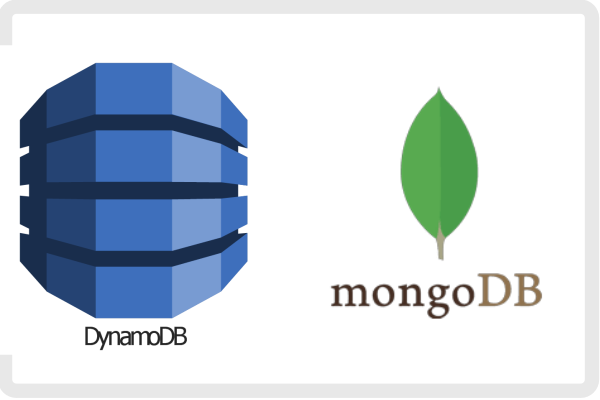
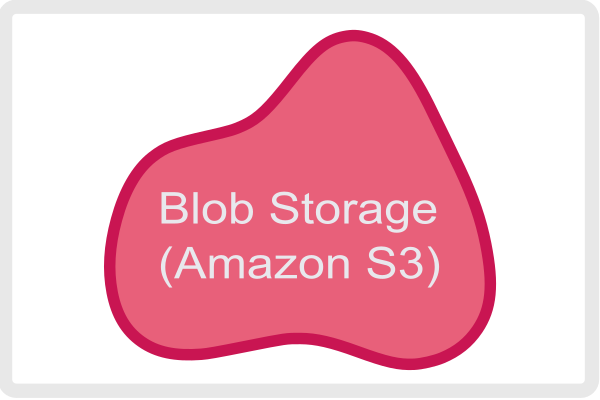
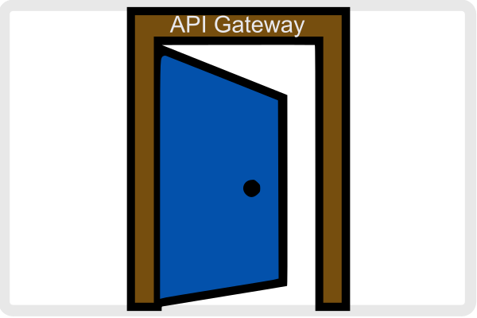
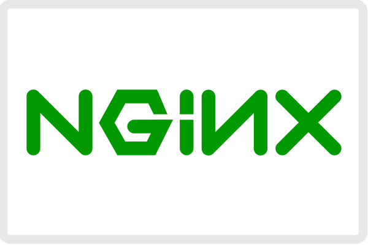
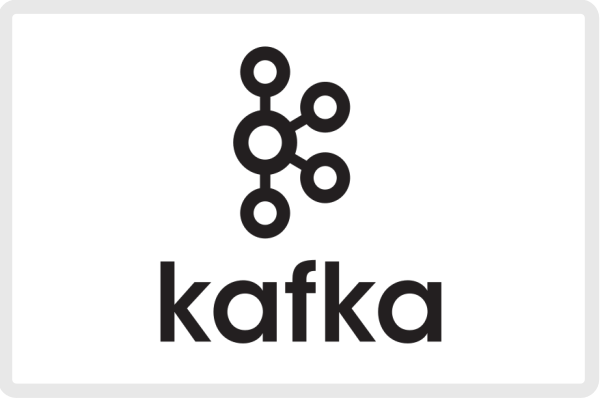

# Components


- **Relational DBs**
    - 

    - Joins
    - Indexes
    - Transactions

- **NoSQL DBs**
    - 

    - Key-Value
        - Fast Access.
        - Simple Model.

    - Document
        - Schemaless.
        - Versatile.

    - Graph
        - Relationships.
        - Effective Retrieval.

    - Column
        - High performance for writes.
        - Easy to remember: Instead of writing rows it literally writes columns.

- **Blob Storage**
    - 

    - Services (like __*Amazon S3*__, __*Google Cloud Storage*__) where you upload a file and you get back a *link* to access it.
        - Has file access restrictions.
        - Good scalability (used by Netflix for example).
        - Often combined with CDNs to get fast downloads world wide.

- **Search Optimized DBs**
    - 

    - Document Search like __*Elastic Search*__| __*AWS OpenSearch*__.

    - Key Concepts
        - **Tokenization**: Breaking a piece of text into individual words.

        - **Stemming**: (like removing the stem of flowers) Reducing words to their root form. This allows you to match different forms of the same word.

        - **Fuzzy Search**: The ability to find results that are similar to a given search term.
            
            - Tolerates slight mispellings.
            
            - Edit distance calculation.
                - Measures how many letters need to be changed, added, or removed to transform one word into another.

        - **Inverted Index**: Instead of having a key matching like in a country matching several records, you have a work with a list of all the documents it appears in (think of the elastic search context).

            ```yaml
                {
                    "word1": [doc1, doc2, doc3],
                    "word2": [doc2, doc3, doc4],
                    "word3": [doc1, doc3, doc4]
                }
            ```

- **API Gateway**
    - 

    - Microservice responsible for: 

        - Routing incoming requests and returning responses.
        - Authentication
        - Rate limiting
        - Logging.

    - Examples:
        - AWS API Gateway
        - Kong
        - Apigee

- **Load Balancer**
    - 

    - Distributes work across your system.

    - In an interview, it can be redundant to draw a load balancer in front of every service.
        
        - Instead, either omit a load balancer from your design altogether or add one only to the front of the design as an abstraction.

    - Examples

        - AWS Elastic Load Balancer
        - NGINX
        - HAProxy

- **Queue**
    - 

    - You send requests to queues and you then forget about them. Then the __*workers*__, who are working at their own pace, take the requests from the queue and return the response.

        - Be careful of introducing queues into synchronous workloads.

    - **Use Cases**

        - **Buffer** for Bursty Traffic: In Uber if the traffic (requests) gets to high, your petition for a ride gets pushed into a queue where you'll timely wait for your turn for a driver.

        - **Distribute Work** Across a System: In a cloud-based photo processing service, queues can be used to distribute expensive image processing tasks.

    - Remember Producer/Consumer (Topics) Architecture.

    - **Important Notes**

        - **Message Ordering**: Most queues are *FIFO*, but others like __Kafka__ offer more complex ordering like priority based or smthn.

        - **Retry Mechanisms**: Queues attempt to redeliver a message a certain number of times before considering it a failure.
            - The time between attempts and the number of retries is configurable.

        - **Dead Letter Queues**: Dead letter queues are used to store messages that cannot be processed.
            - Useful for debugging and auditing
            - It allows you to inspect messages that failed to be processed and understand why they failed.

        - **Scaling with Partitions**: Queues can be partitioned across multiple servers so that they can scale to handle more messages. Each partition can be processed by a different set of workers. Just like databases, you will need to specify a partition key to ensure that related messages are stored in the same partition.

        - **Backpressure**: Backpressure is a way of slowing down the production of messages when the queue is overwhelmed. This helps prevent the queue from becoming a bottleneck in your system. 
            - For example, if a queue is full, you might want to reject new messages or slow down the rate at which new messages are accepted, potentially returning an error to the user or producer.

    - Examples

        - Kafka
        - SQS
