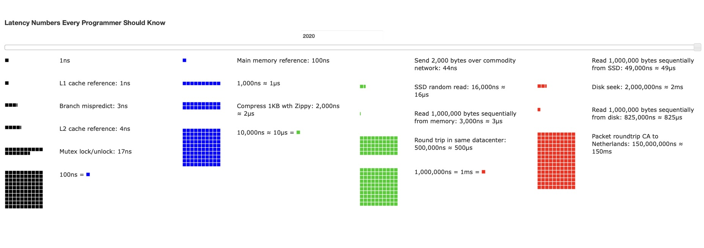

## [Latency Numbers Every Programmer Should Know](https://colin-scott.github.io/personal_website/research/interactive_latency.html)

This website is really useful so you can get an idea (it's a little outdated, 2020) of the latency (how much time it takes an operation to perform) when working with data.

