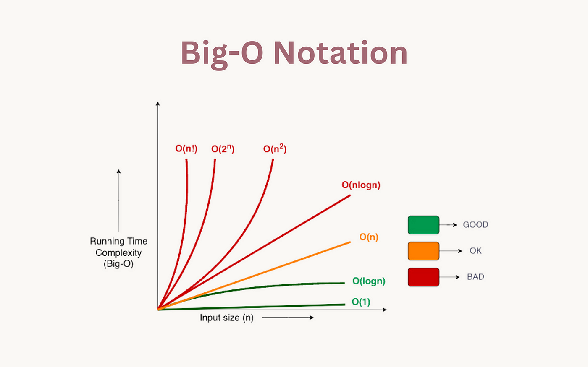

### Big O Notation
***



#### Static Arrays
***

| Operation | Big-O Time | Notes                                                                                                                                      |
|-----------|------------|--------------------------------------------------------------------------------------------------------------------------------------------|
| Reading   | O(1)       | Reading an element by index is constant time.                                                                                              |
| Insertion | O(n)*      | Insertion at the end of the array 'push( )' is typically O(1) on average. However, resizing may occasionally lead to O(n) time complexity. |
| Deletion  | O(n)*      | Deletion from the end of the array 'pop( )' is typically O(1) on average. However, resizing may occasionally lead to O(n) time complexity. |


#### Dynamic Arrays (Python Lists)
***

| Operation | Big-O Time | Notes                                                                                                                                                                      |
|-----------|------------|----------------------------------------------------------------------------------------------------------------------------------------------------------------------------|
| Reading   | O(1)       | Reading an element by index is constant time, similar to regular arrays.                                                                                                   |
| Insertion | O(1)*      | Insertion at the end of the list ('append()' operation) is typically O(1) on average. However, inserting in the middle requires shifting, leading to O(n) time complexity. |
| Deletion  | O(1)*      | Deletion from the end of the list ('pop()' operation) is typically O(1) on average. However, deleting from the middle requires shifting, leading to O(n) time complexity.  |


**Notes**: Insertion and deletion at the end of a Python list (using methods like 'append()' and 'pop()') are also usually O(1) because Python dynamically manages memory for the list and avoids resizing the array too often. However, as mentioned in the notes, if insertion or deletion happens in the middle of the list, it requires shifting elements, resulting in an O(n) time complexity due to the need to move subsequent elements.

#### Stacks
***

| Operation | Big-O Time | Notes                                                                                           |
|-----------|------------|-------------------------------------------------------------------------------------------------|
| Push      | O(1)       |                                                                                                 |
| Pop       | O(1)*      | Check if the stack is empty first.                                                              |
| Peek/Top  | O(1)*      | Retrieves without removing.                                                                     |

#### Linked Lists (1 Direction)
***

| Operation | Big-O Time | Notes                                                     |
|-----------|------------|-----------------------------------------------------------|
| Access    | O(n)       |                                                           |
| Search    | O(n)*      |                                                           |
| Insertion | O(1)*      | Assuming you have the reference to the desired position.  |
| Deletion  | O(1)*      | Assuming you have the reference to the desired position.  |

#### Linked List (2 Directions)
***

| Operation | Big-O Time | Notes                                                     |
|-----------|------------|-----------------------------------------------------------|
| Access    | O(n)       |                                                           |
| Search    | O(n)*      |                                                           |
| Insertion | O(1)*      | Assuming you have the reference to the desired position.  |
| Deletion  | O(1)*      | Assuming you have the reference to the desired position.  |

#### Queues
***


| Operation | Big-O Time | Notes                                                     |
|-----------|------------|-----------------------------------------------------------|
| Enqueue   | O(1)       |                                                           |
| Dequeue   |  O(1)      |                                                           |

#### Binary Trees
***

| Operation       | Big-O Time | Notes                                              |
|-----------------|------------|----------------------------------------------------|
| Search          | O(log n)   | Depends on the height of the binary tree           |
| Insertion       | O(log n)   | Depends on the height of the binary tree           |
| Deletion        | O(log n)   | Depends on the height of the binary tree           |
| Traversal       | O(n)       | In-order, Pre-order, Post-order traversals         |
| Finding height  | O(n)       | Worst case if the tree is unbalanced               |
| Finding depth   | O(n)       | Worst case if the tree is unbalanced               |
| Finding minimum | O(log n)   | Traverse left until you reach the leftmost leaf    |
| Finding maximum | O(log n)   | Traverse right until you reach the rightmost leaf  |

#### Heaps
***

| Operation       | Big-O Time | Notes                                        |
|-----------------|------------|----------------------------------------------|
| Insertion       | O(log n)   | Heapify up operation                         |
| Deletion (Root) | O(log n)   | Heapify down operation                       |
| Search          | O(n)       | Linear search through the array              |
| Extract Minimum | O(log n)   | Removal of the root followed by heapify down |
| Extract Maximum | O(log n)   | Removal of the root followed by heapify down |
| Peek Minimum    | O(1)       | Accessing the root                           |
| Peek Maximum    | O(1)       | Accessing the root                           |
| Heapify         | O(n)       | Building a heap from an unsorted array       |
| Merge           | O(n log n) | Building a new heap from two existing heaps  |


#### Hashmaps
***

| Operation        | Average Case | Worst Case | Notes                                             |
|------------------|--------------|------------|---------------------------------------------------|
| Insertion        | O(1)         | O(n)       | Depends on load factor and collision resolution   |
| Deletion         | O(1)         | O(n)       | Depends on load factor and collision resolution   |
| Search           | O(1)         | O(n)       | Depends on load factor and collision resolution   |
| Access           | O(1)         | O(n)       | Depends on load factor and collision resolution   |
| Collision Avoid. | -            | O(n)       | Depends on implementation and hashing algorithm   |
| Rehashing        | O(n)         | O(n)       | Depends on the number of elements and load factor |


#### Sorting algorithms
***

| Algorithm    | &nbsp;&nbsp;&nbsp;&nbsp;&nbsp;&nbsp;&nbsp;&nbsp;&nbsp;&nbsp;&nbsp; Time Complexity  &nbsp;&nbsp;&nbsp;&nbsp;&nbsp;&nbsp;&nbsp;&nbsp;| Space Complexity |
|--------------|--------------------------------------------s|------------------|

|                | Best       | Average    | Worst      | Worst            |
|----------------|------------|------------|------------|------------------|
| Mergesort      | O(n log n) | O(n log n) | O(n log n) | O(n)             |
| Quicksort      | O(n log n) | O(n log n) | O(n^2)     | O(log n) - O(n)  |
| Insertion Sort | O(n)       | O(n^2)     | O(n^2)     | O(1)             |
| Bucket Sort    | O(n+k)     | O(n+k)     | O(n^2)     | O(n)             |


### Handy Algorithms

- Listing All Contiguous Subarrays
    - A contiguous subarray is a sequence of elements that come from a larger array, and all elements in this subarray are adjacent to each other in the original array.

    ```Python
    test_str = '1234'
    ans = []

    # Go through all the numbers
    for i in range(len(test_str)):
        # Go through all the numbers beggining from i. 
        # Note that 'len(test_str) + 1' is due to slices not being inclusive on the right number.
        for j in range(i + 1, len(test_str) + 1):
            sub = test_str[i: j]
            ans.append(sub)

    # ['1', '12', '123', '1234', '2', '23', '234', '3', '34', '4']
    print(ans)
    ```

### Core Concepts

---

#### Multithreading vs. Multiprocessing

Multithreading and multiprocessing are both techniques for parallel execution, but they handle tasks and resources differently. Here’s a breakdown of their key differences:

##### Multithreading

1. **Concept**: Involves multiple threads within a single process. Threads share the same memory space and resources of the process, allowing easier and more efficient communication.

2. **Memory**: Threads within the same process share the same memory space, which can lead to data consistency issues and requires careful synchronization to avoid conflicts.

3. **Overhead**: Creating and managing threads generally involves less overhead compared to processes, as threads share the same memory and resources. Context switching between threads is typically faster.

4. **Concurrency**: Suitable for I/O-bound tasks or those requiring a lot of shared state. Threads can quickly exchange data and perform tasks dependent on shared resources.

5. **Limitations**: In languages like Python, threads are affected by the Global Interpreter Lock (GIL), limiting their effectiveness for CPU-bound tasks. Python threads are not truly parallel for CPU-intensive computations.

6. **Example Use Case**: Running multiple tasks concurrently, such as handling multiple user requests on a web server, or performing background tasks like updating a user interface.

##### Multiprocessing

1. **Concept**: Involves multiple processes, each with its own memory space and resources. Processes run independently and do not share memory space.

2. **Memory**: Each process has its own memory space, which eliminates the risk of data corruption from shared memory. However, processes need explicit mechanisms to communicate, such as inter-process communication (IPC) mechanisms like pipes or queues.

3. **Overhead**: Creating and managing processes has more overhead compared to threads, as each process has its own memory and resources. Context switching between processes is generally more expensive.

4. **Concurrency**: Suitable for CPU-bound tasks where you want to leverage multiple CPU cores for parallel computation. Processes run independently, eliminating resource contention.

5. **Limitations**: Communication between processes can be more complex and slower than between threads due to the need for IPC. Multiprocessing can also use more memory due to separate memory spaces for each process.

6. **Example Use Case**: Performing heavy computations that can be parallelized, such as processing large datasets, running simulations, or performing complex calculations.

## Summary

- **Multithreading** is ideal for tasks that need concurrent operations with shared state or resources, and is most effective for I/O-bound tasks or those requiring frequent thread communication.
- **Multiprocessing** is better suited for CPU-bound tasks that can be parallelized across multiple processors or cores, without the need for shared state.


# Saved for later

# Got-Stuck Problems

[241 Different Ways To Add Parentheses](https://leetcode.com/problems/different-ways-to-add-parentheses/description/)
    - [Explanation](https://leetcode.com/problems/different-ways-to-add-parentheses/solutions/5806448/beats-90-beginner-friendly-python3-java-c-c-rust-go-js)

[214 Shortest Palindrome](https://leetcode.com/problems/shortest-palindrome/description/)
    - [Explanation](https://www.youtube.com/watch?v=niOT-FK1RH8)

#### Prefix Sum with Dictionary
https://leetcode.com/problems/continuous-subarray-sum/solutions/5276981/prefix-sum-hashmap-patterns-7-problems


[Leetcode Strategy Hustle](https://leetcode.com/discuss/study-guide/5762077/lld-strategy-hustle)

[Greedy Algorithm Guide](https://leetcode.com/problems/best-time-to-buy-and-sell-stock-ii/solutions/4836121/simple-beginner-friendly-dry-run-greedy-approach-readable-sol-time-o-n-space-o-1-gits)