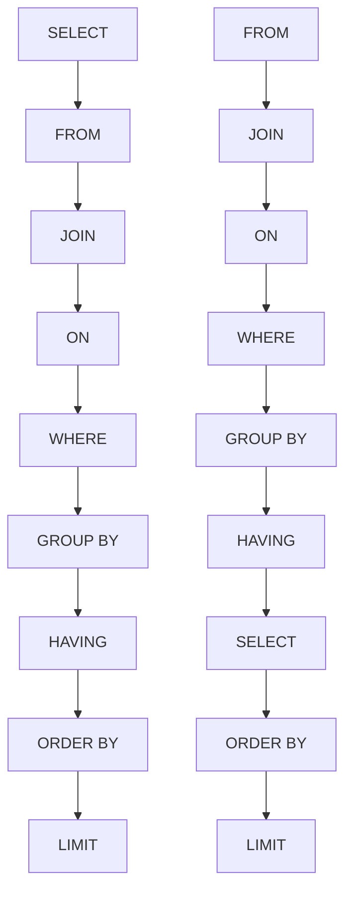
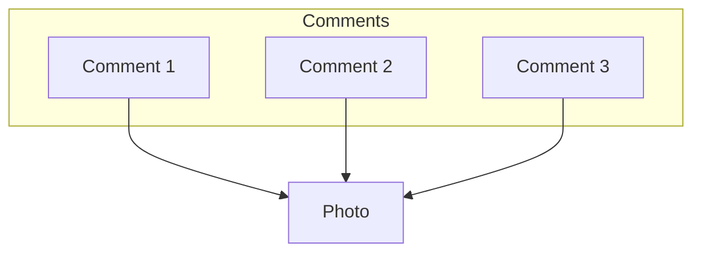

Standard Query Language


To run PostgreSQL online use [pg-sql](https://pg-sql.com)

### Notes
- In SQL, keywords are written in capital letters (like `SELECT`) while variables are written in lower-case (like a column name).
- SQL doesn't execute queries from left to right. It's important to understand this when writing queries so you comprehend what's going on behing the scenes as its very useful when writing complicated queries.
- NULL value means that specific table cell is empty.


### Key Concepts

- **Schema**: The blueprint of a table. It's a set of instructions that define the data relationships between tables, the columns of a table, its value types, constraints, etc.
- **Index**:
- **Primary Key**: Uniquely identifies this record in this table. Commonly an integer or a UUID.
- **Foregin key**: Identifies a record (usually in another table) that this row is associated with. Like a photo mapped to a user_id.
- **Keywords**: Tell the database that we want to do something. Always written in capital letters (`CREATE TABLE` are some examples).
- **Identifiers**: Tell the database what thing we want to act on. Always written in lower 
case letters.

| Relationship | Hint                                                                     |
|--------------|--------------------------------------------------------------------------|
| One-To-Many  | "A user has many photos".                                                |
| Many-To-One  | "Many photos belong to a user".                                          |
| Many-To-Many | "Many students have many classes" <-> "Many classes have many students". |
| One-To-One   | "A boat has a single captain" <-> "A captain belongs to a single boat".  |

| Delete Option | Description                                                               |
|---------------|---------------------------------------------------------------------------|
| `NO ACTION`   | **The default option**; raises an error if there are dependent rows.      |
| `RESTRICT`    | Similar to `NO ACTION`; raises an error if there are dependent rows.      |
| `CASCADE`     | Deletes all rows that have a foreign key referencing the deleted row.     |
| `SET NULL`    | Sets the foreign key column in the referencing rows to `NULL`.            |
| `SET DEFAULT` | Sets the foreign key column in the referencing rows to its default value. |

### Comparisson Math Operators

Comparisson Math Operators are very useful when filtering out information (I.E when using the `WHERE` keyword).

| Operator | Description                  |
|----------|------------------------------|
| =        | Equal                        |
| <>       | Not equal                    |
| >        | Greater than                 |
| <        | Less than                    |
| >=       | Greater than or equal        |
| <=       | Less than or equal           |
| NOT IN   | Value isn't present          |
| IN       | Is value present ?           |
| BETWEEN  | Value in between two others? |
| AND      | Used to join logical ops     |
| OR       | Used to join logical ops     |


### Functions

Here's a markdown table listing some common PostgreSQL functions formatted in uppercase:

| Function                   | Description                                                            |
|----------------------------|------------------------------------------------------------------------|
| ||                         | Concatenates two strings                                               |
| CONCAT(string1, string2, ...) | Concatenates strings                                                |
| UPPER(string)              | Converts string to uppercase                                           |
| LOWER(string)              | Converts string to lowercase                                           |
| LENGTH(string)             | Returns the length of a string                                         |
| ABS(expression)            | Absolute value                                                         |
| AVG(expression)            | Average value of a set of numbers                                      |
| COUNT(expression)          | Number of rows in a result set or number of times an expression occurs |
| MAX(expression)            | Maximum value of a set of numbers                                      |
| MIN(expression)            | Minimum value of a set of numbers                                      |
| SUM(expression)            | Sum of a set of numbers                                                |
| ROUND(expression, precision) | Rounds a numeric value to a specified precision                      |
| COALESCE(expression1, expression2, ...) | Returns the first non-null expression in the list         |
| SUBSTRING(string FROM start FOR length) | Extracts substring from a string                          |
| NOW()                      | Current date and time                                                  |
| DATE_PART('unit', timestamp) | Extracts a specific part (e.g., year, month) from a timestamp        |

### Agregate Functions

| Function            | Description                                                    |
|---------------------|----------------------------------------------------------------|
| `COUNT(expression)` | Counts the number of rows where the expression is not null.    |
| `SUM(expression)`   | Calculates the sum of the values in the expression.            |
| `AVG(expression)`   | Calculates the average (mean) of the values in the expression. |
| `MIN(expression)`   | Finds the minimum value of the expression.                     |
| `MAX(expression)`   | Finds the maximum value of the expression.                     |


### Keyword Hierarchy VS. Execution Order



---


### PostgreSQL Column Types

| Data Type                  | Description                            | Capacity/Range                                                                                     |
|----------------------------|----------------------------------------|----------------------------------------------------------------------------------------------------|
| `BIGINT`                   | Signed eight-byte integer              | -9,223,372,036,854,775,808 to 9,223,372,036,854,775,807                                            |
| `BIGSERIAL`                | Autoincrementing eight-byte integer    | 1 to 9,223,372,036,854,775,807                                                                     |
| `BIT(n)`                   | Fixed-length bit string                | Up to 1,048,576 bits (131,072 bytes)                                                               |
| `BIT VARYING(n)`           | Variable-length bit string             | Up to 1,048,576 bits (131,072 bytes)                                                               |
| `BOOLEAN`                  | Logical Boolean (true/false)           | true or false                                                                                      |
| `BOX`                      | Rectangular box on a plane             | Represented by two points                                                                          |
| `BYTEA`                    | Binary data ("byte array")             | Up to 1 GB                                                                                         |
| `CHARACTER(n)`             | Fixed-length character string          | Up to 1 billion characters                                                                         |
| `CHARACTER VARYING(n)`     | Variable-length character string       | Up to 1 billion characters                                                                         |
| `CIDR`                     | IPv4 or IPv6 network address           | IPv4: 0.0.0.0/0 to 255.255.255.255/32<br>IPv6: ::/0 to ffff:ffff:ffff:ffff:ffff:ffff:ffff:ffff/128 |
| `CIRCLE`                   | Circle on a plane                      | Defined by a center (point) and a radius                                                           |
| `DATE`                     | Calendar date (year, month, day)       | 4713 BC to 5874897 AD                                                                              |
| `DOUBLE PRECISION`         | Double precision floating-point number | 15 decimal digits precision                                                                        |
| `INET`                     | IPv4 or IPv6 host address              | IPv4: 0.0.0.0 to 255.255.255.255<br>IPv6: :: to ffff:ffff:ffff:ffff:ffff:ffff:ffff:ffff            |
| `INTEGER`                  | Signed four-byte integer               | -2,147,483,648 to 2,147,483,647                                                                    |
| `INTERVAL`                 | Time interval                          | -178000000 years to 178000000 years                                                                |
| `JSON`                     | JSON data format                       | 1 GB                                                                                               |
| `JSONB`                    | Binary JSON data format                | 1 GB                                                                                               |
| `LINE`                     | Infinite line on a plane               | Defined by a point and a direction vector                                                          |
| `LSEG`                     | Line segment on a plane                | Defined by two points                                                                              |
| `MACADDR`                  | MAC (Media Access Control) address     | 6 bytes, formatted as XX:XX:XX:XX:XX:XX                                                            |
| `MONEY`                    | Currency amount                        | -922,337,203,685,477.5808 to +922,337,203,685,477.5807                                             |
| `NUMERIC(p, s)`            | Exact numeric of selectable precision  | Up to 131,072 digits before the decimal point; up to 16,383 digits after the decimal point         |
| `PATH`                     | Geometric path on a plane              | Sequence of points                                                                                 |
| `PG_LSN`                   | Log sequence number                    | 64-bit unsigned integer                                                                            |
| `POINT`                    | Geometric point on a plane             | Coordinate (x, y)                                                                                  |
| `POLYGON`                  | Closed geometric path on a plane       | Sequence of points forming a closed loop                                                           |
| `REAL`                     | Single precision floating-point number | 6 decimal digits precision                                                                         |
| `SMALLINT`                 | Signed two-byte integer                | -32,768 to 32,767                                                                                  |
| `SMALLSERIAL`              | Autoincrementing two-byte integer      | 1 to 32,767                                                                                        |
| `SERIAL`                   | Autoincrementing four-byte integer     | 1 to 2,147,483,647                                                                                 |
| `TEXT`                     | Variable-length character string       | Up to 1 billion characters                                                                         |
| `TIME`                     | Time of day (no time zone)             | 00:00:00 to 24:00:00                                                                               |
| `TIMESTAMP`                | Date and time (no time zone)           | 4713 BC to 294276 AD                                                                               |
| `TIMESTAMP WITH TIME ZONE` | Date and time (including time zone)    | 4713 BC to 294276 AD                                                                               |
| `TSQUERY`                  | Text search query                      | Sequence of lexemes                                                                                |
| `TSVECTOR`                 | Text search document                   | Sequence of lexemes                                                                                |
| `TXID_SNAPSHOT`            | User-level transaction ID snapshot     | Varies                                                                                             |
| `UUID`                     | Universally unique identifier          | 128-bit number (UUID)                                                                              |
| `XML`                      | XML data                               | Unlimited size                                                                                     |

### Relationship Types

#### One-To-Many

One-to-many relationships can be easilly identified by the frase "has many" as in the following examples:

- A classroom `has many` students.
- An office `has many` workers.
- A house `has many` people living in it.

#### Many-To-One

Many-to-one relationships are the same as one-to-many, they're just viewed from the other side of the relationship.

- Many students `have one` classroom.
- Many workers `have one` office.
- Many people live in a house.

#### One-To-One 

One-to-one relationships are the simplest to understand and identify as they express one way roads between to objects.

- One company `has one` CEO.
- One country `has one` capitol.
- One person `has one` drivers license.

#### Many-To-Many

Many-to-many relationships are the most complex to identify because they imply that multiple records from one entity can be related to multiple records from another entity. These relationships are typically identified by the use of `many-to-many` or `have many` keywords, which must be applied from both perspectives.

- Movies `have many` actors. <-> Many actors `have many` movies.
- Many conference calls `have many` employees. <-> Many employees `have many` conference calls.
- A google doc can be edited by `many` users at the same time. <-> A single user can edit `many` different documents.

The last example from Google Docs might be easier to understand, as its opposite would be a one-to-one relationship: `A document can only be edited by a single user. <-> A user can only edit a single document`.
Another example is building a database for an E-Commerce application where you need to track which users purchase which product categories. In this context, many-to-many relationships are evident because `Users can purchase products from many different categorys. <-> Each kind of product can be purchased by many different users.`


---


### Primary Keys

- Primary Keys uniquely identify a record in a table, 
- They are usually an integer or an UUID. 
- **There can't be two rows with the same primary key in a table**.

Below is an example of how a primary key `PK` looks like in a table.

#### Users Table

| id INTEGER, PK | username VARCHAR (50) | email VARCHAR (50) |
|----------------|-----------------------|--------------------|
| 1              | user1                 | user1@example.com  |
| 2              | user2                 | user2@example.com  |
| 3              | user3                 | user3@example.com  |
| ...            | ...                   | ...                |

As you can see, the `id` field on each table is a **Primary Key**, and the `user_id` field on the `Photos` table is a **Foreign Key**

##### Notes:
- Even when you delete or modify records **the primary key will not change**, which ensures that all records can be consistently accessed using the PK.
- **Primary Key (PK)**: `id` columns are marked as primary keys ensuring each row has a unique identifier.


### Foreign Keys

Foreign keys in a relational database are columns (or combinations of columns) that establish and enforce a link between data in two tables. They create a parent-child relationship between the tables, where the child table contains values that match values in the primary key column(s) of the parent table.

- Rows can  **only have this if they belong to another record**.
- Many rows can have the same foreign key.
- Name varies, usually called something like **"xyz_id"**.
- **Exactly equal to the primary key of the referenced row**.
- Changes if the relationship changes.

You might find it easier to understand by thinking how Instagram handles its comments. Each comment belongs to a photo were it was written, so in the comments table you would have a foreign key for each comment pointing at its photo (the one where the comment was written into).



Another great example comes from the tables below, notice how the `photos` table records reference a specific user using it's `id` (the Foreign Key).

#### Users Table

| id INTEGER, PK | username VARCHAR (50) | email VARCHAR (50) |
|----------------|-----------------------|--------------------|
| 1              | user1                 | user1@example.com  |
| 2              | user2                 | user2@example.com  |
| 3              | user3                 | user3@example.com  |
| ...            | ...                   | ...                |

#### Photos Table

| id INTEGER, PK | url VARCHAR (50) | user_id (FK, points to users record) |
|----------------|------------------|--------------------------------------|
| 1              | [url_1]          | 1                                    |
| 2              | [url_2]          | 3                                    |
| 3              | [url_3]          | 2                                    |
| ...            | ...              | ...                                  |

As you can see, the `id` field on each table is a **Primary Key**, and the `user_id` field on the `Photos` table is a **Foreign Key**

##### Notes:
- Even when you delete or modify records **the primary key will not change**, which ensures that all records can be consistently accessed using the PK.
- **Primary Key (PK)**: `id` columns are marked as primary keys (`PK`) in both tables, ensuring each row has a unique identifier.
- **Foreign Key (FK)**: In the `photos` table, `user_id` is a foreign key that references the `id` column in the `users` table, establishing a relationship between photos and users.
- **Data Types**: `url` and `email` are specified as `varchar(50)`, indicating the expected character limits for these columns.
  
These tables provide a basic structure for modeling photos and users in a database schema, demonstrating the use of primary keys, foreign keys, and column data types as per your requirements. Adjustments can be made based on specific database management system requirements or additional constraints.

```SQL
-- Create the users table
CREATE TABLE users (
  -- Serial means it auto-generates a value when a record is addedALTER
  -- Primary Key adds special performance benefits when looking for records
  id SERIAL PRIMARY KEY,
  user_name VARCHAR(50)
);
-- Insert some data into the users table
INSERT INTO users (user_name) VALUES ('Juan'), ('Jose'), ('Luis'), ('x123');

-- Create photos table
CREATE TABLE photos (
    id SERIAL PRIMARY KEY,
    url VARCHAR(50),
    -- Name the column as 'user_id' which holds the link to the users table
    -- References keyword is used to specify the table and the column for the Foreign Key relationship
    user_id INTEGER REFERENCES users(id)
);

-- Insert values into the photos table using the foregin key
INSERT INTO photos (url, user_id) VALUES ('http://one.jpg', 4), ('http://tg3223.jpg', 3),
('http://two.jpg', 2), ('http://on234e.jpg', 1), ('http://o23.jpg', 1);
```

Below are some examples of some queries that show how to use the foreign key constraints in a useful way:

```SQL
-- Select all photos that were posted by the user whos id is 4.
SELECT * FROM photos WHERE user_id = 1;

-- List all photos with details about the associated user for each
SELECT * FROM photos JOIN users ON users.id = photos.user_id;

-- Note in this variation of the above query, columns of both tables are available thanks to the JOIN
-- url exists on the photos table while user_name exists on the user table
SELECT url, user_name FROM photos JOIN users ON users.id = photos.user_id;
```

#### ON DELETE Options

When deleting records that have children rows pointing at them (via the foreign key), it's necessary to specify the behavior this child row should have as its foreign key value will become inexistent. Here's where `ON DELETE` options come into play; **they define the actions that take place when the refered record of a foreign key column gets deleted**.

- These `ON DELETE` options **must be placed inside the table schema that has the foreign key sentence**.

| FK ON DELETE Option     | Description                                                               |
|-------------------------|---------------------------------------------------------------------------|
| `ON DELETE NO ACTION`   | **The default option**; raises an error if there are dependent rows.      |
| `ON DELETE RESTRICT`    | Similar to `NO ACTION`; raises an error if there are dependent rows.      |
| `ON DELETE CASCADE`     | Deletes all rows that have a foreign key referencing the deleted row.     |
| `ON DELETE SET NULL`    | Sets the foreign key column in the referencing rows to `NULL`.            |
| `ON DELETE SET DEFAULT` | Sets the foreign key column in the referencing rows to its default value. |

```SQL
-- Create photos table
CREATE TABLE photos (
    id SERIAL PRIMARY KEY,
    url VARCHAR(50),
    -- Set the ON DELETE action for this foreign key column
    -- If the user_id row gets deleted this record will be deleted as well
    user_id INTEGER REFERENCES users(id) ON DELETE CASCADE
);
```

These delete options are very useful in day-to-day applications like blogs. If you delete a blog post you probably don't want to keep around its comments in your DB (**ON DELETE CASCADE**). In some cases you might want to keep the information, like in Reddit that when a user gets deleted his comments remain there but with a `deleted` user tag (**ON DELETE SET NULL**).


### Joins

- Produces values by merging together rows from different **related** tables.
- Use a join **most times** that you're asked to find data that involves multiple resources.
- Table order between `FROM` and `JOIN` often **matters**.
- Must provide context if column names colide.
- Columns can be renamed using the `AS` keyword.


| Join       | Description                                                                        |
|------------|------------------------------------------------------------------------------------|
| INNER JOIN | Returns only the rows that have matching values in both tables.                    |
| LEFT JOIN  | Returns all rows from the left table and the matched rows from the right table.    |
| RIGHT JOIN | Returns all rows from the right table and the matched rows from the left table.    |
| FULL JOIN  | Returns all rows when there is a match in either the left or right table.          |
| CROSS JOIN | Returns the Cartesian product of the two tables, i.e., all possible pairs of rows. |


```SQL
-- Inner Join (Default)
SELECT url, username FROM photos INNER JOIN users ON user.id = photos.user_id; -- Either INNER JOIN or just JOIN will work

-- NOTE: For LEFT and RIGHT joins, THE ORDER MATTERS!

--Left Join
SELECT url, username FROM photos LEFT JOIN users ON user.id = photos.user_id;

-- Right Join
SELECT url, username FROM photos RIGHT JOIN users ON user.id = photos.user_id;

-- Full Join
SELECT url, username FROM photos FULL JOIN users ON user.id = photos.user_id;
```

#### Where With Joins

On ocassions joins by themselves may not be enough to filter out the data from two related tables. In these circumstances a `WHERE WITH` join might be necessary. Imagine the following example, you have three tables 'users', 'comments', and 'photos' built with the SQL code below:

```SQL
CREATE TABLE users(
  id SERIAL PRIMARY KEY,
  username VARCHAR(50)
);
 
CREATE TABLE photos (
  id SERIAL PRIMARY KEY,
  url VARCHAR(200),
  user_id INTEGER REFERENCES users(id) ON DELETE CASCADE
);
 
CREATE TABLE comments (
  id SERIAL PRIMARY KEY,
  contents VARCHAR(240),
  user_id INTEGER REFERENCES users(id) ON DELETE CASCADE,
  photo_id INTEGER REFERENCES photos(id) ON DELETE CASCADE
);
```

Now, if you had a scenario where you'd like to filter out all photos where its author commented on it, a simple join statement wouldn't be enough to get this filtered information. This is because the join would only get you the related records, but youd need to additionally verify if the author of the comment is the author of the photo, as shown in the code below:

```SQL
-- Define the columns to print
SELECT url, contents
-- Set left table for join
FROM comments
-- Set right table for join and relation condition (comments and the photo it was posted into)
JOIN photos ON comments.photo_id = photos.id
-- Set condition that checks wether or not the author of the comment is the author of the photo
WHERE comments.user_id = photos.user_id;
```

This is the way to set conditions additional to the join operation.

#### Three-way Joins

Even when applying where filters on join operations there could still be cases where it just isn't enough. This is where `Three-way Joins` come into play as they allow you to use additional related tables.

Using the previous example, just imagine a slight variation where you wan to also be able to tell which users commented on their own photos. You'd need to use an additional join in order to access the `username` value.

```SQL
SELECT username, url, contents
FROM comments
JOIN photos ON comments.photo_id = photos.id
JOIN users ON comments.user_id = users.id AND photos.user_id = users.id;
-- Note how the conditions for the second join are more complex than the first one
```

Another example:

*Write a query that will return the title of each book, along with the name of the author, and the rating of a review. Only show rows where the author of the book is also the author of the review.*

**Authors**

| id | name            |
|----|-----------------|
| 1  | Stephen King    |
| 2  | Agatha Christie |
| 3  | JK Rowling      |

**Books**

| id | title               | author_id |
|----|---------------------|-----------|
| 1  | The Dark Tower      | 1         |
| 2  | Affair At Styles    | 2         |
| 3  | Chamber of Secrets  | 3         |

**Reviews**

| id | rating | reviewer_id | book_id |
|----|--------|-------------|---------|
| 1  | 3      | 1           | 2       |
| 2  | 4      | 2           | 1       |
| 3  | 5      | 3           | 3       |

```SQL
-- Solution
SELECT title, name, rating 
FROM books 
JOIN authors ON books.author_id = authors.id
JOIN reviews ON reviews.book_id = books.id AND reviews.reviewer_id = authors.id;
```


### Aggregations & Grouping

#### Grouping

- Reduces many rows down to fewer rows.
- Done by using the `GROUP BY` keywords.
- Visualizing the result is key to use.

Example:

```SQL
-- gets all records and groups them by the 'column_name' column. Multiple records get reduced (or grouped) to a single group.
SELECT column FROM table_name GROUP BY column_name;
```

Now, you just can't select any column you like when grouping them. To understanding, lets use an example. You have the following table.

**Comments table**

| id | contents          | user_id | photo_id |
|----|-------------------|---------|----------|
| 1  | Great shot!       | 1       | 1        |
| 2  | Nice work         | 1       | 2        |
| 3  | Love this photo   | 2       | 3        |
| 4  | Awesome capture   | 5       | 5        |
| 5  | Beautiful scenery | 3       | 4        |

If you were to run this query `SELECT * FROM table GROUP BY user_id;` SQL would build something like this in the back:

| Grouped user_id | id   | contents               | photo_id |
|-----------------|------|------------------------|----------|
| 1               | 1, 2 | Great shot!, Nice work | 1, 2     |
| 2               | 3    | Love this photo        | 3        |
| 3               | 5    | Beautiful scenery      | 4        |
| 5               | 4    | Awesome capture        | 5        |

As you can see, the contents of user_id 1 got grouped into a single record. This is the reason that you can only select certain rows when using group by as the other column's rows will be pulled into a group. In the example above, the only column you're allowed to select (without using an aggregate function) without throwing an error is the `user_id` column.

- **This is why you want to visualize how your data will look like after grouping**.
- **If you group records you can only select the grouped column (if you didn't use aggregate functions of course)**.

#### Aggregate Functions

- Looks at many rows and calculates a single value.
- Words like `most`, `average`, `least` are a sign you need to use an aggregation.
- Done by using `Aggregate Functions`.

| Function            | Description                                                    |
|---------------------|----------------------------------------------------------------|
| `COUNT(expression)` | Counts the number of rows where the expression is not null.    |
| `SUM(expression)`   | Calculates the sum of the values in the expression.            |
| `AVG(expression)`   | Calculates the average (mean) of the values in the expression. |
| `MIN(expression)`   | Finds the minimum value of the expression.                     |
| `MAX(expression)`   | Finds the maximum value of the expression.                     |

A simple query using an aggregate function on the table below would look as follows:

**Comments table**

| id | contents          | user_id | photo_id |
|----|-------------------|---------|----------|
| 1  | Great shot!       | 1       | 1        |
| 2  | Nice work         | 1       | 2        |
| 3  | Love this photo   | 2       | 3        |
| 4  | Awesome capture   | 5       | 5        |
| 5  | Beautiful scenery | 3       | 4        |

```SQL
-- Query would return a single value: the sum of all of the ids (15).
SELECT SUM(id) FROM comments;

-- Note that you can't select a column after an aggregate function as you normally would.
-- Query would throw an error
SELECT SUM(id), id FROM comments;
```

- Aggregate functions are **more commonly used by themselves or as a part of a larger GROUP BY query**.
- You can not select a column and use an aggregate at the same time.

#### Combining Group By and Aggregate Functions

An aggregate function when using group by **will be applied to each of the individual subgroups**. 

```SQL
-- gets all records and groups them by the 'user_id' column. 
-- prints the user_id column and its corresponding maximum id per group.
SELECT user_id, MAX(id) FROM comments GROUP BY user_id;
```

**Count Corner Cases**

*Photos table*

| id | url     | user_id |
|----|---------|---------|
| 1  | [url_1] | 1       |
| 2  | [url_2] | 3       |
| 3  | [url_3] | 1       |
| 4  | [url_4] | NULL    |

There are some considerations you might want to keep in mind when using aggregate functions. An example of this whould be `NULL` values. Lets say you have the above photos table and you want to count the number of photos by using the query `SELECT COUNT(user_id) FROM photos;`. Contrary to what you might expect, the result would be 3 instead of 4. This is because **whenever we do COUNT on a column NULL values are not counted**. To avoid this, instead of referencing a specific column you can use `COUNT(*)` instead, which would count the total number of rows and return 4.

A more complex query taking advantage of this would look as follows:

```SQL
SELECT user_id, COUNT(*) FROM photos GROUP BY user_id;
```

This query would return the following table:

| user_id | count |
|---------|-------|
| 1       | 2     |
| 3       | 1     |


#### Filtering Groups With HAVING

The `HAVING` keyword is similar to `WHERE` in the sense that `WHERE` is going to operate on **filtering out some number of rows** whereas `HAVING` is going to operate on **filtering out some number of groups**.

- **You're never going to see `HAVING` without a `GROUP BY`**.

A brieg example of this keyword would be as follows: Supose we have a comments table as shown below:

**Comments table**

| id | contents          | user_id | photo_id |
|----|-------------------|---------|----------|
| 1  | Great shot!       | 1       | 1        |
| 2  | Nice work         | 1       | 2        |
| 3  | Love this photo   | 2       | 3        |
| 4  | Awesome capture   | 5       | 5        |
| 5  | Beautiful scenery | 3       | 4        |

Now, suppose you want to *find the number of comments for each photo where the photo_id is less than three and the photo has more than two comments*. This is quite a complex query since you would have to:

1. Group the photos with their comments.
2. Check the photo_id is less than 3.
3. Check the photo has more than 2 comments, 

```SQL
SELECT photo_id, COUNT(*) 
FROM comments 
WHERE photo_id < 3 
GROUP BY photo_id
HAVING COUNT(*) > 2;
```

A little more complex example: Suppose we have the table below and you want to print the names of manufacturers and total revenue (price * units_sold) for all phones.  Only print the manufacturers who have revenue greater than 2,000,000 for all the phones they sold.

**Phones table**

| name        | manufacturer | price | units_sold |
|-------------|--------------|-------|------------|
| N1280       | Nokia        | 199   | 1925       |
| Iphone 4    | Apple        | 399   | 9436       |
| Galaxy S    | Samsung      | 299   | 2359       |
| S5620 Monte | Samsung      | 250   | 2385       |
| N8          | Nokia        | 150   | 7543       |
| Droid       | Motorola     | 150   | 8395       |
| Wave S8500  | Samsung      | 175   | 9259       |


```SQL
SELECT manufacturer, SUM(price * units_sold) FROM phones GROUP BY manufacturer HAVING SUM(price * units_sold) > 2000000;
```

---


### Common Queries

#### Create Table

```SQL
CREATE TABLE table_name (
    column_title COLUMN_TYPE(optional_value),
    column_title2 COLUMN_TYPE(optional_value),
);
```

#### Insert Single/Multiple Values Into A Table

```SQL
-- To insert a single value just write a single set of parenthesis with column values
INSERT INTO table_name (column_name1, column_name2) VALUES 
(column1_value1, column2_value1)
(column1_value2, column2_value2)
(column1_value3, column2_value3),
;
```

#### Retrieving Information From A Table


```SQL
-- Select all records from table
SELECT * FROM table_name;

-- Select specific columns from table
SELECT column_name, column2_name FROM table_name;

-- You can perform operations between columns when retrieving information
SELECT column_1, column_2 / column_3 FROM table_name;
```
**Notes**: 
- The order of the columns is the order of their printing. You can also print the same column multiple times.
- If your operation's result goes beyond what the column can store you will get an error. For example, if you use INTEGER as the column type and the result of a multiplication of two columns goes over its capacity (2,147,483,648) you will get an `Integer out of range` error.


```SQL
-- When performing operations on retrieval, new columns will come out with weird names. 
-- To rename the result column:
SELECT column_1, column_2 * column_3 AS result_column_name FROM table_name;

-- Concatenating column values as strings
SELECT column_1 || ', ' || column_2  AS concatenated_column_name FROM table_name;

-- The same as above but using CONCAT() instead of '||'
SELECT CONCAT(column_1, ', ', column_2) FROM table_name;
```

#### Filtering Out Records

```SQL
-- Use the WHERE keyword to filter data by using it in pair with comparisson or math operators.
SELECT column_1, column_2 WHERE column_1 > 5000 FROM table_name;

-- BETWEEEN keyword example
SELECT column_1, column_2 FROM table_name WHERE column_1 BETWEEN 5 AND 10;

-- Using a list of possible values for an 'IN' check in a query
SELECT column_1, column_2 FROM table_name WHERE column_1 IN (possible_value_1, possible_value_2, ...);

-- You could also use a negative filter to get all records whose 'column_1' is not in the list by using the 'NOT IN' keywords.
-- Note that you can chain as many 'AND' and 'OR' operators as you want
SELECT column_1, column_2 FROM table_name WHERE column_1 IN (possible_value_1, possible_value_2) AND column_2 = 'arbitrary_value';
```

#### Updating & Deleting Records

- To update records you use the `UPDATE` and `SET` keywords.
- To delete records you use the `DELETE` keyword. Be sure to **NEVER FORGET THE `FROM` STATEMENT**!

```SQL
-- Updating a single column (multiple rows may be updated)
UPDATE table_name SET column_1 = 5000 WHERE column_2 = 'arbitrary_value';

-- Deleting one or more records
DELETE FROM table_name WHERE column_1 = 5;
```

### Query Examples

```SQL
CREATE TABLE movies (
    title VARCHAR(60),
    box_office INTEGER
);
```

```SQL
INSERT INTO movies (title, box_office)
VALUES 
    ('The Avengers', 1500000000),
    ('Batman v Superman', 873000000);
```

```SQL
SELECT title, box_office FROM movies;
```

### Excercises

#### Section 4 & 5

<details>
  <summary>Data</summary>

  ```SQL
  CREATE TABLE users(
    id SERIAL PRIMARY KEY,
    username VARCHAR(50)
  );
  
  CREATE TABLE photos (
    id SERIAL PRIMARY KEY,
    url VARCHAR(200),
    user_id INTEGER REFERENCES users(id) ON DELETE CASCADE
  );
  
  CREATE TABLE comments (
    id SERIAL PRIMARY KEY,
    contents VARCHAR(240),
    user_id INTEGER REFERENCES users(id) ON DELETE CASCADE,
    photo_id INTEGER REFERENCES photos(id) ON DELETE CASCADE
  );
  
  INSERT INTO users (username) 
  VALUES 
    ('Reyna.Marvin'),
          ('Micah.Cremin'),
          ('Alfredo66'),
          ('Gerard_Mitchell42'),
          ('Frederique_Donnelly');
  
  INSERT INTO photos (url, user_id)
  VALUES
    ('https://santina.net', 3),
          ('https://alayna.net', 5),
          ('https://kailyn.name', 3),
          ('http://marjolaine.name', 1),
          ('http://chet.net', 5),
          ('http://jerrold.org', 2),
          ('https://meredith.net', 4),
          ('http://isaias.net', 4),
          ('http://dayne.com', 4),
          ('http://colten.net', 2),
          ('https://adelbert.biz', 5),
          ('http://kolby.org', 1),
          ('https://deon.biz', 2),
          ('https://marina.com', 5),
          ('http://johnson.info', 1),
          ('https://linda.info', 2),
          ('https://tyrique.info', 4),
          ('http://buddy.info', 5),
          ('https://elinore.name', 2),
          ('http://sasha.com', 3);
  
  INSERT INTO comments (contents, user_id, photo_id)
  VALUES
    ('Quo velit iusto ducimus quos a incidunt nesciunt facilis.', 2, 4),
          ('Non est totam.', 5, 5),
          ('Fuga et iste beatae.', 3, 3),
          ('Molestias tempore est.', 1, 5),
          ('Est voluptatum voluptatem voluptatem est ullam quod quia in.', 1, 5),
          ('Aut et similique porro ullam.', 1, 3),
          ('Fugiat cupiditate consequatur sit magni at non ad omnis.', 1, 2),
          ('Accusantium illo maiores et sed maiores quod natus.', 2, 5),
          ('Perferendis cumque eligendi.', 1, 2),
          ('Nihil quo voluptatem placeat.', 5, 5),
          ('Rerum dolor sunt sint.', 5, 2),
          ('Id corrupti tenetur similique reprehenderit qui sint qui nulla tenetur.', 2, 1),
          ('Maiores quo quia.', 1, 5),
          ('Culpa perferendis qui perferendis eligendi officia neque ex.', 1, 4),
          ('Reprehenderit voluptates rerum qui veritatis ut.', 1, 1),
          ('Aut ipsum porro deserunt maiores sit.', 5, 3),
          ('Aut qui eum eos soluta pariatur.', 1, 1),
          ('Praesentium tempora rerum necessitatibus aut.', 4, 3),
          ('Magni error voluptas veniam ipsum enim.', 4, 2),
          ('Et maiores libero quod aliquam sit voluptas.', 2, 3),
          ('Eius ab occaecati quae eos aut enim rem.', 5, 4),
          ('Et sit occaecati.', 4, 3),
          ('Illum omnis et excepturi totam eum omnis.', 1, 5),
          ('Nemo nihil rerum alias vel.', 5, 1),
          ('Voluptas ab eius.', 5, 1),
          ('Dolor soluta quisquam voluptatibus delectus.', 3, 5),
          ('Consequatur neque beatae.', 4, 5),
          ('Aliquid vel voluptatem.', 4, 5),
          ('Maiores nulla ea non autem.', 4, 5),
          ('Enim doloremque delectus.', 1, 4),
          ('Facere vel assumenda.', 2, 5),
          ('Fugiat dignissimos dolorum iusto fugit voluptas et.', 2, 1),
          ('Sed cumque in et.', 1, 3),
          ('Doloribus temporibus hic eveniet temporibus corrupti et voluptatem et sint.', 5, 4),
          ('Quia dolorem officia explicabo quae.', 3, 1),
          ('Ullam ad laborum totam veniam.', 1, 2),
          ('Et rerum voluptas et corporis rem in hic.', 2, 3),
          ('Tempora quas facere.', 3, 1),
          ('Rem autem corporis earum necessitatibus dolores explicabo iste quo.', 5, 5),
          ('Animi aperiam repellendus in aut eum consequatur quos.', 1, 2),
          ('Enim esse magni.', 4, 3),
          ('Saepe cumque qui pariatur.', 4, 4),
          ('Sit dolorem ipsam nisi.', 4, 1),
          ('Dolorem veniam nisi quidem.', 2, 5),
          ('Porro illum perferendis nemo libero voluptatibus vel.', 3, 3),
          ('Dicta enim rerum culpa a quo molestiae nam repudiandae at.', 2, 4),
          ('Consequatur magnam autem voluptas deserunt.', 5, 1),
          ('Incidunt cum delectus sunt tenetur et.', 4, 3),
          ('Non vel eveniet sed molestiae tempora.', 2, 1),
          ('Ad placeat repellat et veniam ea asperiores.', 5, 1),
          ('Eum aut magni sint.', 3, 1),
          ('Aperiam voluptates quis velit explicabo ipsam vero eum.', 1, 3),
          ('Error nesciunt blanditiis quae quis et tempora velit repellat sint.', 2, 4),
          ('Blanditiis saepe dolorem enim eos sed ea.', 1, 2),
          ('Ab veritatis est.', 2, 2),
          ('Vitae voluptatem voluptates vel nam.', 3, 1),
          ('Neque aspernatur est non ad vitae nisi ut nobis enim.', 4, 3),
          ('Debitis ut amet.', 4, 2),
          ('Pariatur beatae nihil cum molestiae provident vel.', 4, 4),
          ('Aperiam sunt aliquam illum impedit.', 1, 4),
          ('Aut laudantium necessitatibus harum eaque.', 5, 3),
          ('Debitis voluptatum nesciunt quisquam voluptatibus fugiat nostrum sed dolore quasi.', 3, 2),
          ('Praesentium velit voluptatem distinctio ut voluptatum at aut.', 2, 2),
          ('Voluptates nihil voluptatum quia maiores dolorum molestias occaecati.', 1, 4),
          ('Quisquam modi labore.', 3, 2),
          ('Fugit quia perferendis magni doloremque dicta officia dignissimos ut necessitatibus.', 1, 4),
          ('Tempora ipsam aut placeat ducimus ut exercitationem quis provident.', 5, 3),
          ('Expedita ducimus cum quibusdam.', 5, 1),
          ('In voluptates doloribus aut ut libero possimus adipisci iste.', 3, 2),
          ('Sit qui est sed accusantium quidem id voluptatum id.', 1, 5),
          ('Libero eius quo consequatur laudantium reiciendis reiciendis aliquid nemo.', 1, 2),
          ('Officia qui reprehenderit ut accusamus qui voluptatum at.', 2, 2),
          ('Ad similique quo.', 4, 1),
          ('Commodi culpa aut nobis qui illum deserunt reiciendis.', 2, 3),
          ('Tenetur quam aut rerum doloribus est ipsa autem.', 4, 2),
          ('Est accusamus aut nisi sit aut id non natus assumenda.', 2, 4),
          ('Et sit et vel quos recusandae quo qui.', 1, 3),
          ('Velit nihil voluptatem et sed.', 4, 4),
          ('Sunt vitae expedita fugiat occaecati.', 1, 3),
          ('Consequatur quod et ipsam in dolorem.', 4, 2),
          ('Magnam voluptatum molestias vitae voluptatibus beatae nostrum sunt.', 3, 5),
          ('Alias praesentium ut voluptatem alias praesentium tempora voluptas debitis.', 2, 5),
          ('Ipsam cumque aut consectetur mollitia vel quod voluptates provident suscipit.', 3, 5),
          ('Ad dignissimos quia aut commodi vel ut nisi.', 3, 3),
          ('Fugit ut architecto doloremque neque quis.', 4, 5),
          ('Repudiandae et voluptas aut in excepturi.', 5, 3),
          ('Aperiam voluptatem animi.', 5, 1),
          ('Et mollitia vel soluta fugiat.', 4, 1),
          ('Ut nemo voluptas voluptatem voluptas.', 5, 2),
          ('At aut quidem voluptatibus rem.', 5, 1),
          ('Temporibus voluptates iure fuga alias minus eius.', 2, 3),
          ('Non autem laboriosam consectetur officiis aut excepturi nobis commodi.', 4, 3),
          ('Esse voluptatem sed deserunt ipsum eaque maxime rerum qui.', 5, 5),
          ('Debitis ipsam ut pariatur molestiae ut qui aut reiciendis.', 4, 4),
          ('Illo atque nihil et quod consequatur neque pariatur delectus.', 3, 3),
          ('Qui et hic accusantium odio quis necessitatibus et magni.', 4, 2),
          ('Debitis repellendus inventore omnis est facere aliquam.', 3, 3),
          ('Occaecati eos possimus deleniti itaque aliquam accusamus.', 3, 4),
          ('Molestiae officia architecto eius nesciunt.', 5, 4),
          ('Minima dolorem reiciendis excepturi culpa sapiente eos deserunt ut.', 3, 3);
  ```
</details>


**Excercises**:

<details>
  <summary>1. For each comment, show the contents of the comment and the username of the user who wrote it.</summary>

  ```SQL
  SELECT contents, username FROM comments JOIN users ON users.id = comments.user_id;
  ```
</details>


<details>
  <summary>2. For each comment, list the contents of the comments and the url of the photo the comment was added to.</summary>

  ```SQL
  SELECT contents, url FROM comments JOIN photos ON comments.photo_id = photos.id;
  ```
</details>


<details>
  <summary>3. Show each photo url along with the username of the poster (you should show the url even if there is no identifiable poster).</summary>

  ```SQL
    SELECT url, username FROM photos LEFT JOIN users ON photos.user_id = users.id;
  ```
</details>


<details>
  <summary>4. Show each user alongside his photos even if he doesn't have photos posted yet.</summary>

  ```SQL
    SELECT username, url FROM photos RIGHT JOIN users ON photos.user_id = users.id;
  ```
</details>


<details>
  <summary>5. Users can comment on photos that they post. List the url and comment content of all photos/comments where this happened.</summary>

  ```SQL
    SELECT url, contents FROM comments JOIN photos ON comments.photo_id = photos.id  WHERE comments.user_id = photos.user_id;
  ```
</details>

<details>
  <summary>6. Find the number of comments for each photo.</summary>

  ```SQL
    SELECT photo_id, COUNT(*) FROM comments GROUP BY photo_id;
  ```
</details>

<details>
  <summary>7. Find the number of comments for each photo where the photo_id is less than three and the photo has more than two comments</summary>

  ```SQL
    SELECT photo_id, COUNT(*) 
    FROM comments 
    WHERE photo_id < 3 
    GROUP BY photo_id
    HAVING COUNT(*) > 2;
  ```
</details>

<details>
  <summary>8. Find the users (users_id) where the user has commented on the first 50 photos and the user added more than 20 comments on those photos.</summary>

  ```SQL
    SELECT user_id, COUNT(*)
    FROM comments WHERE photo_id <= 50 
    GROUP BY user_id HAVING COUNT(*) >= 20;
  ```
</details>


<details>
  <summary>9. Find all the comments for the photo with ID=3, along with the username of the comment author.</summary>
</details>

<details>
  <summary>10. Find the photo with ID = 10 and get the number of comments attached to it.
</summary>
</details>


<details>
  <summary>11. Find the average number of comments per photo.</summary>
</details>

<details>
  <summary>12. Find the user with the most activity (most comments + most photos).</summary>
</details>

<details>
  <summary>13. Find the photo with the most comments attached to it.</summary>
</details>

<details>
  <summary>14. Calculate the average number of characters per comment.</summary>
</details>
    
#### Section 6

<details>
  <summary>Data</summary>

  ```SQL
  CREATE TABLE users (
    id SERIAL PRIMARY KEY,
    first_name VARCHAR,
    last_name VARCHAR
  );
  CREATE TABLE products (
    id SERIAL PRIMARY KEY,
    name VARCHAR,
    department VARCHAR,
    price INTEGER,
    weight INTEGER
  );
  CREATE TABLE orders (
    id SERIAL PRIMARY KEY,
    user_id INTEGER REFERENCES users(id),
    product_id INTEGER REFERENCES products(id),
    paid BOOLEAN
  );
  
  
  INSERT INTO users (first_name, last_name) 
  VALUES 
    ('Iva', 'Lindgren'),
    ('Ignatius', 'Johns'),
    ('Jannie', 'Boehm'),
    ('Neal', 'Wehner'),
    ('Mikayla', 'Casper'),
    ('Patience', 'Stracke'),
    ('Josianne', 'Gerhold'),
    ('Kailee', 'Jacobson'),
    ('Marlen', 'Hickle'),
    ('Pansy', 'Daugherty'),
    ('Vinnie', 'Feest'),
    ('Cierra', 'Johns'),
    ('Violette', 'Heathcote'),
    ('Stan', 'Rath'),
    ('Neha', 'Hyatt'),
    ('Kaylah', 'Gleason'),
    ('Jacky', 'Hegmann'),
    ('Duane', 'Lockman'),
    ('Sonya', 'Marquardt'),
    ('Brenden', 'Streich'),
    ('Laurianne', 'Douglas'),
    ('Orlando', 'Kerluke'),
    ('Irma', 'Wintheiser'),
    ('Cletus', 'Schultz'),
    ('Jermaine', 'Langosh'),
    ('Alexanne', 'Dickens'),
    ('Garret', 'Williamson'),
    ('Max', 'Goodwin'),
    ('Tad', 'Wilderman'),
    ('Lindsay', 'Yost'),
    ('Elliot', 'Oberbrunner'),
    ('Brendan', 'Thompson'),
    ('Brennan', 'Auer'),
    ('Luigi', 'Johnston'),
    ('Garth', 'McLaughlin'),
    ('Ressie', 'Nikolaus'),
    ('Ruby', 'Turner'),
    ('Caden', 'Turcotte'),
    ('Armand', 'Kshlerin'),
    ('Albertha', 'Yundt'),
    ('Kathryn', 'Mueller'),
    ('Arely', 'McGlynn'),
    ('Lawrence', 'Casper'),
    ('Johathan', 'Kirlin'),
    ('Clara', 'Gerhold'),
    ('Miller', 'Feil'),
    ('Rosendo', 'Sawayn'),
    ('Sally', 'Mann'),
    ('Kennith', 'Hettinger'),
    ('Mathilde', 'Eichmann');
  
  
  INSERT INTO products (name, department, price, weight)
  VALUES
    ('Practical Fresh Shirt', 'Toys', 876.00, 3),
    ('Gorgeous Steel Towels', 'Outdoors', 412.00, 16),
    ('Rustic Plastic Bacon', 'Movies', 10.00, 6),
    ('Tasty Wooden Ball', 'Industrial', 796.00, 23),
    ('Fantastic Soft Fish', 'Tools', 10.00, 10),
    ('Gorgeous Concrete Towels', 'Grocery', 328.00, 11),
    ('Incredible Granite Mouse', 'Home', 989.00, 2),
    ('Gorgeous Rubber Ball', 'Books', 801.00, 4),
    ('Generic Fresh Computer', 'Toys', 926.00, 11),
    ('Unbranded Cotton Shoes', 'Sports', 298.00, 29),
    ('Fantastic Metal Chair', 'Home', 887.00, 9),
    ('Ergonomic Metal Pizza', 'Jewelery', 463.00, 16),
    ('Ergonomic Steel Car', 'Outdoors', 53.00, 20),
    ('Licensed Steel Car', 'Movies', 664.00, 10),
    ('Tasty Metal Cheese', 'Beauty', 650.00, 17),
    ('Handcrafted Rubber Towels', 'Baby', 945.00, 6),
    ('Intelligent Metal Mouse', 'Music', 509.00, 7),
    ('Awesome Cotton Salad', 'Shoes', 211.00, 16),
    ('Unbranded Plastic Pizza', 'Industrial', 72.00, 9),
    ('Practical Concrete Sausages', 'Industrial', 408.00, 9),
    ('Handcrafted Frozen Chair', 'Garden', 411.00, 16),
    ('Generic Cotton Pizza', 'Home', 555.00, 4),
    ('Intelligent Cotton Chips', 'Books', 280.00, 21),
    ('Small Plastic Soap', 'Beauty', 345.00, 1),
    ('Small Wooden Pizza', 'Garden', 307.00, 7),
    ('Rustic Rubber Soap', 'Beauty', 127.00, 2),
    ('Handmade Plastic Gloves', 'Sports', 301.00, 10),
    ('Unbranded Cotton Tuna', 'Jewelery', 633.00, 10),
    ('Practical Plastic Towels', 'Games', 379.00, 20),
    ('Practical Wooden Shoes', 'Computers', 112.00, 20),
    ('Sleek Granite Towels', 'Toys', 797.00, 30),
    ('Practical Rubber Mouse', 'Garden', 948.00, 15),
    ('Handcrafted Concrete Bike', 'Toys', 748.00, 10),
    ('Rustic Granite Chair', 'Electronics', 76.00, 8),
    ('Unbranded Wooden Ball', 'Sports', 384.00, 2),
    ('Licensed Frozen Chair', 'Books', 417.00, 9),
    ('Handmade Rubber Chicken', 'Movies', 959.00, 22),
    ('Awesome Fresh Keyboard', 'Home', 982.00, 30),
    ('Generic Fresh Hat', 'Baby', 791.00, 25),
    ('Licensed Plastic Keyboard', 'Garden', 433.00, 17),
    ('Fantastic Steel Chicken', 'Computers', 472.00, 17),
    ('Tasty Rubber Soap', 'Tools', 823.00, 6),
    ('Refined Wooden Mouse', 'Music', 842.00, 15),
    ('Gorgeous Steel Cheese', 'Movies', 548.00, 9),
    ('Fantastic Fresh Sausages', 'Industrial', 360.00, 26),
    ('Incredible Granite Bacon', 'Music', 982.00, 9),
    ('Handcrafted Fresh Sausages', 'Games', 231.00, 21),
    ('Intelligent Fresh Ball', 'Home', 619.00, 9),
    ('Handmade Plastic Fish', 'Games', 312.00, 23),
    ('Handcrafted Cotton Bacon', 'Kids', 480.00, 12),
    ('Sleek Rubber Shoes', 'Jewelery', 597.00, 6),
    ('Handmade Granite Fish', 'Electronics', 166.00, 14),
    ('Practical Wooden Chips', 'Toys', 707.00, 4),
    ('Handmade Rubber Salad', 'Outdoors', 232.00, 13),
    ('Unbranded Granite Shirt', 'Music', 519.00, 13),
    ('Gorgeous Plastic Sausages', 'Movies', 556.00, 2),
    ('Awesome Steel Mouse', 'Clothing', 175.00, 5),
    ('Licensed Steel Towels', 'Industrial', 939.00, 23),
    ('Handcrafted Fresh Bacon', 'Sports', 387.00, 29),
    ('Fantastic Cotton Shirt', 'Health', 496.00, 24),
    ('Licensed Cotton Sausages', 'Sports', 751.00, 27),
    ('Ergonomic Fresh Pants', 'Baby', 638.00, 30),
    ('Handcrafted Frozen Shoes', 'Sports', 84.00, 1),
    ('Small Concrete Pants', 'Health', 487.00, 19),
    ('Intelligent Plastic Car', 'Shoes', 628.00, 13),
    ('Intelligent Cotton Chips', 'Baby', 521.00, 22),
    ('Licensed Steel Towels', 'Health', 132.00, 11),
    ('Sleek Soft Computer', 'Movies', 619.00, 7),
    ('Fantastic Fresh Shirt', 'Tools', 643.00, 17),
    ('Generic Fresh Shoes', 'Kids', 628.00, 29),
    ('Sleek Fresh Gloves', 'Clothing', 919.00, 15),
    ('Gorgeous Rubber Keyboard', 'Baby', 32.00, 8),
    ('Handcrafted Soft Chicken', 'Kids', 720.00, 8),
    ('Small Metal Mouse', 'Baby', 60.00, 6),
    ('Fantastic Fresh Chips', 'Home', 966.00, 14),
    ('Awesome Metal Pants', 'Shoes', 460.00, 8),
    ('Handcrafted Frozen Chips', 'Shoes', 564.00, 19),
    ('Gorgeous Plastic Gloves', 'Movies', 341.00, 14),
    ('Rustic Metal Salad', 'Health', 240.00, 12),
    ('Small Fresh Gloves', 'Garden', 991.00, 8),
    ('Small Fresh Bacon', 'Baby', 473.00, 10),
    ('Refined Rubber Tuna', 'Garden', 1.00, 21),
    ('Small Metal Chips', 'Home', 161.00, 27),
    ('Unbranded Fresh Tuna', 'Home', 657.00, 9),
    ('Refined Metal Hat', 'Industrial', 309.00, 21),
    ('Refined Concrete Pants', 'Sports', 724.00, 2),
    ('Licensed Plastic Salad', 'Beauty', 834.00, 5),
    ('Licensed Soft Chicken', 'Toys', 425.00, 13),
    ('Fantastic Granite Soap', 'Home', 666.00, 29),
    ('Awesome Steel Towels', 'Baby', 552.00, 10),
    ('Ergonomic Wooden Tuna', 'Garden', 778.00, 29),
    ('Fantastic Wooden Chair', 'Jewelery', 145.00, 26),
    ('Tasty Granite Chips', 'Home', 37.00, 9),
    ('Tasty Rubber Table', 'Computers', 525.00, 29),
    ('Ergonomic Granite Shoes', 'Beauty', 48.00, 12),
    ('Refined Metal Tuna', 'Jewelery', 708.00, 23),
    ('Intelligent Rubber Chicken', 'Industrial', 1.00, 11),
    ('Practical Steel Shoes', 'Toys', 947.00, 14),
    ('Handcrafted Rubber Shoes', 'Sports', 275.00, 6),
    ('Intelligent Cotton Gloves', 'Home', 447.00, 29);
  
  
  INSERT INTO orders (user_id, product_id, paid)
  VALUES
    (41, 100, true),
    (27, 99, false),
    (50, 72, false),
    (24, 81, true),
    (24, 54, true),
    (1, 6, true),
    (17, 25, false),
    (8, 5, true),
    (34, 3, true),
    (41, 19, true),
    (15, 23, true),
    (23, 60, true),
    (31, 44, true),
    (46, 34, false),
    (11, 76, false),
    (44, 74, true),
    (18, 58, true),
    (40, 1, false),
    (41, 22, true),
    (10, 20, false),
    (50, 49, false),
    (14, 30, true),
    (4, 38, false),
    (42, 34, true),
    (22, 16, false),
    (4, 89, true),
    (49, 18, true),
    (35, 30, true),
    (7, 59, false),
    (31, 25, true),
    (43, 16, false),
    (18, 27, false),
    (47, 91, true),
    (32, 22, false),
    (5, 11, false),
    (14, 68, false),
    (19, 8, false),
    (43, 74, true),
    (29, 1, false),
    (7, 6, true),
    (16, 3, true),
    (29, 15, false),
    (25, 80, true),
    (5, 15, true),
    (23, 9, true),
    (20, 28, false),
    (18, 21, true),
    (34, 27, false),
    (33, 44, true),
    (26, 18, false),
    (10, 42, false),
    (49, 47, true),
    (4, 87, true),
    (8, 82, true),
    (32, 96, true),
    (3, 88, true),
    (2, 8, true),
    (49, 25, false),
    (3, 34, true),
    (38, 81, false),
    (41, 69, true),
    (50, 19, true),
    (44, 44, false),
    (20, 52, false),
    (16, 44, false),
    (50, 62, false),
    (47, 4, false),
    (4, 2, true),
    (36, 56, true),
    (49, 18, true),
    (20, 63, true),
    (18, 44, true),
    (30, 69, true),
    (33, 52, true),
    (18, 1, true),
    (39, 94, true),
    (39, 53, true),
    (31, 75, true),
    (39, 64, false),
    (33, 46, false),
    (16, 43, false),
    (41, 41, false),
    (33, 77, true),
    (8, 95, false),
    (16, 75, false),
    (4, 12, false),
    (14, 4, true),
    (31, 90, true),
    (30, 77, true),
    (44, 53, false),
    (34, 70, true),
    (23, 76, false),
    (22, 87, false),
    (45, 15, true),
    (14, 15, true),
    (6, 11, true),
    (3, 84, false),
    (25, 89, true),
    (5, 66, true),
    (40, 70, false),
    (10, 95, true),
    (22, 39, true),
    (13, 13, false),
    (12, 46, false),
    (28, 77, false),
    (14, 67, false),
    (11, 52, false),
    (11, 6, false),
    (32, 17, true),
    (40, 79, true),
    (5, 84, true),
    (38, 67, false),
    (45, 8, false),
    (21, 90, true),
    (38, 9, true),
    (23, 33, false),
    (14, 32, false),
    (47, 71, false),
    (15, 63, true),
    (12, 13, true),
    (32, 76, true),
    (17, 23, true),
    (48, 20, false),
    (25, 29, true),
    (20, 18, true),
    (49, 6, true),
    (28, 97, false),
    (2, 29, true),
    (36, 96, false),
    (13, 99, false),
    (36, 70, false),
    (34, 38, true),
    (15, 11, false),
    (19, 17, false),
    (32, 73, true),
    (45, 27, true),
    (34, 86, false),
    (27, 68, true),
    (49, 90, false),
    (10, 60, true),
    (31, 84, false),
    (35, 83, false),
    (28, 43, false),
    (39, 95, false),
    (11, 53, true),
    (8, 89, true),
    (23, 7, true),
    (39, 42, false),
    (41, 60, false),
    (25, 18, true),
    (38, 88, false),
    (47, 69, true),
    (15, 13, true),
    (37, 35, false),
    (37, 52, true),
    (12, 80, false),
    (39, 40, true),
    (28, 23, false),
    (3, 58, false),
    (33, 92, false),
    (38, 51, true),
    (18, 15, false),
    (25, 57, false),
    (46, 28, false),
    (42, 49, true),
    (31, 5, true),
    (37, 29, false),
    (4, 64, true),
    (23, 12, false),
    (37, 93, true),
    (13, 46, true),
    (4, 95, false),
    (44, 59, true),
    (39, 72, false),
    (28, 44, true),
    (3, 55, false),
    (17, 36, false),
    (7, 40, false),
    (4, 69, true),
    (39, 22, true),
    (25, 2, false),
    (21, 88, false),
    (13, 1, true),
    (34, 76, false),
    (9, 19, true),
    (43, 95, false),
    (42, 16, false),
    (50, 35, false),
    (7, 61, false),
    (16, 17, true),
    (45, 25, true),
    (36, 53, true),
    (5, 85, false),
    (1, 27, true),
    (29, 29, true),
    (14, 41, true),
    (1, 95, true),
    (2, 1, true),
    (43, 63, true),
    (6, 36, true),
    (34, 26, true),
    (35, 52, false),
    (14, 92, true),
    (18, 100, true),
    (13, 17, true),
    (25, 69, false),
    (45, 3, false),
    (37, 85, false),
    (44, 87, false),
    (36, 1, true),
    (15, 68, false),
    (12, 30, true),
    (22, 41, false),
    (16, 26, true),
    (34, 46, false),
    (33, 33, false),
    (31, 31, false),
    (41, 75, true),
    (32, 66, false),
    (11, 30, true),
    (29, 20, false),
    (16, 13, false),
    (39, 79, false),
    (45, 94, false),
    (9, 96, false),
    (36, 47, false),
    (2, 34, true),
    (43, 38, true),
    (27, 6, true),
    (19, 55, true),
    (29, 48, false),
    (45, 85, false),
    (18, 38, false),
    (1, 15, true),
    (13, 25, false),
    (14, 10, false),
    (31, 28, false),
    (20, 85, false),
    (18, 88, true),
    (8, 8, false),
    (24, 58, false),
    (24, 48, true),
    (24, 68, false),
    (29, 87, true),
    (6, 36, true),
    (46, 51, true),
    (20, 21, false),
    (18, 40, true),
    (36, 12, false),
    (22, 54, true),
    (22, 10, true),
    (20, 13, false),
    (2, 33, true),
    (20, 46, true),
    (48, 37, true),
    (41, 2, false),
    (2, 53, true),
    (45, 87, false),
    (5, 35, false),
    (28, 46, false),
    (42, 79, true),
    (27, 45, false),
    (11, 21, false),
    (36, 96, false),
    (35, 59, true),
    (30, 92, true),
    (17, 28, false),
    (28, 28, true),
    (23, 43, true),
    (44, 24, false),
    (26, 98, false),
    (36, 51, false),
    (1, 66, false),
    (47, 92, false),
    (1, 36, false),
    (9, 8, false),
    (42, 97, true),
    (32, 38, false),
    (17, 60, true),
    (14, 24, true),
    (43, 14, true),
    (47, 21, true),
    (38, 46, true),
    (22, 75, false),
    (19, 47, true),
    (10, 37, true),
    (9, 11, true),
    (44, 56, true),
    (50, 6, true),
    (21, 99, false),
    (34, 4, true),
    (5, 37, false),
    (8, 11, false),
    (12, 66, false),
    (21, 74, true),
    (38, 53, false),
    (24, 54, false),
    (33, 85, true),
    (9, 57, false),
    (20, 71, true),
    (21, 4, false),
    (38, 96, false),
    (35, 50, false),
    (16, 89, false),
    (45, 95, true),
    (33, 92, false),
    (41, 87, false),
    (25, 15, false),
    (42, 86, false),
    (2, 68, false),
    (5, 85, true),
    (42, 43, false),
    (15, 8, true),
    (13, 3, true),
    (24, 86, false),
    (34, 66, false),
    (35, 98, false),
    (48, 90, false),
    (34, 97, false),
    (48, 36, true),
    (21, 31, false),
    (40, 93, false),
    (26, 89, true),
    (47, 15, true),
    (27, 24, true),
    (30, 34, false),
    (44, 23, true),
    (17, 54, true),
    (31, 42, false),
    (42, 32, false),
    (20, 55, true),
    (2, 80, true),
    (30, 70, true),
    (24, 18, true),
    (5, 96, false),
    (50, 31, false),
    (35, 98, true),
    (41, 30, false),
    (48, 22, true),
    (19, 31, false),
    (34, 33, false),
    (19, 58, false),
    (26, 72, false),
    (34, 59, true),
    (8, 39, true),
    (40, 73, false),
    (44, 56, false),
    (36, 91, true),
    (33, 56, false),
    (36, 90, true),
    (28, 22, false),
    (49, 70, true),
    (19, 14, true),
    (39, 59, false),
    (17, 39, false),
    (40, 72, true),
    (21, 96, false),
    (3, 66, true),
    (23, 6, true),
    (6, 6, false),
    (18, 52, true),
    (48, 87, true),
    (40, 83, true),
    (23, 10, true),
    (21, 6, false),
    (24, 63, true),
    (18, 67, false),
    (35, 47, false),
    (26, 62, false),
    (14, 37, false),
    (9, 51, false),
    (1, 51, true),
    (35, 29, false),
    (49, 66, true),
    (45, 47, false),
    (26, 52, false),
    (31, 60, false),
    (4, 89, false),
    (43, 46, true),
    (16, 23, false),
    (37, 97, true),
    (47, 70, false),
    (22, 88, false),
    (21, 45, true),
    (46, 25, true),
    (36, 80, true),
    (42, 20, true),
    (14, 5, false),
    (10, 65, false),
    (14, 30, false),
    (1, 37, false),
    (2, 22, true),
    (41, 3, true),
    (47, 17, true),
    (34, 50, true),
    (23, 60, false),
    (13, 29, true),
    (18, 16, true),
    (23, 91, true),
    (46, 68, false),
    (3, 87, false),
    (31, 52, false),
    (49, 23, false),
    (50, 75, true),
    (20, 43, true),
    (13, 100, false),
    (14, 6, false),
    (19, 99, true),
    (45, 82, true),
    (41, 66, true),
    (9, 39, true),
    (18, 41, true),
    (47, 17, false),
    (25, 100, true),
    (49, 57, false),
    (41, 15, false),
    (22, 41, false),
    (15, 1, true),
    (29, 96, true),
    (2, 78, true),
    (4, 87, true),
    (22, 99, true),
    (41, 7, false),
    (6, 98, true),
    (41, 20, false),
    (25, 17, false),
    (21, 54, true),
    (48, 64, true),
    (4, 29, false),
    (46, 98, true),
    (23, 66, true),
    (35, 64, true),
    (37, 98, false),
    (30, 84, false),
    (8, 24, false),
    (12, 56, true),
    (7, 23, true),
    (25, 31, true),
    (25, 46, false),
    (49, 80, false),
    (29, 97, false),
    (30, 60, true),
    (50, 37, true),
    (42, 48, false),
    (44, 24, true),
    (34, 93, true),
    (7, 44, true),
    (34, 13, true),
    (37, 47, false),
    (40, 12, false),
    (43, 76, true),
    (41, 2, false),
    (12, 22, true),
    (2, 75, true),
    (19, 18, false),
    (31, 39, true),
    (20, 72, true),
    (25, 15, false),
    (42, 34, false),
    (33, 13, false),
    (40, 8, true),
    (5, 33, true),
    (44, 28, true),
    (29, 5, true),
    (37, 88, false),
    (44, 61, false),
    (1, 57, false),
    (39, 28, true),
    (25, 88, false),
    (47, 52, false),
    (1, 42, false),
    (26, 97, true),
    (29, 24, false),
    (19, 48, true),
    (5, 60, true),
    (45, 74, true),
    (25, 97, true),
    (37, 71, false),
    (30, 18, false),
    (7, 6, true),
    (38, 9, true),
    (36, 56, true),
    (34, 17, true),
    (19, 90, true),
    (7, 16, true),
    (6, 43, true),
    (15, 22, false),
    (1, 60, true),
    (9, 65, true),
    (35, 21, true),
    (18, 62, false),
    (1, 36, false),
    (30, 26, false),
    (12, 82, false),
    (34, 30, false),
    (18, 86, true),
    (12, 77, true),
    (12, 37, false),
    (31, 12, false),
    (6, 28, false),
    (13, 68, false),
    (41, 81, true),
    (6, 87, false),
    (21, 10, false),
    (28, 53, true),
    (30, 22, false),
    (47, 24, false),
    (22, 84, false),
    (21, 88, false),
    (39, 81, true),
    (42, 15, false),
    (25, 31, true),
    (1, 6, false),
    (11, 82, true),
    (8, 64, false),
    (50, 16, true),
    (17, 9, false),
    (41, 36, true),
    (23, 18, true),
    (32, 64, true),
    (2, 73, true),
    (24, 52, true),
    (22, 12, true),
    (17, 32, true),
    (32, 76, true),
    (20, 95, false),
    (36, 33, true),
    (18, 52, false),
    (24, 34, true),
    (21, 48, false),
    (9, 65, false),
    (7, 67, true),
    (22, 54, false),
    (18, 40, false),
    (6, 11, true),
    (29, 34, true),
    (39, 11, true),
    (16, 60, false),
    (19, 11, false),
    (31, 38, false),
    (18, 58, true),
    (7, 16, false),
    (12, 85, false),
    (32, 95, false),
    (24, 45, false),
    (50, 80, false),
    (5, 66, true),
    (27, 56, false),
    (36, 95, false),
    (3, 32, true);
  ```
</details>

