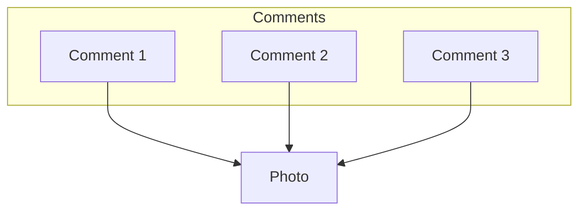

Standard Query Language

To run PostgreSQL online use [pg-sql](https://pg-sql.com)

### Notes
- In SQL, keywords are written in capital letters (like `SELECT`) while variables are written in lower-case (like a column name).
- PostgreSQL doesn't execute queries from left to right. It's important to understand this when writing queries so you comprehend what's going on behing the scenes as its very useful when writing complicated queries.


### Key Concepts

- **Schema**: The blueprint of a table. It's a set of instructions that define the data relationships between tables, the columns of a table, its value types, constraints, etc.
- **Index**:
- **Primary Key**: Uniquely identifies this record in this table. Commonly an integer or a UUID.
- **Foregin key**: Identifies a record (usually in another table) that this row is associated with. Like a photo mapped to a user_id.
- **Keywords**: Tell the database that we want to do something. Always written in capital letters (`CREATE TABLE` are some examples).
- **Identifiers**: Tell the database what thing we want to act on. Always written in lower 
case letters.

### Relationship Types

|                     |                                                                                               |
|---------------------|-----------------------------------------------------------------------------------------------|
| One-To-Many         | "A user has many photos".                                                                     |
| Many-To-One         | "Many photos belong to a user".                                                               |
| Many-To-Many        | "Many students have many classes" <br> "Many classes have many students".                     |
| One-To-One          | "A boat has a single captain" <br> "A captain belongs to a single boat".                      |


### Primary Keys

### Foreign Keys

Foreign keys in a relational database are columns (or combinations of columns) that establish and enforce a link between data in two tables. They create a parent-child relationship between the tables, where the child table (or referencing table) contains values that match values in the primary key column(s) of the parent table (or referenced table).

- Rows only have this **if they belong to another record**.
- Many rows can have the same foreign key.
- Name varies, usually called something like **"xyz_id"**.
- Exactly equal to the primary key of the referenced row.
- Changes if the relationship changes.

You might find it easier to understand by thinking how Instagram handles its comments. Each comment belongs to a user, so in the comments table you would have a foreign key for each comment pointing at its owner (the user who wrote this comment).



### ON DELETE Options

### Joins


### Comparisson Math Operators

Comparisson Math Operators are very useful when filtering out information (I.E when using the `WHERE` key word).

| Operator | Description                  |
|----------|------------------------------|
| =        | Equal                        |
| <>       | Not equal                    |
| >        | Greater than                 |
| <        | Less than                    |
| >=       | Greater than or equal        |
| <=       | Less than or equal           |
| NOT IN   | Value isn't present          |
| IN       | Is value present ?           |
| BETWEEN  | Value in between two others? |
| AND      | Used to join logical ops     |
| OR       | Used to join logical ops     |


### Functions

Here's a markdown table listing some common PostgreSQL functions formatted in uppercase:

| Function                   | Description                                                            |
|----------------------------|------------------------------------------------------------------------|
| ||                         | Concatenates two strings                                               |
| CONCAT(string1, string2, ...) | Concatenates strings                                                |
| UPPER(string)              | Converts string to uppercase                                           |
| LOWER(string)              | Converts string to lowercase                                           |
| LENGTH(string)             | Returns the length of a string                                         |
| ABS(expression)            | Absolute value                                                         |
| AVG(expression)            | Average value of a set of numbers                                      |
| COUNT(expression)          | Number of rows in a result set or number of times an expression occurs |
| MAX(expression)            | Maximum value of a set of numbers                                      |
| MIN(expression)            | Minimum value of a set of numbers                                      |
| SUM(expression)            | Sum of a set of numbers                                                |
| ROUND(expression, precision) | Rounds a numeric value to a specified precision                      |
| COALESCE(expression1, expression2, ...) | Returns the first non-null expression in the list         |
| SUBSTRING(string FROM start FOR length) | Extracts substring from a string                          |
| NOW()                      | Current date and time                                                  |
| DATE_PART('unit', timestamp) | Extracts a specific part (e.g., year, month) from a timestamp        |

### Agregate Functions

### Common Queries

#### Create Table

```SQL
CREATE TABLE table_name (
    column_title COLUMN_TYPE(optional_value)
);
```

#### Insert Single/Multiple Values Into A Table

To insert a single value just write a single set of parenthesis with column values.

```SQL
INSERT INTO table_name (column_name1, column_name2) VALUES 
(column1_value1, column2_value1)
(column1_value2, column2_value2)
(column1_value3, column2_value3),
;
```

#### Retrieving Information From A Table

Select all records from table:
```SQL
SELECT * FROM table_name;
```

Select specific columns from table:
```SQL
SELECT column_name, column2_name FROM table_name;
```
**Note**: The order of the columns is the order of their printing. You can also print the same column multiple times.

You can perform operations between columns when retrieving information:
```SQL
SELECT column_1, column_2 / column_3 FROM table_name;
```
**Note**: If your operation's result goes beyond what the column can store you will get an error. For example, if you use INTEGER as the column type and the result of a multiplication of two columns goes over its capacity (2,147,483,648) you will get an `Integer out of range` error.

When performing operations on retrieval, new columns will come out with weird names. To rename the result column:
```SQL
SELECT column_1, column_2 * column_3 AS result_column_name FROM table_name;
```

Concatenating column values as strings:
```SQL
SELECT column_1 || ', ' || column_2  AS concatenated_column_name FROM table_name;
```

The same as above but using CONCAT() instead of '||':
```SQL
SELECT CONCAT(column_1, ', ', column_2) FROM table_name;
```

#### Filtering Out Records

Use the WHERE key word to filter data by using it in pair with comparisson or math operators.

```SQL
SELECT column_1, column_2 WHERE column_1 > 5000 FROM table_name;
```


```SQL
SELECT column_1, column_2 FROM table_name WHERE column_1 BETWEEN 5 AND 10;
```

Below you'll find a neat trick; using a list of possible values for an IN check in a query:

```SQL
SELECT column_1, column_2 FROM table_name WHERE column_1 IN (possible_value_1, possible_value_2, ...);
```

You could also use a negative filter to get all records whose column_1 is not in the list by using the `NOT IN` key words. Note that you can chain as many AND and OR operators as you want.

```SQL
SELECT column_1, column_2 FROM table_name WHERE column_1 IN (possible_value_1, possible_value_2) AND column_2 = 'arbitrary_value';
```

#### Updating & Deleting Records

To update records you use the `UPDATE` and `SET` key words.

```SQL
UPDATE table_name SET column_1 = 5000 WHERE column_2 = 'arbitrary_value';
```

To delete records you use the `DELETE` key word. Be sure to **NEVER FORGET THE `FROM` STATEMENT**!

```SQL
DELETE FROM table_name WHERE column_1 = 5;
```

---

### Query Examples

```SQL
CREATE TABLE movies (
    title VARCHAR(60),
    box_office INTEGER
);
```

```SQL
INSERT INTO movies (title, box_office)
VALUES 
    ('The Avengers', 1500000000),
    ('Batman v Superman', 873000000);
```

```SQL
SELECT title, box_office FROM movies;
```

### PostgreSQL Common Column Types

| Data Type                  | Description                            | Capacity/Range                                                                                     |
|----------------------------|----------------------------------------|----------------------------------------------------------------------------------------------------|
| `bigint`                   | Signed eight-byte integer              | -9,223,372,036,854,775,808 to 9,223,372,036,854,775,807                                            |
| `bigserial`                | Autoincrementing eight-byte integer    | 1 to 9,223,372,036,854,775,807                                                                     |
| `bit(n)`                   | Fixed-length bit string                | Up to 1,048,576 bits (131,072 bytes)                                                               |
| `bit varying(n)`           | Variable-length bit string             | Up to 1,048,576 bits (131,072 bytes)                                                               |
| `boolean`                  | Logical Boolean (true/false)           | true or false                                                                                      |
| `box`                      | Rectangular box on a plane             | Represented by two points                                                                          |
| `bytea`                    | Binary data ("byte array")             | Up to 1 GB                                                                                         |
| `character(n)`             | Fixed-length character string          | Up to 1 billion characters                                                                         |
| `character varying(n)`     | Variable-length character string       | Up to 1 billion characters                                                                         |
| `cidr`                     | IPv4 or IPv6 network address           | IPv4: 0.0.0.0/0 to 255.255.255.255/32<br>IPv6: ::/0 to ffff:ffff:ffff:ffff:ffff:ffff:ffff:ffff/128 |
| `circle`                   | Circle on a plane                      | Defined by a center (point) and a radius                                                           |
| `date`                     | Calendar date (year, month, day)       | 4713 BC to 5874897 AD                                                                              |
| `double precision`         | Double precision floating-point number | 15 decimal digits precision                                                                        |
| `inet`                     | IPv4 or IPv6 host address              | IPv4: 0.0.0.0 to 255.255.255.255<br>IPv6: :: to ffff:ffff:ffff:ffff:ffff:ffff:ffff:ffff            |
| `integer`                  | Signed four-byte integer               | -2,147,483,648 to 2,147,483,647                                                                    |
| `interval`                 | Time interval                          | -178000000 years to 178000000 years                                                                |
| `json`                     | JSON data format                       | 1 GB                                                                                               |
| `jsonb`                    | Binary JSON data format                | 1 GB                                                                                               |
| `line`                     | Infinite line on a plane               | Defined by a point and a direction vector                                                          |
| `lseg`                     | Line segment on a plane                | Defined by two points                                                                              |
| `macaddr`                  | MAC (Media Access Control) address     | 6 bytes, formatted as XX:XX:XX:XX:XX:XX                                                            |
| `money`                    | Currency amount                        | -922,337,203,685,477.5808 to +922,337,203,685,477.5807                                             |
| `numeric(p, s)`            | Exact numeric of selectable precision  | Up to 131,072 digits before the decimal point; up to 16,383 digits after the decimal point         |
| `path`                     | Geometric path on a plane              | Sequence of points                                                                                 |
| `pg_lsn`                   | Log sequence number                    | 64-bit unsigned integer                                                                            |
| `point`                    | Geometric point on a plane             | Coordinate (x, y)                                                                                  |
| `polygon`                  | Closed geometric path on a plane       | Sequence of points forming a closed loop                                                           |
| `real`                     | Single precision floating-point number | 6 decimal digits precision                                                                         |
| `smallint`                 | Signed two-byte integer                | -32,768 to 32,767                                                                                  |
| `smallserial`              | Autoincrementing two-byte integer      | 1 to 32,767                                                                                        |
| `serial`                   | Autoincrementing four-byte integer     | 1 to 2,147,483,647                                                                                 |
| `text`                     | Variable-length character string       | Up to 1 billion characters                                                                         |
| `time`                     | Time of day (no time zone)             | 00:00:00 to 24:00:00                                                                               |
| `timestamp`                | Date and time (no time zone)           | 4713 BC to 294276 AD                                                                               |
| `timestamp with time zone` | Date and time (including time zone)    | 4713 BC to 294276 AD                                                                               |
| `tsquery`                  | Text search query                      | Sequence of lexemes                                                                                |
| `tsvector`                 | Text search document                   | Sequence of lexemes                                                                                |
| `txid_snapshot`            | User-level transaction ID snapshot     | Varies                                                                                             |
| `uuid`                     | Universally unique identifier          | 128-bit number (UUID)                                                                              |
| `xml`                      | XML data                               | Unlimited size                                                                                     |
