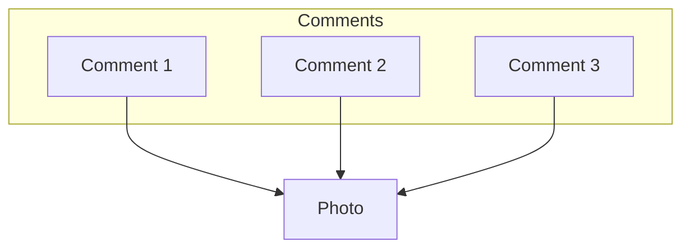
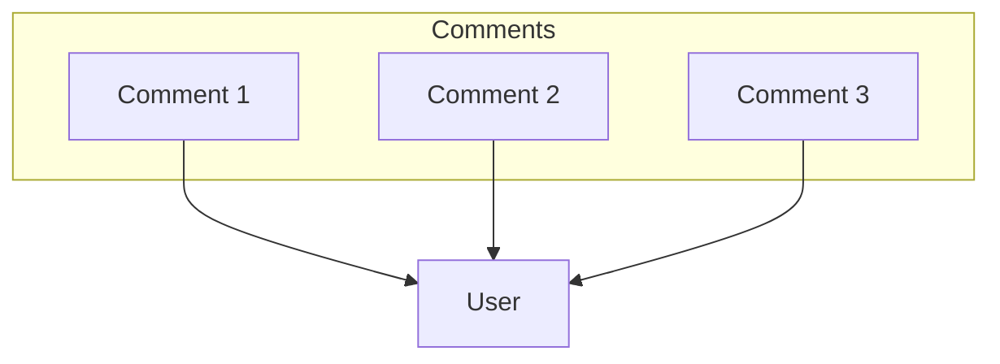

Standard Query Language

**Notes**: In SQL, keywords are written in capital letters (like 'SELECT') while variables are written in lower-case (like a column name).

### Key Concepts

- **Schema**: The blueprint of a table. It's a set of instructions that define the data relationships between tables, the columns of a table, its value types, constraints, etc.
- **Index**:
- **Primary Key**: Uniquely identifies this record in this table. Commonly an integer or a UUID.
- **Foregin key**: Identifies a record (usually in another table) that this row is associated with. Like a photo mapped to a user_id.

### Relationship Types

|                     |                                                                                               |
|---------------------|-----------------------------------------------------------------------------------------------|
| One-To-Many         | "A user has many photos".                                                                     |
| Many-To-One         | "Many photos belong to a user".                                                               |
| Many-To-Many        | "Many students have many classes"   "Many classes have many students".                     |
| One-To-One          | "A boat has a single captain"   "A captain belongs to a single boat".                      |

### Primary Keys

### Foreign Keys

Foreign keys in a relational database are columns (or combinations of columns) that establish and enforce a link between data in two tables. They create a parent-child relationship between the tables, where the child table (or referencing table) contains values that match values in the primary key column(s) of the parent table (or referenced table).

- Rows only have this **if they belong to another record**.
- Many rows can have the same foreign key.
- Name varies, usually called something like **"xyz_id"**.
- Exactly equal to the primary key of the referenced row.
- Changes if the relationship changes.

You might find it easier to understand by thinking how Instagram handles its comments. Each comment belongs to a user, so in the comments table you would have a foreign key for each comment pointing at its owner (the user who wrote this comment).

### ON DELETE Options

### Joins

### Comparisson Math Operators

| Operator | Description                  |
|----------|------------------------------|
| =        | Equal                        |
| <>       | Not equal                    |
| >        | Greater than                 |
| <        | Less than                    |
| >=       | Greater than or equal        |
| <=       | Less than or equal           |
| NOT IN   | Value isn't present          |
| IN       | Is value present ?           |
| BETWEEN  | Value in between two others? |

### Functions

Here's a markdown table listing some common PostgreSQL functions formatted in uppercase:

| Function                   | Description                                                            |
|----------------------------|------------------------------------------------------------------------|
| ABS(expression)            | Absolute value                                                         |
| AVG(expression)            | Average value of a set of numbers                                      |
| COUNT(expression)          | Number of rows in a result set or number of times an expression occurs |
| MAX(expression)            | Maximum value of a set of numbers                                      |
| MIN(expression)            | Minimum value of a set of numbers                                      |
| SUM(expression)            | Sum of a set of numbers                                                |
| ROUND(expression, precision) | Rounds a numeric value to a specified precision                      |
| COALESCE(expression1, expression2, ...) | Returns the first non-null expression in the list         |
| CONCAT(string1, string2, ...) | Concatenates strings                                                |
| UPPER(string)              | Converts string to uppercase                                           |
| LOWER(string)              | Converts string to lowercase                                           |
| SUBSTRING(string FROM start FOR length) | Extracts substring from a string                          |
| NOW()                      | Current date and time                                                  |
| DATE_PART('unit', timestamp) | Extracts a specific part (e.g., year, month) from a timestamp        |

### Agregate Functions
