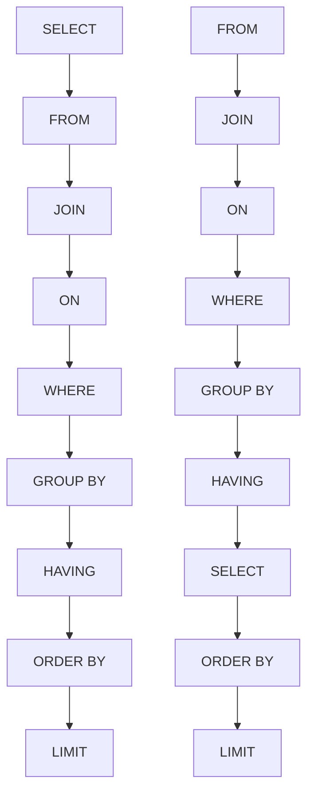
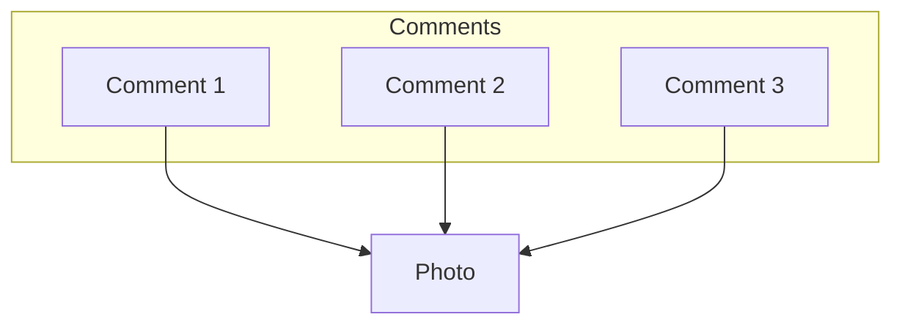

# My Software Engineering Notes
<details>
  <summary><h2 style='display: inline;'> Python </h2></summary>
  


### Decorators

---

Python decorators are a powerful feature that allows you to modify or extend the behavior of functions or methods without changing their actual code. They essentially allow you to wrap another function or method and execute code before and/or after the wrapped function runs. Decorators are typically denoted by the @ symbol followed by the decorator function name, placed just above the function definition.

Here's a basic example to illustrate how decorators work:

``` Python
def my_decorator(func):
    def wrapper():
        print("Something is happening before the function is called.")
        func()
        print("Something is happening after the function is called.")
    return wrapper

@my_decorator
def say_hello():
    print("Hello!")

say_hello()
```

In this example, my_decorator is a decorator function that takes another function func as its argument. Inside my_decorator, a nested function wrapper is defined, which wraps around the original function func. Inside wrapper, you can include code to be executed before and/or after calling func. Finally, the wrapper function is returned.

When you decorate the say_hello function with @my_decorator, Python essentially does this: say_hello = my_decorator(say_hello). So, when you call say_hello(), it actually calls the wrapper function created by my_decorator, which in turn calls the original say_hello function within it.

Some of the most common decorators used in Python include:

``` Python
@property # Used to define properties on classes, allowing you to define getter, setter, and deleter methods for attributes.

@classmethod # Declares a method within a class that takes the class itself as its first argument instead of the instance.

@staticmethod # Used to declare a method that belongs to the class but doesn't require access to the class or instance.

@abstractmethod # Used in abstract base classes to declare abstract methods, which must be implemented by subclasses.

@wraps # A decorator from the functools module used to preserve the metadata of the original function when creating wrapper functions. This is particularly useful for maintaining docstrings, function name, and other attributes.

@lru_cache # A decorator from the functools module that caches the results of a function, saving time when the same inputs occur again.
```

### Dunder Methods 

---

Dunder methods, short for "double underscore" methods, are special methods in Python that have names surrounded by double underscores, like `__init__`, `__repr__`, `__add__`, etc. They are also called magic methods or special methods.

These methods allow classes to define specific behavior that gets invoked in response to certain operations or interactions. For example, when you use the + operator with instances of a class, Python looks for the __add__ method to determine how to perform addition for those objects.

Here are some common dunder methods and their purposes:
``` Python
__init__(self, ...) # Constructor method that initializes a new instance of a class.
__repr__(self) # Method that returns a string representation of the object, used for debugging and logging.
__str__(self) # Method that returns a string representation of the object, used for informal representation to end-users.
__len__(self)# Method that returns the length of the object.
__getitem__(self, key) # Method that enables accessing elements of an object using square brackets, like obj[key].
```

### Iterators

---

An iterator in Python is an object that is used to iterate over iterable objects like lists, tuples, dicts, and sets. The Python iterators object is initialized using the `iter()` method. It uses the `next()` method for iteration.
``` Python
__iter__() # The iter() method is called for the initialization of an iterator. This returns an iterator object
__next__() # The next method returns the next value for the iterable. When we use a for loop to traverse any iterable object, internally it uses the iter() method to get an iterator object, which further uses the next() method to iterate over. This method raises a StopIteration to signal the end of the iteration.
```

``` Python
string = "GFG"
ch_iterator = iter(string)
 
print(next(ch_iterator)) # -> G
print(next(ch_iterator)) # -> F
print(next(ch_iterator)) # -> G
```

### Generators

---

`Generators` are a powerful feature that allow you to iterate over a sequence of items without storing them all in memory at once. They are implemented using a special type of function using `yield` expressions.

Here are key points about Python generators:

- Lazy Evaluation: Generators generate values on-the-fly as they are requested instead of generating them all at once and storing them in memory. This is achieved using the yield statement instead of return.

-Memory Efficiency: Since generators produce values one at a time, they are memory efficient especially for large datasets or infinite sequences.

- Iteration Support: Generators support iteration automatically, which means you can use them in loops or any other context that expects an iterable.

- State Maintenance: The state of local variables in a generator function is remembered between calls. This allows you to write complex iterative algorithms.

- Syntax: Generators are defined using a function that contains one or more yield statements. When called, they return a generator object, which can be iterated over using a for loop or by explicitly calling next() on it.

Here’s a simple example of a generator function that generates squares of numbers up to a given limit:

```Python
def square_generator(n):
    for i in range(n):
        yield i ** 2

# Using the generator
gen = square_generator(5)
for num in gen:
    print(num)

# Output:
# 0
# 1
# 4
# 9
# 16
```

Generators are specially handy when you want to access an array of values but don't want to store them in memory at once (like that API implementation problem you once saw).

### Yield 

---

`Generators` are a special type of iterable that allow you to iterate over a sequence of values lazily, meaning that they produce values on-the-fly as they are requested rather than generating the entire sequence upfront and storing it in memory.

When you use `yield` inside a function, it turns that function into a generator function. Instead of using return to return a single value and exit the function, yield is used to yield a value to the caller while suspending the state of the function. This allows the function to be resumed from where it left off the next time it is called.

Here's a simple example:
``` Python
def count_up_to(n):
    count = 1
    while count <= n:
        yield count
        count += 1

# Using the generator function
counter = count_up_to(5)
print(next(counter))  # Output: 1
print(next(counter))  # Output: 2
print(next(counter))  # Output: 3
```

In this example, count_up_to is a generator function that yields numbers from 1 up to n. When you call next(counter), it starts or resumes execution of the generator function until the next yield statement, where it yields the value and pauses execution. The function retains its state, so subsequent calls to next() continue from where it left off.

Using yield allows for memory-efficient iteration over large sequences, as only one value needs to be stored in memory at a time, unlike with lists where the entire sequence is stored. Additionally, it enables lazy evaluation, meaning that values are generated only when needed, which can improve performance in certain scenarios.

### Zip

---

The zip() function in Python is used to combine multiple iterables (lists, tuples, etc.) element-wise. It takes in two or more iterables as arguments and returns an iterator that generates tuples of corresponding elements from each iterable.

Here's a basic example:

```python
list1 = [1, 2, 3]
list2 = ['a', 'b', 'c']

zipped = zip(list1, list2)

for item in zipped:
    print(item)
# Output:

(1, 'a')
(2, 'b')
(3, 'c')
```

In this example, zip() pairs the first element of list1 with the first element of list2, the second element of list1 with the second element of list2, and so on.

One important thing to note about zip() is that it stops generating tuples as soon as one of the input iterables is exhausted. For example:

```python
list1 = [1, 2, 3]
list2 = ['a', 'b']

zipped = zip(list1, list2)

for item in zipped:
    print(item)
# Output:

(1, 'a')
(2, 'b')
```

Here, since list2 has only two elements, the third element of list1 is ignored.

If you want to get a list of tuples instead of an iterator, you can use the list() function to convert the iterator returned by zip() into a list:

```python
list1 = [1, 2, 3]
list2 = ['a', 'b', 'c']

zipped = list(zip(list1, list2))

print(zipped)
# Output:

[(1, 'a'), (2, 'b'), (3, 'c')]
```

zip() is commonly used in scenarios where you need to iterate over multiple lists simultaneously, especially when the lists are related and you want to process their elements together.

### Serialization

---

Serialization in Python refers to the process of converting complex data structures, such as objects or data collections, into a format that can be easily stored or transmitted and later reconstructed back into its original form. This process is essential for tasks like saving data to a file, sending data over a network, or storing data in a database.

Python provides several built-in modules for serialization, such as:

- pickle: This module can serialize Python objects into a binary format. It can handle almost any Python object, including custom classes and functions.

- json: This module serializes Python objects into a human-readable format called JSON (JavaScript Object Notation). JSON is commonly used for transmitting data between a server and a client over a network.

- marshal: This module is similar to pickle but is more restricted in terms of the types of objects it can serialize. It is primarily used for serializing Python code objects.

- shelve: This module provides a simple interface for persistently storing Python objects in a dictionary-like format.

Serialization is particularly useful for tasks like data storage, data exchange between different systems or languages, and caching. However, it's essential to consider security implications, especially when deserializing data, as it can lead to security vulnerabilities if not handled properly.

### Lambda Functions

---

Lambda functions in Python are small, anonymous functions defined using the lambda keyword. They are often used when you need a short function for a short period of time and don't want to define a full function using def.

#### Syntax
The syntax of a lambda function is:

```Python
lambda arguments: expression
```
- lambda is the keyword used to define a lambda function.
- arguments are the input parameters for the function.
- expression is a single expression that gets evaluated and returned as the result of the function.
#### Examples

##### Basic Example:

```Python
square = lambda x: x ** 2
print(square(5))  # Output: 25
```

Here, lambda x: x ** 2 defines a lambda function that takes one argument x and returns its square.

##### Using Multiple Arguments

```Python
add = lambda x, y: x + y
print(add(3, 4))  # Output: 7
```

This lambda function lambda x, y: x + y takes two arguments x and y and returns their sum.

##### In List Sorting
Lambda functions are often used in conjunction with built-in functions like sorted() or filter():

```Python
points = [(1, 2), (3, 1), (5, 4), (2, 7)]
points_sorted = sorted(points, key=lambda x: x[1])
print(points_sorted)  # Output: [(3, 1), (1, 2), (5, 4), (2, 7)]
```

Here, lambda x: x[1] specifies that the list should be sorted based on the second element of each tuple in points.

##### As an Argument to map()

```Python
numbers = [1, 2, 3, 4, 5]
squared = list(map(lambda x: x ** 2, numbers))
print(squared)  # Output: [1, 4, 9, 16, 25]
```

The lambda function lambda x: x ** 2 is applied to each element in numbers using map() to compute their squares.

#### Benefits of Lambda Functions
- Conciseness: They reduce the amount of code when a simple function is needed.
- Readability: Lambda functions can make code more readable when used appropriately, such as within map(), filter(), or sorted().
#### Limitations
- Single Expression: Lambda functions are restricted to a single expression, making them unsuitable for complex logic.
- No Statements: They cannot contain statements like return, pass, or assert.

Lambda functions are particularly useful in functional programming contexts where functions are treated as first-class citizens and are passed around as arguments or returned from other functions
</details>
<details>
  <summary><h2 style='display: inline;'> Django </h2></summary>
  


### One-to-many Relations

- Use `ForeignKey`

- Related name makes it so that when you want to access an authors book set (by default RELATEDCLASSNAME_SET [book_set]) you use the provided related name 'books' instead of the default 'book_set'.

```class Books
    author = models.ForeignKey(Author, on_delete=models.CASCADE, null=True, related_name='books') # Can be null if no value is provided
```

### Many-to-many Relations
    
- Use `ManyToManyField`

```
# In this case, related_name is used to get all the books of a country by using 'books' (in this case) instead of 'book_set'
class Book
    published_countries = models.ManyToManyField(Country, related_name='books')
```

### One-to-One Relations    
    
- Use `OneToOneField`

- Related name is not needed here since Django automatically will link authors to the Address object it belongs to. This means you can access an author object from its adress like 'Address.objects.all()[0].author'

```
class Author
    address = models.OneToOneField(Address, on_delete=models.CASCADE, null=True)
```
</details>
<details>
  <summary><h2 style='display: inline;'> System Design </h2></summary>
  
### Fundamentals

#### Chapter 1 Reliable, Scalable, and Maintainable Applications

- **Availability**: Percentage of time a system or service is operational and accessible when needed. It is a measure of how often the system is up and running compared to the total time it should be available.

  - Two nines '**99%**' Availability means the service is down around 3.65 days a year.
  - Every aditional nine decreases the downtime by an order of magnitude of roughly 10 times:

    | Availability | Downtime           |
    |--------------|--------------------|
    | 99%          | 3.65 days/year     |
    | 99.9%        | 8.77 hours/year    |
    | 99.99%       | 52.6 minutes/year  |
    | 99.999%      | 5.26 minutes/year  |
    | 100%         | 0 seconds/year     |
 

- **Reliability**: Measures how consistently and correctly a system performs its intended functions over time without failure. It indicates the system's ability to operate without errors or breakdowns when in use.
  
  - *Measurement*: Often assessed using metrics such as Mean Time Between Failures (MTBF) or Mean Time to Failure (MTTF). These metrics quantify how long the system performs correctly before encountering a failure.

- **Redundancy**: Redundancy refers to the inclusion of extra components or systems to ensure that a system can continue to operate in the event of a failure. It is a design approach that involves adding duplicate resources to increase reliability and availability.

  - *Hardware Redundancy*: Adding spare hardware components (e.g., additional servers, power supplies, or network links) that can take over if primary components fail.
  - *Data Redundancy*: Replicating data across multiple storage devices or locations to protect against data loss.
  - *Geographic Redundancy*: Distributing resources across different locations or data centers to protect against site-specific failures.

- **Maintainability**: Over time, many different people will work on the system (engineering and operations, both maintaining current behavior and adapting the system to new use cases), and they should all be able to work on it productively.
  - Operability: Make it easy for operations teams to keep the system running smoothly.
  - Simplicity: Make it easy for new engineers to understand the system.
  - Evolvability: Make it easy for engineers to make changes to the system in the future

- **Fault**: One component of the system deviating from its spec.

- **Failiure**: When the system as a whole stops providing the required service to the user

- Rolling upgrade:

- **Throughput**: The amount of work processed by a system or component in a given amount of time. It's a measure of how efficiently a system performs its tasks. Examples:
  - Systems performance: Requests per second (requests/second)
  - Networks: Megabits per second (Mbps)
  - Databases: Queries per second (queries/second)

- **Latency**: Refers to the time delay between the initiation of a request and the beginning of a response. It’s a measure of the delay experienced by a request or action within a system or network.

- **Service time**: The time it takes to process the request (authorization, load balancing, etc.).

- **Response time**: Response time is the total time it takes from the initiation of a request until the entire response is received and processed. It encompasses the latency as well as the service time.

  - It’s common to see the average response time of a service reported. (Strictly speaking, the term “average” doesn’t refer to any particular formula, but in practice it is usually understood as the arithmetic mean: given n values, add up all the values, and divide by n.) However, the mean is not a very good metric if you want to know your “typical” response time, because it doesn’t tell you how many users actually experienced that delay.

  - Usually it is better to use percentiles. If you take your list of response times and sort it from fastest to slowest, then the median is the halfway point: for example, if your median response time is 200 ms, that means half your requests return in less than 200 ms, and half your requests take longer than that.

    - There are algorithms that can calculate a good approximation of percentiles at minimal CPU and memory cost:
      - forward decay
      - t-digest
      - HdrHistogram. 

- Vertical scaling: Systems *'scaling up'* increase their ability to process more requests by improving the hardware of the hosting machine.

- Horizontal scaling: Systems *'scaling out'* increase their ability to process more requests by adding more machines to handle them.

Distributing load across multiple machines is also known as a shared-nothing architecture.

- **SLA (Service Level Agreement)**: Contracts that define the expected performance and availability of a service 

- **Telemetry**: Monitoring things like performance metrics and error rates. Once the rocket leaves the ground, telemetry is important to know what's going on 

- **Load parameters**: request per second, reads to writes ratio, etc.

- **Fan-out**: Read page 29.

- **Elastic Systems**: Those that can scale automatically.


#### Chapter 2 Data Models and Query Languages

- **Relational VS. Document Model**
  - Pros and Cons
    - **SQL Databases**:
      -  Better support for joins, and many-to-one and many-to-many relationships.
      - Splitting a document-like structure into multiple tables can lead to cumbersome schemas and unnecessarily complicated application code.

    - **NoSQL Databases**:
      - Schema flexibility.
      - Better performance due to locality.
      - For some applications it is closer to the data structures used by the application.
      - If your application does use many-to-many relationships, the document model becomes less appealing

  - Data Model
    - **SQL Databases**: 
      - Relational model with tables, rows, and columns.
      - Accessed via SQL queries.
      - Schema is predefined and changes can be complex.
    
    - **NoSQL Databases**:
      - Varied models including document stores, key-value stores, column-family stores, and graph databases.
      - Flexible schema, allowing for adjustments and hierarchical or nested data structures.

  - Schema Flexibility
    - **SQL Databases**:
      - Fixed schema.
      - Schema changes require migrations, which can be time-consuming.
    
    - **NoSQL Databases**:
      - Dynamic schema.
      - Easier to store different fields or structures in records without predefined schema changes.

  - Consistency and Transactions
    - **SQL Databases**:
      - Adhere to ACID (Atomicity, Consistency, Isolation, Durability) properties.
      - Ensure reliable transactions and consistency even in system failures.
    
    - **NoSQL Databases**:
      - May prioritize availability and partition tolerance (CAP theorem) over strict consistency.
      - Often offer eventual consistency instead of strong consistency.
      - Multi-statement transactions might not be as robust.

  - Scalability
    - **SQL Databases**:
      - Typically scale vertically (adding resources to a single server).
      
    - **NoSQL Databases**:
      - Designed to scale out horizontally (distributing data across multiple servers).
      - Can handle large volumes of data and high-velocity workloads more effectively.

  - Query Language
    - **SQL Databases**:
      - Use Structured Query Language (SQL).
      - SQL is powerful for complex queries involving multiple tables.
      
    - **NoSQL Databases**:
      - Query mechanisms vary by database type.
      - Document stores might use JSON-based queries; key-value stores use simple key-based lookups.

  - Use Cases
    - **SQL Databases**:
      - Best for applications needing complex transactions, strong consistency, and well-defined schemas.
      - Examples: financial systems, traditional enterprise applications.
      
    - **NoSQL Databases**:
      - Ideal for scenarios where scalability, flexibility, and high performance are critical.
      - Examples: real-time web applications, big data applications, content management systems.

A document is usually stored as a single continuous string, encoded as JSON, XML, or a binary variant thereof (such as MongoDB’s BSON). If your application often needs to access the entire document (for example, to render it on a web page), there is a performance advantage to this storage locality.

If data is split across multiple tables, like in Figure 2-1, multiple index lookups are required to retrieve it all, which may require more disk seeks and take more time. The locality advantage only applies if you need large parts of the document at the same time.

- **Imperative VS. Declarative Languages**:
  - Imperative Language: Tells the computer to perform certain operations in a certain order, like JS or Python. You tell the code line by line what to do.
  - Declarative Language: You specify the pattern of the data you want, but not how to achieve that goal (like CSS or react).

- **MapReduce**: Programming model for handling large amounts of data across many machines, popularized by Google.
  - A limited form of MapReduce is supported by some NoSQL datastores, including MongoDB and CouchDB, as a mechanism for performing read-only queries across many documents.
  - MapReduce is neither a declarative query language nor a fully imperative query API, but somewhere in between: the logic of the query is expressed with snippets of code, which are called repeatedly by the processing framework.

- Graph-Like Data Models
  - Many-to-many relationships are prevalent in your data.
  - Consist of:
    - Vertices (also known as nodes or entities).
    - Edges (also known as relationships or arcs).

- **Normalization**: Apparently, in DBs normalization means to store the data in such a way that it is [unique] not duplicated. Like in LinkedIn  your profile has a city or location, the db tables have a table for your user (id, name, last_name, city_id)  and a table for cities (id, city_name, etc.) making it so that if you update the city name in the cities table, all users will have their city updated.

- **Schema-on-read**: XML DBs don't have concrete schemas like relational DBs. That doesn't mean they don't have a structure (it's implicit since the app ensures the data is valid and has a certain structure) but the DB itself doesn't. Hence schema-on-read instead of the incorrect "schema-less".

- **Heterogeneous data**: data that is not following the same structure across all records. Like chocolate chip cookies, they're not exactly the same, they have different shapes and sizes.

- **Homogeneous data**: Data that has the same  structure (following a pattern, it doesn't mean it's all exactly the same info) across all records.

- **Declarative language**: You tell the outcome you want

- **Imperative language**: You specify the steps to achieve the outcome you want


#### Chapter 3: Storage and Retrieval

- **Log**: An append-only sequence of records. Many databases internally use a log, which is an append-only data file.
  - Application Logs: These are the types of logs you know, the file that has all the records of what's going on in an application.
  - DB Log: Some DBs use an internal append-only log to keep track of its records.
    - NOTE: Remember the example of the world's simplest DB where it uses bash commands to append data in a hasmpap way and searches for the most recent occurence of the key. This way you'll immediatly remember what a log is in this context:

      ```Bash
      db_set() {
        echo "$1, $2" >> database
      }
      db_get() {
        grep "^$1," database | sed -e 's/^$1,//" | tail -n 1
      } 
      ```

- **Index**: An additional structure that is derived from the primary data. It allows you to search records faster in the DB with the downside of slowing down writes.


- **Storage engines**:
  - Log-structured:
  - Page-oriented:


<details>
  <summary><h4 style="display: inline;">Functional vs Non-Functional Requirements</h4></summary><br>

| Functional Requirements                                                                                       | Non-Functional Requirements                                                                                             |
|---------------------------------------------------------------------------------------------------------------|-------------------------------------------------------------------------------------------------------------------------|
| A functional requirement defines a system or its component.                                                   | A non-functional requirement defines the quality attribute of a software system.                                        |
| It specifies “What should the software system do?”                                                            | It places constraints on “How should the software system fulfill the functional requirements?”                          |
| Functional requirement is specified by User.                                                                  | Non-functional requirement is specified by technical peoples e.g. Architect, Technical leaders and software developers. |
| It is mandatory.                                                                                              | It is not mandatory.                                                                                                    |
| It is captured in use case.                                                                                   | It is captured as a quality attribute.                                                                                  |
| Defined at a component level.                                                                                 | Applied to a system as a whole.                                                                                         |
| Helps you verify the functionality of the software.                                                           | Helps you to verify the performance of the software.                                                                    |
| Functional Testing like System, Integration, End to End, API testing, etc are done.                           | Non-Functional Testing like Performance, Stress, Usability, Security testing, etc are done.                             |
| Usually easy to define.                                                                                       | Usually more difficult to define.                                                                                       |
| **Example**                                                                                                   | **Example**                                                                                                             |
| 1) Authentication of user whenever he/she logs into the system.                                               | 1) Emails should be sent with a latency of no greater than 12 hours from such an activity.                              |
| 2) System shutdown in case of a cyber attack.                                                                 | 2) The processing of each request should be done within 10 seconds                                                      |
| 3) A Verification email is sent to user whenever he/she registers for the first time on some software system. | 3) The site should load in 3 seconds when the number of simultaneous users are > 10000                                  |

</details>

### Napkin Math

- **1 Byte** = **8 bits** 
- **1 IPV4** Addresss = **4 Bytes**
- **1 IPV6** Address = **16 Bytes**
- **1 Unix Timestamp** = **4 Bytes**
- SSD: Solid State Drive

<details>
  <summary><h5 style="display: inline;">Latency Numbers Every Programmer Should Know</h5></summary><br>

[Latency Numbers Every Programmer Should Know](https://colin-scott.github.io/personal_website/research/interactive_latency.html)

This website is really useful so you can get an idea (it's a little outdated, 2020) of the latency (how much time it takes an operation to perform) when working with data.


</details>

#### Concepts I Found Interesting

<details>
  <summary><h5 style="display: inline;">CPU Cache Mutex Lock/Unlock</h5></summary><br>

In the context of CPU cache, mutex lock and unlock operations typically refer to synchronization mechanisms used in multi-threaded programming to control access to shared resources.

1. Mutex Lock:

- When a thread wants to access a shared resource (such as a region of memory or a data structure) that is cached in CPU cache, it first acquires a mutex lock associated with that resource.
- Acquiring a mutex lock ensures that only one thread can access the shared resource at a time. If the resource is already locked by another thread, the thread attempting to lock it will wait until the lock is released.

2. Mutex Unlock:

- Once a thread has finished using the shared resource, it releases the mutex lock by invoking the unlock operation.
- Releasing the mutex lock allows other threads to acquire the lock and access the shared resource.
- Mutex locks and unlocks help prevent race conditions and ensure that concurrent access to shared resources is properly coordinated, thereby avoiding data corruption and inconsistency.

In the context of CPU cache, when a thread acquires a mutex lock before accessing a shared resource that resides in the cache, it ensures that only one thread can access that resource at a time, even if multiple threads are running concurrently on different CPU cores. This helps maintain data integrity and consistency in multi-threaded applications.

</details>

### Software Technologies You Should Know

<details>
  <summary><h4 style="display: inline;">Redis</h4></summary><br>


Redis, **RE**mote **DI**ctionary **S**erver, is an open-source, in-memory data structure store used as a database, cache, and message broker. It supports various data structures such as strings, hashes, lists, sets, sorted sets with range queries, bitmaps, hyperloglogs, geospatial indexes, and streams. Redis is known for its high performance, flexibility, and rich set of features.

##### Key Features:

- **In-Memory Storage**: Redis primarily stores data in RAM, which allows for extremely fast data access and retrieval.
- **Data Structures**: It supports various data structures, enabling users to store and manipulate data efficiently.
- **Persistence**: Redis offers different persistence options to ensure data durability, including snapshotting and append-only file (AOF) persistence.
- **Replication and High Availability**: Redis supports replication and clustering, allowing for data redundancy and high availability.
- **Pub/Sub Messaging**: Redis can be used as a message broker through its publish/subscribe functionality.
- **Lua Scripting**: Users can extend Redis functionality using Lua scripting.
- **Transactions**: Redis supports transactions, allowing users to execute a group of commands as a single atomic operation.

##### Alternatives:

1. **Memcached**: Memcached is a distributed memory caching system that also stores key-value pairs. It is known for its simplicity and high-performance caching capabilities.

4. **Amazon DynamoDB**: DynamoDB is a fully managed NoSQL database service provided by Amazon Web Services (AWS). It offers seamless scalability, high performance, and built-in security features.

</details>

### Designing Systems & Components
<details>
  <summary><h4 style="display: inline;">Rate Limiter</h4></summary><br>

##### Requirements

1. Take 1 Billion (1x10^9 or 1,000,000,000) users.
2. Must be as general use as possible (multiple services use it).

Components you ended up using:
- Reddis: Sorted sets 
- Memcache
- Consistent Hashing

##### Algorithms

###### Fixed Window Algorithm for Rate limiters

We set a fix window of time, lets say every minute a user can send 100 requests, so everytime a new minute encompasses we refresh his available requests total to 100.

- Benefit: Since we're storing counts inside of the key value store in our memory, this is a very simplistic approach to take. We don't have to take into account when the requests were made exactly, we just care that they happened in the window -> we would just need to include the minute when checking for the availability.

- Issue with refresh rate of the algorithm: With a requests/per minute of a 100; if the user sends a request at 0:59 and then at 1:00 the valid window refreshes, the user could send another 100 requests at 1:01: in total 200 requests in a matter of 2 seconds

###### Sliding window

Any time a user makes a request we check if it is inside the invalid window, every second we shift this valid window by one second so the user can't take advantage of the refresh rate of the fixed window Algo.

- Benefit: Here we're checking if the user has expired his total amout of requests in the previous 60 seconds so we don't have the same refresh rate issue as the Fixed widow.

- Downside: We have to store the exact time-stamp when the user attempted to perform his requests. This increases our memory requirements since one Unix timestamp per request per user:

$4 \text{ Bytes} \times \text{Max\_No.Of\_Requests} \times \text{No\_Of\_Users} -> 4 * 100 * 1000000000 = 400GB$ 

##### Other Algorithms

- Token bucket
- Sliding Window Counter (Balance between Fixed Window and Sliding Window Algorithms)

##### Data Schemas

**Identify User and his count**
key -> Value
User_Id/Ip -> Count (Enforces count using rule)
*Redis can set data to expire

**Identify rule (youtube rate limiter rules may be different than gmail's)**

**Rule DB Schema**
| Parameeter | Type |
|----------|----------|
| Id   | String   |
| API To forward the request to   | Cell 4   |
| Operation/Endpoint   | String   |
| TimeUnit   | String   |
| Request   | Int   |

</details>

</details>
<details>
  <summary><h2 style='display: inline;'> Algorithms </h2></summary>
  
### Big O Notation
***


#### Static Arrays
***

| Operation | Big-O Time | Notes                                                                                                                                      |
|-----------|------------|--------------------------------------------------------------------------------------------------------------------------------------------|
| Reading   | O(1)       | Reading an element by index is constant time.                                                                                              |
| Insertion | O(n)*      | Insertion at the end of the array 'push( )' is typically O(1) on average. However, resizing may occasionally lead to O(n) time complexity. |
| Deletion  | O(n)*      | Deletion from the end of the array 'pop( )' is typically O(1) on average. However, resizing may occasionally lead to O(n) time complexity. |


#### Dynamic Arrays (Python Lists)
***

| Operation | Big-O Time | Notes                                                                                                                                                                      |
|-----------|------------|----------------------------------------------------------------------------------------------------------------------------------------------------------------------------|
| Reading   | O(1)       | Reading an element by index is constant time, similar to regular arrays.                                                                                                   |
| Insertion | O(1)*      | Insertion at the end of the list ('append()' operation) is typically O(1) on average. However, inserting in the middle requires shifting, leading to O(n) time complexity. |
| Deletion  | O(1)*      | Deletion from the end of the list ('pop()' operation) is typically O(1) on average. However, deleting from the middle requires shifting, leading to O(n) time complexity.  |


**Notes**: Insertion and deletion at the end of a Python list (using methods like 'append()' and 'pop()') are also usually O(1) because Python dynamically manages memory for the list and avoids resizing the array too often. However, as mentioned in the notes, if insertion or deletion happens in the middle of the list, it requires shifting elements, resulting in an O(n) time complexity due to the need to move subsequent elements.

#### Stacks
***

| Operation | Big-O Time | Notes                                                                                           |
|-----------|------------|-------------------------------------------------------------------------------------------------|
| Push      | O(1)       |                                                                                                 |
| Pop       | O(1)*      | Check if the stack is empty first.                                                              |
| Peek/Top  | O(1)*      | Retrieves without removing.                                                                     |

#### Linked Lists (1 Direction)
***

| Operation | Big-O Time | Notes                                                     |
|-----------|------------|-----------------------------------------------------------|
| Access    | O(n)       |                                                           |
| Search    | O(n)*      |                                                           |
| Insertion | O(1)*      | Assuming you have the reference to the desired position.  |
| Deletion  | O(1)*      | Assuming you have the reference to the desired position.  |

#### Linked List (2 Directions)
***

| Operation | Big-O Time | Notes                                                     |
|-----------|------------|-----------------------------------------------------------|
| Access    | O(n)       |                                                           |
| Search    | O(n)*      |                                                           |
| Insertion | O(1)*      | Assuming you have the reference to the desired position.  |
| Deletion  | O(1)*      | Assuming you have the reference to the desired position.  |

#### Queues
***


| Operation | Big-O Time | Notes                                                     |
|-----------|------------|-----------------------------------------------------------|
| Enqueue   | O(1)       |                                                           |
| Dequeue   |  O(1)      |                                                           |

#### Binary Trees
***

| Operation       | Big-O Time | Notes                                              |
|-----------------|------------|----------------------------------------------------|
| Search          | O(log n)   | Depends on the height of the binary tree           |
| Insertion       | O(log n)   | Depends on the height of the binary tree           |
| Deletion        | O(log n)   | Depends on the height of the binary tree           |
| Traversal       | O(n)       | In-order, Pre-order, Post-order traversals         |
| Finding height  | O(n)       | Worst case if the tree is unbalanced               |
| Finding depth   | O(n)       | Worst case if the tree is unbalanced               |
| Finding minimum | O(log n)   | Traverse left until you reach the leftmost leaf    |
| Finding maximum | O(log n)   | Traverse right until you reach the rightmost leaf  |

#### Heaps
***

| Operation       | Big-O Time | Notes                                        |
|-----------------|------------|----------------------------------------------|
| Insertion       | O(log n)   | Heapify up operation                         |
| Deletion (Root) | O(log n)   | Heapify down operation                       |
| Search          | O(n)       | Linear search through the array              |
| Extract Minimum | O(log n)   | Removal of the root followed by heapify down |
| Extract Maximum | O(log n)   | Removal of the root followed by heapify down |
| Peek Minimum    | O(1)       | Accessing the root                           |
| Peek Maximum    | O(1)       | Accessing the root                           |
| Heapify         | O(n)       | Building a heap from an unsorted array       |
| Merge           | O(n log n) | Building a new heap from two existing heaps  |


#### Hashmaps
***

| Operation        | Average Case | Worst Case | Notes                                             |
|------------------|--------------|------------|---------------------------------------------------|
| Insertion        | O(1)         | O(n)       | Depends on load factor and collision resolution   |
| Deletion         | O(1)         | O(n)       | Depends on load factor and collision resolution   |
| Search           | O(1)         | O(n)       | Depends on load factor and collision resolution   |
| Access           | O(1)         | O(n)       | Depends on load factor and collision resolution   |
| Collision Avoid. | -            | O(n)       | Depends on implementation and hashing algorithm   |
| Rehashing        | O(n)         | O(n)       | Depends on the number of elements and load factor |


#### Sorting algorithms
***

| Algorithm    | &nbsp;&nbsp;&nbsp;&nbsp;&nbsp;&nbsp;&nbsp;&nbsp;&nbsp;&nbsp;&nbsp; Time Complexity  &nbsp;&nbsp;&nbsp;&nbsp;&nbsp;&nbsp;&nbsp;&nbsp;| Space Complexity |
|--------------|--------------------------------------------s|------------------|

|                | Best       | Average    | Worst      | Worst            |
|----------------|------------|------------|------------|------------------|
| Mergesort      | O(n log n) | O(n log n) | O(n log n) | O(n)             |
| Quicksort      | O(n log n) | O(n log n) | O(n^2)     | O(log n) - O(n)  |
| Insertion Sort | O(n)       | O(n^2)     | O(n^2)     | O(1)             |
| Bucket Sort    | O(n+k)     | O(n+k)     | O(n^2)     | O(n)             |


### Handy Algorithms

- Listing All Contiguous Subarrays
    - A contiguous subarray is a sequence of elements that come from a larger array, and all elements in this subarray are adjacent to each other in the original array.

    ```Python
    test_str = '1234'
    ans = []

    # Go through all the numbers
    for i in range(len(test_str)):
        # Go through all the numbers beggining from i. 
        # Note that 'len(test_str) + 1' is due to slices not being inclusive on the right number.
        for j in range(i + 1, len(test_str) + 1):
            sub = test_str[i: j]
            ans.append(sub)

    # ['1', '12', '123', '1234', '2', '23', '234', '3', '34', '4']
    print(ans)
    ```

### Core Concepts

---

#### Multithreading vs. Multiprocessing

Multithreading and multiprocessing are both techniques for parallel execution, but they handle tasks and resources differently. Here’s a breakdown of their key differences:

##### Multithreading

1. **Concept**: Involves multiple threads within a single process. Threads share the same memory space and resources of the process, allowing easier and more efficient communication.

2. **Memory**: Threads within the same process share the same memory space, which can lead to data consistency issues and requires careful synchronization to avoid conflicts.

3. **Overhead**: Creating and managing threads generally involves less overhead compared to processes, as threads share the same memory and resources. Context switching between threads is typically faster.

4. **Concurrency**: Suitable for I/O-bound tasks or those requiring a lot of shared state. Threads can quickly exchange data and perform tasks dependent on shared resources.

5. **Limitations**: In languages like Python, threads are affected by the Global Interpreter Lock (GIL), limiting their effectiveness for CPU-bound tasks. Python threads are not truly parallel for CPU-intensive computations.

6. **Example Use Case**: Running multiple tasks concurrently, such as handling multiple user requests on a web server, or performing background tasks like updating a user interface.

##### Multiprocessing

1. **Concept**: Involves multiple processes, each with its own memory space and resources. Processes run independently and do not share memory space.

2. **Memory**: Each process has its own memory space, which eliminates the risk of data corruption from shared memory. However, processes need explicit mechanisms to communicate, such as inter-process communication (IPC) mechanisms like pipes or queues.

3. **Overhead**: Creating and managing processes has more overhead compared to threads, as each process has its own memory and resources. Context switching between processes is generally more expensive.

4. **Concurrency**: Suitable for CPU-bound tasks where you want to leverage multiple CPU cores for parallel computation. Processes run independently, eliminating resource contention.

5. **Limitations**: Communication between processes can be more complex and slower than between threads due to the need for IPC. Multiprocessing can also use more memory due to separate memory spaces for each process.

6. **Example Use Case**: Performing heavy computations that can be parallelized, such as processing large datasets, running simulations, or performing complex calculations.

## Summary

- **Multithreading** is ideal for tasks that need concurrent operations with shared state or resources, and is most effective for I/O-bound tasks or those requiring frequent thread communication.
- **Multiprocessing** is better suited for CPU-bound tasks that can be parallelized across multiple processors or cores, without the need for shared state.


### Saved for later

#### Prefix Sum with Dictionary
https://leetcode.com/problems/continuous-subarray-sum/solutions/5276981/prefix-sum-hashmap-patterns-7-problems
</details>
<details>
  <summary><h2 style='display: inline;'> SQL </h2></summary>
  
Standard Query Language


To run PostgreSQL online use [pg-sql](https://pg-sql.com)

### Notes
- In SQL, keywords are written in capital letters (like `SELECT`) while variables are written in lower-case (like a column name).
- SQL doesn't execute queries from left to right. It's important to understand this when writing queries so you comprehend what's going on behing the scenes as its very useful when writing complicated queries.
- NULL value means that specific table cell is empty.


### Key Concepts

- **Schema**: The blueprint of a table. It's a set of instructions that define the data relationships between tables, the columns of a table, its value types, constraints, etc.
- **Index**:
- **Primary Key**: Uniquely identifies this record in this table. Commonly an integer or a UUID.
- **Foregin key**: Identifies a record (usually in another table) that this row is associated with. Like a photo mapped to a user_id.
- **Keywords**: Tell the database that we want to do something. Always written in capital letters (`CREATE TABLE` are some examples).
- **Identifiers**: Tell the database what thing we want to act on. Always written in lower 
case letters.
- **Scalar Subqueries:** Subqueries that return a single value and can be used in conditional expressions.
- **Row Subqueries:** Subqueries that return multiple rows and can be used with operators like `IN`, `ANY`, `ALL`.
- **Table Subqueries:** Subqueries that return entire result sets and are used in place of a table in `FROM` clause.

| Relationship | Hint                                                                     |
|--------------|--------------------------------------------------------------------------|
| One-To-Many  | "A user has many photos".                                                |
| Many-To-One  | "Many photos belong to a user".                                          |
| Many-To-Many | "Many students have many classes" <-> "Many classes have many students". |
| One-To-One   | "A boat has a single captain" <-> "A captain belongs to a single boat".  |

| Delete Option | Description                                                               |
|---------------|---------------------------------------------------------------------------|
| `NO ACTION`   | **The default option**; raises an error if there are dependent rows.      |
| `RESTRICT`    | Similar to `NO ACTION`; raises an error if there are dependent rows.      |
| `CASCADE`     | Deletes all rows that have a foreign key referencing the deleted row.     |
| `SET NULL`    | Sets the foreign key column in the referencing rows to `NULL`.            |
| `SET DEFAULT` | Sets the foreign key column in the referencing rows to its default value. |

### Common Query Keywords

| Keyword      | Description                                                                           |
|--------------|---------------------------------------------------------------------------------------|
| `SELECT`     | Retrieves data from one or more tables.                                               |
| `FROM`       | Specifies the table(s) from which to retrieve data.                                   |
| `WHERE`      | Filters rows based on a specified condition.                                          |
| `GROUP BY`   | Groups rows that have the same values into summary rows.                              |
| `HAVING`     | Filters group rows after the `GROUP BY` clause.                                       |
| `ORDER BY`   | Sorts the result set in ascending or descending order.                                |
| `JOIN`       | Retrieves data from multiple tables based on a related column between them.           |
| `INNER JOIN` | Returns records that have matching values in both tables.                             |
| `LEFT JOIN`  | Returns all records from the left table and matching records from the right table.    |
| `RIGHT JOIN` | Returns all records from the right table and matching records from the left table.    |
| `FULL JOIN`  | Returns all records when there is a match in either left or right table.              |
| `UNION`      | Combines the result set of two or more `SELECT` statements.                           |
| `INTERSECT`  | Returns the intersection of the result sets of two `SELECT` statements.               |
| `EXCEPT`     | Returns the difference between the result sets of two `SELECT` statements.            |
| `DISTINCT`   | Returns unique rows in the result set (**always** placed after `SELECT`).             |
| `LIMIT`      | Limits the number of rows returned in the result set.                                 |
| `OFFSET`     | Skips a specified number of rows before returning the result set.                     |
| `FETCH`      | Retrieves a limited number of rows from a result set, with optional `OFFSET`.         |
| `CASE`       | Evaluates a set of conditions and returns a result.                                   |
| `COALESCE`   | Returns the first non-null expression in a list.                                      |
| `NULLIF`     | Returns `null` if the two arguments are equal; otherwise, returns the first argument. |
| `EXISTS`     | Tests for the existence of any rows in a subquery.                                    |
| `NOT EXISTS` | Tests for the non-existence of any rows in a subquery.                                |
| `COUNT`      | Returns the number of rows that match a specified criteria.                           |
| `SUM`        | Calculates the sum of a set of values.                                                |
| `AVG`        | Calculates the average value of a set of values.                                      |
| `MIN`        | Returns the smallest value in a set of values.                                        |
| `MAX`        | Returns the largest value in a set of values.                                         |

### Comparisson Math Operators

Comparisson Math Operators are very useful when filtering out information (I.E when using the `WHERE` keyword).

| Operator | Description                  |
|----------|------------------------------|
| =        | Equal                        |
| <>       | Not equal                    |
| >        | Greater than                 |
| <        | Less than                    |
| >=       | Greater than or equal        |
| <=       | Less than or equal           |
| ||       | Concatenates two strings     |
| NOT IN   | Value isn't present          |
| IN       | Is value present ?           |
| BETWEEN  | Value in between two others? |
| AND      | Used to join logical ops     |
| OR       | Used to join logical ops     |

### Functions

| Function                                  | Description                                                            |
|-------------------------------------------|------------------------------------------------------------------------|
| `CONCAT(string1, string2, ...)`           | Concatenates strings                                                   |
| `UPPER(string)`                           | Converts string to uppercase                                           |
| `LOWER(string)`                           | Converts string to lowercase                                           |
| `LENGTH(string)`                          | Returns the length of a string                                         |
| `ABS(expression)`                         | Absolute value                                                         |
| `ROUND(expression, precision)`            | Rounds a numeric value to a specified precision                        |
| `COALESCE(expression1, expression2, ...)` | Returns the first non-null expression in the list                      |
| `SUBSTRING(string FROM start FOR length)` | Extracts substring from a string                                       |
| `NOW()`                                   | Current date and time                                                  |
| `DATE_PART('unit', timestamp)`            | Extracts a specific part (e.g., year, month) from a timestamp          |


### Agregate Functions

| Function            | Description                                                    |
|---------------------|----------------------------------------------------------------|
| `COUNT(expression)` | Counts the number of rows where the expression is not null.    |
| `SUM(expression)`   | Calculates the sum of the values in the expression.            |
| `AVG(expression)`   | Calculates the average (mean) of the values in the expression. |
| `MIN(expression)`   | Finds the minimum value of the expression.                     |
| `MAX(expression)`   | Finds the maximum value of the expression.                     |


### Set Operators

| Set Operator    | Description                                                                           |
|-----------------|---------------------------------------------------------------------------------------|
| `UNION`         | Join together the results of two queries and remove duplicate rows                    |
| `UNION ALL`     | Join together results of two queries                                                  |
| `INTERSECT`     | Find the rows common in the results of two queries. Remove duplicates                 |
| `INTERSECT ALL` | Find the rows common in the results of two queries                                    |
| `EXCEPT`        | Find the rows that are present in first query but not second query. Remove duplicates |
| `EXCEPT ALL`    | Find the rows that are present in first query but not second query                    |


### Keyword Hierarchy VS. Execution Order



---


### PostgreSQL Data Types

| Data Type                  | Description                            | Capacity/Range                                                                                     |
|----------------------------|----------------------------------------|----------------------------------------------------------------------------------------------------|
| `BIGINT`                   | Signed eight-byte integer              | -9,223,372,036,854,775,808 to 9,223,372,036,854,775,807                                            |
| `BIGSERIAL`                | Autoincrementing eight-byte integer    | 1 to 9,223,372,036,854,775,807                                                                     |
| `BIT(n)`                   | Fixed-length bit string                | Up to 1,048,576 bits (131,072 bytes)                                                               |
| `BIT VARYING(n)`           | Variable-length bit string             | Up to 1,048,576 bits (131,072 bytes)                                                               |
| `BOOLEAN`                  | Logical Boolean (true/false)           | true or false                                                                                      |
| `BOX`                      | Rectangular box on a plane             | Represented by two points                                                                          |
| `BYTEA`                    | Binary data ("byte array")             | Up to 1 GB                                                                                         |
| `CHARACTER(n)`             | Fixed-length character string          | Up to 1 billion characters                                                                         |
| `CHARACTER VARYING(n)`     | Variable-length character string       | Up to 1 billion characters                                                                         |
| `CIDR`                     | IPv4 or IPv6 network address           | IPv4: 0.0.0.0/0 to 255.255.255.255/32<br>IPv6: ::/0 to ffff:ffff:ffff:ffff:ffff:ffff:ffff:ffff/128 |
| `CIRCLE`                   | Circle on a plane                      | Defined by a center (point) and a radius                                                           |
| `DATE`                     | Calendar date (year, month, day)       | 4713 BC to 5874897 AD                                                                              |
| `DOUBLE PRECISION`         | Double precision floating-point number | 15 decimal digits precision                                                                        |
| `INET`                     | IPv4 or IPv6 host address              | IPv4: 0.0.0.0 to 255.255.255.255<br>IPv6: :: to ffff:ffff:ffff:ffff:ffff:ffff:ffff:ffff            |
| `INTEGER`                  | Signed four-byte integer               | -2,147,483,648 to 2,147,483,647                                                                    |
| `INTERVAL`                 | Time interval                          | -178000000 years to 178000000 years                                                                |
| `JSON`                     | JSON data format                       | 1 GB                                                                                               |
| `JSONB`                    | Binary JSON data format                | 1 GB                                                                                               |
| `LINE`                     | Infinite line on a plane               | Defined by a point and a direction vector                                                          |
| `LSEG`                     | Line segment on a plane                | Defined by two points                                                                              |
| `MACADDR`                  | MAC (Media Access Control) address     | 6 bytes, formatted as XX:XX:XX:XX:XX:XX                                                            |
| `MONEY`                    | Currency amount                        | -922,337,203,685,477.5808 to +922,337,203,685,477.5807                                             |
| `NUMERIC(p, s)`            | Exact numeric of selectable precision  | Up to 131,072 digits before the decimal point; up to 16,383 digits after the decimal point         |
| `PATH`                     | Geometric path on a plane              | Sequence of points                                                                                 |
| `PG_LSN`                   | Log sequence number                    | 64-bit unsigned integer                                                                            |
| `POINT`                    | Geometric point on a plane             | Coordinate (x, y)                                                                                  |
| `POLYGON`                  | Closed geometric path on a plane       | Sequence of points forming a closed loop                                                           |
| `REAL`                     | Single precision floating-point number | 6 decimal digits precision                                                                         |
| `SMALLINT`                 | Signed two-byte integer                | -32,768 to 32,767                                                                                  |
| `SMALLSERIAL`              | Autoincrementing two-byte integer      | 1 to 32,767                                                                                        |
| `SERIAL`                   | Autoincrementing four-byte integer     | 1 to 2,147,483,647                                                                                 |
| `TEXT`                     | Variable-length character string       | Up to 1 billion characters                                                                         |
| `TIME`                     | Time of day (no time zone)             | 00:00:00 to 24:00:00                                                                               |
| `TIMESTAMP`                | Date and time (no time zone)           | 4713 BC to 294276 AD                                                                               |
| `TIMESTAMP WITH TIME ZONE` | Date and time (including time zone)    | 4713 BC to 294276 AD                                                                               |
| `TSQUERY`                  | Text search query                      | Sequence of lexemes                                                                                |
| `TSVECTOR`                 | Text search document                   | Sequence of lexemes                                                                                |
| `TXID_SNAPSHOT`            | User-level transaction ID snapshot     | Varies                                                                                             |
| `UUID`                     | Universally unique identifier          | 128-bit number (UUID)                                                                              |
| `XML`                      | XML data                               | Unlimited size                                                                                     |

### Relationship Types

#### One-To-One 

- One-to-one relationships are the simplest to understand and identify as they express one way roads between to objects.

  - One company `has one` CEO.
  - One country `has one` capitol.
  - One person `has one` drivers license.

  ```SQL
  -- One person has one passport
  CREATE TABLE person (
      person_id SERIAL PRIMARY KEY,
      name VARCHAR(100)
  );

  CREATE TABLE passport (
      passport_id SERIAL PRIMARY KEY,
      passport_number VARCHAR(20),
      person_id INT UNIQUE REFERENCES person(person_id)
  );
  ```

#### One-To-Many

- One-to-many relationships can be easilly identified by the frase "has many" as in the following examples:

  - A classroom `has many` students.
  - An office `has many` workers.
  - A house `has many` people living in it.

  ```SQL
  -- One department has many employees
  CREATE TABLE department (
      department_id SERIAL PRIMARY KEY,
      name VARCHAR(100)
  );

  CREATE TABLE employee (
      employee_id SERIAL PRIMARY KEY,
      name VARCHAR(100),
      department_id INT REFERENCES department(department_id)
  );
  ```

#### Many-To-One

- Many-to-one relationships are the same as one-to-many, they're just viewed from the other side of the relationship.

  - Many students `have one` classroom.
  - Many workers `have one` office.
  - Many people live in a house.

  ```SQL
  -- Many students have one school
  CREATE TABLE school (
      school_id SERIAL PRIMARY KEY,
      name VARCHAR(100)
  );

  CREATE TABLE student (
      student_id SERIAL PRIMARY KEY,
      name VARCHAR(100),
      school_id INT REFERENCES school(school_id)
  );
  ```

#### Many-To-Many

- Many-to-many relationships are the most complex to identify because they imply that multiple records from one entity can be related to multiple records from another entity. These relationships are typically identified by the use of `many-to-many` or `have many` keywords, which must be applied from both perspectives.

  - Movies `have many` actors. <-> Many actors `have many` movies.
  - Many conference calls `have many` employees. <-> Many employees `have many` conference calls.
  - A google doc can be edited by `many` users at the same time. <-> A single user can edit `many` different documents.

  ```SQL
  -- Many courses have many students
  CREATE TABLE course (
      course_id SERIAL PRIMARY KEY,
      name VARCHAR(100)
  );

  CREATE TABLE student (
      student_id SERIAL PRIMARY KEY,
      name VARCHAR(100)
  );

  CREATE TABLE enrollment (
      enrollment_id SERIAL PRIMARY KEY,
      student_id INT REFERENCES student(student_id),
      course_id INT REFERENCES course(course_id),
      UNIQUE(student_id, course_id)
  );
  ```

- **Note**: The last example from Google Docs might be easier to understand, as its opposite would be a one-to-one relationship: `A document can only be edited by a single user. <-> A user can only edit a single document`.
Another example is building a database for an E-Commerce application where you need to track which users purchase which product categories. In this context, many-to-many relationships are evident because `Users can purchase products from many different categorys. <-> Each kind of product can be purchased by many different users.`


---


### Primary Keys

- Primary Keys uniquely identify a record in a table, 
  - They are usually an integer or an UUID. 
  - **There can't be two rows with the same primary key in a table**.

#### Users Table

| id INTEGER (PK) | username VARCHAR (50) | email VARCHAR (50) |
|-----------------|-----------------------|--------------------|
| 1               | user1                 | user1@example.com  |
| 2               | user2                 | user2@example.com  |
| 3               | user3                 | user3@example.com  |
| ...             | ...                   | ...                |

As you can see in the example above, the `id` field on each table is a **Primary Key**, and the `user_id` field on the `Photos` table is a **Foreign Key**.

- **Notes**:
  - Even when you delete or modify records **the primary key will not change**, which ensures that all records can be consistently accessed using the PK.
  - **Primary Key (PK)**: `id` columns are marked as primary keys ensuring each row has a unique identifier.


### Foreign Keys

- Foreign keys in a relational database are columns (or combinations of columns) that establish and enforce a link between data in two tables. They create a parent-child relationship between the tables, where the child table contains values that match values in the primary key column(s) of the parent table.

  - Rows can  **only have this if they belong to another record**.
  - Many rows can have the same foreign key.
  - Name varies, usually called something like **"xyz_id"**.
  - **Exactly equal to the primary key of the referenced row**.
  - Changes if the relationship changes.


You might find it easier to understand by thinking how Instagram handles its comments. Each comment belongs to a photo were it was written, so in the comments table you would have a foreign key for each comment pointing at its photo (the one where the comment was written into).

Another great example comes from the tables below, notice how the `photos` table records reference a specific user using it's `id` (the Foreign Key).

#### Users Table

| id INTEGER, PK | username VARCHAR (50) | email VARCHAR (50) |
|----------------|-----------------------|--------------------|
| 1              | user1                 | user1@example.com  |
| 2              | user2                 | user2@example.com  |
| 3              | user3                 | user3@example.com  |
| ...            | ...                   | ...                |

#### Photos Table

| id INTEGER, PK | url VARCHAR (50) | user_id (FK, points to users record) |
|----------------|------------------|--------------------------------------|
| 1              | [url_1]          | 1                                    |
| 2              | [url_2]          | 3                                    |
| 3              | [url_3]          | 2                                    |
| ...            | ...              | ...                                  |

As you can see, the `id` field on each table is a **Primary Key**, and the `user_id` field on the `Photos` table is a **Foreign Key**

- **Notes**:
  - Even when you delete or modify records **the primary key will not change**, which ensures that all records can be consistently accessed using the PK.
  - **Primary Key (PK)**: `id` columns are marked as primary keys (`PK`) in both tables, ensuring each row has a unique identifier.
  - **Foreign Key (FK)**: In the `photos` table, `user_id` is a foreign key that references the `id` column in the `users` table, establishing a relationship between photos and users.
  - **Data Types**: `url` and `email` are specified as `varchar(50)`, indicating the expected character limits for these columns.
  
- These tables provide a basic structure for modeling photos and users in a database schema, demonstrating the use of primary keys, foreign keys, and column data types as per your requirements. Adjustments can be made based on specific database management system requirements or additional constraints.

  ```SQL
  -- Create the users table
  CREATE TABLE users (
    -- Serial means it auto-generates a value when a record is addedALTER
    -- Primary Key adds special performance benefits when looking for records
    id SERIAL PRIMARY KEY,
    user_name VARCHAR(50)
  );
  -- Insert some data into the users table
  INSERT INTO users (user_name) VALUES ('Juan'), ('Jose'), ('Luis'), ('x123');

  -- Create photos table
  CREATE TABLE photos (
      id SERIAL PRIMARY KEY,
      url VARCHAR(50),
      -- Name the column as 'user_id' which holds the link to the users table
      -- References keyword is used to specify the table and the column for the Foreign Key relationship
      user_id INTEGER REFERENCES users(id)
  );

  -- Insert values into the photos table using the foregin key
  INSERT INTO photos (url, user_id) VALUES ('http://one.jpg', 4), ('http://tg3223.jpg', 3),
  ('http://two.jpg', 2), ('http://on234e.jpg', 1), ('http://o23.jpg', 1);
  ```

- Below are some examples of some queries that show how to use the foreign key constraints in a useful way:

  ```SQL
  -- Select all photos that were posted by the user whos id is 4.
  SELECT * FROM photos WHERE user_id = 1;

  -- List all photos with details about the associated user for each
  SELECT * FROM photos JOIN users ON users.id = photos.user_id;

  -- Note in this variation of the above query, columns of both tables are available thanks to the JOIN
  -- url exists on the photos table while user_name exists on the user table
  SELECT url, user_name FROM photos JOIN users ON users.id = photos.user_id;
  ```

#### ON DELETE Options

When deleting records that have children rows pointing at them (via the foreign key), it's necessary to specify the behavior this child row should have as its foreign key value will become inexistent. Here's where `ON DELETE` options come into play; **they define the actions that take place when the refered record of a foreign key column gets deleted**.

- `ON DELETE` options **must be placed inside the table schema that has the foreign key sentence**.

| FK ON DELETE Option     | Description                                                               |
|-------------------------|---------------------------------------------------------------------------|
| `ON DELETE NO ACTION`   | **The default option**; raises an error if there are dependent rows.      |
| `ON DELETE RESTRICT`    | Similar to `NO ACTION`; raises an error if there are dependent rows.      |
| `ON DELETE CASCADE`     | Deletes all rows that have a foreign key referencing the deleted row.     |
| `ON DELETE SET NULL`    | Sets the foreign key column in the referencing rows to `NULL`.            |
| `ON DELETE SET DEFAULT` | Sets the foreign key column in the referencing rows to its default value. |


- Delete options are very useful in day-to-day applications like blogs. If you delete a blog post you probably don't want to keep around its comments in your DB (**ON DELETE CASCADE**). In some cases you might want to keep the information, like in Reddit that when a user gets deleted his comments remain there but with a `deleted` user tag (**ON DELETE SET NULL**).

  ```SQL
  -- Create photos table
  CREATE TABLE photos (
      id SERIAL PRIMARY KEY,
      url VARCHAR(50),
      -- Set the ON DELETE action for this foreign key column
      -- If the user_id row gets deleted this record will be deleted as well
      user_id INTEGER REFERENCES users(id) ON DELETE CASCADE
  );
  ```


### Joins

- Produce values by merging together rows from different **related** tables.
  - Use a join **most times** that you're asked to find data that involves multiple resources.
  - Table order between `FROM` and `JOIN` often **matters**.
  - Must provide context if column names colide.
  - Columns can be renamed using the `AS` keyword.


| Join       | Description                                                                        |
|------------|------------------------------------------------------------------------------------|
| INNER JOIN | Returns only the rows that have matching values in both tables.                    |
| LEFT JOIN  | Returns all rows from the left table and the matched rows from the right table.    |
| RIGHT JOIN | Returns all rows from the right table and the matched rows from the left table.    |
| FULL JOIN  | Returns all rows when there is a match in either the left or right table.          |
| CROSS JOIN | Returns the Cartesian product of the two tables, i.e., all possible pairs of rows. |

- The code for the Joins listed above is as follows:

  ```SQL
  -- Inner Join (Default)
  SELECT url, username FROM photos INNER JOIN users ON user.id = photos.user_id; -- Either INNER JOIN or just JOIN will work

  -- NOTE: For LEFT and RIGHT joins, THE ORDER MATTERS!

  --Left Join
  SELECT url, username FROM photos LEFT JOIN users ON user.id = photos.user_id;

  -- Right Join
  SELECT url, username FROM photos RIGHT JOIN users ON user.id = photos.user_id;

  -- Full Join
  SELECT url, username FROM photos FULL JOIN users ON user.id = photos.user_id;
  ```

- **`Where With` Joins**

  - On ocassions joins by themselves may not be enough to filter out the data from two related tables. In these circumstances a `WHERE WITH` join might be necessary. Imagine the following example, you have three tables 'users', 'comments', and 'photos' built with the SQL code below.

  ```SQL
  CREATE TABLE users(
    id SERIAL PRIMARY KEY,
    username VARCHAR(50)
  );
  
  CREATE TABLE photos (
    id SERIAL PRIMARY KEY,
    url VARCHAR(200),
    user_id INTEGER REFERENCES users(id) ON DELETE CASCADE
  );
  
  CREATE TABLE comments (
    id SERIAL PRIMARY KEY,
    contents VARCHAR(240),
    user_id INTEGER REFERENCES users(id) ON DELETE CASCADE,
    photo_id INTEGER REFERENCES photos(id) ON DELETE CASCADE
  );
  ```

- Now, if you had a scenario where you'd like to filter out all photos where its author commented on it, a simple join statement wouldn't be enough to get this filtered information. This is because the join would only get you the related records, but youd need to additionally verify if the author of the comment is the author of the photo, as shown in the code below. 
  - This is the way to set conditions additional to the join operation.

  ```SQL
  -- Define the columns to print
  SELECT url, contents
  -- Set left table for join
  FROM comments
  -- Set right table for join and relation condition (comments and the photo it was posted into)
  JOIN photos ON comments.photo_id = photos.id
  -- Set condition that checks wether or not the author of the comment is the author of the photo
  WHERE comments.user_id = photos.user_id;
  ```

- **Three-way Joins**

  - Even when applying where filters on join operations there could still be cases where it just isn't enough. This is where `Three-way Joins` come into play as they allow you to use additional related tables.

  - Using the previous example, just imagine a slight variation where you wan to also be able to tell which users commented on their own photos. You'd need to use an additional join in order to access the `username` value.

    ```SQL
    SELECT username, url, contents
    FROM comments
    JOIN photos ON comments.photo_id = photos.id
    JOIN users ON comments.user_id = users.id AND photos.user_id = users.id;
    -- Note how the conditions for the second join are more complex than the first one
    ```

  - Another example:

      **Authors**

      | id | name            |
      |----|-----------------|
      | 1  | Stephen King    |
      | 2  | Agatha Christie |
      | 3  | JK Rowling      |

      **Books**

      | id | title               | author_id |
      |----|---------------------|-----------|
      | 1  | The Dark Tower      | 1         |
      | 2  | Affair At Styles    | 2         |
      | 3  | Chamber of Secrets  | 3         |

      **Reviews**

      | id | rating | reviewer_id | book_id |
      |----|--------|-------------|---------|
      | 1  | 3      | 1           | 2       |
      | 2  | 4      | 2           | 1       |
      | 3  | 5      | 3           | 3       |

    - *Write a query that will return the title of each book, along with the name of the author, and the rating of a review. Only show rows where the author of the book is also the author of the review.*

      ```SQL
      -- Solution
      SELECT title, name, rating 
      FROM books 
      JOIN authors ON books.author_id = authors.id
      JOIN reviews ON reviews.book_id = books.id AND reviews.reviewer_id = authors.id;
      ```


### Aggregations & Grouping

#### Grouping

- Reduces many rows down to fewer rows.
- Done by using the `GROUP BY` keywords.
- Visualizing the result is key to use.

  Example:

  ```SQL
  -- Gets all records and groups them by the 'column_name' column. Multiple records get reduced (or grouped) to a single group.
  SELECT column FROM table_name GROUP BY column_name;
  ```

Now, you just can't select any column you like when grouping them. To understanding, lets use an example. You have the following table.

**Comments table**

| id | contents          | user_id | photo_id |
|----|-------------------|---------|----------|
| 1  | Great shot!       | 1       | 1        |
| 2  | Nice work         | 1       | 2        |
| 3  | Love this photo   | 2       | 3        |
| 4  | Awesome capture   | 5       | 5        |
| 5  | Beautiful scenery | 3       | 4        |

If you were to run this query `SELECT * FROM table GROUP BY user_id;` SQL would build something like this in the back:

| Grouped user_id | id   | contents               | photo_id |
|-----------------|------|------------------------|----------|
| 1               | 1, 2 | Great shot!, Nice work | 1, 2     |
| 2               | 3    | Love this photo        | 3        |
| 3               | 5    | Beautiful scenery      | 4        |
| 5               | 4    | Awesome capture        | 5        |

As you can see, the contents of user_id 1 got grouped into a single record. This is the reason that you can only select certain rows when using group by as the other column's rows will be pulled into a group. In the example above, the only column you're allowed to select (without using an aggregate function) without throwing an error is the `user_id` column.

- **This is why you want to visualize how your data will look like after grouping**.
- **If you group records you can only select the grouped column (if you didn't use aggregate functions of course)**.

#### Aggregates

- Looks at many rows and calculates a single value.
- Words like `most`, `average`, `least` are a sign you need to use an aggregation.
- Done by using Aggregate Functions.

| Function            | Description                                                    |
|---------------------|----------------------------------------------------------------|
| `COUNT(expression)` | Counts the number of rows where the expression is not null.    |
| `SUM(expression)`   | Calculates the sum of the values in the expression.            |
| `AVG(expression)`   | Calculates the average (mean) of the values in the expression. |
| `MIN(expression)`   | Finds the minimum value of the expression.                     |
| `MAX(expression)`   | Finds the maximum value of the expression.                     |

A simple query using an aggregate function on the table below would look as follows:

**Comments table**

| id | contents          | user_id | photo_id |
|----|-------------------|---------|----------|
| 1  | Great shot!       | 1       | 1        |
| 2  | Nice work         | 1       | 2        |
| 3  | Love this photo   | 2       | 3        |
| 4  | Awesome capture   | 5       | 5        |
| 5  | Beautiful scenery | 3       | 4        |

```SQL
-- Query would return a single value: the sum of all of the ids (15).
SELECT SUM(id) FROM comments;

-- Note that you can't select a column after an aggregate function as you normally would.
-- Query would throw an error
SELECT SUM(id), id FROM comments;
```

- Aggregate functions are **more commonly used by themselves or as a part of a larger GROUP BY query**.
- You can not select a column and use an aggregate at the same time.

#### Combining Group By and Aggregate Functions

An aggregate function when using group by **will be applied to each of the individual subgroups**. 

```SQL
-- gets all records and groups them by the 'user_id' column. 
-- prints the user_id column and its corresponding maximum id per group.
SELECT user_id, MAX(id) FROM comments GROUP BY user_id;
```

**Count Corner Cases**

*Photos table*

| id | url     | user_id |
|----|---------|---------|
| 1  | [url_1] | 1       |
| 2  | [url_2] | 3       |
| 3  | [url_3] | 1       |
| 4  | [url_4] | NULL    |

There are some considerations you might want to keep in mind when using aggregate functions. An example of this whould be `NULL` values. Lets say you have the above photos table and you want to count the number of photos by using the query `SELECT COUNT(user_id) FROM photos;`. Contrary to what you might expect, the result would be 3 instead of 4. This is because **whenever we do COUNT on a column NULL values are not counted**. To avoid this, instead of referencing a specific column you can use `COUNT(*)` instead, which would count the total number of rows and return 4.

- A more complex query taking advantage of this would look as follows:

  ```SQL
  SELECT user_id, COUNT(*) FROM photos GROUP BY user_id;
  ```

This query would return the following table:

| user_id | count |
|---------|-------|
| 1       | 2     |
| 3       | 1     |


#### Filtering Groups With HAVING

The `HAVING` keyword is similar to `WHERE` in the sense that `WHERE` is going to operate on **filtering out some number of rows** whereas `HAVING` is going to operate on **filtering out some number of groups**.

- **You're never going to see `HAVING` without a `GROUP BY`**.

A brieg example of this keyword would be as follows: Supose we have a comments table as shown below:

**Comments table**

| id | contents          | user_id | photo_id |
|----|-------------------|---------|----------|
| 1  | Great shot!       | 1       | 1        |
| 2  | Nice work         | 1       | 2        |
| 3  | Love this photo   | 2       | 3        |
| 4  | Awesome capture   | 5       | 5        |
| 5  | Beautiful scenery | 3       | 4        |

Now, suppose you want to *find the number of comments for each photo where the photo_id is less than three and the photo has more than two comments*. This is quite a complex query since you would have to:

1. Group the photos with their comments.
2. Check the photo_id is less than 3.
3. Check the photo has more than 2 comments, 

  ```SQL
  SELECT photo_id, COUNT(*) 
  FROM comments 
  WHERE photo_id < 3 
  GROUP BY photo_id
  HAVING COUNT(*) > 2;
  ```

- A little more complex example: Suppose we have the table below and you want to print the names of manufacturers and total revenue (price * units_sold) for all phones.  Only print the manufacturers who have revenue greater than 2,000,000 for all the phones they sold.

  - **Phones table**

    | name        | manufacturer | price | units_sold |
    |-------------|--------------|-------|------------|
    | N1280       | Nokia        | 199   | 1925       |
    | Iphone 4    | Apple        | 399   | 9436       |
    | Galaxy S    | Samsung      | 299   | 2359       |
    | S5620 Monte | Samsung      | 250   | 2385       |
    | N8          | Nokia        | 150   | 7543       |
    | Droid       | Motorola     | 150   | 8395       |
    | Wave S8500  | Samsung      | 175   | 9259       |


    ```SQL
    SELECT manufacturer, SUM(price * units_sold) FROM phones GROUP BY manufacturer HAVING SUM(price * units_sold) > 2000000;
    ```


### Sorting

The `ORDER BY` keyword is used to sort the result set returned by a `SELECT` statement. Here's a brief overview of how `ORDER BY` works and its key features:

- **Sorting Results:** `ORDER BY` arranges the rows of the query result in a specified order based on one or more columns.

  ```SQL
  SELECT column1, column2, ...
  FROM table_name
  ORDER BY column1 [ASC | DESC], column2 [ASC | DESC], ...;
  ```
- `column1`, `column2`, etc.: Columns by which the result set should be sorted.
- `ASC` (default) or `DESC`: Specifies ascending or descending order for each column.

- **Single Column Sorting:** You can specify a single column after `ORDER BY` to sort results based on that column's values.
  
  Example:
  ```SQL
  SELECT * FROM employees
  ORDER BY last_name;
  ```
  This sorts employees alphabetically by their last names in ascending order (default).

- **Multiple Column Sorting:** You can sort by multiple columns. Rows are sorted by the first column specified. **By default, it orders them by ascending order**. If values in that column are the same, sorting continues with the next column(s) specified.
  
  Example:
  ```SQL
  SELECT * FROM employees
  ORDER BY department_id ASC, last_name DESC;
  ```
  This sorts employees first by `department_id` in ascending order. If departments are the same, it then sorts by `last_name` in descending order.

- **Sorting by Expressions:** You can also sort by expressions, not just column names. These expressions could involve calculations, functions, or operations on columns.

  Example:
  ```SQL
  SELECT * FROM products
  ORDER BY unit_price * quantity DESC;
  ```
  This sorts products based on the total price (`unit_price * quantity`) in descending order.

- **Sorting NULL Values:** By default, NULL values are treated as the smallest possible values when sorting in ascending order and the largest possible values when sorting in descending order. You can control this behavior using `NULLS FIRST` or `NULLS LAST` keywords.

  Example:
  ```SQL
  SELECT * FROM employees
  ORDER BY hire_date ASC NULLS LAST;
  ```
  This sorts employees by `hire_date` in ascending order, placing rows with NULL `hire_date` values at the end.


### Offset & Limit

- **Pagination:** `OFFSET` and `LIMIT` are used together to paginate query results, allowing you to retrieve a subset of rows from a result set.

  ```SQL
  SELECT column1, column2, ...
  FROM table_name
  ORDER BY column1 [ASC | DESC], column2 [ASC | DESC], ...
  LIMIT number_of_rows_to_return OFFSET offset_value;
  ```

- `LIMIT`: Specifies the maximum number of rows to return in the result set.
- `OFFSET`: Specifies the number of rows to skip before starting to return rows from the result set.

#### Key Points:

- **Usage of `LIMIT`:**
  - Use `LIMIT` to restrict the number of rows returned by a query.
  
  Example:
  ```SQL
  SELECT * FROM products
  ORDER BY product_id
  LIMIT 10;
  ```
  This query returns the first 10 rows from the `products` table, ordered by `product_id`.

- **Usage of `OFFSET`:**
  - Use `OFFSET` to skip a specified number of rows before beginning to return rows.
  
  Example:
  ```SQL
  SELECT * FROM products
  ORDER BY product_id
  LIMIT 10 OFFSET 20;
  ```
  This query skips the first 20 rows from the `products` table and then returns the next 10 rows, ordered by `product_id`. This is useful for implementing pagination.

- **Combining `OFFSET` and `LIMIT`:**
  - Use both `OFFSET` and `LIMIT` together to paginate through large result sets.
  
  Example:
  ```SQL
  SELECT * FROM employees
  ORDER BY hire_date DESC
  LIMIT 20 OFFSET 40;
  ```
  This query retrieves 20 rows from the `employees` table, starting from the 41st row (offset 40), and orders them by `hire_date` in descending order.

- **Performance Considerations:**
  - Be mindful of the performance implications when using `OFFSET` and `LIMIT` with large result sets. For very large offsets, the database might need to scan and skip a large number of rows, which could impact query performance.


### Union

- **Combining Results:** `UNION` is used to combine the result sets of two or more `SELECT` statements into a single result set.

  ```SQL
  (SELECT column1, column2, ...
  FROM table_name1
  WHERE condition)
  UNION [ALL]
  (SELECT column1, column2, ...
  FROM table_name2
  WHERE condition);
  ```

- `UNION`: Combines the result sets of the two `SELECT` statements and removes any duplicate rows from the final result set.
- `UNION ALL`: Combines the result sets of the two `SELECT` statements, including all duplicate rows.
- Parenthesis (mostly optional): Lets the DB client know the scope of a specific keywor. For example, if you were to use an `ORDER BY` statement in the second query, your client might have trouble determining wether it just applies to the second query of the union or to the result itself.
- For `UNION` to work, the result columns of both queries **must** have both the same name and data type. Renaming columns is futile.

#### Key Points:

- **Basic Usage of `UNION`:**
  - Use `UNION` to combine result sets from two or more `SELECT` statements that have the same number of columns and compatible data types.
  
  Example:
  ```SQL
  SELECT product_id, product_name
  FROM products
  WHERE category_id = 1
  UNION
  SELECT product_id, product_name
  FROM products
  WHERE category_id = 2;
  ```
  This query combines products from two different categories into a single result set, removing any duplicate products.

- **Usage of `UNION ALL`:**
  - Use `UNION ALL` to combine result sets including duplicate rows from the `SELECT` statements.
  
  Example:
  ```SQL
  SELECT customer_id, order_id
  FROM orders
  WHERE order_status = 'completed'
  UNION ALL
  SELECT customer_id, order_id
  FROM orders
  WHERE order_status = 'pending';
  ```
  This query combines orders that are completed and pending into a single result set, including duplicate orders if they exist.

- **Column Compatibility:**
  - Ensure that the number of columns and their data types match between the `SELECT` statements used with `UNION` or `UNION ALL`.

- **Ordering and Filtering with `UNION`:**
  - You can apply `ORDER BY`, `LIMIT`, and `OFFSET` clauses to the final `UNION` result set to control the order and limit the number of rows returned.

  Example:
  ```SQL
  SELECT product_id, product_name
  FROM products
  WHERE category_id = 1
  UNION
  SELECT product_id, product_name
  FROM products
  WHERE category_id = 2
  ORDER BY product_name;
  ```
  This query combines products from two categories and orders them alphabetically by `product_name` in the final result set.

### Intersect

- **Finding Common Rows:** `INTERSECT` is used to retrieve the common rows that appear in the result sets of two or more `SELECT` statements.

  ```SQL
  SELECT column1, column2, ...
  FROM table_name1
  INTERSECT
  SELECT column1, column2, ...
  FROM table_name2;
  ```

#### Key Points:

- **Basic Usage of `INTERSECT`:**
  - Use `INTERSECT` to retrieve rows that are common between the result sets of two `SELECT` statements.
  
  Example:
  ```sql
  SELECT customer_id
  FROM orders
  WHERE order_status = 'completed'
  INTERSECT
  SELECT customer_id
  FROM orders
  WHERE order_status = 'pending';
  ```
  This query retrieves customer IDs that have both completed and pending orders.

- **Column Compatibility:**
  - Similar to `UNION`, ensure that the number of columns and their data types match between the `SELECT` statements used with `INTERSECT`.

- **Ordering and Filtering with `INTERSECT`:**
  - You can apply `ORDER BY`, `LIMIT`, and `OFFSET` clauses to the final `INTERSECT` result set to control the order and limit the number of rows returned.

  Example:
  ```sql
  SELECT customer_id
  FROM orders
  WHERE order_status = 'completed'
  INTERSECT
  SELECT customer_id
  FROM orders
  WHERE order_status = 'pending'
  ORDER BY customer_id;
  ```
  This query retrieves and orders customer IDs that have both completed and pending orders alphabetically by `customer_id`.

#### Considerations:

- **Performance:** `INTERSECT` typically involves finding common rows between large result sets, so it's important to consider its performance implications, especially when dealing with large datasets.


### Except

- **Finding Unique Rows:** `EXCEPT` is used to retrieve rows from the result set of the first `SELECT` statement that are not present in the result set of the second `SELECT` statement.

  ```sql
  SELECT column1, column2, ...
  FROM table_name1
  EXCEPT
  SELECT column1, column2, ...
  FROM table_name2;
  ```

#### Key Points:

- **Basic Usage of `EXCEPT`:**
  - Use `EXCEPT` to retrieve rows that are present in the result set of the first `SELECT` statement but not in the result set of the second `SELECT` statement.
  
  Example:
  ```sql
  SELECT product_id, product_name
  FROM products
  WHERE category_id = 1
  EXCEPT
  SELECT product_id, product_name
  FROM products
  WHERE category_id = 2;
  ```
  This query retrieves products that belong to category 1 but do not belong to category 2.

- **Column Compatibility:**
  - Ensure that the number of columns and their data types match between the `SELECT` statements used with `EXCEPT`.

- **Ordering and Filtering with `EXCEPT`:**
  - You can apply `ORDER BY`, `LIMIT`, and `OFFSET` clauses to the final `EXCEPT` result set to control the order and limit the number of rows returned.
  - Changing query order changes results!

  Example:
  ```sql
  SELECT customer_id
  FROM orders
  WHERE order_status = 'completed'
  EXCEPT
  SELECT customer_id
  FROM orders
  WHERE order_status = 'pending'
  ORDER BY customer_id;
  ```
  This query retrieves and orders customer IDs that have completed orders but do not have pending orders, ordered alphabetically by `customer_id`.

#### Considerations:

- **Performance:** `EXCEPT` involves comparing and finding differences between result sets, so consider its performance implications, especially with large datasets.

- **Handling NULL Values:** `EXCEPT` treats `NULL` values as equal, so rows with `NULL` values in corresponding columns will be considered duplicates and excluded from the result.


### SubQueries

- A subquery (or inner query) is **a query nested within another SQL statement** (outer query). It allows you to perform operations such as filtering, retrieving data conditionally, or using the result of one query as input for another.

  ```sql
  SELECT column1, column2, ...
  FROM table_name
  WHERE column1 = (SELECT column1 FROM another_table WHERE condition);
  ```

#### Key Points:

- **Basic Usage of Subqueries:**
  - Use subqueries to retrieve data based on conditions that depend on the result of another query.

  Example:
  ```sql
  SELECT product_name
  FROM products
  WHERE product_id IN (SELECT product_id FROM order_items WHERE order_id = 123);
  ```
  This query retrieves product names that are part of order 123.

- **Column Compatibility:**
  - Ensure that the subquery returns a single column or a single value when used in a condition.

- **Types of Subqueries:**
  - **Scalar Subqueries:** Subqueries that return a single value and can be used in conditional expressions.
  - **Row Subqueries:** Subqueries that return multiple rows and can be used with operators like `IN`, `ANY`, `ALL`.
  - **Table Subqueries:** Subqueries that return entire result sets and are used in place of a table in `FROM` clause.

#### Considerations:

- **Performance:** Subqueries can impact performance, especially if they return large result sets or are nested deeply. Consider optimizing queries or using alternative methods like joins where appropriate.

- **Nested Subqueries:** Avoid excessively nested subqueries for readability and maintainability of SQL queries.

- **Correlated Subqueries:** Correlated subqueries depend on the outer query, executing once for each row processed by the outer query. Be cautious of their performance implications.

- **Additional Notes**
  - Subqueries used in `SELECT` statements **must be of scalar type**.
  - Subqueries used in `FROM` statements are allowed to be **any subquery as long as the outer selects/wheres/etc are compatible**.
    - Gotcha: **The subquery must have an alias applied to it**.
  - Subqueries used in `JOIN` statements are allowed to be **any subquery that returns data compatible with the `ON` clause**.
  - The structure of the data allowed to be returned by **Subqueries used in `WHERE` statements** changes depending on the comparisson operator.
    ```SQL
    -- Using Section 9 Data
    -- Show the id of the orders that involve a product with a price/weight ratio greater than 5
    SELECT id FROM orders WHERE product_id IN (SELECT id FROM products WHERE price/ weight > 5);
    ```


    | Operator in the WHERE clause | Structure of the data the subquery must return |
    |------------------------------|------------------------------------------------|
    | =                            | Single Value                                   |
    | != or <>                     | Single Value                                   |
    | >                            | Single Value                                   |
    | <                            | Single Value                                   |
    | >=                           | Single Value                                   |
    | <=                           | Single Value                                   |
    | IN                           | Set of Values (Single Column)                  |
    | NOT IN                       | Set of Values (Single Column)                  |
    | EXISTS                       | Result Set (One or More Columns)               |
    | NOT EXISTS                   | Result Set (One or More Columns)               |
    | = ALL/SOME/ANY               | Single Value                                   |
    | <> ALL/SOME/ANY              | Single Value                                   |
    | > ALL/SOME/ANY               | Single Value                                   |
    | < ALL/SOME/ANY               | Single Value                                   |
    | >= ALL/SOME/ANY              | Single Value                                   |
    | <= ALL/SOME/ANY              | Single Value                                   |

    - **NOTE**: `SOME` and `ANY` mean exactly the same thing.

      ```SQL
      -- Show the name and price of the products with a price greater than the average product price
      SELECT name, price FROM products WHERE price > (SELECT AVG(PRICE) FROM products);
      ```
  - **Correlated Subqueries** are subquieries where you're referring to some row from the outside query in the inner query  (or subquery).
    - You can imagine this type of subquery as a **nested FOR loop**.
    - You can almost always expect to use an alias somewhere when using correlated subqueries.
    - Examples:
      ```SQL
      -- Using Section 6 Data

      -- Subquery in WHERE clause
      SELECT name, department, price
      FROM products as p1 
      WHERE p1.price = (SELECT MAX(price) FROM products AS p2 WHERE p2.department = p1.department);

      -- Subquery as column
      SELECT name, (SELECT COUNT(*) FROM orders AS o1 WHERE o1.product_id = p1.id) 
      FROM products as p1;
      ```
    - You can use subqueries after a `SELECT` **without a `FROM` clause** as long as the subquery returns a single value.
      - This is very useful when trying to calculate a single value that is the result of several other values.
        ```SQL
        -- Using Section 6 Data
        SELECT (SELECT MAX(price) FROM products);

        -- Find the ratio from the maximum priced item to the average price of all items
        SELECT (SELECT MAX(price) FROM products / SELECT AVG(price) FROM products);

        -- Find the max price and the average price, printing them side to side
        SELECT (SELECT MAX(price) FROM products), (SELECT AVG(price) FROM products);
        ```
      
---

### PostgreSQL Data Types

- **Numbers**

  - Fast Rules
    ```mermaid
      flowchart TD
        A[Fast Rules] --> B[Id column of any table]
        A --> C[Need to store a number without a decimal]
        A --> D[Bank balance, grams of gold, scientific calculations]
        A --> E[Kilograms of trash in a landfill, liters of water in a lake, air pressure in a tire]
        B --> F[Mark the column as serial]
        C --> G[Mark the column as integer]
        D --> H[Need to store a number with a decimal and this data needs to be very accurate]
        E --> I[Need to store a number with a decimal and the decimal doesn't make a big difference]
        H --> J[Mark the column as numeric]
        I --> K[Mark the column as double precision]
        F -->|Serial| B
        G -->|Integer| C
        H -->|Numeric| D
        I -->|Double Precision| E

        %% Style for clarity
        classDef critical fill:#e67049;
        class H,I critical;
    ```
  - Without any decimal points

    | Data Type  | Range/Precision                              |
    |------------|----------------------------------------------|
    | `smallint` | -32768 to +32767                             |
    | `integer`  | -2147483648 to 2147483647                    |
    | `bigint`   | -9223372036854775808 to +9223372036854775807 |


  - No decimal point, **autoincrement**

    | Data Type     | Range/Precision          |
    |---------------|--------------------------|
    | `smallserial` | 1 to 32767               |
    | `serial`      | 1 to 2147483647          |
    | `bigserial`   | 1 to 9223372036854775807 |


  - With decimal points

    | Data Type          | Range/Precision                                   |
    |--------------------|---------------------------------------------------|
    | `decimal`          | 131072 digits before decimal point, 16383 after   |
    | `numeric`          | 131072 digits before decimal point, 16383 after   |
    | `real`             | 1E-37 to 1E37 with at least 6 places precision    |
    | `double precision` | 1E-307 to 1E308 with at least 15 places precision |
    | `float`            | Same as real or double precision                  |

    - **NOTES**
      - In PostgreSQL, the `real`, `double precision`, and `float` types are treated with **floating point** math. This kind of calculations are notorious for being somewhat off (the ones that usually have a very small offset from the true value like 0.0000003).
        - The reason to use them if they're not precise is because **they're way more eficient**.

- Currency
- Binary
- Date/Time
  - **Dates**
    - PostgreSQL is **very** flexible when it comes to handling dates. You can provide any date as a string and Postgre will **automatically convert it into a fixed date value**.
      ```mermaid
        flowchart TD
          A[1980-11-20] --> B[1980-11-20]
          C[Nov-20-1980] --> B
          D[20-Nov-1980] --> B
          E[1980-November-20] --> B
          F[November 20, 1980] --> B

          %% Style for clarity
          classDef standard fill:#358bcc;
          class B standard;
      ```

      - The diagram above would translate into the following SQL code:
        ```SQL
        SELECT ('1980-11-20'::DATE);
        -- Or
        SELECT ('[Nov-20-1980'::DATE);
        -- Or
        SELECT ('20-Nov-1980'::DATE);
        -- Or
        SELECT ('1980-November-20'::DATE);
        -- Or
        SELECT ('November 20, 1980'::DATE);
        -- All result in 1980-11-20 (Year, Month, Day)
        ```
  - **Time**
    - Time can be stored with or **without a time zone**.

      | Time     | Time without zone   |
      |----------|---------------------|
      | 01:23 AM | 01:23, no time zone |
      | 05:23 PM | 17:23, no time zone |
      | 20:34    | 20:34, no time zone |

      - Example:
        ```SQL
        SELECT ('01:23:23 PM'::TIME WITHOUT TIME ZONE);
        -- Results in 13:23:23
        ```
    - When storing time **with a time zone**, any value you put in will be **converted into the corresponding UTC value**.

      | Time Format       | Converted Format |
      |-------------------|------------------|
      | 01:23 AM EST      | 01:23-05:00      |
      | 05:23 PM PST      | 17:23-08:00      |
      | 05:23 PM UTC      | 17:23+00:00      |
      | 05:23 PM UTC      | 17:23+00:00      |

      - Example:
        ```SQL
        SELECT ('01:23:23 PM EST'::TIME WITH TIME ZONE);
        -- Results in 13:23:23-05:00
        ```

    - You can also store **Timestamps** with or without a time zone.

      | Time Format             | Converted Format       |
      |-------------------------|------------------------|
      | Nov-20-1980 5:23 PM PST | 1980-11-20 18:23:00-07 |

      - Example:
        ```SQL
        SELECT ('NOV-20-1980 1:23 AM PST'::TIMESTAMP WITH TIME ZONE);
        -- Results in 1980-11-20 02:23:00-07
        ```

    - Lastly **Intervals**. Think of Intervals as **a duration of time**.

      | Time Format | Converted Format        |
      |-------------|-------------------------|
      | 1 day       | 1 day                   |
      | 1 D         | 1 day                   |
      | 1 D 1 M 1 S | 1 day 1 minute 1 second |

      - Example:
        ```SQL
        SELECT ('1 day'::INTERVAL);
        -- Results in 1 day
        ```

      - Intervals are very useful since you can use them for numeric operations.
        ```SQL
        SELECT ('1D 20 H 30 M 45 S'::INTERVAL) - ('1D'::INTERVAL);
        -- Results in 20:30:45
        ```
      
      - You can also make use of intervals to add or substract time from dates as well. Not only dates but also times and timestamps.
        ```SQL
        SELECT ('NOV-20-1980 1:23 AM EST'::TIMESTAMP WITH TIME ZONE) - 
        ('1 D'::INTERVAL);
        -- Results in 1980-11-18 23:23:00-07

        SELECT ('NOV-20-1980 1:23 AM EST'::TIMESTAMP WITH TIME ZONE) - 
        ('4 D'::INTERVAL);
        -- Results in 1980-11-15 23:23:00-07

        SELECT ('NOV-20-1980 1:23 AM EST'::TIMESTAMP WITH TIME ZONE) - 
        ('NOV-10-1980 1:23 AM EST'::TIMESTAMP WITH TIME ZONE);
        -- Finds the number of days between Nov-20 and Nov-10. Results in 10 days

        -- You can also mix in different times and time zones as well
        SELECT ('NOV-20-1980 1:23 AM EST'::TIMESTAMP WITH TIME ZONE) - 
        ('NOV-10-1980 5:23 AM PST'::TIMESTAMP WITH TIME ZONE);
        -- Results in 9 days 16:40:00
        ```

      - Now, storing intervals is not very useful. What is useful however, is having the ability to perform validations in the Database as oposed to the server. This leads us to the next section `Database-Side Validations And Constraints`.
        - **Note**: Remember that System Design *rules* in the DB topic? Well I think this is it. Basically you can perform a database-side validation to check when the user last requested a resource and then perform your sliding window algorithm to check if he should be allowed to send yet another request.


- Character

  | Data Type    | Description                                                                      |
  |--------------|----------------------------------------------------------------------------------|
  | `CHAR(n)`    | Store some characters, length will always be `n` even if PG has to insert spaces |
  | `VARCHAR`    | Store any length of string                                                       |
  | `VARCHAR(n)` | Store a string up to `n` characters, automatically remove extra characters       |
  | `TEXT`       | Store any length of string                                                       |


- JSON
- Geometric
- Range
- Arrays
- Boolean
  - PostgreSQL has the capability of transforming certain values into a boolean (`TRUE|FALSE`).

    | Data Type               | Description |
    |-------------------------|-------------|
    | true, yes, on, 1, t, y  | TRUE        |
    | false, no, off, 0, f, n | FALSE       |
    | null                    | NULL        |

    - For example:
      ```SQL
      SELECT ('yes'::BOOLEAN);
      -- OR
      SELECT (1::BOOLEAN);
      -- Result in TRUE
      ```

- XML
- UUID

### Database-Side Validation

Row level validation (things we can check when a row is being inserted/updated)
- Is a given value defined ?
- Is a value unique in its column ?
- Is a value <, >, >=, <=, =, some other value ?

When to apply validation *server side* vs *database side* ?

| **Web Server**                                    | **Database**                                                         |
|---------------------------------------------------|----------------------------------------------------------------------|
| Easier to express more complex validation         | Validation still applied even if you connect with a different client |
| Far easier to apply new validation rules          | Guaranteed that validation is always applied                         |
| Many libraries to handle validation automatically | Can only apply new validation rules if all existing rows satisfy it  |

#### **Null constraints**: 

- Define the behavior of the insertions when a value is `NULL`.

  ```SQL
  CREATE TABLE products (
    id SERIAL PRIMARY KEY,
    name VARCHAR(40),
    department VARCHAR(40),
    price INTEGER NOT NULL,
    weight INTEGER,
  );
  ```

  - Setting constraints **after** table creation:

    ```SQL
    ALTER TABLE products
    ALTER COLUMN price
    SET NOT NULL;
    ```
    
      - **Note**: If your table already has `NULL` values an error will be thrown. To fix this, you have to deal with all the `NULL` values first (by deleting them, modifying their values, etc.).

        ```SQL
        -- Solving the error by setting a price
        UPDATE products SET price = 999 WHERE price is NULL;

        -- Solving the error by deleting the rows
        ```

#### **Default constraints**: 

- Set a default value when no value is provided.

  ```SQL
  CREATE TABLE products (
      id SERIAL PRIMARY KEY,
      name VARCHAR(40),
      department VARCHAR(40),
      price INTEGER DEFAULT 999,
      weight INTEGER,
    );
  ```

  - Setting default value **after** table creation:

    ```SQL
    ALTER TABLE products
    ALTER COLUMN price
    SET DEFAULT 999;
    ```

#### **Unique constraints**: 

- Make it so that there can't be two or more rows with the same column value.

  ```SQL
  CREATE TABLE products (
      id SERIAL PRIMARY KEY,
      name VARCHAR(40) NOT NULL UNIQUE,
      department VARCHAR(40),
      price INTEGER DEFAULT 999,
      weight INTEGER,
    );
  ```

  - Setting unique column **after** table creation:

    ```SQL
    ALTER TABLE products
    ADD UNIQUE (name);
    ```

    - **Note**: You can't add a UNIQUE constraint unless all those columns in the table are already unique.

#### **Multi-column Unique constraints**: 

- Make it possible to make a combination of column values be unique (think of first_name / phone_number)

  ```SQL
  CREATE TABLE products (
    id SERIAL PRIMARY KEY,
    name VARCHAR(40) NOT NULL,
    department VARCHAR(40),
    price INTEGER DEFAULT 999,
    weight INTEGER,
    UNIQUE(name, department)
  );
  ```

  - Setting a unique multi-column combination **after** table creation:

  ```SQL
  ALTER TABLE products
  ADD UNIQUE (name, department);
  ```

  - **Note**: You can't add a UNIQUE constraint unless all those column combinations in the table are already unique.

#### **Checks**: 

- Allow you to verify that certain conditions are met when adding new data to a table.

  ```SQL
    CREATE TABLE products (
      id SERIAL PRIMARY KEY,
      name VARCHAR(40),
      department VARCHAR(40),
      price INTEGER CHECK (price > 0),
      weight INTEGER,
    );
    ```

    - Setting a *check* **after** table creation:

    ```SQL
    ALTER TABLE products
    ADD CHECK (price > 0);
    ```

      - **Note**: You can't add a check if any of the existing rows on the table don't satisfy it.

- **Note**: A check can only work on the row we are adding/updating.

#### **Checks over multiple columns**

You can perform checks that validate conditions accross multiple columns.

- Defining a mulit-column check:

  ```SQL
  CREATE TABLE orders (
    id SERIAL PRIMARY KEY,
    name VARCHAR(40),
    created_at TIMESTAMP NOT NULL,
    est_delivery TIMESTAMP NOT NULL,
    CHECK (created_at < est_delivery)
  );

  -- Insertion Success
  INSERT INTO orders (name, created_at, est_delivery) VALUES ('Shirt', '2000-NOV-20 01:00AM', '2000-NOV-25 01:00AM')
  -- Insertion Failure (est_delivery date is before the created_at date)
  INSERT INTO orders (name, created_at, est_delivery) VALUES ('Shirt', '2000-NOV-20 01:00AM', '2000-NOV-10 01:00AM')
  ```

#### Removing constraints

- You can always remove constraints from a table if you dim them not necessary.

    ```SQL
    ALTER TABLE table_name DROP CONSTRAINT constraint_name;
    ```
    - **Remember**: PostgreSQL asigns names to constraints automatically. You can check them out under a table's constraints panel in PGAdmin:

      ```
      pgAdmin
      │
      ├── Servers
      │   ├── [Server Name]
      │   │   ├── Databases
      │   │   │   ├── [Database Name]
      │   │   │   │   ├── Schemas
      │   │   │   │   │   ├── [Schema Name]
      │   │   │   │   │   │   ├── Tables
      │   │   │   │   │   │   │   ├── [Table Name]
      │   │   │   │   │   │   │   │   ├── Constraints
      │   │   │   │   │   │   │   │   └── [Constraint Name]
      ```

### Common Queries

- Create Table
  ```SQL
  CREATE TABLE table_name (
      column_title COLUMN_TYPE(optional_value),
      column_title2 COLUMN_TYPE(optional_value),
  );
  ```

- Insert Single/Multiple Values Into A Table

  ```SQL
  -- To insert a single value just write a single set of parenthesis with column values
  INSERT INTO table_name (column_name1, column_name2) VALUES 
  (column1_value1, column2_value1)
  (column1_value2, column2_value2)
  (column1_value3, column2_value3),
  ;
  ```

- Retrieving Information From A Table


  ```SQL
  -- Select all records from table
  SELECT * FROM table_name;

  -- Select specific columns from table
  SELECT column_name, column2_name FROM table_name;

  -- You can perform operations between columns when retrieving information
  SELECT column_1, column_2 / column_3 FROM table_name;
  ```
  **Notes**: 
  - The order of the columns is the order of their printing. You can also print the same column multiple times.
  - If your operation's result goes beyond what the column can store you will get an error. For example, if you use INTEGER as the column type and the result of a multiplication of two columns goes over its capacity (2,147,483,648) you will get an `Integer out of range` error.


  ```SQL
  -- When performing operations on retrieval, new columns will come out with weird names. 
  -- To rename the result column use the 'AS' keyword
  SELECT column_1, column_2 * column_3 AS result_column_name FROM table_name;

  -- Concatenating column values as strings
  SELECT column_1 || ', ' || column_2  AS concatenated_column_name FROM table_name;

  -- The same as above but using CONCAT() instead of '||'
  SELECT CONCAT(column_1, ', ', column_2) FROM table_name;
  ```

- Filtering Out Records

  ```SQL
  -- Use the WHERE keyword to filter data by using it in pair with comparisson or math operators.
  SELECT column_1, column_2 WHERE column_1 > 5000 FROM table_name;

  -- BETWEEEN keyword example
  SELECT column_1, column_2 FROM table_name WHERE column_1 BETWEEN 5 AND 10;

  -- Using a list of possible values for an 'IN' check in a query
  SELECT column_1, column_2 FROM table_name WHERE column_1 IN (possible_value_1, possible_value_2, ...);

  -- You could also use a negative filter to get all records whose 'column_1' is not in the list by using the 'NOT IN' keywords.
  -- Note that you can chain as many 'AND' and 'OR' operators as you want
  SELECT column_1, column_2 FROM table_name WHERE column_1 IN (possible_value_1, possible_value_2) AND column_2 = 'arbitrary_value';
  ```

- Updating & Deleting Records

  - To update records you use the `UPDATE` and `SET` keywords.
  - To delete records you use the `DELETE` keyword. Be sure to **NEVER FORGET THE `FROM` STATEMENT**!

  ```SQL
  -- Updating a single column (multiple rows may be updated)
  UPDATE table_name SET column_1 = 5000 WHERE column_2 = 'arbitrary_value';

  -- Deleting one or more records
  DELETE FROM table_name WHERE column_1 = 5;
  ```

- Constraints

  ```SQL
  -- Removing a constraint
  ALTER TABLE table_name DROP CONSTRAINT constraint_name;
  ```

### Excercises

#### Section 4 & 5

<details>
  <summary>Data</summary>

  ```SQL
  CREATE TABLE users(
    id SERIAL PRIMARY KEY,
    username VARCHAR(50)
  );
  
  CREATE TABLE photos (
    id SERIAL PRIMARY KEY,
    url VARCHAR(200),
    user_id INTEGER REFERENCES users(id) ON DELETE CASCADE
  );
  
  CREATE TABLE comments (
    id SERIAL PRIMARY KEY,
    contents VARCHAR(240),
    user_id INTEGER REFERENCES users(id) ON DELETE CASCADE,
    photo_id INTEGER REFERENCES photos(id) ON DELETE CASCADE
  );
  
  INSERT INTO users (username) 
  VALUES 
    ('Reyna.Marvin'),
          ('Micah.Cremin'),
          ('Alfredo66'),
          ('Gerard_Mitchell42'),
          ('Frederique_Donnelly');
  
  INSERT INTO photos (url, user_id)
  VALUES
    ('https://santina.net', 3),
          ('https://alayna.net', 5),
          ('https://kailyn.name', 3),
          ('http://marjolaine.name', 1),
          ('http://chet.net', 5),
          ('http://jerrold.org', 2),
          ('https://meredith.net', 4),
          ('http://isaias.net', 4),
          ('http://dayne.com', 4),
          ('http://colten.net', 2),
          ('https://adelbert.biz', 5),
          ('http://kolby.org', 1),
          ('https://deon.biz', 2),
          ('https://marina.com', 5),
          ('http://johnson.info', 1),
          ('https://linda.info', 2),
          ('https://tyrique.info', 4),
          ('http://buddy.info', 5),
          ('https://elinore.name', 2),
          ('http://sasha.com', 3);
  
  INSERT INTO comments (contents, user_id, photo_id)
  VALUES
    ('Quo velit iusto ducimus quos a incidunt nesciunt facilis.', 2, 4),
          ('Non est totam.', 5, 5),
          ('Fuga et iste beatae.', 3, 3),
          ('Molestias tempore est.', 1, 5),
          ('Est voluptatum voluptatem voluptatem est ullam quod quia in.', 1, 5),
          ('Aut et similique porro ullam.', 1, 3),
          ('Fugiat cupiditate consequatur sit magni at non ad omnis.', 1, 2),
          ('Accusantium illo maiores et sed maiores quod natus.', 2, 5),
          ('Perferendis cumque eligendi.', 1, 2),
          ('Nihil quo voluptatem placeat.', 5, 5),
          ('Rerum dolor sunt sint.', 5, 2),
          ('Id corrupti tenetur similique reprehenderit qui sint qui nulla tenetur.', 2, 1),
          ('Maiores quo quia.', 1, 5),
          ('Culpa perferendis qui perferendis eligendi officia neque ex.', 1, 4),
          ('Reprehenderit voluptates rerum qui veritatis ut.', 1, 1),
          ('Aut ipsum porro deserunt maiores sit.', 5, 3),
          ('Aut qui eum eos soluta pariatur.', 1, 1),
          ('Praesentium tempora rerum necessitatibus aut.', 4, 3),
          ('Magni error voluptas veniam ipsum enim.', 4, 2),
          ('Et maiores libero quod aliquam sit voluptas.', 2, 3),
          ('Eius ab occaecati quae eos aut enim rem.', 5, 4),
          ('Et sit occaecati.', 4, 3),
          ('Illum omnis et excepturi totam eum omnis.', 1, 5),
          ('Nemo nihil rerum alias vel.', 5, 1),
          ('Voluptas ab eius.', 5, 1),
          ('Dolor soluta quisquam voluptatibus delectus.', 3, 5),
          ('Consequatur neque beatae.', 4, 5),
          ('Aliquid vel voluptatem.', 4, 5),
          ('Maiores nulla ea non autem.', 4, 5),
          ('Enim doloremque delectus.', 1, 4),
          ('Facere vel assumenda.', 2, 5),
          ('Fugiat dignissimos dolorum iusto fugit voluptas et.', 2, 1),
          ('Sed cumque in et.', 1, 3),
          ('Doloribus temporibus hic eveniet temporibus corrupti et voluptatem et sint.', 5, 4),
          ('Quia dolorem officia explicabo quae.', 3, 1),
          ('Ullam ad laborum totam veniam.', 1, 2),
          ('Et rerum voluptas et corporis rem in hic.', 2, 3),
          ('Tempora quas facere.', 3, 1),
          ('Rem autem corporis earum necessitatibus dolores explicabo iste quo.', 5, 5),
          ('Animi aperiam repellendus in aut eum consequatur quos.', 1, 2),
          ('Enim esse magni.', 4, 3),
          ('Saepe cumque qui pariatur.', 4, 4),
          ('Sit dolorem ipsam nisi.', 4, 1),
          ('Dolorem veniam nisi quidem.', 2, 5),
          ('Porro illum perferendis nemo libero voluptatibus vel.', 3, 3),
          ('Dicta enim rerum culpa a quo molestiae nam repudiandae at.', 2, 4),
          ('Consequatur magnam autem voluptas deserunt.', 5, 1),
          ('Incidunt cum delectus sunt tenetur et.', 4, 3),
          ('Non vel eveniet sed molestiae tempora.', 2, 1),
          ('Ad placeat repellat et veniam ea asperiores.', 5, 1),
          ('Eum aut magni sint.', 3, 1),
          ('Aperiam voluptates quis velit explicabo ipsam vero eum.', 1, 3),
          ('Error nesciunt blanditiis quae quis et tempora velit repellat sint.', 2, 4),
          ('Blanditiis saepe dolorem enim eos sed ea.', 1, 2),
          ('Ab veritatis est.', 2, 2),
          ('Vitae voluptatem voluptates vel nam.', 3, 1),
          ('Neque aspernatur est non ad vitae nisi ut nobis enim.', 4, 3),
          ('Debitis ut amet.', 4, 2),
          ('Pariatur beatae nihil cum molestiae provident vel.', 4, 4),
          ('Aperiam sunt aliquam illum impedit.', 1, 4),
          ('Aut laudantium necessitatibus harum eaque.', 5, 3),
          ('Debitis voluptatum nesciunt quisquam voluptatibus fugiat nostrum sed dolore quasi.', 3, 2),
          ('Praesentium velit voluptatem distinctio ut voluptatum at aut.', 2, 2),
          ('Voluptates nihil voluptatum quia maiores dolorum molestias occaecati.', 1, 4),
          ('Quisquam modi labore.', 3, 2),
          ('Fugit quia perferendis magni doloremque dicta officia dignissimos ut necessitatibus.', 1, 4),
          ('Tempora ipsam aut placeat ducimus ut exercitationem quis provident.', 5, 3),
          ('Expedita ducimus cum quibusdam.', 5, 1),
          ('In voluptates doloribus aut ut libero possimus adipisci iste.', 3, 2),
          ('Sit qui est sed accusantium quidem id voluptatum id.', 1, 5),
          ('Libero eius quo consequatur laudantium reiciendis reiciendis aliquid nemo.', 1, 2),
          ('Officia qui reprehenderit ut accusamus qui voluptatum at.', 2, 2),
          ('Ad similique quo.', 4, 1),
          ('Commodi culpa aut nobis qui illum deserunt reiciendis.', 2, 3),
          ('Tenetur quam aut rerum doloribus est ipsa autem.', 4, 2),
          ('Est accusamus aut nisi sit aut id non natus assumenda.', 2, 4),
          ('Et sit et vel quos recusandae quo qui.', 1, 3),
          ('Velit nihil voluptatem et sed.', 4, 4),
          ('Sunt vitae expedita fugiat occaecati.', 1, 3),
          ('Consequatur quod et ipsam in dolorem.', 4, 2),
          ('Magnam voluptatum molestias vitae voluptatibus beatae nostrum sunt.', 3, 5),
          ('Alias praesentium ut voluptatem alias praesentium tempora voluptas debitis.', 2, 5),
          ('Ipsam cumque aut consectetur mollitia vel quod voluptates provident suscipit.', 3, 5),
          ('Ad dignissimos quia aut commodi vel ut nisi.', 3, 3),
          ('Fugit ut architecto doloremque neque quis.', 4, 5),
          ('Repudiandae et voluptas aut in excepturi.', 5, 3),
          ('Aperiam voluptatem animi.', 5, 1),
          ('Et mollitia vel soluta fugiat.', 4, 1),
          ('Ut nemo voluptas voluptatem voluptas.', 5, 2),
          ('At aut quidem voluptatibus rem.', 5, 1),
          ('Temporibus voluptates iure fuga alias minus eius.', 2, 3),
          ('Non autem laboriosam consectetur officiis aut excepturi nobis commodi.', 4, 3),
          ('Esse voluptatem sed deserunt ipsum eaque maxime rerum qui.', 5, 5),
          ('Debitis ipsam ut pariatur molestiae ut qui aut reiciendis.', 4, 4),
          ('Illo atque nihil et quod consequatur neque pariatur delectus.', 3, 3),
          ('Qui et hic accusantium odio quis necessitatibus et magni.', 4, 2),
          ('Debitis repellendus inventore omnis est facere aliquam.', 3, 3),
          ('Occaecati eos possimus deleniti itaque aliquam accusamus.', 3, 4),
          ('Molestiae officia architecto eius nesciunt.', 5, 4),
          ('Minima dolorem reiciendis excepturi culpa sapiente eos deserunt ut.', 3, 3);
  ```
</details>


**Excercises**:

<details>
  <summary>1. For each comment, show the contents of the comment and the username of the user who wrote it.</summary>

  ```SQL
  SELECT contents, username FROM comments JOIN users ON users.id = comments.user_id;
  ```
</details>


<details>
  <summary>2. For each comment, list the contents of the comments and the url of the photo the comment was added to.</summary>

  ```SQL
  SELECT contents, url FROM comments JOIN photos ON comments.photo_id = photos.id;
  ```
</details>


<details>
  <summary>3. Show each photo url along with the username of the poster (you should show the url even if there is no identifiable poster).</summary>

  ```SQL
    SELECT url, username FROM photos LEFT JOIN users ON photos.user_id = users.id;
  ```
</details>


<details>
  <summary>4. Show each user alongside his photos even if he doesn't have photos posted yet.</summary>

  ```SQL
    SELECT username, url FROM photos RIGHT JOIN users ON photos.user_id = users.id;
  ```
</details>


<details>
  <summary>5. Users can comment on photos that they post. List the url and comment content of all photos/comments where this happened.</summary>

  ```SQL
    SELECT url, contents FROM comments JOIN photos ON comments.photo_id = photos.id  WHERE comments.user_id = photos.user_id;
  ```
</details>

<details>
  <summary>6. Find the number of comments for each photo.</summary>

  ```SQL
    SELECT photo_id, COUNT(*) FROM comments GROUP BY photo_id;
  ```
</details>

<details>
  <summary>7. Find the number of comments for each photo where the photo_id is less than three and the photo has more than two comments</summary>

  ```SQL
    SELECT photo_id, COUNT(*) 
    FROM comments 
    WHERE photo_id < 3 
    GROUP BY photo_id
    HAVING COUNT(*) > 2;
  ```
</details>

<details>
  <summary>8. Find the users (users_id) where the user has commented on the first 50 photos and the user added more than 20 comments on those photos.</summary>

  ```SQL
    SELECT user_id, COUNT(*)
    FROM comments WHERE photo_id <= 50 
    GROUP BY user_id HAVING COUNT(*) >= 20;
  ```
</details>


<details>
  <summary>9. Find all the comments for the photo with ID=3, along with the username of the comment author.</summary>

  ```SQL
  SELECT contents, username
  FROM comments JOIN users ON comments.user_id = users.id
  WHERE photo_id = 3;
  ```
</details>

<details>
  <summary>10. Find the photo with ID = 3 and get the number of comments attached to it.</summary>

  ```SQL
  SELECT url, COUNT(*) AS comment_count
  FROM comments JOIN photos 
  ON comments.photo_id = photos.id 
  WHERE photo_id = 3 
  GROUP BY url;
  ```
</details>


<details>
  <summary>11. Find the average number of comments per photo.</summary>

  ```SQL
  SELECT AVG(photo_comments) AS avg_comments_per_photo
  FROM (SELECT photo_id, COUNT(*) AS photo_comments
  FROM comments GROUP BY photo_id) AS mandatory_alias;
  ```
</details>

<details>
  <summary>12. Find the user with the most activity (most comments + most photos).</summary>

  ```SQL
  -- Most comments
  -- SELECT user_id, COUNT(*) AS comment_count FROM comments GROUP BY user_id;
  -- Most photos 
  -- SELECT user_id, COUNT(*) AS photo_count FROM photos GROUP BY user_id;

  SELECT user_comments.user_id, 
  user_comments.comment_count + user_photos.photo_count AS activity
  FROM (SELECT user_id, COUNT(*) AS comment_count FROM comments GROUP BY user_id) AS user_comments
  JOIN (SELECT user_id, COUNT(*) AS photo_count FROM photos GROUP BY user_id) AS user_photos 
  ON user_comments.user_id = user_photos.user_id
  ORDER BY activity DESC
  LIMIT 1;
  ```
</details>

<details>
  <summary>13. Find the photo with the most comments attached to it.</summary>
</details>

<details>
  <summary>14. Calculate the average number of characters per comment.</summary>
</details>
    
#### Section 6, 7 ,8 & 9

<details>
  <summary>Data</summary>

  ```SQL
  CREATE TABLE users (
    id SERIAL PRIMARY KEY,
    first_name VARCHAR,
    last_name VARCHAR
  );
  CREATE TABLE products (
    id SERIAL PRIMARY KEY,
    name VARCHAR,
    department VARCHAR,
    price INTEGER,
    weight INTEGER
  );
  CREATE TABLE orders (
    id SERIAL PRIMARY KEY,
    user_id INTEGER REFERENCES users(id),
    product_id INTEGER REFERENCES products(id),
    paid BOOLEAN
  );
  
  
  INSERT INTO users (first_name, last_name) 
  VALUES 
    ('Iva', 'Lindgren'),
    ('Ignatius', 'Johns'),
    ('Jannie', 'Boehm'),
    ('Neal', 'Wehner'),
    ('Mikayla', 'Casper'),
    ('Patience', 'Stracke'),
    ('Josianne', 'Gerhold'),
    ('Kailee', 'Jacobson'),
    ('Marlen', 'Hickle'),
    ('Pansy', 'Daugherty'),
    ('Vinnie', 'Feest'),
    ('Cierra', 'Johns'),
    ('Violette', 'Heathcote'),
    ('Stan', 'Rath'),
    ('Neha', 'Hyatt'),
    ('Kaylah', 'Gleason'),
    ('Jacky', 'Hegmann'),
    ('Duane', 'Lockman'),
    ('Sonya', 'Marquardt'),
    ('Brenden', 'Streich'),
    ('Laurianne', 'Douglas'),
    ('Orlando', 'Kerluke'),
    ('Irma', 'Wintheiser'),
    ('Cletus', 'Schultz'),
    ('Jermaine', 'Langosh'),
    ('Alexanne', 'Dickens'),
    ('Garret', 'Williamson'),
    ('Max', 'Goodwin'),
    ('Tad', 'Wilderman'),
    ('Lindsay', 'Yost'),
    ('Elliot', 'Oberbrunner'),
    ('Brendan', 'Thompson'),
    ('Brennan', 'Auer'),
    ('Luigi', 'Johnston'),
    ('Garth', 'McLaughlin'),
    ('Ressie', 'Nikolaus'),
    ('Ruby', 'Turner'),
    ('Caden', 'Turcotte'),
    ('Armand', 'Kshlerin'),
    ('Albertha', 'Yundt'),
    ('Kathryn', 'Mueller'),
    ('Arely', 'McGlynn'),
    ('Lawrence', 'Casper'),
    ('Johathan', 'Kirlin'),
    ('Clara', 'Gerhold'),
    ('Miller', 'Feil'),
    ('Rosendo', 'Sawayn'),
    ('Sally', 'Mann'),
    ('Kennith', 'Hettinger'),
    ('Mathilde', 'Eichmann');
  
  
  INSERT INTO products (name, department, price, weight)
  VALUES
    ('Practical Fresh Shirt', 'Toys', 876.00, 3),
    ('Gorgeous Steel Towels', 'Outdoors', 412.00, 16),
    ('Rustic Plastic Bacon', 'Movies', 10.00, 6),
    ('Tasty Wooden Ball', 'Industrial', 796.00, 23),
    ('Fantastic Soft Fish', 'Tools', 10.00, 10),
    ('Gorgeous Concrete Towels', 'Grocery', 328.00, 11),
    ('Incredible Granite Mouse', 'Home', 989.00, 2),
    ('Gorgeous Rubber Ball', 'Books', 801.00, 4),
    ('Generic Fresh Computer', 'Toys', 926.00, 11),
    ('Unbranded Cotton Shoes', 'Sports', 298.00, 29),
    ('Fantastic Metal Chair', 'Home', 887.00, 9),
    ('Ergonomic Metal Pizza', 'Jewelery', 463.00, 16),
    ('Ergonomic Steel Car', 'Outdoors', 53.00, 20),
    ('Licensed Steel Car', 'Movies', 664.00, 10),
    ('Tasty Metal Cheese', 'Beauty', 650.00, 17),
    ('Handcrafted Rubber Towels', 'Baby', 945.00, 6),
    ('Intelligent Metal Mouse', 'Music', 509.00, 7),
    ('Awesome Cotton Salad', 'Shoes', 211.00, 16),
    ('Unbranded Plastic Pizza', 'Industrial', 72.00, 9),
    ('Practical Concrete Sausages', 'Industrial', 408.00, 9),
    ('Handcrafted Frozen Chair', 'Garden', 411.00, 16),
    ('Generic Cotton Pizza', 'Home', 555.00, 4),
    ('Intelligent Cotton Chips', 'Books', 280.00, 21),
    ('Small Plastic Soap', 'Beauty', 345.00, 1),
    ('Small Wooden Pizza', 'Garden', 307.00, 7),
    ('Rustic Rubber Soap', 'Beauty', 127.00, 2),
    ('Handmade Plastic Gloves', 'Sports', 301.00, 10),
    ('Unbranded Cotton Tuna', 'Jewelery', 633.00, 10),
    ('Practical Plastic Towels', 'Games', 379.00, 20),
    ('Practical Wooden Shoes', 'Computers', 112.00, 20),
    ('Sleek Granite Towels', 'Toys', 797.00, 30),
    ('Practical Rubber Mouse', 'Garden', 948.00, 15),
    ('Handcrafted Concrete Bike', 'Toys', 748.00, 10),
    ('Rustic Granite Chair', 'Electronics', 76.00, 8),
    ('Unbranded Wooden Ball', 'Sports', 384.00, 2),
    ('Licensed Frozen Chair', 'Books', 417.00, 9),
    ('Handmade Rubber Chicken', 'Movies', 959.00, 22),
    ('Awesome Fresh Keyboard', 'Home', 982.00, 30),
    ('Generic Fresh Hat', 'Baby', 791.00, 25),
    ('Licensed Plastic Keyboard', 'Garden', 433.00, 17),
    ('Fantastic Steel Chicken', 'Computers', 472.00, 17),
    ('Tasty Rubber Soap', 'Tools', 823.00, 6),
    ('Refined Wooden Mouse', 'Music', 842.00, 15),
    ('Gorgeous Steel Cheese', 'Movies', 548.00, 9),
    ('Fantastic Fresh Sausages', 'Industrial', 360.00, 26),
    ('Incredible Granite Bacon', 'Music', 982.00, 9),
    ('Handcrafted Fresh Sausages', 'Games', 231.00, 21),
    ('Intelligent Fresh Ball', 'Home', 619.00, 9),
    ('Handmade Plastic Fish', 'Games', 312.00, 23),
    ('Handcrafted Cotton Bacon', 'Kids', 480.00, 12),
    ('Sleek Rubber Shoes', 'Jewelery', 597.00, 6),
    ('Handmade Granite Fish', 'Electronics', 166.00, 14),
    ('Practical Wooden Chips', 'Toys', 707.00, 4),
    ('Handmade Rubber Salad', 'Outdoors', 232.00, 13),
    ('Unbranded Granite Shirt', 'Music', 519.00, 13),
    ('Gorgeous Plastic Sausages', 'Movies', 556.00, 2),
    ('Awesome Steel Mouse', 'Clothing', 175.00, 5),
    ('Licensed Steel Towels', 'Industrial', 939.00, 23),
    ('Handcrafted Fresh Bacon', 'Sports', 387.00, 29),
    ('Fantastic Cotton Shirt', 'Health', 496.00, 24),
    ('Licensed Cotton Sausages', 'Sports', 751.00, 27),
    ('Ergonomic Fresh Pants', 'Baby', 638.00, 30),
    ('Handcrafted Frozen Shoes', 'Sports', 84.00, 1),
    ('Small Concrete Pants', 'Health', 487.00, 19),
    ('Intelligent Plastic Car', 'Shoes', 628.00, 13),
    ('Intelligent Cotton Chips', 'Baby', 521.00, 22),
    ('Licensed Steel Towels', 'Health', 132.00, 11),
    ('Sleek Soft Computer', 'Movies', 619.00, 7),
    ('Fantastic Fresh Shirt', 'Tools', 643.00, 17),
    ('Generic Fresh Shoes', 'Kids', 628.00, 29),
    ('Sleek Fresh Gloves', 'Clothing', 919.00, 15),
    ('Gorgeous Rubber Keyboard', 'Baby', 32.00, 8),
    ('Handcrafted Soft Chicken', 'Kids', 720.00, 8),
    ('Small Metal Mouse', 'Baby', 60.00, 6),
    ('Fantastic Fresh Chips', 'Home', 966.00, 14),
    ('Awesome Metal Pants', 'Shoes', 460.00, 8),
    ('Handcrafted Frozen Chips', 'Shoes', 564.00, 19),
    ('Gorgeous Plastic Gloves', 'Movies', 341.00, 14),
    ('Rustic Metal Salad', 'Health', 240.00, 12),
    ('Small Fresh Gloves', 'Garden', 991.00, 8),
    ('Small Fresh Bacon', 'Baby', 473.00, 10),
    ('Refined Rubber Tuna', 'Garden', 1.00, 21),
    ('Small Metal Chips', 'Home', 161.00, 27),
    ('Unbranded Fresh Tuna', 'Home', 657.00, 9),
    ('Refined Metal Hat', 'Industrial', 309.00, 21),
    ('Refined Concrete Pants', 'Sports', 724.00, 2),
    ('Licensed Plastic Salad', 'Beauty', 834.00, 5),
    ('Licensed Soft Chicken', 'Toys', 425.00, 13),
    ('Fantastic Granite Soap', 'Home', 666.00, 29),
    ('Awesome Steel Towels', 'Baby', 552.00, 10),
    ('Ergonomic Wooden Tuna', 'Garden', 778.00, 29),
    ('Fantastic Wooden Chair', 'Jewelery', 145.00, 26),
    ('Tasty Granite Chips', 'Home', 37.00, 9),
    ('Tasty Rubber Table', 'Computers', 525.00, 29),
    ('Ergonomic Granite Shoes', 'Beauty', 48.00, 12),
    ('Refined Metal Tuna', 'Jewelery', 708.00, 23),
    ('Intelligent Rubber Chicken', 'Industrial', 1.00, 11),
    ('Practical Steel Shoes', 'Toys', 947.00, 14),
    ('Handcrafted Rubber Shoes', 'Sports', 275.00, 6),
    ('Intelligent Cotton Gloves', 'Home', 447.00, 29);
  
  
  INSERT INTO orders (user_id, product_id, paid)
  VALUES
    (41, 100, true),
    (27, 99, false),
    (50, 72, false),
    (24, 81, true),
    (24, 54, true),
    (1, 6, true),
    (17, 25, false),
    (8, 5, true),
    (34, 3, true),
    (41, 19, true),
    (15, 23, true),
    (23, 60, true),
    (31, 44, true),
    (46, 34, false),
    (11, 76, false),
    (44, 74, true),
    (18, 58, true),
    (40, 1, false),
    (41, 22, true),
    (10, 20, false),
    (50, 49, false),
    (14, 30, true),
    (4, 38, false),
    (42, 34, true),
    (22, 16, false),
    (4, 89, true),
    (49, 18, true),
    (35, 30, true),
    (7, 59, false),
    (31, 25, true),
    (43, 16, false),
    (18, 27, false),
    (47, 91, true),
    (32, 22, false),
    (5, 11, false),
    (14, 68, false),
    (19, 8, false),
    (43, 74, true),
    (29, 1, false),
    (7, 6, true),
    (16, 3, true),
    (29, 15, false),
    (25, 80, true),
    (5, 15, true),
    (23, 9, true),
    (20, 28, false),
    (18, 21, true),
    (34, 27, false),
    (33, 44, true),
    (26, 18, false),
    (10, 42, false),
    (49, 47, true),
    (4, 87, true),
    (8, 82, true),
    (32, 96, true),
    (3, 88, true),
    (2, 8, true),
    (49, 25, false),
    (3, 34, true),
    (38, 81, false),
    (41, 69, true),
    (50, 19, true),
    (44, 44, false),
    (20, 52, false),
    (16, 44, false),
    (50, 62, false),
    (47, 4, false),
    (4, 2, true),
    (36, 56, true),
    (49, 18, true),
    (20, 63, true),
    (18, 44, true),
    (30, 69, true),
    (33, 52, true),
    (18, 1, true),
    (39, 94, true),
    (39, 53, true),
    (31, 75, true),
    (39, 64, false),
    (33, 46, false),
    (16, 43, false),
    (41, 41, false),
    (33, 77, true),
    (8, 95, false),
    (16, 75, false),
    (4, 12, false),
    (14, 4, true),
    (31, 90, true),
    (30, 77, true),
    (44, 53, false),
    (34, 70, true),
    (23, 76, false),
    (22, 87, false),
    (45, 15, true),
    (14, 15, true),
    (6, 11, true),
    (3, 84, false),
    (25, 89, true),
    (5, 66, true),
    (40, 70, false),
    (10, 95, true),
    (22, 39, true),
    (13, 13, false),
    (12, 46, false),
    (28, 77, false),
    (14, 67, false),
    (11, 52, false),
    (11, 6, false),
    (32, 17, true),
    (40, 79, true),
    (5, 84, true),
    (38, 67, false),
    (45, 8, false),
    (21, 90, true),
    (38, 9, true),
    (23, 33, false),
    (14, 32, false),
    (47, 71, false),
    (15, 63, true),
    (12, 13, true),
    (32, 76, true),
    (17, 23, true),
    (48, 20, false),
    (25, 29, true),
    (20, 18, true),
    (49, 6, true),
    (28, 97, false),
    (2, 29, true),
    (36, 96, false),
    (13, 99, false),
    (36, 70, false),
    (34, 38, true),
    (15, 11, false),
    (19, 17, false),
    (32, 73, true),
    (45, 27, true),
    (34, 86, false),
    (27, 68, true),
    (49, 90, false),
    (10, 60, true),
    (31, 84, false),
    (35, 83, false),
    (28, 43, false),
    (39, 95, false),
    (11, 53, true),
    (8, 89, true),
    (23, 7, true),
    (39, 42, false),
    (41, 60, false),
    (25, 18, true),
    (38, 88, false),
    (47, 69, true),
    (15, 13, true),
    (37, 35, false),
    (37, 52, true),
    (12, 80, false),
    (39, 40, true),
    (28, 23, false),
    (3, 58, false),
    (33, 92, false),
    (38, 51, true),
    (18, 15, false),
    (25, 57, false),
    (46, 28, false),
    (42, 49, true),
    (31, 5, true),
    (37, 29, false),
    (4, 64, true),
    (23, 12, false),
    (37, 93, true),
    (13, 46, true),
    (4, 95, false),
    (44, 59, true),
    (39, 72, false),
    (28, 44, true),
    (3, 55, false),
    (17, 36, false),
    (7, 40, false),
    (4, 69, true),
    (39, 22, true),
    (25, 2, false),
    (21, 88, false),
    (13, 1, true),
    (34, 76, false),
    (9, 19, true),
    (43, 95, false),
    (42, 16, false),
    (50, 35, false),
    (7, 61, false),
    (16, 17, true),
    (45, 25, true),
    (36, 53, true),
    (5, 85, false),
    (1, 27, true),
    (29, 29, true),
    (14, 41, true),
    (1, 95, true),
    (2, 1, true),
    (43, 63, true),
    (6, 36, true),
    (34, 26, true),
    (35, 52, false),
    (14, 92, true),
    (18, 100, true),
    (13, 17, true),
    (25, 69, false),
    (45, 3, false),
    (37, 85, false),
    (44, 87, false),
    (36, 1, true),
    (15, 68, false),
    (12, 30, true),
    (22, 41, false),
    (16, 26, true),
    (34, 46, false),
    (33, 33, false),
    (31, 31, false),
    (41, 75, true),
    (32, 66, false),
    (11, 30, true),
    (29, 20, false),
    (16, 13, false),
    (39, 79, false),
    (45, 94, false),
    (9, 96, false),
    (36, 47, false),
    (2, 34, true),
    (43, 38, true),
    (27, 6, true),
    (19, 55, true),
    (29, 48, false),
    (45, 85, false),
    (18, 38, false),
    (1, 15, true),
    (13, 25, false),
    (14, 10, false),
    (31, 28, false),
    (20, 85, false),
    (18, 88, true),
    (8, 8, false),
    (24, 58, false),
    (24, 48, true),
    (24, 68, false),
    (29, 87, true),
    (6, 36, true),
    (46, 51, true),
    (20, 21, false),
    (18, 40, true),
    (36, 12, false),
    (22, 54, true),
    (22, 10, true),
    (20, 13, false),
    (2, 33, true),
    (20, 46, true),
    (48, 37, true),
    (41, 2, false),
    (2, 53, true),
    (45, 87, false),
    (5, 35, false),
    (28, 46, false),
    (42, 79, true),
    (27, 45, false),
    (11, 21, false),
    (36, 96, false),
    (35, 59, true),
    (30, 92, true),
    (17, 28, false),
    (28, 28, true),
    (23, 43, true),
    (44, 24, false),
    (26, 98, false),
    (36, 51, false),
    (1, 66, false),
    (47, 92, false),
    (1, 36, false),
    (9, 8, false),
    (42, 97, true),
    (32, 38, false),
    (17, 60, true),
    (14, 24, true),
    (43, 14, true),
    (47, 21, true),
    (38, 46, true),
    (22, 75, false),
    (19, 47, true),
    (10, 37, true),
    (9, 11, true),
    (44, 56, true),
    (50, 6, true),
    (21, 99, false),
    (34, 4, true),
    (5, 37, false),
    (8, 11, false),
    (12, 66, false),
    (21, 74, true),
    (38, 53, false),
    (24, 54, false),
    (33, 85, true),
    (9, 57, false),
    (20, 71, true),
    (21, 4, false),
    (38, 96, false),
    (35, 50, false),
    (16, 89, false),
    (45, 95, true),
    (33, 92, false),
    (41, 87, false),
    (25, 15, false),
    (42, 86, false),
    (2, 68, false),
    (5, 85, true),
    (42, 43, false),
    (15, 8, true),
    (13, 3, true),
    (24, 86, false),
    (34, 66, false),
    (35, 98, false),
    (48, 90, false),
    (34, 97, false),
    (48, 36, true),
    (21, 31, false),
    (40, 93, false),
    (26, 89, true),
    (47, 15, true),
    (27, 24, true),
    (30, 34, false),
    (44, 23, true),
    (17, 54, true),
    (31, 42, false),
    (42, 32, false),
    (20, 55, true),
    (2, 80, true),
    (30, 70, true),
    (24, 18, true),
    (5, 96, false),
    (50, 31, false),
    (35, 98, true),
    (41, 30, false),
    (48, 22, true),
    (19, 31, false),
    (34, 33, false),
    (19, 58, false),
    (26, 72, false),
    (34, 59, true),
    (8, 39, true),
    (40, 73, false),
    (44, 56, false),
    (36, 91, true),
    (33, 56, false),
    (36, 90, true),
    (28, 22, false),
    (49, 70, true),
    (19, 14, true),
    (39, 59, false),
    (17, 39, false),
    (40, 72, true),
    (21, 96, false),
    (3, 66, true),
    (23, 6, true),
    (6, 6, false),
    (18, 52, true),
    (48, 87, true),
    (40, 83, true),
    (23, 10, true),
    (21, 6, false),
    (24, 63, true),
    (18, 67, false),
    (35, 47, false),
    (26, 62, false),
    (14, 37, false),
    (9, 51, false),
    (1, 51, true),
    (35, 29, false),
    (49, 66, true),
    (45, 47, false),
    (26, 52, false),
    (31, 60, false),
    (4, 89, false),
    (43, 46, true),
    (16, 23, false),
    (37, 97, true),
    (47, 70, false),
    (22, 88, false),
    (21, 45, true),
    (46, 25, true),
    (36, 80, true),
    (42, 20, true),
    (14, 5, false),
    (10, 65, false),
    (14, 30, false),
    (1, 37, false),
    (2, 22, true),
    (41, 3, true),
    (47, 17, true),
    (34, 50, true),
    (23, 60, false),
    (13, 29, true),
    (18, 16, true),
    (23, 91, true),
    (46, 68, false),
    (3, 87, false),
    (31, 52, false),
    (49, 23, false),
    (50, 75, true),
    (20, 43, true),
    (13, 100, false),
    (14, 6, false),
    (19, 99, true),
    (45, 82, true),
    (41, 66, true),
    (9, 39, true),
    (18, 41, true),
    (47, 17, false),
    (25, 100, true),
    (49, 57, false),
    (41, 15, false),
    (22, 41, false),
    (15, 1, true),
    (29, 96, true),
    (2, 78, true),
    (4, 87, true),
    (22, 99, true),
    (41, 7, false),
    (6, 98, true),
    (41, 20, false),
    (25, 17, false),
    (21, 54, true),
    (48, 64, true),
    (4, 29, false),
    (46, 98, true),
    (23, 66, true),
    (35, 64, true),
    (37, 98, false),
    (30, 84, false),
    (8, 24, false),
    (12, 56, true),
    (7, 23, true),
    (25, 31, true),
    (25, 46, false),
    (49, 80, false),
    (29, 97, false),
    (30, 60, true),
    (50, 37, true),
    (42, 48, false),
    (44, 24, true),
    (34, 93, true),
    (7, 44, true),
    (34, 13, true),
    (37, 47, false),
    (40, 12, false),
    (43, 76, true),
    (41, 2, false),
    (12, 22, true),
    (2, 75, true),
    (19, 18, false),
    (31, 39, true),
    (20, 72, true),
    (25, 15, false),
    (42, 34, false),
    (33, 13, false),
    (40, 8, true),
    (5, 33, true),
    (44, 28, true),
    (29, 5, true),
    (37, 88, false),
    (44, 61, false),
    (1, 57, false),
    (39, 28, true),
    (25, 88, false),
    (47, 52, false),
    (1, 42, false),
    (26, 97, true),
    (29, 24, false),
    (19, 48, true),
    (5, 60, true),
    (45, 74, true),
    (25, 97, true),
    (37, 71, false),
    (30, 18, false),
    (7, 6, true),
    (38, 9, true),
    (36, 56, true),
    (34, 17, true),
    (19, 90, true),
    (7, 16, true),
    (6, 43, true),
    (15, 22, false),
    (1, 60, true),
    (9, 65, true),
    (35, 21, true),
    (18, 62, false),
    (1, 36, false),
    (30, 26, false),
    (12, 82, false),
    (34, 30, false),
    (18, 86, true),
    (12, 77, true),
    (12, 37, false),
    (31, 12, false),
    (6, 28, false),
    (13, 68, false),
    (41, 81, true),
    (6, 87, false),
    (21, 10, false),
    (28, 53, true),
    (30, 22, false),
    (47, 24, false),
    (22, 84, false),
    (21, 88, false),
    (39, 81, true),
    (42, 15, false),
    (25, 31, true),
    (1, 6, false),
    (11, 82, true),
    (8, 64, false),
    (50, 16, true),
    (17, 9, false),
    (41, 36, true),
    (23, 18, true),
    (32, 64, true),
    (2, 73, true),
    (24, 52, true),
    (22, 12, true),
    (17, 32, true),
    (32, 76, true),
    (20, 95, false),
    (36, 33, true),
    (18, 52, false),
    (24, 34, true),
    (21, 48, false),
    (9, 65, false),
    (7, 67, true),
    (22, 54, false),
    (18, 40, false),
    (6, 11, true),
    (29, 34, true),
    (39, 11, true),
    (16, 60, false),
    (19, 11, false),
    (31, 38, false),
    (18, 58, true),
    (7, 16, false),
    (12, 85, false),
    (32, 95, false),
    (24, 45, false),
    (50, 80, false),
    (5, 66, true),
    (27, 56, false),
    (36, 95, false),
    (3, 32, true);
  ```
</details>

<details>
  <summary>1. Return a list of products sorted by price.</summary>

  ```SQL
  SELECT * FROM products ORDER BY price;
  ```
</details>

<details>
  <summary>2. Return a list of the last 10 users (there are 50 in total).</summary>

  ```SQL
  SELECT * FROM users OFFSET 40;
  ```
</details>

<details>
  <summary>3. Return a list of the last 10 users (there are 50 in total) and of those last 10 return only the first 5.</summary>

  ```SQL
  SELECT * FROM users OFFSET 40 LIMIT 5;
  ```
</details>

<details>
  <summary>4. Return a list of the 5 cheapest products.</summary>

  ```SQL
  SELECT * FROM products ORDER BY price LIMIT 5;
  ```
</details>

<details>
  <summary>5. Find the 4 products with the highest price and the 4 products with the highes price/weight ratio.</summary>

  ```SQL
  -- Divide and conquer: write the queries separately and then union them
  (SELECT * FROM products ORDER BY price LIMIT 4)
  -- If you want the query to show rows that showed up in both queries use 'UNION ALL'
  UNION
  (SELECT * FROM products ORDER BY price / weight LIMIT 4);
  ```
</details>

<details>
  <summary>6. List the name and price of all the products that are more expensive than all the products on the toys deparment.</summary>

  ```SQL
  -- Using a subquery
  SELECT name, price FROM products WHERE price > (SELECT MAX(price) FROM products WHERE department = 'Toys');
  ```
</details>

<details>
  <summary>7. Write a query that prints the name and price for each phone.  In addition, print out the ratio of the phones price against max price of all phones (so price / max price).  Rename this third column to price_ratio.</summary>

  ```SQL
  -- Using a subquery
  SELECT name, price, price / (SELECT MAX(price) FROM phones) AS price_ratio FROM phones;
  ```
</details>

<details>
  <summary>8. Find the average number of orders for all users.</summary>

  ```SQL
  SELECT AVG(orders_per_user) FROM (SELECT COUNT(*) as orders_per_user FROM orders GROUP BY user_id) as p;
  ```
</details>

<details>
  <summary>9. Simple example of a subquery in a 'JOIN' stament.</summary>

  ```SQL
  -- JOIN example: A join that gets the name of the users who ordered product with id=3
  SELECT first_name 
  FROM users
  JOIN (SELECT user_id FROM orders WHERE product_id = 3) AS ords 
  ON ords.user_id = users.id;
  ```
</details>

<details>
  <summary>10. Show the name of all prodcuts that are not in the same department as products with a price less than 100.</summary>

  ```SQL
  SELECT name FROM products WHERE department NOT IN (SELECT department FROM products WHERE price < 100);
  ```
</details>

<details>
  <summary>11. Show the department, name, and price of products that are more expensive than products in the 'Industrial' department.</summary>

  ```SQL
  -- My Answer
  -- SELECT department, name, price FROM products WHERE price > (SELECT MAX(price) FROM products WHERE department = 'Industrial');

  -- Using Greater-Than-All
  SELECT department, name, price FROM products WHERE price > ALL (SELECT price FROM products WHERE department = 'Industrial');
  ```
</details>

<details>
  <summary>12. Show the name of the products that are more expensive than at least one product in the 'Industrial' department.</summary>

  ```SQL
  -- You can replace ANY with SOME and the result would be the same
  SELECT name FROM products WHERE price > ANY (SELECT price FROM products WHERE department = 'Industrial');
  ```
</details>

<details>
  <summary>13. Show the name, department and price of the most expensive product of each department.</summary>

  ```SQL
  -- 1) First iteration, hard coded department
  -- SELECT name, department, price FROM products as p1 WHERE p1.price = (SELECT MAX(price) FROM products AS p2 WHERE p2.department = 'Industrial');

  -- 2) Second iteration (creates the For loop by correlation)
  SELECT name, department, price FROM products as p1 WHERE p1.price = (SELECT MAX(price) FROM products AS p2 WHERE p2.department = p1.department);
  ```
</details>

<details>
  <summary>14. Without using a join or a group by, prin the number of orders for each product.</summary>

  ```SQL
  SELECT name, (SELECT COUNT(*) FROM orders AS o1 WHERE o1.product_id = p1.id) 
  FROM products as p1;
  ```
</details>

<details>
  <summary>15. List all unique departments and make another query that returns the number of unique departments.</summary>

  ```SQL
  -- REMEMBER: `DISTINCT` is always placed after SELECT
  SELECT DISTINCT department FROM products;

  -- Counting all the unique departments
  SELECT COUNT(DISTINCT department) FROM products;
  ```
</details>

<details>
  <summary>16. List all unique combinations of department and product names.</summary>

  ```SQL
  -- REMEMBER: If you use `DISTINCT` on more than one column you can no longer use a count on them.
  SELECT DISTINCT department, name FROM products;

  -- To count them you would need a subquery
  -- SELECT COUNT(*) AS count_distinct_pairs FROM (SELECT DISTINCT department, name FROM products) AS distinct_pairs;
  ```
</details>

<details>
  <summary>17. Compute the cost to ship each item inside of the products table. Where the shipping cost is the greatest value between (weight * 2$) or 30$</summary>

  ```SQL
  -- EXAMPLE: SELECT GREATEST(1, 200, 3, 4, 5).
  SELECT name, weight, GREATEST(2 * weight, 30) FROM products;
  ```
</details>

<details>
  <summary>18. All products are on sale! To calculate the sale price of a product, use the least value between (product's price * 0.5$) or 400$</summary>

  ```SQL
  -- EXAMPLE: SELECT LEAST(1, 200, 3, 4, 5).
  SELECT name, price, LEAST(0.5 * price, 400) FROM products;
  ```
</details>

<details>
  <summary>19. Print each product and its price. Also print a description of the price: If the price > 600 then 'high', if price > 300 then 'medium' else print 'cheap'.</summary>

  ```SQL
  SELECT
    name, price,
    CASE 
      WHEN price > 600 THEN 'high'
      WHEN price > 300 THEN 'medium'
      ELSE 'cheap'
    END
  FROM products;
  ```
</details>
</details>
<details>
  <summary><h2 style='display: inline;'> NoSQL </h2></summary>
  

</details>
<details>
  <summary><h2 style='display: inline;'> Docker </h2></summary>
  

</details>
<details>
  <summary><h2 style='display: inline;'> Linux </h2></summary>
  

</details>
<details>
  <summary><h2 style='display: inline;'> Git </h2></summary>
  


### Connecting a new PC to your GitHub profile

1. Generate a token using the instructions from [Creating a personal access token](https://docs.github.com/en/authentication/keeping-your-account-and-data-secure/managing-your-personal-access-tokens):
   - GitHub profile -> Settings -> Developer Settings -> Personal access tokens

2. Open your git bash and set up the token using the following commands:

    ```bash
    git config --global credential.https://github.username <your_username>
    git config --global credential.https://github.com.token <your_token>
    ```

**REMEMBER:** Don't forget to set the token's permissions, even for public repositories!

### Removing a file added with `git add`

Just use `git reset <file>` and the file will be removed from the current index (the "about to be committed" list) without changing anything else.

To unstage **all files** from the current stage set use `git reset`

### Ignoring a previously tracked file

`.gitignore` will prevent untracked files from being added (without an add -f) to the set of files tracked by Git. However, Git will continue to track any files that are already being tracked.

To stop tracking a file, we must remove it from the index:
```bash
git rm --cached <file>
```

To remove a folder and all files in the folder recursively:
```bash
git rm -r --cached <folder>
```

The removal of the file from the head revision will happen on the next commit.

**WARNING**: While this will not remove the physical file from your local machine, it will remove the files from other developers' machines on their next git pull.

</details>
