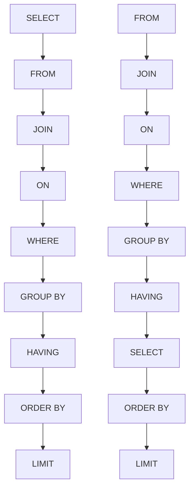
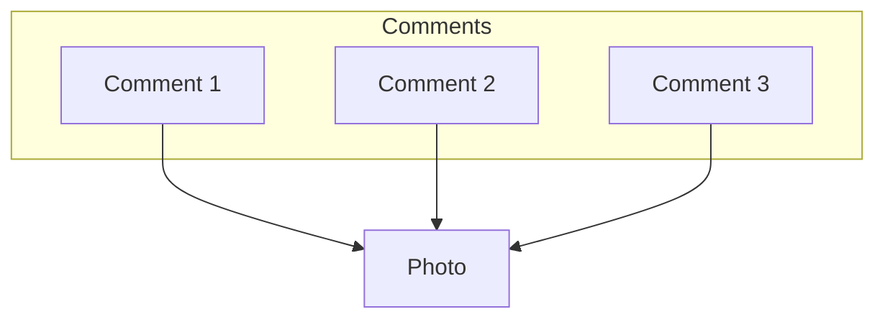

# My Software Engineering Notes
<details>
  <summary><h2 style='display: inline;'> Designing Data-Intensive Apps </h2></summary>
  
# Part I

# Chapter 1: Reliable, Scalable, and Maintainable Applications

## Availability

Percentage of time a system or service is operational and accessible when needed. It measures how often the system is up compared to the total time it should be available.

- **Downtime Based on Availability**:
  | Availability | Downtime           |
  |--------------|--------------------|
  | 99%          | 3.65 days/year     |
  | 99.9%        | 8.77 hours/year    |
  | 99.99%       | 52.6 minutes/year  |
  | 99.999%      | 5.26 minutes/year  |
  | 100%         | 0 seconds/year     |

  Each additional nine decreases the downtime by an order of magnitude of roughly 10 times.

## Reliability

Measures how consistently and correctly a system performs its intended functions over time without failure.

- **Measurement**:
  - Often assessed using metrics such as Mean Time Between Failures (MTBF) or Mean Time to Failure (MTTF), which quantify how long the system performs correctly before encountering a failure.

## Redundancy

The inclusion of extra components or systems to ensure continued operation in the event of a failure.

- Redundancy Types
    | Type                      | Description                                                                                                                           |
    |---------------------------|---------------------------------------------------------------------------------------------------------------------------------------|
    | **Hardware Redundancy**   | Spare hardware components (e.g., additional servers, power supplies, or network links) that can take over if primary components fail. |
    | **Data Redundancy**       | Replicating data across multiple storage devices or locations to protect against data loss.                                           |
    | **Geographic Redundancy** | Distributing resources across different locations or data centers to protect against site-specific failures.                          |


## Maintainability

Ensuring that various people (engineering and operations) can work on the system productively over time.

| **Factors**      | **Description**                                                         |
|------------------|-------------------------------------------------------------------------|
| **Operability**  | Make it easy for operations teams to keep the system running smoothly.  |
| **Simplicity**   | Make it easy for new engineers to understand the system.                |
| **Evolvability** | Make it easy for engineers to make changes to the system in the future. |


## Fault and Failure

- **Fault**: A deviation of one component from its specification.
- **Failure**: When the system as a whole stops providing the required service to the user.

## Rolling Upgrade

A method of upgrading a system without shutting it down or interrupting its operation.

## Throughput

The amount of work processed by a system or component in a given amount of time.

- Examples:
  - **Systems Performance**: Requests per second (requests/second)
  - **Networks**: Megabits per second (Mbps)
  - **Databases**: Queries per second (queries/second)

## Latency

The time delay between the initiation of a request and the beginning of a response.

## Service Time

The time it takes to process a request, including tasks like authorization and load balancing.

## Response Time

The total time from the initiation of a request until the entire response is received and processed. It encompasses both latency and service time.

- **Metrics**:
  - **Average Response Time**: Often reported as the arithmetic mean, but may not reflect the typical user experience.
  - **Percentiles**: Provide a better understanding of response times, with the median being the halfway point. Percentile algorithms include:
    - Forward Decay
    - T-Digest
    - HDRHistogram

## Scaling

- **Vertical Scaling**: *Scaling up* by improving the hardware of the hosting machine.
- **Horizontal Scaling**: *Scaling out* by adding more machines to handle increased load. Known as a shared-nothing architecture.

## SLA (Service Level Agreement)

Contracts that define the expected performance and availability of a service.

## Telemetry

Monitoring performance metrics and error rates. Essential for understanding system status after deployment.

## Load Parameters

- Examples: 
    - Requests per second.
    - Reads-to-writes ratio.

## Fan-out

- **Note**: Refer to page 29 for detailed information.

## Elastic Systems

Systems that can scale automatically.


# Chapter 2: Data Models and Query Languages

## Relational vs. Document Model

- **Pros and Cons**

  - **SQL Databases**:
    - Pros:
      - Better support for joins, and many-to-one and many-to-many relationships.
      - Reliable for complex transactions and strong consistency.
    - Cons:
      - Splitting a document-like structure into multiple tables can lead to cumbersome schemas and complex application code.

  - **NoSQL Databases**:
    - Pros:
      - Schema flexibility.
      - Better performance due to locality.
      - For some applications, closer to the data structures used by the application.
    - Cons:
      - Document model can become less appealing for applications with many-to-many relationships.

## Data Model

- **SQL Databases**:
  - Relational model with tables, rows, and columns.
  - Accessed via SQL queries.
  - Schema is predefined and changes can be complex.

- **NoSQL Databases**:
  - Varied models including document stores, key-value stores, column-family stores, and graph databases.
  - Flexible schema, allowing for adjustments and hierarchical or nested data structures.

## Schema Flexibility

- **SQL Databases**:
  - Fixed schema.
  - Schema changes require migrations, which can be time-consuming.

- **NoSQL Databases**:
  - Dynamic schema.
  - Easier to store different fields or structures in records without predefined schema changes.

## Consistency and Transactions

- **SQL Databases**:
  - Adhere to ACID (Atomicity, Consistency, Isolation, Durability) properties.
  - Ensure reliable transactions and consistency even in system failures.

- **NoSQL Databases**:
  - May prioritize availability and partition tolerance (CAP theorem) over strict consistency.
  - Often offer eventual consistency instead of strong consistency.
  - Multi-statement transactions might not be as robust.

## Scalability

- **SQL Databases**:
  - Typically scale vertically (adding resources to a single server).

- **NoSQL Databases**:
  - Designed to scale out horizontally (distributing data across multiple servers).
  - Can handle large volumes of data and high-velocity workloads more effectively.

## Query Language

- **SQL Databases**:
  - Use Structured Query Language (SQL).
  - SQL is powerful for complex queries involving multiple tables.

- **NoSQL Databases**:
  - Query mechanisms vary by database type.
  - Document stores might use JSON-based queries; key-value stores use simple key-based lookups.

## Use Cases

- **SQL Databases**:
  - Best for applications needing complex transactions, strong consistency, and well-defined schemas.
  - Examples: Financial systems, traditional enterprise applications.

- **NoSQL Databases**:
  - Ideal for scenarios where scalability, flexibility, and high performance are critical.
  - Examples: Real-time web applications, big data applications, content management systems.

## Document Storage

A document is usually stored as a single continuous string, encoded as JSON, XML, or a binary variant (e.g., MongoDB’s BSON). If your application often needs to access the entire document (e.g., to render it on a web page), there is a performance advantage due to this storage locality.

If data is split across multiple tables, as shown in Figure 2-1, multiple index lookups are required to retrieve it all. This can result in more disk seeks and longer retrieval times. The locality advantage is significant if large parts of the document are needed simultaneously.

## Imperative vs. Declarative Languages

- **Imperative Language**:
  - Specifies the exact operations in a particular order (e.g., JavaScript, Python).
  - Example: Line-by-line instructions on what to do.

- **Declarative Language**:
  - Specifies what the result should be, without detailing how to achieve it (e.g., CSS, React).

## MapReduce

- **Overview**:
  - A programming model for handling large amounts of data across many machines, popularized by Google.
  - A limited form of MapReduce is supported by some NoSQL datastores, including MongoDB and CouchDB, for read-only queries across many documents.
  - Combines `map` and `reduce` functions from functional programming languages.

- **Map Function**:
    ```Python
        # Map
        # Applies a given function to all items in an iterable (like a list) and returns an iterator that produces the results
        
        # Define a function to be applied to each element
        def square(x):
            return x * x
        numbers = [1, 2, 3, 4, 5]
        # Apply the function to each item in the list using map
        squared_numbers = map(square, numbers)
        # Convert the map object to a list and print it
        print(list(squared_numbers))  # Output: [1, 4, 9, 16, 25]

        # Reduce
        # Applies a binary function (a function that takes two arguments) cumulatively to the items of an iterable, from left to right, so as to reduce the iterable to a single value.
        from functools import reduce
        # Define a function to be used for reduction
        def add(x, y):
            return x + y
        numbers = [1, 2, 3, 4, 5]
        # Apply the function cumulatively using reduce
        sum_of_numbers = reduce(add, numbers)

        print(sum_of_numbers)  # Output: 15
      ```

## Graph-Like Data Models

In scenarios where **many-to-many relationships** are prevalent, a graph-like data model can be particularly effective. This model consists of the following key components:

- **Vertices** (also known as **nodes** or **entities**):
  - Represent **individual objects** or **entities** in the graph.
  - Each vertex can contain attributes or properties that describe the entity it represents.
  - Examples: People, locations, products, or any distinct objects.

- **Edges** (also known as **relationships** or **arcs**):
  - Represent the **connections** or **relationships** between vertices.
  - Edges can be **directed** or **undirected**:
    - **Directed edges** have a direction, indicating a one-way relationship (e.g., A → B).
    - **Undirected edges** do not have a direction, indicating a mutual relationship (e.g., A ↔ B).
  - Each edge can also have attributes or properties that describe the relationship.

### Key Characteristics

- **Flexible Schema**:
  - Graph models do not require a rigid schema, allowing the addition of new types of relationships or entities without altering existing data.

- **Efficient Traversal**:
  - Graph databases are optimized for traversing and querying relationships between vertices, making them suitable for applications requiring complex queries over interconnected data.

- **Use Cases**:
  - Social networks (e.g., users, friends, and interactions)
  - Recommendation systems (e.g., users and products)
  - Fraud detection (e.g., transactions and accounts)
  - Network and IT infrastructure (e.g., servers, connections, and configurations)

- Examples
    - **Social Network**:
    - **Vertices**: Users
    - **Edges**: Friendships, messages, posts

    - **Recommendation System**:
    - **Vertices**: Users, Products
    - **Edges**: Purchases, ratings, reviews

### Triple Stores and SPARQL

- **Triple Stores**:
  - Triple Stores are a type of graph database designed to store and manage **RDF (Resource Description Framework)** data, represented as triples. Each triple consists of:
    - **Subject**: The entity being described.
    - **Predicate**: The property or relationship.
    - **Object**: The value or another entity related to the subject.
  - Triple stores are particularly suited for managing semantic data and ontologies.
  
  - **Examples of Triple Stores**:
    - Apache Jena
    - RDF4J
    - Virtuoso

- **SPARQL**:
  - **SPARQL** (SPARQL Protocol and RDF Query Language) is a query language specifically designed for querying RDF data. It allows users to perform complex queries to retrieve and manipulate data stored in triple stores.
  
  - **Basic SPARQL Query Structure**:
    - **SELECT**: Specifies the variables to return.
    - **WHERE**: Contains the pattern to match in the data.
    - **FILTER**: (Optional) Refines the results based on conditions.

  - **Example Query**:
    ```sparql
      PREFIX ex: <http://example.org/>

      SELECT ?person ?email
      WHERE {
        ?person ex:hasEmail ?email .
        FILTER (CONTAINS(?email, "@example.com"))
      }
    ```

### Additional Concepts

- **Normalization**:
  - In databases, normalization means to store the data in such a way that it is **unique** and not duplicated. For example, in LinkedIn, your profile has a city or location, but the database has separate tables for users and cities. If you update the city name in the cities table, all users with that city will have their data updated.

- **Schema-on-Read**:
  - XML databases don't have concrete schemas like relational databases. This doesn't mean they lack structure; the structure is implicit, as the application ensures data validity. Hence, "schema-on-read" is a more accurate term than "schema-less."

- **Heterogeneous Data**:
  - Data that does not follow the same structure across all records. Example: Chocolate chip cookies vary in shape and size.

- **Homogeneous Data**:
  - Data that follows the same structure or pattern across all records. It does not mean all records have identical information, but they adhere to a consistent format.

- **Declarative Language**:
  - Specifies what outcome you want without detailing the steps to achieve it.

- **Imperative Language**:
  - Specifies the exact steps needed to achieve the desired outcome.


# Chapter 3: Storage and Retrieval

## Log

- An append-only sequence of records.
    - Many databases internally use a log, which is an append-only data file.

  - **Application Logs**:
    - These logs record events and activities within an application.
    - Example: Log files capturing user interactions, errors, or system events.

  - **DB Log**:
    
    - Some databases use an internal append-only log to track records.
    
    - **Note**: Consider the example of the world's simplest database using bash commands, which illustrates how a log can be used in this context:
      ```bash
        db_set() {
            echo "$1, $2" >> database
        }
        
        db_get() {
            grep "^$1," database | sed -e 's/^$1,//' | tail -n 1
        }
      ```
    
    - In this example:
      - `db_set` appends a record (key-value pair) to the `database` file.
      - `db_get` retrieves the most recent value associated with a key from the `database` file.

  - **Understanding Logs**:
    - Logs are essential for tracking changes and maintaining a history of operations in databases.
    - The append-only nature of logs ensures that all changes are recorded sequentially, which aids in data recovery and consistency.

## Database Indexing Structures

- **Index**: An additional structure derived from the primary data. It allows faster record searches in the database but can slow down writes.

### Hash Indexes

- **Hash Indexes**: 
  - Imagine our data storage involves only appending to a file. The simplest indexing strategy is to maintain an in-memory hash map where each key maps to a byte offset in the data file, indicating where the value can be found.
  - This is similar to the LeetCode problem *'Encode and Decode Strings'*.

### SSTables and LSM-Trees

- **Sorted String Tables (SSTables)**:
  - Similar to log files used in the *Hash Indexes* example, but with an added detail: segment files are sorted by key, and each key appears only once within each merged segment file (ensured by the compaction process).
  - Merging segments is efficient, akin to the merge sort algorithm, even if the files are larger than available memory.
  - To find a key, you don't need an index of all keys in memory; a sparse in-memory index is sufficient. For example, if you need a key between two in-memory index keys, use the offset of the first key and search from there.
  - Since read requests involve scanning several key-value pairs, grouping records into a block and compressing it before writing to disk is possible.

- **Log-Structured Merge-Tree (LSM-Tree)**:
  - LSM storage engines are based on merging and compacting sorted files.

- **Compaction Strategies**:
  - **Size-Tiered Compaction**: Newer, smaller SSTables are merged into older, larger SSTables.
    - Used by: Cassandra, HBase
  - **Leveled Compaction**: Splits the key range into smaller SSTables and moves older data into separate levels, allowing more incremental compaction and less disk space usage.
    - Used by: LevelDB, RocksDB, Cassandra

- **Advantages**:
  - Sorted data supports efficient range queries, and sequential disk writes enable high write throughput.

### B-Trees

- **B-Trees**:
  - Like SSTables, B-trees keep key-value pairs sorted by key, enabling efficient lookups and range queries. However, B-trees differ significantly in design.

- **Structure**:
  - B-trees use fixed-size blocks or pages (traditionally 4 KB) and read or write one page at a time.
  - **Pages**: Identified using an address, allowing pages to refer to other pages (similar to pointers but on disk).
    - **Leaf Page**: Stores values of the keys in its range without references.
    - **Branching Factor**: Number of references to child pages. Typically several hundred.

- **Operations**:
  - If a leaf page cannot accommodate a new key-value pair, it splits into two pages, and the parent page is updated.

- **Note**:
  - A B-tree with `n` keys has a depth of `O(log n)`. Most databases fit into a B-tree that's three or four levels deep, handling up to 256 TB with a branching factor of 500.

- **Write-Ahead Log (WAL)**:
  - **WAL**: An append-only file where every B-tree modification is written before being applied to the pages. This log restores the B-tree to a consistent state after a crash.

- **Concurrency Control**:
  - Managed with *latches* (lightweight locks) to prevent concurrent access issues.

- **Optimizations**:
  - **Copy-On-Write**: Some databases (e.g., LMDB) use this instead of overwriting pages and maintaining a WAL.
  - **Abbreviated Keys**: Store shorter keys in pages to save space and increase branching factor.
  - **Page Layout**: Aim to lay out leaf pages sequentially on disk, though maintaining this order can be challenging.
  - **Additional Pointers**: Leaf pages may include references to neighboring sibling pages.

- **Comparison with LSM-Trees**:
  - **Rule of Thumb**:
    - LSM-trees are generally faster for writes.
    - B-trees are typically faster for reads.
  - **Advantages of LSM-Trees**:
    - Write amplification: B-trees write data at least twice (WAL and page), while LSM-trees can reduce this through compaction.
    - Better write throughput, particularly on magnetic hard drives due to sequential writes.
    - More effective compression and lower storage overhead, especially with leveled compaction.

  - **Downsides of LSM-Trees**:
    - Compaction can interfere with performance, especially on high write throughput.
    - Disk bandwidth for initial writes and compaction may become a bottleneck.
    - Multiple copies of the same key across segments can occur.

### Other Indexing Structures

- **Key-Value Indexes**: As discussed, similar to a primary key index in the relational model.
- **Secondary Indexes**: Can be created using the `CREATE INDEX` command in relational databases. Both B-trees and log-structured indexes can serve as secondary indexes.

### Storing Values within the Index

- **Heap File**:
  - The index's key is used for queries, while the value can be:
    - The actual row data.
    - A reference to the row stored elsewhere in a *heap file*, which maintains data in no particular order.

- **Clustered Index**:
  - Stores the indexed row directly within the index, optimizing read performance but potentially increasing storage and write overhead.

- **Covering Index**:
  - Stores some columns of a table within the index, allowing queries to be answered by the index alone. This reduces read times but increases storage and write overhead.

### Multi-Column Indexes

- **Concatenated Index**:
  - Combines several fields into one key by appending columns, e.g., (lastname, firstname). Useful for queries involving multiple fields in a specific order.

- **Multi-Dimensional Indexes**:
  - Generalize querying multiple columns, important for geospatial data and other multi-dimensional queries.
    - Examples:
      - Ecommerce: Search products by color (RGB dimensions).
      - Weather Database: Search for temperature observations within a range on specific dates.

## Full-Text Search and Fuzzy Indexes

- Traditional indexes do not support searching for similar keys, such as misspelled words.
- This is known as **fuzzy querying**, which requires different techniques.
- **Lucene**:
    - Lucene allows searching for words within a certain **edit distance**. For instance, an edit distance of 1 means that one letter has been added, removed, or replaced.
    - It uses an SSTable-like structure for its term dictionary. This structure includes a small in-memory index that helps locate the offset in the sorted file where a key can be found.
    - Lucene’s in-memory index is a finite state automaton over the characters in the keys, similar to a trie.
    - This automaton can be converted into a **Levenshtein automaton**, which supports efficient search for words within a given edit distance.

### Keeping Everything in Memory

  - Compared to main memory, disks are more cumbersome to deal with. We use disks because:
    - They are **durable** (data is not lost if the power is turned off).
    - They have a **lower cost per gigabyte** compared to RAM.
  
  - As RAM prices decrease, the cost argument for disks diminishes. Many datasets are manageable within RAM, making it feasible to keep them entirely in memory, sometimes distributed across multiple machines. This has led to the development of **in-memory databases**.
    - Examples: 
        - Memcached
        - Redis
  - Some in-memory key-value stores, like **Memcached**, are designed solely for caching, where data loss upon restart is acceptable.
  
  - Other in-memory databases focus on **durability** through:
    - Special hardware (e.g., battery-powered RAM),
    - Writing a log of changes to disk,
    - Periodic snapshots to disk,
    - Replicating the in-memory state to other machines.
  
  - When an in-memory database restarts, it reloads its state from disk or over the network from a **replica**.
    - The disk acts as an append-only log for durability, while reads are served entirely from memory.
  
  - **In-memory DBs** can be faster as they avoid the overhead of encoding data structures for disk storage.
  
  - **Anti-Caching**: Evicts the least recently used data from memory to disk when memory is insufficient, and reloads it into memory when accessed again.

### Transaction Processing or Analytics?

- **Transaction Processing vs. Analytics**:
  
  - **Transaction**: A logical unit of reads and writes. Transactions do not necessarily need to have ACID properties but should allow low-latency reads and writes.
    - Unlike batch processing jobs, which run periodically (e.g., once per day).
  
  - **OLTP** (*Online Transaction Processing*):
    - Designed to handle a high volume of short online transactions (inserts, updates, queries).
    - Focuses on:
      - Fast query processing,
      - Maintaining data integrity in multi-user environments.
    - Commonly used in applications like retail sales and banking.
  
  - **OLAP** (*Online Analytics Processing*):
    - Optimized for querying and analyzing large volumes of data.
    - Supports complex queries and multidimensional analysis.
    - Often used for business intelligence, reporting, and data mining.

  - **OLTP VS. OLAP**
    | Property                 | Transaction Processing Systems (OLTP)             | Analytic Systems (OLAP)                   |
    |--------------------------|---------------------------------------------------|-------------------------------------------|
    | **Main read pattern**    | Small number of records per query, fetched by key | Aggregate over large number of records    |
    | **Main write pattern**   | Random-access, low-latency writes from user input | Bulk import (ETL) or event stream         |
    | **Primarily used by**    | End user/customer, via web application            | Internal analyst, for decision support    |
    | **What data represents** | Latest state of data (current point in time)      | History of events that happened over time |
    | **Dataset size**         | Gigabytes to terabytes                            | Terabytes to petabytes                    |

    - In the late 1980s and early 1990s, there was a trend for companies to stop using their OLTP systems for analytics purposes, and to run the analytics on a separate database instead. This separate database was called a __*data warehouse*__.


## Data Warehousing

A **data warehouse** is a separate database designed for querying by analysts without affecting OLTP operations.
- Database administrators often prefer not to have analysts interacting with OLTP databases directly.
- The data warehouse contains a read-only copy of data from various OLTP systems within the company.
- **ETL** (*Extract–Transform–Load*):
    - Data is extracted from OLTP databases using either periodic data dumps or continuous updates.
    - The data is then:
      - Transformed into an analysis-friendly schema,
      - Cleaned up,
      - Loaded into the data warehouse.

### The Divergence Between OLTP Databases and Data Warehouses

- **OLTP vs. Data Warehousing**:
  - OLTP databases are optimized for fast, real-time transaction processing and maintain data integrity.
  - Data warehouses are optimized for complex queries and data analysis, supporting historical data and large-scale data processing.

### Stars and Snowflakes: Schemas for Analytics

- **Star Schema**: Central fact tables connected to dimension tables in a star-like pattern. Useful for straightforward querying.
- **Snowflake Schema**: A more normalized form of the star schema where dimension tables are split into multiple related tables. This reduces redundancy but can complicate queries.

### Column-Oriented Storage

In column-oriented storage, values from each column are stored together rather than values from each row.
  
  - **Column Compression**:
    - **Note**: Systems like Cassandra and HBase use column families, but they store columns together within each family and do not use column compression extensively. Thus, they are primarily row-oriented.

  - **Memory Bandwidth and Vectorized Processing**:
    - Column-oriented storage reduces the volume of data loaded from disk and enhances CPU efficiency.
    - Column data can fit in the CPU’s L1 cache, allowing for faster processing through **vectorized processing**.
    - **Vectorized processing** involves executing operations on chunks of compressed column data directly, improving performance.

  - **Writing to Column-Oriented Storage**:
    - **LSM-trees** are effective for writing to column-oriented storage. Writes first go to an in-memory store and are then merged with column files on disk.
    - This method is utilized by systems like Vertica.

  - **Aggregation: Data Cubes and Materialized Views**:
    - **Materialized Views**:
      - Used to cache frequently queried aggregates, reducing the need to recompute them each time.
      - Unlike virtual views, materialized views store actual copies of query results on disk.
      - Updates to the underlying data require refreshing materialized views, which can make writes more expensive but beneficial for read-heavy data warehouses.

[](https://www.youtube.com/watch?v=BIlFTFrEFOI)

- **Memtable**:
  - An in-memory balanced tree data structure, such as a red-black tree, used to manage writes before they are flushed to disk.

- **Bloom Filter**:
  - A memory-efficient data structure used to approximate the contents of a set.
  - It can indicate if a key does not exist in the database, reducing unnecessary disk reads for non-existent keys.

- **Compaction**:
  - Involves removing duplicate keys and retaining only the most recent update for each key to avoid running out of space.
  - Each segment has an in-memory hash table mapping keys to file offsets.
    - To find a key’s value, the most recent segment’s hash map is checked first, followed by older segments if necessary.
  
  - **Tombstone**:
    - A special deletion record appended to the data file to mark a key for deletion.
    - During log segment merges, tombstones instruct the merging process to discard any previous values for the deleted key.

## Storage Engines

- **Log-Structured**:
    - Optimized for write-heavy workloads with mechanisms like LSM-trees.
- **Page-Oriented**:
    - Focuses on reading and writing data in fixed-size pages, often used in traditional B-tree-based systems.


# Chapter 4. Encoding and Evolution

- **Backward Compatibility**
    - Newer code can read data that was written by older code.
        - Relatively easy to achieve.

- **Forward Compatibility**
    - Older code can read data that was written by newer code.
        - Tricky to achieve.

- **REST** 
    - Representational State Transfer
- **RPC**
    - Remote Procedure Calls

- **Message-Passing Systems**: Includes actors and message queues.

## Formats for Encoding Data

- **Encoding**: The translation from the in-memory representation to a byte sequence (also known as __*serialization*__ or __*marshalling*__).

- **Decoding**: The reverse of encoding, translating from a byte sequence to the in-memory representation.
  - Parsing
  - Deserialization
  - Unmarshalling

- **Language-Specific Formats**:
  | Language | Serialization Method     |
  |----------|--------------------------|
  | Python   | Pickle                   |
  | Java     | `java.io.Serializable`   |
  | Ruby     | Marshal                  |
  | Java     | Kryo (TPD)               |

- **JSON, XML, and Binary Variants**:
  - **JSON and XML**:
    - XML and CSV do not inherently distinguish between numbers and strings of digits (except through external schemas).
    - JSON distinguishes strings and numbers but does not differentiate between integers and floating-point numbers, nor does it specify precision.

      - **Precision Issues**: Integers greater than 2^53 cannot be exactly represented in an IEEE 754 double-precision floating-point number, leading to inaccuracies when parsed in languages using floating-point numbers (e.g., JavaScript).
        - **Example**: Twitter uses a 64-bit number for tweet IDs. Their API returns tweet IDs as both a JSON number and a decimal string to handle precision issues.

  - **Unicode Support**:
    - JSON and XML support Unicode character strings (human-readable text) but do not natively support binary strings (sequences of bytes without a character encoding).

  - **CSV**:
    - CSV lacks a schema, so the meaning of each row and column must be defined by the application.

- **Binary Encoding**
  - When data is used only internally within an organization, there is less pressure to use a lowest-common-denominator encoding format.
  
  - **Comparison with JSON and XML**:
    - JSON is less verbose than XML, but both formats still use more space compared to binary formats.

    - This has led to the development of various binary encodings for JSON, including:
      - MessagePack
      - BSON
      - BJSON
      - Smile
    
    - For XML, examples of binary encodings include:
      - WBXML
      - Fast Infoset

- **Thrift and Protocol Buffers**
  - **Apache Thrift** (developed by Facebook) and **Protocol Buffers (protobuf)** (developed by Google) are binary encoding libraries.
  - Both Thrift and Protocol Buffers provide code generation tools that:
    - Take a schema definition and produce classes that implement the schema in various programming languages.
    - Allow application code to call the generated code to encode or decode records based on the schema.

- **Field Tags and Schema Evolution**
  - **Removing Fields**:
    - Removing a field involves similar backward and forward compatibility concerns as adding a field, but with reversed implications.
    - You can only remove a field if it is optional (required fields cannot be removed).
    - Once a tag number is used, it should not be reused to avoid conflicts with existing data that might include the old tag number.

  - **Further Reading**:
    - For additional details on what a tag is in this context, refer to the subsection on tag definitions.

## Datatypes and Schema Evolution

  - **Changing Data Types**:
    - Changing the datatype of a field might be possible but can result in loss of precision or truncation. For example:
      - Changing a 32-bit integer to a 64-bit integer:
        - **New Code**: Can read data written by old code since it can handle the extra bits by filling them with zeros.
        - **Old Code**: Uses a 32-bit variable, so if it reads a 64-bit value, it may be truncated if the value exceeds 32 bits.

  - **Protocol Buffers**:
    - Protocol Buffers do not have a dedicated list or array datatype but use a `repeated` marker for fields.
      - This allows converting an `optional` (single-valued) field into a `repeated` (multi-valued) field without issues.

- **Avro**
    - Apache Avro is another binary encoding format that differs from Protocol Buffers and Thrift.
    - Avro uses schemas to define data structures and supports two schema languages:
      - **Avro IDL**: Intended for human editing.
      - **JSON-Based Schema**: More machine-readable.

  - **Writer’s Schema**:
    - For details on the writer’s schema, refer to the specific subsection.

  - **Dynamically Generated Schemas**:
    - For details on dynamically generated schemas, refer to the specific subsection.

## Dataflow Through Databases

Section talks about how you should write data to the DB in such a way that the future code shouldn't have trouble reading it. It also mentions an example where an ORM might be troublesom when updating DB records if the application code isn't updated (check the image 4-7). 

Lastly, it talks about how __*snapshots*__ are saved for backup and how you could take advantage of the fact they're read only and use an encoder format like parquet for data-warehousing for analytics or use Avro to reduce the snapshot file size.
- **DB migrations**: Rewriting data.

- **Dataflow Through Services: REST and RPC**

  - **Communication Roles**:
    - **Clients**: Connect to servers to make API requests.
    - **Servers**: Expose APIs over the network and may act as clients to other servers.

  - **Services**:
    - The API exposed by the server can impose restrictions on what clients can do, serving as a form of encapsulation.

  - **Ajax**:
    - *Asynchronous JavaScript and XML*: A technique where client-side JavaScript applications use XMLHttpRequest to act as HTTP clients.
      - The server response is typically data in a format like JSON for further client-side processing.
      - The API implemented on top is application-specific, and both client and server must agree on API details.

  - **Service-Oriented Architecture (SOA)**:
    - **Microservices Architecture**: A refined version of SOA.
      - Services should be independently deployable and evolvable, allowing teams to release new versions frequently without coordination with others.
      - Expect old and new versions of servers and clients to run simultaneously, requiring compatible data encoding across service API versions.

  - **Middleware**:
    - Software that supports service-to-service communication within the same organization, often within the same datacenter, is referred to as middleware.

## Popular Approaches to Web Services

  - **REST (REpresentational State Transfer)**:
    - A design philosophy built upon HTTP principles.
    - Key Characteristics:
      - Simple formats.
      - Uses URLs to identify resources.
      - Leverages HTTP features for cache control, authentication, and content type negotiation.
    - An API designed according to REST principles is called RESTful.

  - **SOAP (Simple Object Access Protocol)**:
    - An XML-based protocol for network API requests.
    - Key Characteristics:
      - Aims to be independent of HTTP and avoids using most HTTP features.
      - Includes a complex array of related standards (the web service framework known as WS) for additional features.
      - The API is described using an XML-based language called **WSDL (Web Services Description Language)**.
        - **WSDL** allows for code generation so clients can interact with remote services using local classes and methods, which are encoded to XML messages and decoded by the framework.
        - **WSDL** is not designed for human readability.
      - SOAP relies heavily on tool support, code generation, and IDEs.

  - **RPC (Remote Procedure Call)**:
    - RPC attempts to make remote network service requests resemble function or method calls in your programming language, within the same process (this abstraction is known as *location transparency*).
    - Focuses primarily on requests between services owned by the same organization, typically within the same datacenter.

  - **RPC Implementations**:
    - **Thrift and Avro**: Both come with built-in RPC support.
    - **gRPC**: An RPC implementation using Protocol Buffers.

  - **Data Encoding and Evolution for RPC**:
    - Simplifying Assumption:
      - It is reasonable to assume servers are updated before clients. Thus, backward compatibility is needed for requests, and forward compatibility is needed for responses.
    - Compatibility Properties:
      - **Thrift, gRPC (Protocol Buffers), and Avro RPC**: Evolve according to the compatibility rules of their respective encoding formats.
      - **SOAP**: Requests and responses are specified with XML schemas, which can be evolved, but subtle pitfalls exist.
      - **RESTful APIs**: Typically use JSON (without a formal schema) for responses, and JSON or URI-encoded/form-encoded parameters for requests. Adding optional parameters and new fields to responses usually maintains compatibility.

    - **Challenges**:
      - RPC is often used across organizational boundaries, making it difficult for the service provider to control client upgrades.
      - Compatibility-breaking changes often require maintaining multiple versions of the API side by side.

    - **API Versioning**:
      - No universal agreement on API versioning methods.
      - Common Approaches:
        - **RESTful APIs**: Version numbers in the URL or HTTP headers.
        - **API Keys**: Store requested API versions on the server and manage version selection through an administrative interface.

## Message-Passing Dataflow

- **Asynchronous Message-Passing Systems**:
    - These systems are situated between RPC (where one process sends a request to another process expecting a quick response) and databases (where one process writes data and another reads it later).
    
    - **Characteristics**:
      - Similar to RPC in that messages (requests) are delivered with low latency.
      - Similar to databases in that messages are sent through an intermediary called a message broker (or message queue, or message-oriented middleware), which temporarily stores the messages.
    
    - **Message Broker Advantages Over RPC**:

      - **Buffering**: Acts as a buffer if the recipient is unavailable or overloaded, improving system reliability.
      - **Automatic Redelivery**: Redelivers messages if the process has crashed, preventing message loss.
      - **Address Independence**: The sender does not need to know the recipient’s IP address and port number.
      - **Broadcasting**: Allows a single message to be sent to multiple recipients.
      - **Decoupling**: Logically decouples the sender from the recipient; the sender just publishes messages without needing to know who will consume them.
    
    - **Communication Pattern**:
      - Typically one-way: the sender does not expect a reply to the message, although responses can be sent on a separate channel.
      - Asynchronous: The sender does not wait for the message to be delivered but sends it and proceeds.

  - **Message Brokers**:
    - **Examples**:
      - RabbitMQ
      - ActiveMQ
      - HornetQ
      - NATS
      - Apache Kafka
    
    - **Usage**:
      1. A process sends a message to a named queue or topic.
      2. The broker ensures that the message is delivered to one or more consumers/subscribers.
      3. Multiple producers and consumers can interact with the same topic.
    
    - **Topics and Dataflow**:
      - A topic provides one-way dataflow, but a consumer can publish messages to another topic or a reply queue, enabling request/response patterns similar to RPC.
    
    - **Data Model**:
      - Message brokers do not enforce a specific data model; messages are sequences of bytes with metadata. Flexible encoding formats can be used as long as they are backward and forward compatible.
    
    - **Message Republishing**:
      - If a consumer republishes messages to another topic, care must be taken to preserve unknown fields to avoid issues similar to those in databases.

  - **Distributed Actor Frameworks**:
      - The actor model is a concurrency model within a single process. Instead of managing threads directly, logic is encapsulated in actors.
     
      - **Actor Characteristics**:
        - Each actor represents a client or entity with local state (not shared with other actors).
        - Actors communicate through asynchronous messages.
        - Message delivery is not guaranteed; messages may be lost in certain error scenarios.
        - Actors process one message at a time, avoiding threading issues, and can be scheduled independently by the framework.
    
    - **Further Reading**:
      - For a detailed understanding, refer to resources on distributed actor frameworks and their implementation.

## Additional concepts
- **Idempotence**:
    - Refers to operations where repeating the operation has the same effect as performing it once. (Details are not covered in this section but are important for RPC operations.)


# Part II

## Shared-Memory Architecture

All the components can be treated as a single machine 
  - Many CPUs, many RAM chips, and many disks can be joined together under one operating system, and a fast interconnect allows any CPU to access any part of the memory or disk.

    - The problem with a shared-memory approach is that the cost grows faster than linearly: a machine with twice as many CPUs, twice as much RAM, and twice as much disk capacity as another typically costs significantly more than twice as much.
      
    - And due to bottlenecks, a machine twice the size cannot necessarily handle twice the load.

## Shared-Disk Architecture

Uses several machines with independent CPUs and RAM, but stores data on an array of disks that is shared between the machines, which are connected via a fast network.

  - This architecture is used for some data warehousing workloads, but contention and the overhead of locking limit the scalability of the shared-disk approach.

- **Shared Nothing Architectures
Each machine or virtual machine running the database software is called a node. Each node uses its CPUs, RAM, and disks independently. 
  - Any coordination between nodes is done at the software level, using a conventional network.
  - No special hardware is required by a shared-nothing system, so you can use whatever machines have the best price/performance ratio.

## Shared-Nothing Architecture

In this approach, each machine or virtual machine running the database software is called a **node**.

  - Each node uses its CPUs, RAM, and disks independently.
  - Coordination between nodes is done at the software level, using a conventional network.
  - No special hardware is required.
    - You can distribute data across multiple geographic regions, and thus reduce latency. 

## Replication Versus Partitioning (Sharding)

  - **Replication**: Keeping a copy of the same data on several different nodes, potentially in different locations. Replication provides redundancy: if some nodes are unavailable, the data can still be served from the remaining nodes. 
    - Replication can also help improve performance.
  
  - **Partitioning (Sharding)**: Splitting a big database into smaller subsets called partitions so that different partitions can be assigned to different nodes (also known as sharding).

# Chapter 5: Replication

**Replication** means keeping a copy of the same data on multiple machines that are connected via a network. Reasons you may want to replicate data:
  
  - To keep data geographically close to your users (and thus reduce latency).
  
  - To allow the system to continue working even if some of its parts have failed (and thus increase availability).

  - To scale out the number of machines that can serve read queries (and thus increase read throughput).

In this chapter we will assume that your dataset is so small that each machine can hold a copy of the entire dataset. In Chapter 6 we will discuss partitioning (**sharding**) of datasets that are too big for a single machine.

If the data that you’re replicating does not change over time, then replication is easy: you just need to copy the data to every node once, and you’re done.

  - All of the difficulty in replication lies in handling changes to replicated data.

We will discuss __*three popular algorithms*__ for replicating changes between nodes: 

  - Single-Leader
  - Multi-Leader
  - Leaderless

There are many trade-offs to consider with replication: for example, whether to use *synchronous* or *asynchronous* replication, and *how to handle failed replicas*.

---


## Leader-Based Replication

- **Replica**: A node that stores a copy of the Database.

Also known as *active/passive* or *master–slave* replication.

Only One Downside:
  - All writes must go through it.
    * If you can't connect to the leader, you can't perform writes.

1. One of the replicas is designated the **leader** (also known as *master* or *primary*).
  
  - Writing can **only** be performed on the leader.

2. The other replicas are known as followers (*read replicas*, *slaves*, *secondaries*, or *hot standbys*).
  
  - Whenever the leader writes new data, it also sends the data change to all of its followers as part of a replication log or change stream. 
  
  - Each follower takes the log from the leader and updates its local copy of the DB, by applying all writes in the same order as the leader.

3. When a client wants to read a record, it can read from the leader or the followers.

  - Followers are *read-only*.


[](https://www.youtube.com/watch?v=Yy0GJjRQcRQ)

Leader-based replication is built in on PostgreSQL, but load balancing for the DB instances isn't. Some 0pen source addons for the load balancing of the Postgresql DB instances:
- PgPool
- HAPROXY

- **Note**: Leader-based replication is not restricted to only databases: distributed message brokers such as Kafka [5] and RabbitMQ highly available queues [6] also use it.

Leader-based replication has **one major downside**: there is only one leader, and all writes must go through it.iv If you can’t connect to the leader for any reason, for example due to a network interruption between you and the leader, you can’t write to the database.


## Synchronous VS Asynchronous Replication 

An important detail of a replicated system is whether the replication happens **synchronously** or **asynchronously**. 

  - In relational databases, this is often a configurable option.
  - Other systems are often hardcoded to be either one or the other.

- **Synchronous Replication**: 
  
  - The leader waits until  *n* amount of followers have confirmed they received the write before reporting success to the user, and before making the write visible to other clients.

  - **Pros**:
    - The follower is guaranteed to have an up-to-date copy of the data that is consistent with the leader.
    - On leader failure the synch-configured followers are ensured to have the same data available.

  - **Cons**:
    - The leader must block all writes and wait until the synchronous replica is available again.
      - This means that f the synchronous follower doesn’t respond (it crashed, a network fault, etc.), the write cannot be processed. 

    - It is impractical for all followers to be synchronous. 
      - Any one node outage would cause the whole system to grind to a halt. 


  - **Note**: If the synchronous follower becomes unavailable or slow, one of the asynchronous followers is made synchronous.
    - Ensures you have *up-to-date* on at least two nodes.
    - This configuration is sometimes also called semi-synchronous.
    - In practice, if you enable synchronous replication on a database, it usually means that one of the followers is synchronous, and the others are asynchronous.


- **Asynchronous Replication**

  - If the leader fails and is not recoverable, any writes that have not yet been replicated to followers are lost.
 
    - The leader sends the message, but doesn’t wait for a response from the followers.

  - **Pros**:
    - Writes are not guaranteed to be durable, even if it has been confirmed to the client.

  - **Cons**:
    - The leader can continue processing writes, even if all of its followers have fallen behind.


## Setting Up New Followers

From time to time, you need to set up new followers—perhaps to increase the number of replicas, or to replace failed nodes. The process outline looks like this:

1. Take a consistent snapshot of the leader’s database at some point in time.
    * If possible, without taking a lock on the entire database.

2. Copy the snapshot to the new follower node.

3. The follower connects to the leader and requests all the data changes that have happened since the snapshot was taken.

    * This requires that the snapshot is associated with an exact position in the leader’s replication log. 
      
      * That position has various names: for example, PostgreSQL calls it the *log sequence number*.

4. When the follower has processed the backlog of data changes since the snapshot, we say it has *caught up* and can now continue to process changes from the leader as they happen.

Some DBs have this process fully automated, others require an operator to go through a somewhat arcane multi-step workflow.


## Handling Node Outages

Any node in the system can go down, perhaps unexpectedly due to a fault.

Being able to reboot individual nodes without downtime is a big advantage for operations and maintenance.

**The Question**:

  - How do you achieve high availability with leader-based replication?

**Our Goals**: 

  - Keep the system as a whole running despite individual node failures.
  - Keep the impact of a node outage as small as possible.


### Follower failure: Catch-up recovery

On its local disk, each follower keeps a log of the data changes it has received from the leader.

On crash, or on a networkd de-sycnh, the follower can recover easily:

  1. From its log, it knows the last transaction that was processed before the fault occurred.

  2. Re-connects to the leader and requests all the data changes that occurred during the down time.

  3. After applying the changes (caughting-up) it can continue to opperate.


### Leader failure: Failover

Handling a failure of the leader is trickier: 

1. One of the followers needs to be promoted to be the new leader. 
2. Clients need to be reconfigured to send their writes to the new leader.
3. Other followers need to start consuming data changes from the new leader.

This process is known as **Failover**.

**Failover** (either manual or automatic) consists of the following steps:

1. **Determining that the leader has failed**

  * Most systems simply use a timeout: nodes frequently bounce messages back and forth between each other, and if a node doesn’t respond for some period of time—say, 30 seconds—it is assumed to be dead. 

    * This doesn't apply if the leader is manually taken down (e.g. maintenance).

2. **Choosing a new leader**

  * This could be done through an election process (where the leader is chosen by a majority of the remaining replicas), or a new leader could be appointed by a previously elected __*controller node*__.

  * The best candidate for leadership is usually the replica with the most up- to-date data changes from the old leader.

  * Getting all the nodes to agree on a new leader is a **consensus** problem.

3. **Reconfiguring the system to use the new leader**

  * Clients now need to send their write requests to the new leader (*Request Routing*).

  * If the old leader comes back, it might still believe that it is the leader, not realizing that the other replicas have forced it to step down.

    * The system needs to ensure that the old leader becomes a follower and recognizes the new leader.

Failover is fraught with things that can go wrong:

  - If asynchronous replication is used, the new leader may not have received all the writes from the old leader before it failed.
    
    - This could result in conflicting writes (i.e. conflicting primary keys), so the most common approach is to discard them.

  - Discarding writes is especially dangerous if other storage systems outside of the database need to be coordinated with the database contents.

  - In certain fault scenarios (see Chapter 8), it could happen that two nodes both believe that they are the leader: **split-brain**.

    - If both leaders accept writes, and there is no process for resolving conflicts data is likely to be lost or corrupted.

      - As a safety catch, some systems have a mechanism to shut down one node if two leaders are detected.

        - However, if this mechanism is not carefully designed, you can end up with both nodes being shut down
  
  - What is the right timeout before the leader is declared dead? A longer timeout means a longer time to recovery in the case where the leader fails.

    - However, if the timeout is too short, there could be unnecessary failovers.

There are no easy solutions to these problems. For this reason, some operations teams prefer to perform failovers manually, even if the software supports automatic failover.

These issues—node failures; unreliable networks; and trade-offs around replica consistency, durability, availability, and latency—are in fact fundamental problems in distributed systems. 

In Chapter 8 and Chapter 9 we will discuss them in greater depth.


## Implementation of Replication Logs

**The Question**:

  - How does leader-based replication work under the hood?

### Statement-based replication

The leader logs every write request (statement) that it executes and sends that statement log to its followers.

Every `INSERT`, `UPDATE`, or `DELETE` statement is forwarded to followers, and each follower parses and executes that SQL statement as if it had been received from a client.

- **Cons**

  - Any statement that calls a nondeterministic function, such as `RAND()` or `NOW()`, is likely to generate a different value on each replica.

  - If statements use an autoincrementing column, or if they depend on the existing data in the database they must be executed in exactly the same order on each replica, or else they may have a different effect.

    - This limits concurrent transactions.

  - Statements that have side effects (e.g., triggers, stored procedures, user- defined functions) may result in different side effects occurring on each replica, unless the side effects are absolutely deterministic.

Because there are so many edge cases, other replication methods are now generally preferred, even though you could still navigate around them.


### Write-ahead log (WAL) shipping

PostgreSQL's streaming replication is based on this method.

- In the case of a log-structured storage engine, this log is the main place for storage. 
  - Log segments are compacted and garbage-collected in the background.

- In the case of a B-tree, which overwrites individual disk blocks, every modification is first written to a write-ahead log so that the index can be restored to a consistent state after a crash.

The log is an append-only sequence of bytes containing all writes to the database. 

We can use the exact same log to build a replica on another node: besides writing the log to disk, the leader also sends it across the network to its followers. 

When the follower processes this log, it builds a copy of the exact same data structures as found on the leader.

**Cons**

- The log describes the data on a very low level.

  - The WAL contains details of which bytes were changed in which disk blocks, making replication closely coupled to the storage engine.
    - If the database changes its storage format from one version to another, it is typically not possible to run different versions of the database software on the leader and the followers.

- WAL shipping (this method's implementation name) makes it troublesome for followers to use more recente versions of the DB, forcing overtime on rolling upgrades.


### Logical (row-based) log replication

An alternative is to use different log formats for replication and for the storage engine, decoupling the process from the storage engine internals.

This kind of replication log is called a `logical log`, to distinguish it from the storage engine’s (physical) data representation.

A logical log for a relational database is usually a sequence of records describing writes to database tables at the granularity of a row:

- For an inserted row, the log contains the new values of all columns.

- For a deleted row, the log contains enough information to uniquely identify the row that was deleted.

- For an updated row, the log contains enough information to uniquely identify the updated row, and the new values of all columns.

**Pros**
  - Since a logical log is decoupled from the storage engine internals, it can more easily be kept backward compatible, allowing the leader and the follower to run different versions of the database software, or even different storage engines.

  - A logical log format is also easier for external applications to parse.
    - Super useful for data warehousing or caching.
      - This technique is called `change data capture`.


### Trigger-based replication

PostgreSQL supports this.

A trigger lets you register custom application code that is automatically executed when a data change (write transaction) occurs in a database system.

The trigger has the opportunity to log this change into a separate table, from which it can be read by an external process. That external process can then apply any necessary application logic and replicate the data change to another system.

**Pros**
  - Involves application code.

  - Allows you to only replicate a subset of the data.

  - Allows you to replicate from one kind of database to another.

  - Can handle conflict resolution.

**Cons**
  - Involves application code.

  - Has greater overheads than other replication methods.

  - Is more prone to bugs and limitations than the database’s built-in replication.


## Problems with Replication Lag

**Reasons for Replication**

- Tolerate node failures.
- Scalability (processing more requests than a single machine can handle).
- Latency (placing replicas geographically closer to users).

Leader-based replication requires all writes to go through a single node, but read-only queries can go to any replica.

For workloads where there is far more reads than writes you could use a `read-scaling architecture`.

**Read-Scaling Architecture**

  - Create many followers.

  - Distribute the read requests across those followers.
    * Reduces the leader's workload.

  - Allows you to increase the read capacity by just adding more followers.

  - Only works with *asynchronous* replication (a single node failing could stop all the writes).

Now, replicas can fall *way* behind the leader, and can virtually take forever to catch up; this is why it's called __*eventual consistency*__.

**Replication Lag**: The delay between a write on the leader being reflected on a follower.

There are *3* main problems that arise when the replication lag is large:

  - Reading Your Own Writes.
    * User writes data and reads it from a *fallen-behind* replica thinking his data is lost.

  - Monotonic Reads.
    * '*Things move backwards in time*': Consecutive reads should not be allowed on replicas with older data.


  - Consistent Prefix Reads.
    * If some partitions get the info slower than others, you can see the answer before you see the question (Mr. Poons).


### Reading Your Own Writes

**Scenario**: User writes data and reads it from a *fallen-behind* replica thinking his data is lost.

In this case you need `read-after-write` consistency, also known as `read-your-writes` consistency. This guarantees users can consistently see their submissions being reflected.
  - Note: Other people's data being consistently reflected is not guaranteed.

**Leader-Based Replication Possible Implementations**

  - When reading something that the user may have modified, read it from the leader; otherwise, read it from a follower.
    * Simple rule:
      - Always read the user’s own profile from the leader,
      - Any other users’ profiles from any node.
  
    * If most things in the application are editable by the user, that approach won’t be effective and cancel out scalability benefits.
      - You could for one minute after the last update, make all reads from the leader.
      - Or you could monitor the replication lag on followers and prevent queries on followers behind by more than a minute.
  
  - The client can remember the timestamp of its most recent write. Then the app can pass reads only to replicas with greater update timestamps.
    
    - You could look for mor recently updated replicas or wait for the replica to catch up.

    - The timestamp could be a:
      - Logical Timestamp: Something that indicates ordering of writes (such as the log sequence number)
      - The actual system clock.
        * Clock synch becomes a potential issue.

  - If the user uses different devices you might want to provide `cross-device read-after-write` consistency:
    
    - Approaches that require remembering the timestamp of the user’s last update become more difficult.
      * Metadata needs to be centralized.

    - If your replicas are distributed across different datacenters, there is no guarantee that connections from different devices will be routed to the same datacenter.


### Monotonic Reads

**Scenario**: A user reads data on the application, requests another read but the data is no longer there because he read it from another replica.

It’s a lesser guarantee than strong consistency, but a stronger guarantee than eventual consistency. 

When you read data, you may see an old value; monotonic reads only means that if one user makes several reads in sequence, they will not read older data after having previously read newer data.

- A solution: Make sure that each user always makes their reads from the same replica (different users can read from different replicas).

### Consistent Prefix Reads

**Scenario**: If some partitions are replicated slower than others, an observer may see the answer before they see the question (Mr. Poons).

Preventing this kind of anomaly requires another type of guarantee: `consistent prefix reads`.

  - If a sequence of writes happens in a certain order, then anyone reading those writes will see them appear in the same order.
    * Problematic in sharding.

In many distributed databases, different partitions operate independently, so there is no global ordering of writes: 
  - When a user reads from the database, they may see some parts of the database in an older state and some in a newer state.

  - One solution is to make sure that any writes that are causally related to each other are written to the same partition—but in some applications that cannot be done efficiently.
    * There are algorithms that keep track of causal dependencies.


### Solutions for Replication Lag

When working with an eventually consistent system ask yourself: `what happens if the replication lag spans several seconds?`
  - If the result is bad user experience, you should provide stronger guarantees like read-after-write.

  > Pretending that replication is synchronous when in fact it is asynchronous is a recipe for problems down the line.

> It would be better if application developers didn’t have to worry about subtle replication issues and could just trust their databases to “do the right thing.” This is why transactions exist: they are a way for a database to provide stronger guarantees so that the application can be simpler.


[](https://www.youtube.com/watch?v=bI8Ry6GhMSE&t=96s)


## Multi-Leader Replication

In this setup, each leader simultaneously acts as a follower to the other leaders.
  
  - Master-Master.
  - Active-Active.

Leader-Based Replication has only one downside:
  - Since leader has to be in one of the datacenters.
    * All writes must go through it (both the datacenter and the leader).

A natural extension of the leader-based replication model is to allow more than one node to accept writes. Replication still happens in the same way: each node that processes a write must forward that data change to all the other nodes.

`PostgreSQL` uses a third party software for Multi-Leader Replication:
  - **BDR**

**Use Cases**

  > It rarely makes sense to use a multi-leader setup within a single datacenter, because the benefits rarely outweigh the added complexity.

  - Multi-datacenter operation.

  - Clients with offline operation.

  - Collaborative editing.

### Use Case: Multi-Datacenter Operation


**Basic Concept**: Within each datacenter, regular leader–follower replication is used; between datacenters, each datacenter’s leader replicates its changes to the leaders in other datacenters.

  - **Performance**
    - Writes can be processed in the local datacenter and is replicated asynchronously to the other datacenters.
      * This hides the inter-datacenter network delay (reducing latency).

  - **Tolerance of datacenter outages**
    - In a single-leader configuration, if the datacenter with the leader fails, failover can promote a follower in another datacenter to be leader.
    
    - In a multi-leader configuration, each datacenter can continue operating independently of the others, and replication catches up when the failed datacenter comes back online.

  - **Tolerance of network problems**

    - Networks between datacenters are slower than the datacenter's local networks.

      - A single-leader configuration is very sensitive to problems in this inter-datacenter link, because writes are made synchronously over this link.

      - A multi-leader configuration with asynchronous replication can usually tolerate network problems better: 
        * A temporary network interruption does not prevent writes being processed.

**NOTE**: The same data may be concurrently modified in two different datacenters, and those write conflicts must be resolved.

Autoincrementing keys, triggers, and integrity constraints can be problematic. 
  * For this reason, multi-leader replication is often considered dangerous territory that should be avoided if possible.


### Use Case: Clients With Offline Operation

Appropriate if you have an application that needs to continue to work while it is disconnected from the internet.
  - Calendar Apps for example.

If you make any changes while you are offline, they need to be synced with a server and your other devices when the device is next online.

1. Every device has a local database that acts as a leader (it accepts write requests)
2. There is an asynchronous multi-leader replication process (sync) between the replicas of your calendar on all of your devices. 
3. The replication lag may be hours or even days.

From an architectural point of view, this setup is essentially the same as multi-leader replication between datacenters, taken to the extreme: each device is a “datacenter,” and the network connection between them is extremely unreliable. As the rich history of broken calendar sync implementations demonstrates, multi-leader replication is a tricky thing to get right.

> CouchDB is designed for this mode of operation.

### Use Case: Collaborative Editing

Real-time collaborative editing applications allow several people to edit a document simultaneously.
  - Google Docs
  - Etherpad

`ALGORITHM GOES HERE`

When one user edits a document, the changes are instantly applied to their local replica (the state of the document in their web browser or client application) and asynchronously replicated to the server and any other users who are editing the same document.

> If you want to guarantee that there will be no editing conflicts, the application must obtain a lock on the document before a user can edit it. If another user wants to edit the same document, they first have to wait until the first user has committed their changes and released the lock. This collaboration model is equivalent to single-leader replication with transactions on the leader.

> However, for faster collaboration, you may want to make the unit of change very small (e.g., a single keystroke) and avoid locking. This approach allows multiple users to edit simultaneously, but it also brings all the challenges of multi-leader replication, including requiring conflict resolution.


### Handling Write Conflicts

- **Synchronous versus asynchronous conflict detection**
  * If you want synchronous conflict detection, you might as well just use single-leader replication.

- **Conflict avoidance**
  - The simplest strategy for dealing with conflicts is to avoid them.
    * Most multi-leader setups handle conflict very poorly.

  - If all writes for a particular record go through the same leader, then conflicts cannot occur.
    - However, sometimes you might want to change the designated leader for a record (user moves, datacenter goes down, etc.).
      * In this situation, conflict avoidance breaks down, and you have to deal with the possibility of concurrent writes on different leaders.

- **Converging toward a consistent state**
  - A single-leader database applies writes in a sequential order: if there are several updates to the same field, the last write determines the final value of the field.

  - In a multi-leader configuration, *there is no defined ordering of writes*.
    * If each replica simply applied writes in the order that it saw the writes, the database would end up in an inconsistent state.

  - There are various ways of achieving convergent conflict resolution:

    1. Give each write a unique ID (e.g., a timestamp, a long random number, a UUID, etc.), pick the write with the highest ID as the winner, and throw away the other writes.
        
        * If a timestamp is used, this technique is known as **last write wins (LWW)**.

        * This approach is popular but dangerously prone to data loss. 

    2. Give each replica a unique ID, and let writes that originated at a higher- numbered replica always take precedence.
      * Data loss implied.

    3. Somehow merge the values together.
      * E.g. order them alphabetically and then concatenate them.

    4. Record the conflict in an explicit data structure that preserves all information, and write application code that resolves the conflict at some later time.
      * Perhaps by prompting the user.

- **Custom conflict resolution logic**
  - Most multi-leader replication tools let you write conflict resolution logic using application code, which can be executed on read or on write:

    - **On write**
      - As soon as the database system detects a conflict in the log of replicated changes, it calls the conflict handler.
        * This handler runs in a background process and cannot prompt the user.
    
    - **On read**
      - Conflicting writes are stored. The next time the data is read, these multiple versions of the data are returned to the application.
        * The application may prompt the user or automatically resolve the conflict, writing the result back to the DB.

**Note** that conflict resolution usually applies at the level of an individual row or document, not for an entire transaction.
  * If a transaction atomically makes several different writes, each write is still considered separately for the purposes of conflict resolution.

Read more about research into automatically resolving conflicts at the end of the chapter:

- **CRDTs**: Conflict-free replicated datatypes are data structures that can be concurrently edited by multiple users, and automatically resolve conflicts.

- **Mergeable persistent data structures**: Track history explicitly, similarly to Git, and use a three-way merge function (whereas CRDTs use two-way merges).

- **Operational transformation**: The conflict resolution algorithm behind collaborative editing apps such as Google Doc.
  * Designed for concurrent editing of an ordered list of items, such as the list of characters that constitute a text document.


#### What is a conflict?

Some kinds of conflict are obvious: Two writes concurrently modifying a field to separate values.

Others not so much. Like in a booking system that makes reservations, two bookings of the same room could be made at the same time on different leaders.
  * Even if the application checks availability before allowing a user to make a booking, there can be a conflict if the two bookings are made on two different leaders.

### Multi-Leader Replication Topologies


**Replication topology**: Describes the communication paths along which writes are propagated from one node to another.

When you have only two leaders, leader 1 must send all of its writes to leader 2, and vice versa. But when you have more, you can choose from many styles.

- The most general topology is *all-to-all*.

- In circular and star topologies, a write may need to pass through several nodes before it reaches all replicas.
  
  * To prevent infinite replication loops, each node is given a unique identifier, and in the replication log, each write is tagged with the identifiers of all the nodes it has passed through.

- A problem with circular and star topologies is that if just one node fails, it can interrupt the flow of replication messages between other nodes, causing them to be unable to communicate until the node is fixed.
  
  * The fault tolerance of a more densely connected topology (such as all-to-all) is better.

- The *all-to-all* topologies have issues too.
  
  * Some network links may be faster than others: Resulting in some replication messages “overtaking” others.

  * With multi-leader replication, writes may arrive in the wrong order at some replicas (problem of causality).

    * Simply attaching a timestamp to every write is not sufficient, because clocks cannot be trusted to be sufficiently in sync.

    * To order these events correctly, a technique called __*version vectors*__ can be used.

**Note** In 2017 PostgreSQL BDR does not provide causal ordering of writes, and Tungsten Replicator for MySQL doesn’t even try to detect conflicts.

## Leaderless Replication

In leaderless replication any replica can take in writes. Also, *there doesn't exist failover* in leaderless replication.

In some leaderless implementations, the client directly sends its writes to several replicas, while in others, a coordinator node does this on behalf of the client. However, unlike a leader database, that coordinator does not enforce a particular ordering of writes.

### Writing to the Database When a Node Is Down

In leaderless replication, writes are sent asynchronously to all replicas where you just need a certain percentage (lets say 2 out of 3 existing replicas) to reply with a success response.

Reads also query all the replicas in order to get the most recent information since there could be the case where a node was down when the write was performed (and thus missing it) but then came back up and replied with __*stale*__ (outdated) data.
  
  - You query multiple replicas to avoid getting stale data since one of them is bound to have recent data, which you'll select.
    
    - Version numbers are used to determine which value is newer.

- *Read requests are also sent to several nodes in parallel.*

#### **Read Repair and Anti-Entropy**

  - The replication scheme should ensure that eventually all the data is copied to every replica. There exist two main methods to ensure nodes catch up when they fall behind:

    - **Read repair**
      
      - When a client makes a read from several nodes in parallel, it can detect any stale responses and sends the new data to those nodes.

      - This approach works well for values that are frequently read.


    - **Anti-entropy process**

      - Some DBs have a background process that constantly looks for differences in the data between replicas and copies any missing data from one replica to another.

      - Unlike the replication log in leader-based replication, this *anti-entropy* process does not copy writes in any particular order, and there may be a significant delay before data is copied.

  - Not all systems implement both of these.
    - Without an anti-entropy process, values that are rarely read may be missing from some replicas and thus have reduced durability.

#### **Quorums for reading and writing**

  - Remembering that reads/writes must be successful in a certain percentage of replicas to be succesful, lets use 2 out of 3 total replicas as the success criteria.

    - Given a successful write, how many replicas should we query in order to get the most recent data on read ? 
      - The answer is 2, since only one replica can be allowed to fall behind in this context.

  - More generally, if there are `n` replicas, every write must be confirmed by `w` nodes to be considered successful, and we must query at least `r` nodes for each read.

    * In our example, `n = 3`, `w = 2`, `r = 2`.
  
    - As long as `w + r > n`, we expect to get an up-to-date value when reading.
      - Because at least 1 of the `r` replicas must be up to date.

  - Reads and writes that obey these r and w values are called `quorum` reads and writes.
    - You can think of r and w as the minimum number of votes required for the read or write to be valid.

  - In Dynamo-style databases, the parameters n, w, and r are typically configurable.

  - A common choice is to make `n` an odd number (typically 3 or 5) and to set `w = r = (n + 1) / 2` (rounded up).
    
    - A workload with few writes and many reads may benefit from setting `w = n` and `r = 1`. This makes reads faster, but has the disadvantage that just one failed node causes all database writes to fail.

  - **NOTE**: There may be more than n nodes in the cluster, but any given value is stored only on n nodes. This allows the dataset to be partitioned, supporting datasets that are larger than you can fit on one node.

  - **Quorum Conditions**
    
    - The quorum condition, `w + r > n`, allows the system to tolerate unavailable nodes as follows:

      - If `w < n`, we can still process writes if a node is unavailable.
      - If `r < n`, we can still process reads if a node is unavailable.
      - With `n = 3`, `w = 2`, `r = 2` we can tolerate one unavailable node.
      - With `n = 5`, `w = 3`, `r = 3` we can tolerate two unavailable nodes.
      - Normally, reads and writes are always sent to all `n` replicas in parallel. The parameters `w` and `r` determine how many nodes we wait for—i.e.,how many of the `n` nodes need to report success before we consider the read or write to be successful.
      - If fewer than the required `w` or `r` nodes are available, writes or reads return an `error`.


### Limitations of Quorum Consistency

If you have n replicas, and you choose w and r such that w + r > n, you can generally expect every read to return the most recent value written for a key. That is, among the nodes you read there must be at least one node with the latest value (they *must* overlap).

> Often, `r` and `w` are chosen to be a majority (more than `n/2`) of nodes, because that ensures `w + r > n` while still tolerating up to `n/2` node failures. But quorums are not necessarily majorities—it only matters that the sets of nodes used by the read and write operations overlap in at least one node.

- You may also set `w` and `r` to smaller numbers, so that `w + r ≤ n` (i.e., the quorum condition is not satisfied). 
  - This allows more lower latency and higher availability (if nodes go down, chances are you can process reads/writes still).
  - Reads and writes will still be sent to n nodes, but a smaller number of successful responses is required for the operation to succeed.

- With a smaller `w` and `r` you are more likely to read stale values (chance of no overlapping).
  - On the upside, this configuration allows lower latency and higher availability.

Even with w + r > n, there are likely to be edge cases where stale values are returned (they depend on the implementation).

  - If a __*sloppy quorum*__ is used, the writes may end up on different nodes than the reads, so there is no longer a guaranteed overlap.

  - If two writes occur concurrently, it is not clear which one happened first.
     * This requires conflict resolution (i.e. merging results) with its corresponding consecuences (i.e. `clock skew` in Last Write Wins).

  - If a write happens concurrently with a read, the write may be reflected on only some of the replicas. 
    * It’s undetermined whether the read returns the old or the new value.

  - If a write succeeded on some replicas but failed on others, succeeding on fewer than w replicas, it is not rolled back on the replicas where it succeeded.
    * Ia write was reported as failed, subsequent reads may or may not return the value from that write.

  - If a node carrying a new value fails, and its data is restored from a replica carrying an old value, the number of replicas storing the new value may fall below w, breaking the quorum condition.

  - Even if everything is working correctly, some edge cases can get unlucky with the timing,

Thus, although quorums appear to guarantee that a read returns the latest written value, in practice it is not so simple.

  - The parameters w and r allow you to adjust the probability of stale values being read, but it’s wise to not take them as absolute guarantees.

  - Stronger guarantees generally require transactions or consensus.

#### Monitoring staleness

- Even if your application can tolerate stale reads, you need to be aware of the health of your replication.

  - You should have alerts to know if nodes have fallen behind to investigate the reason.

  * In systems with leaderless replication, there is no fixed order in which writes are applied, which makes monitoring more difficult.

  * If the database only uses read repair (no anti-entropy), there is no limit to how old a value might be.


### Sloppy Quorums and Hinted Handoff

Databases with appropriately configured quorums can tolerate the failure of individual nodes without the need for failover. They also tolerate nodes slowing down.

- These characteristics make leaderless replication DBs appealing for use cases that require:
  - High availability.
  - Low latency.
  - Can tolerate occasional stale reads.

However, quorums (as described so far) are not as fault-tolerant as they could be. To a client that is cut off from the database nodes, they might as well be dead. In this situation, it’s likely that fewer than w or r reachable nodes remain, so the client can no longer reach a quorum.

In a large cluster (with significantly more than n nodes) it’s likely that the client can connect to some database nodes during the network interruption, just not to the nodes that it needs to assemble a quorum for a particular value. In that case, database designers face a trade-off:

  - Is it better to return errors to all requests for which we cannot reach a quorum of w or r nodes?

  - Or should we accept writes anyway, and write them to some nodes that are reachable but aren’t among the n nodes on which the value usually lives? (**Sloppy Quorum**)

**Sloppy Quorum**: Writes and reads still require `w` and `r` successful responses, but those may include nodes that are not among the designated `n` “home” nodes for a value. 
  * In this case, the "home" nodes refer to those that are located in the datacenter to which a client normally makes his writes (remember geography and proximity). So if your close datacenter goes down -> you go to another (for a while).

> By analogy, if you lock yourself out of your house, you may knock on the neighbor’s door and ask whether you may stay on their couch temporarily.

**Hinted Handoff**: Once the network interruption is fixed, any writes that one node temporarily accepted on behalf of another node are sent to the appropriate “home” nodes.

> Once you find the keys to your house again, your neighbor politely asks you to get off their couch and go home.

Sloppy quorums are particularly useful for increasing write availability: 
  
  * As long as any w nodes are available, the database can accept writes.
  
  * This means that even when w + r > n, you cannot be sure to read the latest value for a key, because the latest value may have been temporarily written to some nodes outside of n (your "home" nodes).

  * There is no guarantee that a read of `r` nodes will see it until the hinted handoff has completed.

[](https://www.youtube.com/watch?v=oDAONthD50g0)


#### Multi-Datacenter Operation

  - Leaderless replication is also suitable for multi-datacenter operation.

    - Cassandra and Voldemort use the normal leaderless model:
      - The number of replicas `n` includes nodes in all datacenters, and in the configuration you can specify how many of the `n` replicas you want to have in each datacenter.
        * Each client write is sent to all replicas, regardless of datacenter, but the client only waits for acknowledgment from a quorum of nodes within its local datacenter.

        * Writes to other datacenters are configured.

    - Riak keeps all communication between clients and database nodes local to one datacenter.
      * So, `n` describes the number of replicas within one datacenter.

    - Cross-datacenter replication between database clusters happens asynchronously in the background, in a style that is similar to multi-leader replication.

### Detecting Concurrent Writes

Dynamo-style databases allow several clients to concurrently write to the same key, which means that conflicts will occur even if strict quorums are used.
  * Conflicts can also arise during read repair or hinted handoff.

The problem is that events may arrive in a different order at different nodes. If each node simply overwrote the value for a key whenever it received a write request from a client, the nodes would become permanently inconsistent.

In order to become eventually consistent, the replicas should converge toward the same value. Most implementations are quite poor:
  - If you want to avoid losing data, you need to know a lot about the internals of your database’s conflict handling.

Lets explore the issues with concurrent writes.

#### Last write wins (discarding concurrent writes)

In Last Write Wins (LWW), you asign timestamps to writes and if two writes collide the most recent wins, discarding the others.
  * LWW is the only supported conflict resolution method in *Cassandra*, and an optional feature in *Riak*.

As long as we have some way of unambiguously determining which write is more “recent,” and every write is eventually copied to every replica, the replicas will eventually converge to the same value.
  * Very misleading when concurrent writes collide of clocks are out of synch.
  * "*We say the writes are concurrent, so their order is undefined*."

LWW achieves the goal of eventual convergence, but at the cost of durability. If losing data is not acceptable, LWW is a poor choice for conflict resolution.

> The only safe way of using a database with LWW is to ensure that a key is only written once and thereafter treated as immutable, thus avoiding any concurrent updates to the same key. For example, a recommended way of using Cassandra is to use a UUID as the key, thus giving each write operation a unique key.

#### The “happens-before” relationship and concurrency

How do we decide whether two operations are concurrent or not?

  * Say you have two operations A and B, where B builds (uses or expands) from A. Since B is __*causally dependant*__ on A, A comes before B.

  * On concurrent writes of a client in a node, it does not know that another client is also performing an operation on the same key (on another node). Thus, there is no causal dependency between the operations.

Whether one operation happens before another operation is the key to defining what concurrency means.

> Two operations are concurrent if neither happens before the other (i.e., neither knows about the other)

So, whenever you have two operations A and B, there are three possibilities: 
  - A happened before B
  - B happened before A
  - A and B are concurrent.

**NOTE**
  
  > It may seem that two operations should be called concurrent if they occur “at the same time”—but in fact, it is not important whether they literally overlap in time. Because of problems with clocks in distributed systems, it is actually quite difficult to tell whether two things happened at exactly the same time.

  * For defining concurrency, exact time doesn’t matter: 
    * Two operations are concurrent if they are both unaware of each other, regardless of the physical time at which they occurred. 

For the following subsections, they are each a step in the process of designing an algorithm that detects and solves the concurrent writes issue. **They're all talking about the same algorithm**.

#### Capturing the happens-before relationship

This subsection explains an algorithm that determines whether two operations are concurrent, or whether one happened before another.

- **I actually recommend you re-visit it at the book, but the summary is as follows**.

  - The server maintains a version number for every key, increments the version number every time that key is written, and stores the new version number along with the value written.

  - When a client reads a key, the server returns all values that have not been overwritten, as well as the latest version number. 
    * A client must read a key before writing.

  - When a client writes a key, it must include the version number from the prior read, and it must merge together all values that it received in the prior read. 
    * The response from a write request can be like a read, returning all current values, which allows us to chain several writes like in the shopping cart example.

  - When the server receives a write with a particular version number, it can overwrite all values with that version number or below (since it knows that they have been merged into the new value), but it must keep all values with a higher version number (because those values are concurrent with the incoming write).

When a write includes the version number from a prior read, that tells us which previous state the write is based on. If you make a write without including a version number, it is concurrent with all other writes, so it will not overwrite anything—it will just be returned as one of the values on subsequent reads.

#### Merging concurrently written values

The previous algorithm ensures that no data is silently dropped, but it unfortunately requires that the clients do some extra work:
  
  * After concurrent operations, they have to clean up afterward by merging the concurrently written values.
    - Riak calls these concurrent values siblings.

Merging sibling values is essentially the same problem as conflict resolution in multi-leader replication
  - A simple approach is to just pick one of the values based on a version number or timestamp (last write wins), but that implies losing data.

With the shopping cart example, a reasonable approach to merging siblings is to just take the union (without duplicates).
  * If you want to allow people to also remove things from their carts, then taking the union of siblings may not yield the right result:
    - If you merge two sibling carts and an item has been removed in only one of them, that item will reappear in the union of the siblings.

  * To prevent this problem, an item cannot simply be deleted from the database when it is removed; instead, the system must leave a marker with an appropriate version number to indicate that the item has been removed when merging siblings (a *tombstone*).

Merging siblings in application code is complex and error-prone, Riak’s datatype support uses a family of data structures called CRDTs that can automatically merge siblings in sensible ways, including preserving deletions.

#### Version vectors

How does the previously discussed algorithm change when there are multiple replicas, but no leader?

A single version number to capture dependencies between operations is not sufficient when there are multiple replicas.

Instead, we need to use a version number per replica as well as per key. Each replica increments its own version number when processing a write, and also keeps track of the version numbers it has seen from each of the other replicas. This information indicates which values to overwrite and which values to keep as siblings.

**Version Vector**: The collection of version numbers from all the replicas.

Like the example's version numbers, version vectors are sent from the database replicas to clients when values are read, and need to be sent back to the database when a value is subsequently written.
  * The version vector allows the database to distinguish between overwrites and concurrent writes.

Also, like in the single-replica example, the application may need to merge siblings. The version vector structure ensures that it is safe to read from one replica and subsequently write back to another replica.
  * Doing so may result in siblings being created, but no data is lost as long as siblings are merged correctly.

**NOTE**: Version Vectors != Version Clocks.
  * When comparing the state of replicas, version vectors are the right data structure to use.

# Chapter 6: Partitioning

[](https://www.youtube.com/watch?v=oJj-pltxBUM)


| DB                                | Partitioning Synonym |
|-----------------------------------|----------------------|
| MongoDB, Elasticsearch, SolrCloud | Shard                |
| HBase                             | region               |
| Bigtable                          | Tablet               |
| Cassandra, Riak                   | vnode                |
| Couchbase                         | vBucket              |

For very large datasets, or very high query throughput, storing all data in a single DB is not sufficient: we need to break the data up into partitions (sharding).

Normally, partitions are defined in such a way that each piece of data (each record, row, or document) belongs to exactly one partition.

In effect, each partition is a small database of its own, although the database may support operations that touch multiple partitions at the same time.

- The main reason for wanting to partition data is **scalability**.

- Partitions are defined in such a way that each piece of data (each record, row, or document) belongs to exactly one partition.
  * This is the *why* behind the throughput limitation of replication:
    - By separating data in different DBs, they each handle less operations.

      > Thus, a large dataset can be distributed across many disks, and the query load can be distributed across many processors.

- The primary challenge of partitioning is consistently finding the partition to which a record belongs.
  * You don't want to be running parallel queries on all nodes/partitions to find your info.


> For queries that operate on a single partition, each node can independently execute the queries for its own partition, so query throughput can be scaled by adding more nodes.

Some systems are designed for **transactional workloads**, and others for **analytics**. This chapter is mainly about different approaches for partitioning large datasets and the interactions with the indexes.
  * It also talks about __*rebalancing*__, which is necessary if you want to add or remove nodes.
  * Chapter also covers routing to the right partition.

## Partitioning and Replication

Partitioning is usually combined with replication so that copies of each partition are stored on multiple nodes.
  
  - Even though a record belongs to exactly one partition, it may still be stored on several different nodes for fault tolerance.

  - A node may store more than one partition.

  - In leader-follower replication, each node may be the leader for some partitions and a follower for other partitions.

  - The choice of partitioning scheme is mostly independent of the choice of replication scheme.
    * Replication will be mostly ignored due to this.


## Partitioning of Key-Value Data

**Question**: How do you decide which records to store on which nodes?

**Goal**: Spread the data and the query load evenly across nodes.

If the partitioning is unfair, so that some partitions have more data or queries than others, we call it __*skewed*__.
  * Skew makes partitioning much less effective.
  * **Hot Node**: A partition with disproportionately high load.


- **IMPORTANT**: For this subsection, assume for now that you have a simple key-value data model, in which you always access a record by its primary key.

### Partitioning by Key Range

One way of partitioning is to assign a continuous range of keys (from some minimum to some maximum) to each partition, like the volumes of a paper encyclopedia (Image Above).

  1. If you know the boundaries between the ranges, you can easily determine which partition contains a given key.
  2. If you also know the partitions and their parent nodes, you can make your request directly to the appropriate node.
    * Like picking the correct book out of the shelf.

**Note**: The ranges of keys are not necessarily evenly spaced, because your data may not be evenly distributed.
  * Just like in the encyclopedia, volume 1 takes two letters while volume 12 takes 6 letters.
  > In order to distribute the data evenly, the __*partition boundaries*__ need to adapt to the data.


Keys in each partition can remain sorted, making range scans are easy, and you can treat the key as a concatenated index in order to fetch several related records in one query (*Multi-column indexes*).

  - However, the downside is that certain access patterns can lead to hot spots.
    * Revise the sensor with timestamps example in this section (clue: the timestamps make all writes to *today's* partition).

### Partitioning by Hash of Key

Because of this risk of skew and hot spots, __*many distributed datastores use a hash function*__ to determine the partition for a given key.
  > A good hash function takes skewed data and makes it uniformly distributed.

  - For partitioning purposes, the hash function need not be cryptographically strong.

    * There can be two different keys that get the same result from the hash function.

    * Think of a meatgrinder.

    * Many programming languages have built-in hash functions: they tend to not be viable for partitioning.

Once you have a suitable hash function for keys, you can assign each partition a range of hashes (rather than a range of keys) and every key whose hash falls within a partition’s range will be stored in that partition.

  * For your understanding: In the book it recommends you to visualize a hashing function that **given a string it returns an integer in the range of `1 - 2^32`**; a 32 bit hashing function.
    
    - Now the part of '*assign each partition a range of hashes*' makes sense.

This technique is good at distributing keys fairly among the partitions. 
  - The partition boundaries can be evenly spaced.
  - They can be chosen pseudorandomly (in which case the technique is sometimes known as __*consistent hashing*__).

Unfortunately, it also has its cons:
  - You lose the ability to do efficient range queries.
    > Keys that were once adjacent are now scattered across all the partitions, so their sort order is lost.
      * Any range query has to be sent to all partitions in MongoDB.

- CouchBase, Riak, Voldemort do not support range queries on the primary key.

- Read this subection to **find out how Cassandra achieves a compromise between the two partitioning strategies**.
  * Hint: it uses compound primary keys.

The concatenated index approach enables an elegant data model for one-to- many relationships.

  - On a social media site, one user may post many updates (think of an update as a blog post). 
    
    - If the primary key for updates is chosen to be (`user_id`, `update_timestamp`), then you can efficiently retrieve all updates made by a particular user within some time interval, sorted by timestamp.

    - Different users may be stored on different partitions, but within each user, the updates are stored ordered by timestamp on a single partition.

**Important**
  - **Consistent Hashing**, as in the algorithm CDNs use for routing, *actually doesn’t work very well for databases* and is rarely used.
    * Avoid the term consistent hashing and just call it hash partitioning instead.

### Skewed Workloads and Relieving Hot Spots

In the extreme case where all reads and writes are for the same key, you still end up with all requests being routed to the same partition.

This kind of workload is perhaps unusual, but not unheard of: enter *celebrity posts on social media apps*.
  * This event can result in a large volume of writes to the same key (where the key is perhaps the user ID of the celebrity, or the ID of the action that people are commenting on).

> Today, **most data systems are not able to automatically compensate** for such a highly skewed workload, so it’s the responsibility of the application to reduce the skew. For example, if one key is known to be very hot, a simple technique is to add a random number to the beginning or end of the key. Just a two-digit decimal random number would split the writes to the key evenly across 100 different keys, allowing those keys to be distributed to different partitions.

> However, having split the writes across different keys, any reads now have to do additional work, as they have to read the data from all 100 keys and combine it. This technique also requires additional bookkeeping: it only makes sense to append the random number for the small number of hot keys; for the vast majority of keys with low write throughput this would be unnecessary overhead. Thus, you also need some way of keeping track of which keys are being split.

> Perhaps in the future, data systems will be able to automatically detect and compensate for skewed workloads; but for now, you need to think through the trade-offs for your own application.

## Partitioning and Secondary Indexes

If records are only ever accessed via their primary key, we can determine the partition from that key and use it for routing the requests.

A secondary index usually doesn’t identify a record uniquely but rather is a way of searching for occurrences of a particular value: 
  - Find all actions by user.
  - Find all articles containing the word `warhog`.
  - Find all cars whose color is `red`.

Secondary indexes are the bread and butter of relational databases, and they are common in document databases too.
  * Most notably, secondary indexes are the *raison d’être* (reason to be) of search servers such as Solr and Elasticsearch.

The problem with secondary indexes is that they don’t map neatly to partitions. There are two main approaches to partitioning a database with secondary indexes: 
  * Document-based partitioning
  * Term-based partitioning.

### Partitioning Secondary Indexes by Document

The book's example is actually pretty neat:
  * Each partition hold's the secondary indexes ([Check this video](https://www.youtube.com/watch?v=BIlFTFrEFOI)) for *ONLY* the cars that match it *INSIDE* this partitioned.
  * This means that the client will query all the partitions, having all partitions return the items that match the secondary index (**scather/gather**).

  - 

Whenever you need to write to the database, you only need to deal with the partition that contains the document ID (primary index) that you are writing. 
  * For that reason, a document-partitioned index is also known as a __*local index*__ (as opposed to a global index).

However, reading from a document-partitioned index requires care:
  - There is no reason why all `red` cars would fall under the same partition.
  - You need to query all partitions and merge the results.

**Scather/Gather**: Querying all partitions with secondary indexes.
  * Can make read queries very expensive.
  * Even if you query the partitions in parallel, scatter/gather is prone to tail latency amplification. Nevertheless, it is widely used.

> Most database vendors recommend that you structure your partitioning scheme so that secondary index queries can be served from a single partition, but that is not always possible, especially when you’re using multiple secondary indexes in a single query (such as filtering cars by color and by make at the same time).

### Partitioning Secondary Indexes by Term

Rather than each partition having its own secondary index (a local index), we can construct a global index that covers data in all partitions. 
  * This global index can't be in just a single node (beats the purpose of partitioning).
    - The global index must be partitioned as well, but different from the primary index.

This is super easy to understand using the books example:
  - Each partition has a range of *terms* where car's colors from letter `a` to `r` appear in `partition0` and the rest (`s` to `z`) on `partition1`.
  - Each partition's color contains the primary IDs of **even the cars in other partitions that belong to this term (red)**.
  * The index on the make of car is partitioned similarly (with the partition boundary being between f and h).


> We call this kind of index *term-partitioned*, because the *term* we’re looking for determines the partition of the index. Here, a term would be `color:red`, for example. The name term comes from full-text indexes (a particular kind of secondary index), where the terms are all the words that occur in a document.

As before, we can partition the index by the term itself, or using a hash of the term.

- Partitioning by the term itself can be useful for range scans.
 - E.g., on a numeric property, such as the asking price of the car.

- Partitioning on a hash of the term gives a more even distribution of load.

The advantage of a global (term-partitioned) index over a document-partitioned index is that it can **make reads more efficient**:  
  - Rather than doing scatter/gather over all partitions, a client only needs to make a request to the partition containing the term that it wants.

The downside of a global index is that writes are slower and more complicated.
  - A write to a single document may now affect multiple partitions of the index (every term in the document might be on a different partition, on a different node).

> In an ideal world, the index would always be up to date, and every document written to the database would immediately be reflected in the index. However, in a term-partitioned index, that would require a distributed transaction across all partitions affected by a write, which is not supported in all databases (see Chapter 7 and Chapter 9).

In practice, updates to global secondary indexes are often asynchronous (that is, if you read the index shortly after a write, the change you just made may not yet be reflected in the index).

**REMEMBER**: You may see this two approaches called as __*local vs global indexing*__.

## Rebalancing Partitions

**Rebalancing**: The process of moving load from one node in the cluster to another.

No matter which partitioning scheme is used, rebalancing is usually expected to meet some minimum requirements:

  - After rebalancing, the load (data storage, read and write requests) should be shared fairly between the nodes in the cluster.
  - While rebalancing is happening, the database should continue accepting reads and writes.
  - No more data than necessary should be moved between nodes, to make rebalancing fast and to minimize the network and disk I/O load.

### Strategies for Rebalancing


  - __How *not* to do it__: `hash mod N`

    - In this book example, a hash (key) mod 10 (`key % 10`) would return a number between 0 and 9 (if we write the hash as a decimal number, the hash mod 10 would be the last digit). 
      
      - If we have 10 nodes, numbered 0 to 9, that seems like an easy way of assigning each key to a node.

      * The problem with the mod `N` approach is that if the number of nodes `N` changes, most of the keys will need to be moved from one node to another.

      > We need an approach that doesn’t move data around more than necessary.


  - **Fixed number of partitions**

    - Create many more partitions than there are nodes, and assign several partitions to each node (say 100 to 1).

      * Now, if a node is added to the cluster, the new node can steal a few partitions from every existing node until partitions are fairly distributed once again. If a node is removed, the same happens in reverse.

      * Only entire partitions are moved between nodes.

      * The number of partitions *doesn't* change.

      * The assignment of partitions to nodes *does* change.
      
      * This can take quite some time, but once done it's done.

        - The old assignment of partitions is used for any reads and writes that happen while the transfer is in progress.

    - By assigning more partitions to nodes that are more powerful, you can force those nodes to take a greater share of the load.

    - Used by `ElasticSearch`, `Riak`, `CouchBase`, and `Voldemort`.

    > Choosing the right number of partitions is difficult if the total size of the dataset is highly variable (for example, if it starts small but may grow much larger over time).

    > If partitions are very large, rebalancing and recovery from node failures become expensive. But if partitions are too small, they incur too much overhead.

  - **Dynamic partitioning**

    - For databases that use key range partitioning a fixed number of partitions with fixed boundaries would be very inconvenient:
      
      - If you got the boundaries wrong, you could end up with all of the data in one partition and all of the other partitions empty.
    
    - In this approach, when a partition grows to exceed a configured size (on HBase, the default is 10 GB), it is split into two partitions so that approximately half of the data ends up on each side of the split.

      * If lots of data is deleted and a partition shrinks below some threshold, it can be merged with an adjacent partition.

    - Each partition is assigned to one node, and each node can handle multiple partitions, like in the case of a fixed number of partitions.
      * A split partition can be transferred to another node in order to balance the load.

    * An advantage of dynamic partitioning is that the number of partitions adapts to the total data volume.
      
    - However, a caveat is that an empty database starts off with a single partition.

      * While the dataset is small, all writes have to be processed by a single node while the other nodes sit idle until splitting.

      * To mitigate this issue, HBase and MongoDB allow an initial set of partitions to be configured on an empty database (this is called __*pre-splitting*__).

      > In the case of key-range partitioning, pre-splitting requires that you already know what the key distribution is going to look like.

    - Dynamic partitioning is not only suitable for key range–partitioned data, but can equally well be used with hash-partitioned data.

    > With dynamic partitioning, the number of partitions is proportional to the size of the dataset, since the splitting and merging processes keep the size of each partition between some fixed minimum and maximum. 


  - **Partitioning proportionally to nodes**

    - In this approach, you make the number of partitions proportional to the number of nodes—in other words, to have a fixed number of partitions per node.
      
      * The size of each partition grows proportionally to the dataset size while the number of nodes remains unchanged, but when you increase the number of nodes, the partitions become smaller again.

      * Since a larger data volume generally requires a larger number of nodes to store, this approach also keeps the size of each partition fairly stable.

    - When a new node joins the cluster, it randomly chooses a fixed number of existing partitions to split, and then takes ownership of half of them.

      * The randomization can produce unfair splits, but when averaged over a larger number of partitions (in Cassandra, 256 partitions per node by default), the new node ends up taking a fair share of the load from the existing nodes.

    > Picking partition boundaries randomly requires that hash-based partitioning is used (so the boundaries can be picked from the range of numbers produced by the hash function). Indeed this is the approach most similar to consistent hashing.

### Operations: Automatic or Manual Rebalancing

**Question**: Does the rebalancing happen automatically or manually?

Couchbase, Riak, and Voldemort generate a suggested partition assignment automatically, but require an administrator to commit it before it takes effect.

Fully automated rebalancing can be convenient, because there is less operational work to do for normal maintenance. However, it can be unpredictable.

If rebalancing is not done carefully, this process can overload the network or the nodes and harm the performance of other requests while the rebalancing is in progress.

Such automation can be dangerous in combination with automatic failure detection.
  1. Say one node is overloaded and is temporarily slow to respond to requests.
  2. The other nodes conclude that the overloaded node is dead, and automatically rebalance the cluster to move load away from it.
  3. This puts additional load on the overloaded node, other nodes, and the network 
      * Potentially causing a cascading failure.

> For that reason, it can be a good thing to have a human in the loop for rebalancing. It’s slower, but it can help prevent surprises.

## Request Routing

**Question**: When a client wants to make a request, how does it know which node to connect to?

* This is an instance of a more general problem called service discovery, which isn’t limited to just databases. Any piece of software that is accessible over a network has this problem.

Here are a few different approaches to this problem:
  1. Allow clients to contact any node (e.g., via a round-robin load balancer).
      * If the node's the owner it handles the request, if not it forwards it to the owner and replies with the response.

  2. Send all requests from clients to a routing tier first, which determines the node that should handle each request and forwards it accordingly.
      * The routing tier acts as a partition-aware load balancer (no replies, just routing).
  
  3. Require that clients be aware of the partitioning and the assignment of partitions to nodes.

**Note**: There are protocols for achieving consensus in a distributed system, but they are hard to implement correctly.


- Many distributed data systems rely on a separate coordination service such as ZooKeeper to keep track of this cluster metadata.

  * Read this part of the book, as it explains ZooKeeper much better (and it's an extra).
    - In summary, every node/partition registers itself in ZooKeeper and whenever a partition changes ownership, or a node is added or removed, ZooKeeper notifies the routing tier so that it can keep its routing information up to date.
  
  * MongoDB has a similar architecture, but it relies on its own config server implementation and mongos daemons as the routing tier.

  * Cassandra and Riak: Use a gossip protocol among the nodes to disseminate any changes in cluster state.

### Parallel Query Execution

> So far we have focused on very simple queries that read or write a single key (plus scatter/gather queries in the case of document-partitioned secondary indexes). **This is about the level of access supported by most NoSQL distributed datastores**.

> However, massively parallel processing (MPP) relational database products, often used for analytics, are much more sophisticated in the types of queries they support.

> Fast parallel execution of data warehouse queries is a specialized topic, and given the business importance of analytics, it receives a lot of commercial interest. 


# Chapter 7: Transactions

--- 

Investiga sobre el replication stream

https://leetcode.com/discuss/study-guide/5762077/lld-strategy-hustle

https://leetcode.com/problems/best-time-to-buy-and-sell-stock-ii/solutions/4836121/simple-beginner-friendly-dry-run-greedy-approach-readable-sol-time-o-n-space-o-1-gits
</details>
<details>
  <summary><h2 style='display: inline;'> SD Interview </h2></summary>
  
# Components


## Relational DBs

- 

- Joins
- Indexes
- Transactions

## NoSQL DBs

    - 

    - Key-Value
        - Fast Access.
        - Simple Model.

    - Document
        - Schemaless.
        - Versatile.

    - Graph
        - Relationships.
        - Effective Retrieval.

    - Column
        - High performance for writes.
        - Easy to remember: Instead of writing rows it literally writes columns.

## Blob Storage

- 

- Services (like __*Amazon S3*__, __*Google Cloud Storage*__) where you upload a file and you get back a *link* to access it.
    - Has file access restrictions.
    - Good scalability (used by Netflix for example).
    - Often combined with CDNs to get fast downloads world wide.

## Search Optimized DBs**
- 

- Document Search like __*Elastic Search*__| __*AWS OpenSearch*__.

- Key Concepts
    - **Tokenization**: Breaking a piece of text into individual words.

    - **Stemming**: (like removing the stem of flowers) Reducing words to their root form. This allows you to match different forms of the same word.

    - **Fuzzy Search**: The ability to find results that are similar to a given search term.
        
        - Tolerates slight mispellings.
        
        - Edit distance calculation.
            - Measures how many letters need to be changed, added, or removed to transform one word into another.

    - **Inverted Index**: Instead of having a key matching like in a country matching several records, you have a work with a list of all the documents it appears in (think of the elastic search context).

        ```yaml
            {
                "word1": [doc1, doc2, doc3],
                "word2": [doc2, doc3, doc4],
                "word3": [doc1, doc3, doc4]
            }
        ```

## API Gateway

- 

- Microservice responsible for: 

    - Routing incoming requests and returning responses.
    - Authentication
    - Rate limiting
    - Logging.

- Examples:
    - AWS API Gateway
    - Kong
    - Apigee

## Load Balancer**

- 

- Distributes work across your system.

- In an interview, it can be redundant to draw a load balancer in front of every service.
    
    - Instead, either omit a load balancer from your design altogether or add one only to the front of the design as an abstraction.

- Examples

    - AWS Elastic Load Balancer
    - NGINX
    - HAProxy

## Queue

- 

- You send requests to queues and you then forget about them. Then the __*workers*__, who are working at their own pace, take the requests from the queue and return the response.

    - Be careful of introducing queues into synchronous workloads.

- **Use Cases**

    - **Buffer** for Bursty Traffic: In Uber if the traffic (requests) gets to high, your petition for a ride gets pushed into a queue where you'll timely wait for your turn for a driver.

    - **Distribute Work** Across a System: In a cloud-based photo processing service, queues can be used to distribute expensive image processing tasks.

- Remember Producer/Consumer (Topics) Architecture.

- **Important Notes**

    - **Message Ordering**: Most queues are *FIFO*, but others like __Kafka__ offer more complex ordering like priority based or smthn.

    - **Retry Mechanisms**: Queues attempt to redeliver a message a certain number of times before considering it a failure.
        - The time between attempts and the number of retries is configurable.

    - **Dead Letter Queues**: You use them to store messages that failed to be processed to later check why.
        - Useful for debugging and auditing.

    - **Scaling with Partitions**: Queues can be partitioned across multiple servers so that they can scale to handle more messages. Each partition can be processed by a different set of workers. Just like databases, you will need to specify a partition key to ensure that related messages are stored in the same partition.

    - **Backpressure**: Backpressure is a way of slowing down the production of messages when the queue is overwhelmed. This helps prevent the queue from becoming a bottleneck in your system. 
        - For example, if a queue is full, you might want to reject new messages or slow down the rate at which new messages are accepted, potentially returning an error to the user or producer.

- Examples

    - Kafka
    - SQS (Managed by AWS)

## Streams

- Useful for scenarios where you're processing vast amounts of data in real-time or supporting complex processing scenarios, such as event sourcing.

    - Event sourcing is a technique where changes in application state are stored as a sequence of events. These events can be replayed to reconstruct the application's state at any point in time.

- Unlike message queues, streams can retain data for a configurable period of time, allowing consumers to read and re-read messages from the same position or from a specified time in the past.

- **Good Choice For**:
    - __When you need to process large amounts of data in real-time__: Imagine designing a system for a social media platform where you need to display real-time analytics of user engagements (likes, comments, shares) on posts. You can use a stream to ingest high volumes of engagement events generated by users across the globe. A stream processing system (like Apache Flink or Spark Streaming) can process these events in real-time to update the analytics dashboard.

    - __When you need to support complex processing scenarios like event sourcing__: Consider a banking system where every transaction (deposits, withdrawals, transfers) needs to be recorded and could affect multiple accounts. Using event sourcing with a stream like Kafka, each transaction is an event that can be stored, processed, and replayed. This setup not only allows for real-time processing of transactions but also enables the bank to audit transactions, rollback changes, or reconstruct the state of any account at any point in time by replaying the events.
- Useful for scenarios where you're processing vast amounts of data in real-time or supporting complex processing scenarios, such as event sourcing.

    - Event sourcing is a technique where changes in application state are stored as a sequence of events. These events can be replayed to reconstruct the application's state at any point in time.

- Unlike message queues, streams can retain data for a configurable period of time, allowing consumers to read and re-read messages from the same position or from a specified time in the past.

- **Good Choice For**:
    - __When you need to process large amounts of data in real-time__: Imagine designing a system for a social media platform where you need to display real-time analytics of user engagements (likes, comments, shares) on posts. You can use a stream to ingest high volumes of engagement events generated by users across the globe. A stream processing system (like Apache Flink or Spark Streaming) can process these events in real-time to update the analytics dashboard.

    - __When you need to support complex processing scenarios like event sourcing__: Consider a banking system where every transaction (deposits, withdrawals, transfers) needs to be recorded and could affect multiple accounts. Using event sourcing with a stream like Kafka, each transaction is an event that can be stored, processed, and replayed. This setup not only allows for real-time processing of transactions but also enables the bank to audit transactions, rollback changes, or reconstruct the state of any account at any point in time by replaying the events.
- Useful for scenarios where you're processing vast amounts of data in real-time or supporting complex processing scenarios, such as event sourcing.

    - Event sourcing is a technique where changes in application state are stored as a sequence of events. These events can be replayed to reconstruct the application's state at any point in time.

- Unlike message queues, streams can retain data for a configurable period of time, allowing consumers to read and re-read messages from the same position or from a specified time in the past.

- **Good Choice For**:
    - __When you need to process large amounts of data in real-time__: Imagine designing a system for a social media platform where you need to display real-time analytics of user engagements (likes, comments, shares) on posts. You can use a stream to ingest high volumes of engagement events generated by users across the globe. A stream processing system (like Apache Flink or Spark Streaming) can process these events in real-time to update the analytics dashboard.

    - __When you need to support complex processing scenarios like event sourcing__: Consider a banking system where every transaction (deposits, withdrawals, transfers) needs to be recorded and could affect multiple accounts. Using event sourcing with a stream like Kafka, each transaction is an event that can be stored, processed, and replayed. This setup not only allows for real-time processing of transactions but also enables the bank to audit transactions, rollback changes, or reconstruct the state of any account at any point in time by replaying the events.

    - __When you need to support multiple consumers reading from the same stream__: In a real-time chat application, when a user sends a message, it's published to a stream associated with the chat room. This stream acts as a centralized channel where all chat participants are subscribers. As the message is distributed through the stream, each participant (consumer) receives the message simultaneously, allowing for real-time communication. This is a great example of a publish-subscribe pattern, which is a common use case for streams.
- Useful for scenarios where you're processing vast amounts of data in real-time or supporting complex processing scenarios, such as event sourcing.

    - Event sourcing is a technique where changes in application state are stored as a sequence of events. These events can be replayed to reconstruct the application's state at any point in time.

- Unlike message queues, streams can retain data for a configurable period of time, allowing consumers to read and re-read messages from the same position or from a specified time in the past.

- **Good Choice For**:
    - __When you need to process large amounts of data in real-time__: Imagine designing a system for a social media platform where you need to display real-time analytics of user engagements (likes, comments, shares) on posts. You can use a stream to ingest high volumes of engagement events generated by users across the globe. A stream processing system (like Apache Flink or Spark Streaming) can process these events in real-time to update the analytics dashboard.

    - __When you need to support complex processing scenarios like event sourcing__: Consider a banking system where every transaction (deposits, withdrawals, transfers) needs to be recorded and could affect multiple accounts. Using event sourcing with a stream like Kafka, each transaction is an event that can be stored, processed, and replayed. This setup not only allows for real-time processing of transactions but also enables the bank to audit transactions, rollback changes, or reconstruct the state of any account at any point in time by replaying the events.

    - __When you need to support multiple consumers reading from the same stream__: In a real-time chat application, when a user sends a message, it's published to a stream associated with the chat room. This stream acts as a centralized channel where all chat participants are subscribers. As the message is distributed through the stream, each participant (consumer) receives the message simultaneously, allowing for real-time communication. This is a great example of a publish-subscribe pattern, which is a common use case for streams.
- Useful for scenarios where you're processing vast amounts of data in real-time or supporting complex processing scenarios, such as event sourcing.

    - Event sourcing is a technique where changes in application state are stored as a sequence of events. These events can be replayed to reconstruct the application's state at any point in time.

- Unlike message queues, streams can retain data for a configurable period of time, allowing consumers to read and re-read messages from the same position or from a specified time in the past.

- **Good Choice For**:
    - __When you need to process large amounts of data in real-time__: Imagine designing a system for a social media platform where you need to display real-time analytics of user engagements (likes, comments, shares) on posts. You can use a stream to ingest high volumes of engagement events generated by users across the globe. A stream processing system (like Apache Flink or Spark Streaming) can process these events in real-time to update the analytics dashboard.

    - __When you need to support complex processing scenarios like event sourcing__: Consider a banking system where every transaction (deposits, withdrawals, transfers) needs to be recorded and could affect multiple accounts. Using event sourcing with a stream like Kafka, each transaction is an event that can be stored, processed, and replayed. This setup not only allows for real-time processing of transactions but also enables the bank to audit transactions, rollback changes, or reconstruct the state of any account at any point in time by replaying the events.

    - __When you need to support multiple consumers reading from the same stream__: In a real-time chat application, when a user sends a message, it's published to a stream associated with the chat room. This stream acts as a centralized channel where all chat participants are subscribers. As the message is distributed through the stream, each participant (consumer) receives the message simultaneously, allowing for real-time communication. This is a great example of a publish-subscribe pattern, which is a common use case for streams.

- Things you should know about streams

    - **Scaling with Partitioning**: In order to scale streams, they can be partitioned across multiple servers. Each partition can be processed by a different consumer, allowing for horizontal scaling.
        
        - You'll need to provide a partition key.
    
    - **Multiple Consumer Groups**: Streams can support multiple consumer groups, allowing different consumers to read from the same stream independently. This is useful for scenarios where you need to process the same data in different ways. For example, in a real-time analytics system.
    
    - **Replication**: In order to support fault tolerance streams can replicate data across multiple servers.
    
    - **Windowing**: A way of grouping events together based on time or count. This is useful for scenarios where you need to process events in batches, such as calculating hourly or daily aggregates of data. 
        
        - Think about a real-time dashboard that shows mean delivery time per region over the last 24 hours.

- Examples
    - Apache Flink
    - Spark Streaming
    - Kafka
    - Kinesis (Managed by AWS)


## Distributed Lock

Traditional ACID DBs use transaction locks to keep data consistent, which is great for ensuring that while one user is updating a record, no one else can update it, but they're not designed for longer-term locking. 


- Distributed locks are perfect for situations where you need to lock something across different systems or processes for a reasonable period of time. 

    * They're often __implemented using__ a distributed key-value store like __*Redis*__ or __*Zookeeper*__.

    * You can use a key-value store to store a lock and then use the atomicity of the key-value store to ensure that only one process can acquire the lock at a time.

- Another handy feature of distributed locks is that they can be set to expire after a certain amount of time (what if the process crashes?).

- **System Examples**

    - **E-Commerce Checkout System**: Lock high demand items for a period of time during checkout.

    - **Ride-Sharing Matchmaking**: When a rider requests a ride, the system can lock a nearby driver, preventing them from being matched with multiple riders simultaneously. This lock can be held until the driver confirms or declines the ride or until a certain amount of time has passed.

    - **Distributed Cron Jobs**: For systems that run scheduled tasks (cron jobs) across multiple servers, a distributed lock ensures that a task is executed by only one server at a time.

    - **Online Auction Bidding System**: In an online auction, a distributed lock can be used during the final moments of bidding to ensure that when a bid is placed in the last seconds, the system locks the item to prevent other users biding at the item at the same time.

- **Things you should know**

    - **Locking Mechanisms**: One common implementation uses Redis and is called `Redlock`. Redlock uses multiple Redis instances to ensure that a lock is acquired and released in a safe and consistent manner.

    - **Lock Expiry**: Distributed locks can be set to expire after a certain amount of time. This is important for ensuring that locks don't get stuck in a locked state if a process crashes or is killed.

    - **Locking Granularity**: You can lock a single resource or a group of resources. 
        * You might want to lock a single ticket in a ticketing system or you might want to lock a group of tickets.
    
    - **Deadlocks**: Deadlocks can occur when two or more processes are waiting for each other to release a lock. Think about a situation where two processes are trying to acquire two locks at the same time:
        
        * One process acquires lock A and then tries to acquire lock B, while the other process acquires lock B and then tries to acquire lock A.

## Distributed Caches

A cache is just a server, or cluster of servers, that stores data in memory. They're great for storing data that's expensive to compute or retrieve from a database.

    * Lower the latency, scale the system.

- **Use Cases**

    - **Save Aggregated Metrics**: When a user requests a dashboard, the platform can retrieve the calculated analytics and data from the cache instead of recomputing it, reducing latency.

    - **Reduce Number of DB Queries**: User sessions are often stored in a cache to reduce the load on the database.
        
        * When a user logs in, the system can store their session data in the cache, allowing the system to quickly retrieve the data when the user makes a request.

        * Important for systems with lots of users.

    - **Speed Up Expensive Queries**: Remember the twitter landing page example.

        * This is a complex query that requires joining multiple tables and filtering by multiple columns. Instead, you can run the query once, store the results in a distributed cache, and then retrieve the results from the cache when a user requests them.

            - Remember the fan-out solution: They slowed writes for users but by caching user's landing pages reading is way faster.

- **Things you should know**

    - **Eviction Policies**: Determine which items to remove from cache when full.

        1. Least Recently Used (**LRU**): Evicts the least recently accessed items first.
        2. First In, First Out (**FIFO**): Evicts items in the order they were added.
        3. Least Frequently Used (**LFU**): Removes items that are least frequently accessed.

    - **Cache Invalidation Strategy**: Strategy to ensure that the data in your cache is up to date.

        * If you are designing Ticketmaster and caching popular events, then you'll need to invalidate an event in the cache if the event in your Database was updated (like the venue changed).

    - **Cache Write Strategy**: Ensure data is written to cache consistently.

        - **Write-Through** Cache: Writes data to both the cache and the underlying datastore simultaneously. Ensures consistency but can be slower for write operations.

        - **Write-Around** Cache: Writes data directly to the datastore, bypassing the cache. This can minimize cache pollution but might increase data fetch times on subsequent reads.
        
        - **Write-Back** Cache: Writes data to the cache and then asynchronously writes the data to the datastore. This can be faster for write operations but can lead to data loss if the cache is not persisted to disk.

- **REMEMBER**

    * Modern caches have many different *datastructures* you can leverage, they are not just simple key-value stores.

    * Be explicit about what data you are storing in the cache, including the data structure you're using.

- **Redis**
    
    - Strings
    - Hashes
    - Lists
    - Sets
    - Sorted sets
    - Bitmaps
    - Hyperloglogs

- **Memcached**

    - Strings
    - Binary objects.


## CDN

A content delivery network (CDN) is a type of cache that uses distributed servers to deliver content to users based on their geographic location.

CDNs are often used to deliver static content like images, videos, and HTML files, but they can also be used to deliver dynamic content like API responses.

> CDNs are often used to deliver static content like images, videos, and HTML files, but they can also be used to deliver dynamic content like API responses.

- The most common application of a CDN in an interview is to cache static media assets like images and videos.

- **Things you should know**
    
    - **CDNs are not just for static assets**: They can store *dynamic content*. This is especially useful for content that is accessed frequently, but changes infrequently. 
        * For example, a blog post that is updated once a day can be cached by a CDN.

    - **CDNs can be used to cache API responses**: If you have an API that is accessed frequently, you can use a CDN to cache the responses.

    - **Eviction policies**: Like other caches, CDNs have eviction policies that determine when cached content is removed.
        * You can set a time-to-live (TTL) for cached content, or you can use a cache invalidation mechanism to remove content from the cache when it changes.

- CloudFlare
- Amazon CloudFront
    - Caching, DDoS protection, and web application firewalls.

# Common Patterns


</details>
<details>
  <summary><h2 style='display: inline;'> Python </h2></summary>
  


### Binary Operators

| Operator | Description              | Example  |
|----------|--------------------------|----------|
| `&`      | Bitwise AND              | `a & b`  |
| `\|`     | Bitwise OR               | `a \| b` |
| `^`      | Bitwise XOR              | `a ^ b`  |
| `~`      | Bitwise NOT              | `~a`     |
| `<<`     | Bitwise left shift       | `a << b` |
| `>>`     | Bitwise right shift      | `a >> b` |
| `==`     | Equality                 | `a == b` |
| `!=`     | Inequality               | `a != b` |
| `<`      | Less than                | `a < b`  |
| `<=`     | Less than or equal to    | `a <= b` |
| `>`      | Greater than             | `a > b`  |
| `>=`     | Greater than or equal to | `a >= b` |

Convert `int` to `binary`:

    ```python
    bin(3) # output -> '0b11'
    ```

Convert `binary` to `int`:

    ```python
    int('11', 2) # The 2 stands for the base of the integer (binary = base 2)
    # output -> '3'
    ```

### Sorting

Sorting by using a lambda funciton:

```Python
# Sample list of tuples
data = [(1, 'apple'), (3, 'banana'), (2, 'cherry')]

# Sort by the second element of each tuple
data.sort(key=lambda x: x[1])

print(data) # [(1, 'apple'), (3, 'banana'), (2, 'cherry')]
```

### Strings

Join an array of numbers into a single string

```Python
# Sample list with integers
my_numbers = [1, 2, 3, 4, 5]

# Convert each element to a string and join with a comma
result = ', '.join(map(str, my_numbers))

print(result) # 12345
```


### Decorators

---

Python decorators are a powerful feature that allows you to modify or extend the behavior of functions or methods without changing their actual code. They essentially allow you to wrap another function or method and execute code before and/or after the wrapped function runs. Decorators are typically denoted by the @ symbol followed by the decorator function name, placed just above the function definition.

Here's a basic example to illustrate how decorators work:

``` Python
def my_decorator(func):
    def wrapper():
        print("Something is happening before the function is called.")
        func()
        print("Something is happening after the function is called.")
    return wrapper

@my_decorator
def say_hello():
    print("Hello!")

say_hello()
```

In this example, my_decorator is a decorator function that takes another function func as its argument. Inside my_decorator, a nested function wrapper is defined, which wraps around the original function func. Inside wrapper, you can include code to be executed before and/or after calling func. Finally, the wrapper function is returned.

When you decorate the say_hello function with @my_decorator, Python essentially does this: say_hello = my_decorator(say_hello). So, when you call say_hello(), it actually calls the wrapper function created by my_decorator, which in turn calls the original say_hello function within it.

Some of the most common decorators used in Python include:

``` Python
@property # Used to define properties on classes, allowing you to define getter, setter, and deleter methods for attributes.

@classmethod # Declares a method within a class that takes the class itself as its first argument instead of the instance.

@staticmethod # Used to declare a method that belongs to the class but doesn't require access to the class or instance.

@abstractmethod # Used in abstract base classes to declare abstract methods, which must be implemented by subclasses.

@wraps # A decorator from the functools module used to preserve the metadata of the original function when creating wrapper functions. This is particularly useful for maintaining docstrings, function name, and other attributes.

@lru_cache # A decorator from the functools module that caches the results of a function, saving time when the same inputs occur again.
```

### Dunder Methods 

---

Dunder methods, short for "double underscore" methods, are special methods in Python that have names surrounded by double underscores, like `__init__`, `__repr__`, `__add__`, etc. They are also called magic methods or special methods.

These methods allow classes to define specific behavior that gets invoked in response to certain operations or interactions. For example, when you use the + operator with instances of a class, Python looks for the __add__ method to determine how to perform addition for those objects.

Here are some common dunder methods and their purposes:
``` Python
__init__(self, ...) # Constructor method that initializes a new instance of a class.
__repr__(self) # Method that returns a string representation of the object, used for debugging and logging.
__str__(self) # Method that returns a string representation of the object, used for informal representation to end-users.
__len__(self)# Method that returns the length of the object.
__getitem__(self, key) # Method that enables accessing elements of an object using square brackets, like obj[key].
```

### Iterators

---

An iterator in Python is an object that is used to iterate over iterable objects like lists, tuples, dicts, and sets. The Python iterators object is initialized using the `iter()` method. It uses the `next()` method for iteration.
``` Python
__iter__() # The iter() method is called for the initialization of an iterator. This returns an iterator object
__next__() # The next method returns the next value for the iterable. When we use a for loop to traverse any iterable object, internally it uses the iter() method to get an iterator object, which further uses the next() method to iterate over. This method raises a StopIteration to signal the end of the iteration.
```

``` Python
string = "GFG"
ch_iterator = iter(string)
 
print(next(ch_iterator)) # -> G
print(next(ch_iterator)) # -> F
print(next(ch_iterator)) # -> G
```

### Generators

---

`Generators` are a powerful feature that allow you to iterate over a sequence of items without storing them all in memory at once. They are implemented using a special type of function using `yield` expressions.

Here are key points about Python generators:

- Lazy Evaluation: Generators generate values on-the-fly as they are requested instead of generating them all at once and storing them in memory. This is achieved using the yield statement instead of return.

-Memory Efficiency: Since generators produce values one at a time, they are memory efficient especially for large datasets or infinite sequences.

- Iteration Support: Generators support iteration automatically, which means you can use them in loops or any other context that expects an iterable.

- State Maintenance: The state of local variables in a generator function is remembered between calls. This allows you to write complex iterative algorithms.

- Syntax: Generators are defined using a function that contains one or more yield statements. When called, they return a generator object, which can be iterated over using a for loop or by explicitly calling next() on it.

Here’s a simple example of a generator function that generates squares of numbers up to a given limit:

```Python
def square_generator(n):
    for i in range(n):
        yield i ** 2

# Using the generator
gen = square_generator(5)
for num in gen:
    print(num)

# Output:
# 0
# 1
# 4
# 9
# 16
```

Generators are specially handy when you want to access an array of values but don't want to store them in memory at once (like that API implementation problem you once saw).

### Yield 

---

`Generators` are a special type of iterable that allow you to iterate over a sequence of values lazily, meaning that they produce values on-the-fly as they are requested rather than generating the entire sequence upfront and storing it in memory.

When you use `yield` inside a function, it turns that function into a generator function. Instead of using return to return a single value and exit the function, yield is used to yield a value to the caller while suspending the state of the function. This allows the function to be resumed from where it left off the next time it is called.

Here's a simple example:
``` Python
def count_up_to(n):
    count = 1
    while count <= n:
        yield count
        count += 1

# Using the generator function
counter = count_up_to(5)
print(next(counter))  # Output: 1
print(next(counter))  # Output: 2
print(next(counter))  # Output: 3
```

In this example, count_up_to is a generator function that yields numbers from 1 up to n. When you call next(counter), it starts or resumes execution of the generator function until the next yield statement, where it yields the value and pauses execution. The function retains its state, so subsequent calls to next() continue from where it left off.

Using yield allows for memory-efficient iteration over large sequences, as only one value needs to be stored in memory at a time, unlike with lists where the entire sequence is stored. Additionally, it enables lazy evaluation, meaning that values are generated only when needed, which can improve performance in certain scenarios.

### Zip

---

The zip() function in Python is used to combine multiple iterables (lists, tuples, etc.) element-wise. It takes in two or more iterables as arguments and returns an iterator that generates tuples of corresponding elements from each iterable.

Here's a basic example:

```python
list1 = [1, 2, 3]
list2 = ['a', 'b', 'c']

zipped = zip(list1, list2)

for item in zipped:
    print(item)
# Output:

(1, 'a')
(2, 'b')
(3, 'c')
```

In this example, zip() pairs the first element of list1 with the first element of list2, the second element of list1 with the second element of list2, and so on.

One important thing to note about zip() is that it stops generating tuples as soon as one of the input iterables is exhausted. For example:

```python
list1 = [1, 2, 3]
list2 = ['a', 'b']

zipped = zip(list1, list2)

for item in zipped:
    print(item)
# Output:

(1, 'a')
(2, 'b')
```

Here, since list2 has only two elements, the third element of list1 is ignored.

If you want to get a list of tuples instead of an iterator, you can use the list() function to convert the iterator returned by zip() into a list:

```python
list1 = [1, 2, 3]
list2 = ['a', 'b', 'c']

zipped = list(zip(list1, list2))

print(zipped)
# Output:

[(1, 'a'), (2, 'b'), (3, 'c')]
```

zip() is commonly used in scenarios where you need to iterate over multiple lists simultaneously, especially when the lists are related and you want to process their elements together.

### Serialization

---

Serialization in Python refers to the process of converting complex data structures, such as objects or data collections, into a format that can be easily stored or transmitted and later reconstructed back into its original form. This process is essential for tasks like saving data to a file, sending data over a network, or storing data in a database.

Python provides several built-in modules for serialization, such as:

- pickle: This module can serialize Python objects into a binary format. It can handle almost any Python object, including custom classes and functions.

- json: This module serializes Python objects into a human-readable format called JSON (JavaScript Object Notation). JSON is commonly used for transmitting data between a server and a client over a network.

- marshal: This module is similar to pickle but is more restricted in terms of the types of objects it can serialize. It is primarily used for serializing Python code objects.

- shelve: This module provides a simple interface for persistently storing Python objects in a dictionary-like format.

Serialization is particularly useful for tasks like data storage, data exchange between different systems or languages, and caching. However, it's essential to consider security implications, especially when deserializing data, as it can lead to security vulnerabilities if not handled properly.

### Lambda Functions

---

Lambda functions in Python are small, anonymous functions defined using the lambda keyword. They are often used when you need a short function for a short period of time and don't want to define a full function using def.

#### Syntax
The syntax of a lambda function is:

```Python
lambda arguments: expression
```
- lambda is the keyword used to define a lambda function.
- arguments are the input parameters for the function.
- expression is a single expression that gets evaluated and returned as the result of the function.
#### Examples

##### Basic Example:

```Python
square = lambda x: x ** 2
print(square(5))  # Output: 25
```

Here, lambda x: x ** 2 defines a lambda function that takes one argument x and returns its square.

##### Using Multiple Arguments

```Python
add = lambda x, y: x + y
print(add(3, 4))  # Output: 7
```

This lambda function lambda x, y: x + y takes two arguments x and y and returns their sum.

##### In List Sorting
Lambda functions are often used in conjunction with built-in functions like sorted() or filter():

```Python
points = [(1, 2), (3, 1), (5, 4), (2, 7)]
points_sorted = sorted(points, key=lambda x: x[1])
print(points_sorted)  # Output: [(3, 1), (1, 2), (5, 4), (2, 7)]
```

Here, lambda x: x[1] specifies that the list should be sorted based on the second element of each tuple in points.

##### As an Argument to map()

```Python
numbers = [1, 2, 3, 4, 5]
squared = list(map(lambda x: x ** 2, numbers))
print(squared)  # Output: [1, 4, 9, 16, 25]
```

The lambda function lambda x: x ** 2 is applied to each element in numbers using map() to compute their squares.

#### Benefits of Lambda Functions
- Conciseness: They reduce the amount of code when a simple function is needed.
- Readability: Lambda functions can make code more readable when used appropriately, such as within map(), filter(), or sorted().
#### Limitations
- Single Expression: Lambda functions are restricted to a single expression, making them unsuitable for complex logic.
- No Statements: They cannot contain statements like return, pass, or assert.

Lambda functions are particularly useful in functional programming contexts where functions are treated as first-class citizens and are passed around as arguments or returned from other functions
</details>
<details>
  <summary><h2 style='display: inline;'> Django </h2></summary>
  


### One-to-many Relations

- Use `ForeignKey`

- Related name makes it so that when you want to access an authors book set (by default RELATEDCLASSNAME_SET [book_set]) you use the provided related name 'books' instead of the default 'book_set'.

```class Books
    author = models.ForeignKey(Author, on_delete=models.CASCADE, null=True, related_name='books') # Can be null if no value is provided
```

### Many-to-many Relations
    
- Use `ManyToManyField`

```
# In this case, related_name is used to get all the books of a country by using 'books' (in this case) instead of 'book_set'
class Book
    published_countries = models.ManyToManyField(Country, related_name='books')
```

### One-to-One Relations    
    
- Use `OneToOneField`

- Related name is not needed here since Django automatically will link authors to the Address object it belongs to. This means you can access an author object from its adress like 'Address.objects.all()[0].author'

```
class Author
    address = models.OneToOneField(Address, on_delete=models.CASCADE, null=True)
```
</details>
<details>
  <summary><h2 style='display: inline;'> System Design </h2></summary>
  
### Fundamentals

<details>
  <summary><h4 style="display: inline;">Functional vs Non-Functional Requirements</h4></summary><br>

| Functional Requirements                                                                                       | Non-Functional Requirements                                                                                             |
|---------------------------------------------------------------------------------------------------------------|-------------------------------------------------------------------------------------------------------------------------|
| A functional requirement defines a system or its component.                                                   | A non-functional requirement defines the quality attribute of a software system.                                        |
| It specifies “What should the software system do?”                                                            | It places constraints on “How should the software system fulfill the functional requirements?”                          |
| Functional requirement is specified by User.                                                                  | Non-functional requirement is specified by technical peoples e.g. Architect, Technical leaders and software developers. |
| It is mandatory.                                                                                              | It is not mandatory.                                                                                                    |
| It is captured in use case.                                                                                   | It is captured as a quality attribute.                                                                                  |
| Defined at a component level.                                                                                 | Applied to a system as a whole.                                                                                         |
| Helps you verify the functionality of the software.                                                           | Helps you to verify the performance of the software.                                                                    |
| Functional Testing like System, Integration, End to End, API testing, etc are done.                           | Non-Functional Testing like Performance, Stress, Usability, Security testing, etc are done.                             |
| Usually easy to define.                                                                                       | Usually more difficult to define.                                                                                       |
| **Example**                                                                                                   | **Example**                                                                                                             |
| 1) Authentication of user whenever he/she logs into the system.                                               | 1) Emails should be sent with a latency of no greater than 12 hours from such an activity.                              |
| 2) System shutdown in case of a cyber attack.                                                                 | 2) The processing of each request should be done within 10 seconds                                                      |
| 3) A Verification email is sent to user whenever he/she registers for the first time on some software system. | 3) The site should load in 3 seconds when the number of simultaneous users are > 10000                                  |

</details>


### Napkin Math

- **1 Byte** = **8 bits** 
- **1 IPV4** Addresss = **4 Bytes**
- **1 IPV6** Address = **16 Bytes**
- **1 Unix Timestamp** = **4 Bytes**
- SSD: Solid State Drive

<details>
  <summary><h5 style="display: inline;">Latency Numbers Every Programmer Should Know</h5></summary><br>

[Latency Numbers Every Programmer Should Know](https://colin-scott.github.io/personal_website/research/interactive_latency.html)

This website is really useful so you can get an idea (it's a little outdated, 2020) of the latency (how much time it takes an operation to perform) when working with data.


</details>

#### Concepts I Found Interesting

<details>
  <summary><h5 style="display: inline;">CPU Cache Mutex Lock/Unlock</h5></summary><br>

In the context of CPU cache, mutex lock and unlock operations typically refer to synchronization mechanisms used in multi-threaded programming to control access to shared resources.

1. Mutex Lock:

- When a thread wants to access a shared resource (such as a region of memory or a data structure) that is cached in CPU cache, it first acquires a mutex lock associated with that resource.
- Acquiring a mutex lock ensures that only one thread can access the shared resource at a time. If the resource is already locked by another thread, the thread attempting to lock it will wait until the lock is released.

2. Mutex Unlock:

- Once a thread has finished using the shared resource, it releases the mutex lock by invoking the unlock operation.
- Releasing the mutex lock allows other threads to acquire the lock and access the shared resource.
- Mutex locks and unlocks help prevent race conditions and ensure that concurrent access to shared resources is properly coordinated, thereby avoiding data corruption and inconsistency.

In the context of CPU cache, when a thread acquires a mutex lock before accessing a shared resource that resides in the cache, it ensures that only one thread can access that resource at a time, even if multiple threads are running concurrently on different CPU cores. This helps maintain data integrity and consistency in multi-threaded applications.

</details>

### Software Technologies You Should Know

<details>
  <summary><h4 style="display: inline;">Redis</h4></summary><br>


Redis, **RE**mote **DI**ctionary **S**erver, is an open-source, in-memory data structure store used as a database, cache, and message broker. It supports various data structures such as strings, hashes, lists, sets, sorted sets with range queries, bitmaps, hyperloglogs, geospatial indexes, and streams. Redis is known for its high performance, flexibility, and rich set of features.

##### Key Features:

- **In-Memory Storage**: Redis primarily stores data in RAM, which allows for extremely fast data access and retrieval.
- **Data Structures**: It supports various data structures, enabling users to store and manipulate data efficiently.
- **Persistence**: Redis offers different persistence options to ensure data durability, including snapshotting and append-only file (AOF) persistence.
- **Replication and High Availability**: Redis supports replication and clustering, allowing for data redundancy and high availability.
- **Pub/Sub Messaging**: Redis can be used as a message broker through its publish/subscribe functionality.
- **Lua Scripting**: Users can extend Redis functionality using Lua scripting.
- **Transactions**: Redis supports transactions, allowing users to execute a group of commands as a single atomic operation.

##### Alternatives:

1. **Memcached**: Memcached is a distributed memory caching system that also stores key-value pairs. It is known for its simplicity and high-performance caching capabilities.

4. **Amazon DynamoDB**: DynamoDB is a fully managed NoSQL database service provided by Amazon Web Services (AWS). It offers seamless scalability, high performance, and built-in security features.

</details>

<details>
  <summary><h4 style="display: inline;">Elastic Search</h4></summary><br>


</details>


### Designing Systems & Components
<details>
  <summary><h4 style="display: inline;">Rate Limiter</h4></summary><br>

##### Requirements

1. Take 1 Billion (1x10^9 or 1,000,000,000) users.
2. Must be as general use as possible (multiple services use it).

Components you ended up using:
- Reddis: Sorted sets 
- Memcache
- Consistent Hashing

##### Algorithms

###### Fixed Window Algorithm for Rate limiters

We set a fix window of time, lets say every minute a user can send 100 requests, so everytime a new minute encompasses we refresh his available requests total to 100.

- Benefit: Since we're storing counts inside of the key value store in our memory, this is a very simplistic approach to take. We don't have to take into account when the requests were made exactly, we just care that they happened in the window -> we would just need to include the minute when checking for the availability.

- Issue with refresh rate of the algorithm: With a requests/per minute of a 100; if the user sends a request at 0:59 and then at 1:00 the valid window refreshes, the user could send another 100 requests at 1:01: in total 200 requests in a matter of 2 seconds

###### Sliding window

Any time a user makes a request we check if it is inside the invalid window, every second we shift this valid window by one second so the user can't take advantage of the refresh rate of the fixed window Algo.

- Benefit: Here we're checking if the user has expired his total amout of requests in the previous 60 seconds so we don't have the same refresh rate issue as the Fixed widow.

- Downside: We have to store the exact time-stamp when the user attempted to perform his requests. This increases our memory requirements since one Unix timestamp per request per user:

$4 \text{ Bytes} \times \text{Max\_No.Of\_Requests} \times \text{No\_Of\_Users} -> 4 * 100 * 1000000000 = 400GB$ 

##### Other Algorithms

- Token bucket
- Sliding Window Counter (Balance between Fixed Window and Sliding Window Algorithms)

##### Data Schemas

**Identify User and his count**
key -> Value
User_Id/Ip -> Count (Enforces count using rule)
*Redis can set data to expire

**Identify rule (youtube rate limiter rules may be different than gmail's)**

**Rule DB Schema**
| Parameeter | Type |
|----------|----------|
| Id   | String   |
| API To forward the request to   | Cell 4   |
| Operation/Endpoint   | String   |
| TimeUnit   | String   |
| Request   | Int   |

</details>

</details>
<details>
  <summary><h2 style='display: inline;'> Algorithms </h2></summary>
  
### Big O Notation
***


#### Static Arrays
***

| Operation | Big-O Time | Notes                                                                                                                                      |
|-----------|------------|--------------------------------------------------------------------------------------------------------------------------------------------|
| Reading   | O(1)       | Reading an element by index is constant time.                                                                                              |
| Insertion | O(n)*      | Insertion at the end of the array 'push( )' is typically O(1) on average. However, resizing may occasionally lead to O(n) time complexity. |
| Deletion  | O(n)*      | Deletion from the end of the array 'pop( )' is typically O(1) on average. However, resizing may occasionally lead to O(n) time complexity. |


#### Dynamic Arrays (Python Lists)
***

| Operation | Big-O Time | Notes                                                                                                                                                                      |
|-----------|------------|----------------------------------------------------------------------------------------------------------------------------------------------------------------------------|
| Reading   | O(1)       | Reading an element by index is constant time, similar to regular arrays.                                                                                                   |
| Insertion | O(1)*      | Insertion at the end of the list ('append()' operation) is typically O(1) on average. However, inserting in the middle requires shifting, leading to O(n) time complexity. |
| Deletion  | O(1)*      | Deletion from the end of the list ('pop()' operation) is typically O(1) on average. However, deleting from the middle requires shifting, leading to O(n) time complexity.  |


**Notes**: Insertion and deletion at the end of a Python list (using methods like 'append()' and 'pop()') are also usually O(1) because Python dynamically manages memory for the list and avoids resizing the array too often. However, as mentioned in the notes, if insertion or deletion happens in the middle of the list, it requires shifting elements, resulting in an O(n) time complexity due to the need to move subsequent elements.

#### Stacks
***

| Operation | Big-O Time | Notes                                                                                           |
|-----------|------------|-------------------------------------------------------------------------------------------------|
| Push      | O(1)       |                                                                                                 |
| Pop       | O(1)*      | Check if the stack is empty first.                                                              |
| Peek/Top  | O(1)*      | Retrieves without removing.                                                                     |

#### Linked Lists (1 Direction)
***

| Operation | Big-O Time | Notes                                                     |
|-----------|------------|-----------------------------------------------------------|
| Access    | O(n)       |                                                           |
| Search    | O(n)*      |                                                           |
| Insertion | O(1)*      | Assuming you have the reference to the desired position.  |
| Deletion  | O(1)*      | Assuming you have the reference to the desired position.  |

#### Linked List (2 Directions)
***

| Operation | Big-O Time | Notes                                                     |
|-----------|------------|-----------------------------------------------------------|
| Access    | O(n)       |                                                           |
| Search    | O(n)*      |                                                           |
| Insertion | O(1)*      | Assuming you have the reference to the desired position.  |
| Deletion  | O(1)*      | Assuming you have the reference to the desired position.  |

#### Queues
***


| Operation | Big-O Time | Notes                                                     |
|-----------|------------|-----------------------------------------------------------|
| Enqueue   | O(1)       |                                                           |
| Dequeue   |  O(1)      |                                                           |

#### Binary Trees
***

| Operation       | Big-O Time | Notes                                              |
|-----------------|------------|----------------------------------------------------|
| Search          | O(log n)   | Depends on the height of the binary tree           |
| Insertion       | O(log n)   | Depends on the height of the binary tree           |
| Deletion        | O(log n)   | Depends on the height of the binary tree           |
| Traversal       | O(n)       | In-order, Pre-order, Post-order traversals         |
| Finding height  | O(n)       | Worst case if the tree is unbalanced               |
| Finding depth   | O(n)       | Worst case if the tree is unbalanced               |
| Finding minimum | O(log n)   | Traverse left until you reach the leftmost leaf    |
| Finding maximum | O(log n)   | Traverse right until you reach the rightmost leaf  |

#### Heaps
***

| Operation       | Big-O Time | Notes                                        |
|-----------------|------------|----------------------------------------------|
| Insertion       | O(log n)   | Heapify up operation                         |
| Deletion (Root) | O(log n)   | Heapify down operation                       |
| Search          | O(n)       | Linear search through the array              |
| Extract Minimum | O(log n)   | Removal of the root followed by heapify down |
| Extract Maximum | O(log n)   | Removal of the root followed by heapify down |
| Peek Minimum    | O(1)       | Accessing the root                           |
| Peek Maximum    | O(1)       | Accessing the root                           |
| Heapify         | O(n)       | Building a heap from an unsorted array       |
| Merge           | O(n log n) | Building a new heap from two existing heaps  |


#### Hashmaps
***

| Operation        | Average Case | Worst Case | Notes                                             |
|------------------|--------------|------------|---------------------------------------------------|
| Insertion        | O(1)         | O(n)       | Depends on load factor and collision resolution   |
| Deletion         | O(1)         | O(n)       | Depends on load factor and collision resolution   |
| Search           | O(1)         | O(n)       | Depends on load factor and collision resolution   |
| Access           | O(1)         | O(n)       | Depends on load factor and collision resolution   |
| Collision Avoid. | -            | O(n)       | Depends on implementation and hashing algorithm   |
| Rehashing        | O(n)         | O(n)       | Depends on the number of elements and load factor |


#### Sorting algorithms
***

| Algorithm    | &nbsp;&nbsp;&nbsp;&nbsp;&nbsp;&nbsp;&nbsp;&nbsp;&nbsp;&nbsp;&nbsp; Time Complexity  &nbsp;&nbsp;&nbsp;&nbsp;&nbsp;&nbsp;&nbsp;&nbsp;| Space Complexity |
|--------------|--------------------------------------------s|------------------|

|                | Best       | Average    | Worst      | Worst            |
|----------------|------------|------------|------------|------------------|
| Mergesort      | O(n log n) | O(n log n) | O(n log n) | O(n)             |
| Quicksort      | O(n log n) | O(n log n) | O(n^2)     | O(log n) - O(n)  |
| Insertion Sort | O(n)       | O(n^2)     | O(n^2)     | O(1)             |
| Bucket Sort    | O(n+k)     | O(n+k)     | O(n^2)     | O(n)             |


### Handy Algorithms

- Listing All Contiguous Subarrays
    - A contiguous subarray is a sequence of elements that come from a larger array, and all elements in this subarray are adjacent to each other in the original array.

    ```Python
    test_str = '1234'
    ans = []

    # Go through all the numbers
    for i in range(len(test_str)):
        # Go through all the numbers beggining from i. 
        # Note that 'len(test_str) + 1' is due to slices not being inclusive on the right number.
        for j in range(i + 1, len(test_str) + 1):
            sub = test_str[i: j]
            ans.append(sub)

    # ['1', '12', '123', '1234', '2', '23', '234', '3', '34', '4']
    print(ans)
    ```

### Core Concepts

---

#### Multithreading vs. Multiprocessing

Multithreading and multiprocessing are both techniques for parallel execution, but they handle tasks and resources differently. Here’s a breakdown of their key differences:

##### Multithreading

1. **Concept**: Involves multiple threads within a single process. Threads share the same memory space and resources of the process, allowing easier and more efficient communication.

2. **Memory**: Threads within the same process share the same memory space, which can lead to data consistency issues and requires careful synchronization to avoid conflicts.

3. **Overhead**: Creating and managing threads generally involves less overhead compared to processes, as threads share the same memory and resources. Context switching between threads is typically faster.

4. **Concurrency**: Suitable for I/O-bound tasks or those requiring a lot of shared state. Threads can quickly exchange data and perform tasks dependent on shared resources.

5. **Limitations**: In languages like Python, threads are affected by the Global Interpreter Lock (GIL), limiting their effectiveness for CPU-bound tasks. Python threads are not truly parallel for CPU-intensive computations.

6. **Example Use Case**: Running multiple tasks concurrently, such as handling multiple user requests on a web server, or performing background tasks like updating a user interface.

##### Multiprocessing

1. **Concept**: Involves multiple processes, each with its own memory space and resources. Processes run independently and do not share memory space.

2. **Memory**: Each process has its own memory space, which eliminates the risk of data corruption from shared memory. However, processes need explicit mechanisms to communicate, such as inter-process communication (IPC) mechanisms like pipes or queues.

3. **Overhead**: Creating and managing processes has more overhead compared to threads, as each process has its own memory and resources. Context switching between processes is generally more expensive.

4. **Concurrency**: Suitable for CPU-bound tasks where you want to leverage multiple CPU cores for parallel computation. Processes run independently, eliminating resource contention.

5. **Limitations**: Communication between processes can be more complex and slower than between threads due to the need for IPC. Multiprocessing can also use more memory due to separate memory spaces for each process.

6. **Example Use Case**: Performing heavy computations that can be parallelized, such as processing large datasets, running simulations, or performing complex calculations.

## Summary

- **Multithreading** is ideal for tasks that need concurrent operations with shared state or resources, and is most effective for I/O-bound tasks or those requiring frequent thread communication.
- **Multiprocessing** is better suited for CPU-bound tasks that can be parallelized across multiple processors or cores, without the need for shared state.


# Saved for later

# Got-Stuck Problems

[241 Different Ways To Add Parentheses](https://leetcode.com/problems/different-ways-to-add-parentheses/description/)
    - [Explanation](https://leetcode.com/problems/different-ways-to-add-parentheses/solutions/5806448/beats-90-beginner-friendly-python3-java-c-c-rust-go-js)

[214 Shortest Palindrome](https://leetcode.com/problems/shortest-palindrome/description/)
    - [Explanation](https://www.youtube.com/watch?v=niOT-FK1RH8)

[440 Kth Smallest In Lexicographical Order](https://leetcode.com/problems/k-th-smallest-in-lexicographical-order/)
    - [Explanation](https://leetcode.com/problems/k-th-smallest-in-lexicographical-order/solutions/5818614/beats-100-easy-solution/)

#### Prefix Sum with Dictionary
https://leetcode.com/problems/continuous-subarray-sum/solutions/5276981/prefix-sum-hashmap-patterns-7-problems


[Leetcode Strategy Hustle](https://leetcode.com/discuss/study-guide/5762077/lld-strategy-hustle)

[Greedy Algorithm Guide](https://leetcode.com/problems/best-time-to-buy-and-sell-stock-ii/solutions/4836121/simple-beginner-friendly-dry-run-greedy-approach-readable-sol-time-o-n-space-o-1-gits)

# Solved Premium Problems

[Get Premium Probelms Here](https://interview-prep-pro.vercel.app)

- [490 The Maze](https://leetcode.ca/2017-04-03-490-The-Maze/)

    ```Python
    """
        There is a ball in a maze with empty spaces (represented as 0) and walls (represented as 1). The ball can go through the empty spaces by rolling up, down, left or right, but it won't stop rolling until hitting a wall. When the ball stops, it could choose the next direction.

        Given the m x n maze, the ball's start position and the destination, where start = [startrow, startcol] and destination = [destinationrow, destinationcol], return true if the ball can stop at the destination, otherwise return false.

        You may assume that the borders of the maze are all walls (see examples).
        """

        from typing import List
        import unittest

        class Solution:
            def canStopAtTarget(self, maze: List[List[int]], start: List[int], destination: List[int]):        
                rows, columns = len(maze), len(maze[0])
                directions = [(0, -1), (1, 0), (0, 1), (-1, 0)]
                visiting = set()
                dead_ends = set()
                print(destination)

                def dfs(row, column, depth):
                    visiting.add((row, column))
                    r, c = row, column

                    if (row, column) == (destination[0], destination[1]):
                        return True
                    if (row, column) in dead_ends:
                        return False
                    
                    # 4 rotations
                    for delta_row, delta_column in directions:
                        r, c = row, column
                        while 0 <= r + delta_row < rows and 0 <= c + delta_column < columns and maze[r + delta_row][c + delta_column] != 1:
                            r += delta_row
                            c += delta_column
                        if (r, c) not in visiting and dfs(r, c, depth + 1):
                            return True
                    
                    dead_ends.add((row, column))
                    visiting.remove((row, column))
                    return False

                return dfs(start[0], start[1], 0)


        class Tests(unittest.TestCase):

            def test1(self):
                case = Solution()
                maze = [[0,0,1,0,0],[0,0,0,0,0],[0,0,0,1,0],[1,1,0,1,1],[0,0,0,0,0]] 
                start = [0,4]
                destination = [4,4]
                return self.assertEqual(True, case.canStopAtTarget(maze, start, destination))
            
            def test2(self):
                case = Solution()
                maze = [[0,0,1,0,0],[0,0,0,0,0],[0,0,0,1,0],[1,1,0,1,1],[0,0,0,0,0]]
                start = [0,4]
                destination = [3,2]
                return self.assertEqual(False, case.canStopAtTarget(maze, start, destination))

            def test3(self):
                case = Solution()
                maze = [[0,0,0,0,0],[1,1,0,0,1],[0,0,0,0,0],[0,1,0,0,1],[0,1,0,0,0]]
                start = [4,3]
                destination = [0,1]
                return self.assertEqual(False, case.canStopAtTarget(maze, start, destination))

        if __name__ == '__main__':
            unittest.main()
    ```

- [Number of connected components in an undirected graph](https://www.lintcode.com/problem/591/)

    ```Python
        """
        Number of connected components in an undirected graph
        Given n nodes in a graph, denoted 1 through n. ConnectingGraph3(n) creates n nodes, and at the beginning there are no edges in the graph.

        You need to support the following method:

        connect(a, b), an edge to connect node a and node b
        query(), Returns the number of connected component in the graph
        """

        import unittest


        class connectGraph:

            def __init__(self, n):
                self.parents = [i for i in range(0, n + 1)]
                self.rank = [1 for _ in range(n)]

            def get_parent(self, node):
                p = self.parents[node]
                while p != self.parents[p]:
                    p = self.parents[self.parents[p]]
                return p

            def connect(self, a, b):
                parent_a, parent_b = self.get_parent(a), self.get_parent(b)

                if parent_a == parent_b:
                    return False
                
                if self.rank[parent_a] >= self.rank[parent_b]:
                    self.parents[parent_b] = parent_a
                    self.rank[parent_a] += 1
                else:
                    self.parents[parent_a] = parent_b
                    self.rank[parent_b] += 1

                return True

                
            def query(self):
                nodes = 0
                groups = set()
                for node in self.parents:
                    if node != 0 :
                        p = self.get_parent(node)
                        if p not in groups:
                            nodes += 1
                        groups.add(p)
                return nodes


        class Test(unittest.TestCase):

            def test1(self):
                ans = []
                case = connectGraph(5)
                ans.append(case.query())
                case.connect(1, 2)
                ans.append(case.query())
                case.connect(2, 4)
                ans.append(case.query())
                case.connect(1, 4)
                ans.append(case.query())

                return self.assertEqual(ans, [5,4,3,3])
            
            def test2(self):
                ans = []
                case = connectGraph(6)
                ans.append(case.query())
                ans.append(case.query())
                ans.append(case.query())
                ans.append(case.query())
                ans.append(case.query())
                self.assertEqual(ans, [6,6,6,6,6])

            

        if __name__ == '__main__':
            unittest.main()
    ```

- [1668 Shortest Way to Form String](https://algo.monster/liteproblems/1055)

    ```Python
        def shortestWay(source: str, target: str) -> int:
            count = 0
            target_p = 0  # Pointer for target

            while target_p < len(target):
                # source = 'abc' target = 'abcbc'
                # Start matching with a new subsequence
                count += 1
                source_p = 0  # Pointer for source
                
                # Try to match target[target_p] with source characters
                while source_p < len(source) and target_p < len(target):
                    if source[source_p] == target[target_p]:
                        target_p += 1  # Move to the next character in target
                    source_p += 1  # Move to the next character in source
                    
                # If we can't match anymore, it means we need another subsequence

            return count
    ```

    | Source      | Target      | Expected Output |
    |-------------|-------------|------------------|
    | abc         | ababc       | 2                |
    | abc         | acdbc       | 3                |
    | xyz         | xzyz        | 3                |
    | abc         | cba         | 3                |
    | abcde       | ade         | 1                |
    | abc         | def         | 3                |
    | abacaba     | aaa         | 2                |
    | xyz         | xyzxyz      | 2                |
</details>
<details>
  <summary><h2 style='display: inline;'> SQL </h2></summary>
  
Standard Query Language


To run PostgreSQL online use [pg-sql](https://pg-sql.com)

### Notes
- In SQL, keywords are written in capital letters (like `SELECT`) while variables are written in lower-case (like a column name).
- SQL doesn't execute queries from left to right. It's important to understand this when writing queries so you comprehend what's going on behing the scenes as its very useful when writing complicated queries.
- NULL value means that specific table cell is empty.


### Key Concepts

- **Schema**: The blueprint of a table. It's a set of instructions that define the data relationships between tables, the columns of a table, its value types, constraints, etc.
- **Index**:
- **Primary Key**: Uniquely identifies this record in this table. Commonly an integer or a UUID.
- **Foregin key**: Identifies a record (usually in another table) that this row is associated with. Like a photo mapped to a user_id.
- **Keywords**: Tell the database that we want to do something. Always written in capital letters (`CREATE TABLE` are some examples).
- **Identifiers**: Tell the database what thing we want to act on. Always written in lower 
case letters.
- **Scalar Subqueries:** Subqueries that return a single value and can be used in conditional expressions.
- **Row Subqueries:** Subqueries that return multiple rows and can be used with operators like `IN`, `ANY`, `ALL`.
- **Table Subqueries:** Subqueries that return entire result sets and are used in place of a table in `FROM` clause.

| Relationship | Hint                                                                     |
|--------------|--------------------------------------------------------------------------|
| One-To-Many  | "A user has many photos".                                                |
| Many-To-One  | "Many photos belong to a user".                                          |
| Many-To-Many | "Many students have many classes" <-> "Many classes have many students". |
| One-To-One   | "A boat has a single captain" <-> "A captain belongs to a single boat".  |

| Delete Option | Description                                                               |
|---------------|---------------------------------------------------------------------------|
| `NO ACTION`   | **The default option**; raises an error if there are dependent rows.      |
| `RESTRICT`    | Similar to `NO ACTION`; raises an error if there are dependent rows.      |
| `CASCADE`     | Deletes all rows that have a foreign key referencing the deleted row.     |
| `SET NULL`    | Sets the foreign key column in the referencing rows to `NULL`.            |
| `SET DEFAULT` | Sets the foreign key column in the referencing rows to its default value. |

### Common Query Keywords

| Keyword      | Description                                                                           |
|--------------|---------------------------------------------------------------------------------------|
| `SELECT`     | Retrieves data from one or more tables.                                               |
| `FROM`       | Specifies the table(s) from which to retrieve data.                                   |
| `WHERE`      | Filters rows based on a specified condition.                                          |
| `GROUP BY`   | Groups rows that have the same values into summary rows.                              |
| `HAVING`     | Filters group rows after the `GROUP BY` clause.                                       |
| `ORDER BY`   | Sorts the result set in ascending or descending order.                                |
| `JOIN`       | Retrieves data from multiple tables based on a related column between them.           |
| `INNER JOIN` | Returns records that have matching values in both tables.                             |
| `LEFT JOIN`  | Returns all records from the left table and matching records from the right table.    |
| `RIGHT JOIN` | Returns all records from the right table and matching records from the left table.    |
| `FULL JOIN`  | Returns all records when there is a match in either left or right table.              |
| `UNION`      | Combines the result set of two or more `SELECT` statements.                           |
| `INTERSECT`  | Returns the intersection of the result sets of two `SELECT` statements.               |
| `EXCEPT`     | Returns the difference between the result sets of two `SELECT` statements.            |
| `DISTINCT`   | Returns unique rows in the result set (**always** placed after `SELECT`).             |
| `LIMIT`      | Limits the number of rows returned in the result set.                                 |
| `OFFSET`     | Skips a specified number of rows before returning the result set.                     |
| `FETCH`      | Retrieves a limited number of rows from a result set, with optional `OFFSET`.         |
| `CASE`       | Evaluates a set of conditions and returns a result.                                   |
| `COALESCE`   | Returns the first non-null expression in a list.                                      |
| `NULLIF`     | Returns `null` if the two arguments are equal; otherwise, returns the first argument. |
| `EXISTS`     | Tests for the existence of any rows in a subquery.                                    |
| `NOT EXISTS` | Tests for the non-existence of any rows in a subquery.                                |
| `COUNT`      | Returns the number of rows that match a specified criteria.                           |
| `SUM`        | Calculates the sum of a set of values.                                                |
| `AVG`        | Calculates the average value of a set of values.                                      |
| `MIN`        | Returns the smallest value in a set of values.                                        |
| `MAX`        | Returns the largest value in a set of values.                                         |

### Comparisson Math Operators

Comparisson Math Operators are very useful when filtering out information (I.E when using the `WHERE` keyword).

| Operator | Description                  |
|----------|------------------------------|
| =        | Equal                        |
| <>       | Not equal                    |
| >        | Greater than                 |
| <        | Less than                    |
| >=       | Greater than or equal        |
| <=       | Less than or equal           |
| ||       | Concatenates two strings     |
| NOT IN   | Value isn't present          |
| IN       | Is value present ?           |
| BETWEEN  | Value in between two others? |
| AND      | Used to join logical ops     |
| OR       | Used to join logical ops     |

### Functions

| Function                                  | Description                                                            |
|-------------------------------------------|------------------------------------------------------------------------|
| `CONCAT(string1, string2, ...)`           | Concatenates strings                                                   |
| `UPPER(string)`                           | Converts string to uppercase                                           |
| `LOWER(string)`                           | Converts string to lowercase                                           |
| `LENGTH(string)`                          | Returns the length of a string                                         |
| `ABS(expression)`                         | Absolute value                                                         |
| `ROUND(expression, precision)`            | Rounds a numeric value to a specified precision                        |
| `COALESCE(expression1, expression2, ...)` | Returns the first non-null expression in the list                      |
| `SUBSTRING(string FROM start FOR length)` | Extracts substring from a string                                       |
| `NOW()`                                   | Current date and time                                                  |
| `DATE_PART('unit', timestamp)`            | Extracts a specific part (e.g., year, month) from a timestamp          |


### Agregate Functions

| Function            | Description                                                    |
|---------------------|----------------------------------------------------------------|
| `COUNT(expression)` | Counts the number of rows where the expression is not null.    |
| `SUM(expression)`   | Calculates the sum of the values in the expression.            |
| `AVG(expression)`   | Calculates the average (mean) of the values in the expression. |
| `MIN(expression)`   | Finds the minimum value of the expression.                     |
| `MAX(expression)`   | Finds the maximum value of the expression.                     |


### Set Operators

| Set Operator    | Description                                                                           |
|-----------------|---------------------------------------------------------------------------------------|
| `UNION`         | Join together the results of two queries and remove duplicate rows                    |
| `UNION ALL`     | Join together results of two queries                                                  |
| `INTERSECT`     | Find the rows common in the results of two queries. Remove duplicates                 |
| `INTERSECT ALL` | Find the rows common in the results of two queries                                    |
| `EXCEPT`        | Find the rows that are present in first query but not second query. Remove duplicates |
| `EXCEPT ALL`    | Find the rows that are present in first query but not second query                    |


### Keyword Hierarchy VS. Execution Order



---


### PostgreSQL Data Types

| Data Type                  | Description                            | Capacity/Range                                                                                     |
|----------------------------|----------------------------------------|----------------------------------------------------------------------------------------------------|
| `BIGINT`                   | Signed eight-byte integer              | -9,223,372,036,854,775,808 to 9,223,372,036,854,775,807                                            |
| `BIGSERIAL`                | Autoincrementing eight-byte integer    | 1 to 9,223,372,036,854,775,807                                                                     |
| `BIT(n)`                   | Fixed-length bit string                | Up to 1,048,576 bits (131,072 bytes)                                                               |
| `BIT VARYING(n)`           | Variable-length bit string             | Up to 1,048,576 bits (131,072 bytes)                                                               |
| `BOOLEAN`                  | Logical Boolean (true/false)           | true or false                                                                                      |
| `BOX`                      | Rectangular box on a plane             | Represented by two points                                                                          |
| `BYTEA`                    | Binary data ("byte array")             | Up to 1 GB                                                                                         |
| `CHARACTER(n)`             | Fixed-length character string          | Up to 1 billion characters                                                                         |
| `CHARACTER VARYING(n)`     | Variable-length character string       | Up to 1 billion characters                                                                         |
| `CIDR`                     | IPv4 or IPv6 network address           | IPv4: 0.0.0.0/0 to 255.255.255.255/32<br>IPv6: ::/0 to ffff:ffff:ffff:ffff:ffff:ffff:ffff:ffff/128 |
| `CIRCLE`                   | Circle on a plane                      | Defined by a center (point) and a radius                                                           |
| `DATE`                     | Calendar date (year, month, day)       | 4713 BC to 5874897 AD                                                                              |
| `DOUBLE PRECISION`         | Double precision floating-point number | 15 decimal digits precision                                                                        |
| `INET`                     | IPv4 or IPv6 host address              | IPv4: 0.0.0.0 to 255.255.255.255<br>IPv6: :: to ffff:ffff:ffff:ffff:ffff:ffff:ffff:ffff            |
| `INTEGER`                  | Signed four-byte integer               | -2,147,483,648 to 2,147,483,647                                                                    |
| `INTERVAL`                 | Time interval                          | -178000000 years to 178000000 years                                                                |
| `JSON`                     | JSON data format                       | 1 GB                                                                                               |
| `JSONB`                    | Binary JSON data format                | 1 GB                                                                                               |
| `LINE`                     | Infinite line on a plane               | Defined by a point and a direction vector                                                          |
| `LSEG`                     | Line segment on a plane                | Defined by two points                                                                              |
| `MACADDR`                  | MAC (Media Access Control) address     | 6 bytes, formatted as XX:XX:XX:XX:XX:XX                                                            |
| `MONEY`                    | Currency amount                        | -922,337,203,685,477.5808 to +922,337,203,685,477.5807                                             |
| `NUMERIC(p, s)`            | Exact numeric of selectable precision  | Up to 131,072 digits before the decimal point; up to 16,383 digits after the decimal point         |
| `PATH`                     | Geometric path on a plane              | Sequence of points                                                                                 |
| `PG_LSN`                   | Log sequence number                    | 64-bit unsigned integer                                                                            |
| `POINT`                    | Geometric point on a plane             | Coordinate (x, y)                                                                                  |
| `POLYGON`                  | Closed geometric path on a plane       | Sequence of points forming a closed loop                                                           |
| `REAL`                     | Single precision floating-point number | 6 decimal digits precision                                                                         |
| `SMALLINT`                 | Signed two-byte integer                | -32,768 to 32,767                                                                                  |
| `SMALLSERIAL`              | Autoincrementing two-byte integer      | 1 to 32,767                                                                                        |
| `SERIAL`                   | Autoincrementing four-byte integer     | 1 to 2,147,483,647                                                                                 |
| `TEXT`                     | Variable-length character string       | Up to 1 billion characters                                                                         |
| `TIME`                     | Time of day (no time zone)             | 00:00:00 to 24:00:00                                                                               |
| `TIMESTAMP`                | Date and time (no time zone)           | 4713 BC to 294276 AD                                                                               |
| `TIMESTAMP WITH TIME ZONE` | Date and time (including time zone)    | 4713 BC to 294276 AD                                                                               |
| `TSQUERY`                  | Text search query                      | Sequence of lexemes                                                                                |
| `TSVECTOR`                 | Text search document                   | Sequence of lexemes                                                                                |
| `TXID_SNAPSHOT`            | User-level transaction ID snapshot     | Varies                                                                                             |
| `UUID`                     | Universally unique identifier          | 128-bit number (UUID)                                                                              |
| `XML`                      | XML data                               | Unlimited size                                                                                     |

### Relationship Types

#### One-To-One 

- One-to-one relationships are the simplest to understand and identify as they express one way roads between to objects.

  - One company `has one` CEO.
  - One country `has one` capitol.
  - One person `has one` drivers license.

  ```SQL
  -- One person has one passport
  CREATE TABLE person (
      person_id SERIAL PRIMARY KEY,
      name VARCHAR(100)
  );

  CREATE TABLE passport (
      passport_id SERIAL PRIMARY KEY,
      passport_number VARCHAR(20),
      person_id INT UNIQUE REFERENCES person(person_id)
  );
  ```

#### One-To-Many

- One-to-many relationships can be easilly identified by the frase "has many" as in the following examples:

  - A classroom `has many` students.
  - An office `has many` workers.
  - A house `has many` people living in it.

  ```SQL
  -- One department has many employees
  CREATE TABLE department (
      department_id SERIAL PRIMARY KEY,
      name VARCHAR(100)
  );

  CREATE TABLE employee (
      employee_id SERIAL PRIMARY KEY,
      name VARCHAR(100),
      department_id INT REFERENCES department(department_id)
  );
  ```

#### Many-To-One

- Many-to-one relationships are the same as one-to-many, they're just viewed from the other side of the relationship.

  - Many students `have one` classroom.
  - Many workers `have one` office.
  - Many people live in a house.

  ```SQL
  -- Many students have one school
  CREATE TABLE school (
      school_id SERIAL PRIMARY KEY,
      name VARCHAR(100)
  );

  CREATE TABLE student (
      student_id SERIAL PRIMARY KEY,
      name VARCHAR(100),
      school_id INT REFERENCES school(school_id)
  );
  ```

#### Many-To-Many

- Many-to-many relationships are the most complex to identify because they imply that multiple records from one entity can be related to multiple records from another entity. These relationships are typically identified by the use of `many-to-many` or `have many` keywords, which must be applied from both perspectives.

  - Movies `have many` actors. <-> Many actors `have many` movies.
  - Many conference calls `have many` employees. <-> Many employees `have many` conference calls.
  - A google doc can be edited by `many` users at the same time. <-> A single user can edit `many` different documents.

  ```SQL
  -- Many courses have many students
  CREATE TABLE course (
      course_id SERIAL PRIMARY KEY,
      name VARCHAR(100)
  );

  CREATE TABLE student (
      student_id SERIAL PRIMARY KEY,
      name VARCHAR(100)
  );

  CREATE TABLE enrollment (
      enrollment_id SERIAL PRIMARY KEY,
      student_id INT REFERENCES student(student_id),
      course_id INT REFERENCES course(course_id),
      UNIQUE(student_id, course_id)
  );
  ```

- **Note**: The last example from Google Docs might be easier to understand, as its opposite would be a one-to-one relationship: `A document can only be edited by a single user. <-> A user can only edit a single document`.
Another example is building a database for an E-Commerce application where you need to track which users purchase which product categories. In this context, many-to-many relationships are evident because `Users can purchase products from many different categorys. <-> Each kind of product can be purchased by many different users.`


---


### Primary Keys

- Primary Keys uniquely identify a record in a table, 
  - They are usually an integer or an UUID. 
  - **There can't be two rows with the same primary key in a table**.

#### Users Table

| id INTEGER (PK) | username VARCHAR (50) | email VARCHAR (50) |
|-----------------|-----------------------|--------------------|
| 1               | user1                 | user1@example.com  |
| 2               | user2                 | user2@example.com  |
| 3               | user3                 | user3@example.com  |
| ...             | ...                   | ...                |

As you can see in the example above, the `id` field on each table is a **Primary Key**, and the `user_id` field on the `Photos` table is a **Foreign Key**.

- **Notes**:
  - Even when you delete or modify records **the primary key will not change**, which ensures that all records can be consistently accessed using the PK.
  - **Primary Key (PK)**: `id` columns are marked as primary keys ensuring each row has a unique identifier.


### Foreign Keys

- Foreign keys in a relational database are columns (or combinations of columns) that establish and enforce a link between data in two tables. They create a parent-child relationship between the tables, where the child table contains values that match values in the primary key column(s) of the parent table.

  - Rows can  **only have this if they belong to another record**.
  - Many rows can have the same foreign key.
  - Name varies, usually called something like **"xyz_id"**.
  - **Exactly equal to the primary key of the referenced row**.
  - Changes if the relationship changes.


You might find it easier to understand by thinking how Instagram handles its comments. Each comment belongs to a photo were it was written, so in the comments table you would have a foreign key for each comment pointing at its photo (the one where the comment was written into).

Another great example comes from the tables below, notice how the `photos` table records reference a specific user using it's `id` (the Foreign Key).

#### Users Table

| id INTEGER, PK | username VARCHAR (50) | email VARCHAR (50) |
|----------------|-----------------------|--------------------|
| 1              | user1                 | user1@example.com  |
| 2              | user2                 | user2@example.com  |
| 3              | user3                 | user3@example.com  |
| ...            | ...                   | ...                |

#### Photos Table

| id INTEGER, PK | url VARCHAR (50) | user_id (FK, points to users record) |
|----------------|------------------|--------------------------------------|
| 1              | [url_1]          | 1                                    |
| 2              | [url_2]          | 3                                    |
| 3              | [url_3]          | 2                                    |
| ...            | ...              | ...                                  |

As you can see, the `id` field on each table is a **Primary Key**, and the `user_id` field on the `Photos` table is a **Foreign Key**

- **Notes**:
  - Even when you delete or modify records **the primary key will not change**, which ensures that all records can be consistently accessed using the PK.
  - **Primary Key (PK)**: `id` columns are marked as primary keys (`PK`) in both tables, ensuring each row has a unique identifier.
  - **Foreign Key (FK)**: In the `photos` table, `user_id` is a foreign key that references the `id` column in the `users` table, establishing a relationship between photos and users.
  - **Data Types**: `url` and `email` are specified as `varchar(50)`, indicating the expected character limits for these columns.
  
- These tables provide a basic structure for modeling photos and users in a database schema, demonstrating the use of primary keys, foreign keys, and column data types as per your requirements. Adjustments can be made based on specific database management system requirements or additional constraints.

  ```SQL
  -- Create the users table
  CREATE TABLE users (
    -- Serial means it auto-generates a value when a record is addedALTER
    -- Primary Key adds special performance benefits when looking for records
    id SERIAL PRIMARY KEY,
    user_name VARCHAR(50)
  );
  -- Insert some data into the users table
  INSERT INTO users (user_name) VALUES ('Juan'), ('Jose'), ('Luis'), ('x123');

  -- Create photos table
  CREATE TABLE photos (
      id SERIAL PRIMARY KEY,
      url VARCHAR(50),
      -- Name the column as 'user_id' which holds the link to the users table
      -- References keyword is used to specify the table and the column for the Foreign Key relationship
      user_id INTEGER REFERENCES users(id)
  );

  -- Insert values into the photos table using the foregin key
  INSERT INTO photos (url, user_id) VALUES ('http://one.jpg', 4), ('http://tg3223.jpg', 3),
  ('http://two.jpg', 2), ('http://on234e.jpg', 1), ('http://o23.jpg', 1);
  ```

- Below are some examples of some queries that show how to use the foreign key constraints in a useful way:

  ```SQL
  -- Select all photos that were posted by the user whos id is 4.
  SELECT * FROM photos WHERE user_id = 1;

  -- List all photos with details about the associated user for each
  SELECT * FROM photos JOIN users ON users.id = photos.user_id;

  -- Note in this variation of the above query, columns of both tables are available thanks to the JOIN
  -- url exists on the photos table while user_name exists on the user table
  SELECT url, user_name FROM photos JOIN users ON users.id = photos.user_id;
  ```

#### ON DELETE Options

When deleting records that have children rows pointing at them (via the foreign key), it's necessary to specify the behavior this child row should have as its foreign key value will become inexistent. Here's where `ON DELETE` options come into play; **they define the actions that take place when the refered record of a foreign key column gets deleted**.

- `ON DELETE` options **must be placed inside the table schema that has the foreign key sentence**.

| FK ON DELETE Option     | Description                                                               |
|-------------------------|---------------------------------------------------------------------------|
| `ON DELETE NO ACTION`   | **The default option**; raises an error if there are dependent rows.      |
| `ON DELETE RESTRICT`    | Similar to `NO ACTION`; raises an error if there are dependent rows.      |
| `ON DELETE CASCADE`     | Deletes all rows that have a foreign key referencing the deleted row.     |
| `ON DELETE SET NULL`    | Sets the foreign key column in the referencing rows to `NULL`.            |
| `ON DELETE SET DEFAULT` | Sets the foreign key column in the referencing rows to its default value. |


- Delete options are very useful in day-to-day applications like blogs. If you delete a blog post you probably don't want to keep around its comments in your DB (**ON DELETE CASCADE**). In some cases you might want to keep the information, like in Reddit that when a user gets deleted his comments remain there but with a `deleted` user tag (**ON DELETE SET NULL**).

  ```SQL
  -- Create photos table
  CREATE TABLE photos (
      id SERIAL PRIMARY KEY,
      url VARCHAR(50),
      -- Set the ON DELETE action for this foreign key column
      -- If the user_id row gets deleted this record will be deleted as well
      user_id INTEGER REFERENCES users(id) ON DELETE CASCADE
  );
  ```


### Joins

- Produce values by merging together rows from different **related** tables.
  - Use a join **most times** that you're asked to find data that involves multiple resources.
  - Table order between `FROM` and `JOIN` often **matters**.
  - Must provide context if column names colide.
  - Columns can be renamed using the `AS` keyword.


| Join       | Description                                                                        |
|------------|------------------------------------------------------------------------------------|
| INNER JOIN | Returns only the rows that have matching values in both tables.                    |
| LEFT JOIN  | Returns all rows from the left table and the matched rows from the right table.    |
| RIGHT JOIN | Returns all rows from the right table and the matched rows from the left table.    |
| FULL JOIN  | Returns all rows when there is a match in either the left or right table.          |
| CROSS JOIN | Returns the Cartesian product of the two tables, i.e., all possible pairs of rows. |

- The code for the Joins listed above is as follows:

  ```SQL
  -- Inner Join (Default)
  SELECT url, username FROM photos INNER JOIN users ON user.id = photos.user_id; -- Either INNER JOIN or just JOIN will work

  -- NOTE: For LEFT and RIGHT joins, THE ORDER MATTERS!

  --Left Join
  SELECT url, username FROM photos LEFT JOIN users ON user.id = photos.user_id;

  -- Right Join
  SELECT url, username FROM photos RIGHT JOIN users ON user.id = photos.user_id;

  -- Full Join
  SELECT url, username FROM photos FULL JOIN users ON user.id = photos.user_id;
  ```

- **`Where With` Joins**

  - On ocassions joins by themselves may not be enough to filter out the data from two related tables. In these circumstances a `WHERE WITH` join might be necessary. Imagine the following example, you have three tables 'users', 'comments', and 'photos' built with the SQL code below.

  ```SQL
  CREATE TABLE users(
    id SERIAL PRIMARY KEY,
    username VARCHAR(50)
  );
  
  CREATE TABLE photos (
    id SERIAL PRIMARY KEY,
    url VARCHAR(200),
    user_id INTEGER REFERENCES users(id) ON DELETE CASCADE
  );
  
  CREATE TABLE comments (
    id SERIAL PRIMARY KEY,
    contents VARCHAR(240),
    user_id INTEGER REFERENCES users(id) ON DELETE CASCADE,
    photo_id INTEGER REFERENCES photos(id) ON DELETE CASCADE
  );
  ```

- Now, if you had a scenario where you'd like to filter out all photos where its author commented on it, a simple join statement wouldn't be enough to get this filtered information. This is because the join would only get you the related records, but youd need to additionally verify if the author of the comment is the author of the photo, as shown in the code below. 
  - This is the way to set conditions additional to the join operation.

  ```SQL
  -- Define the columns to print
  SELECT url, contents
  -- Set left table for join
  FROM comments
  -- Set right table for join and relation condition (comments and the photo it was posted into)
  JOIN photos ON comments.photo_id = photos.id
  -- Set condition that checks wether or not the author of the comment is the author of the photo
  WHERE comments.user_id = photos.user_id;
  ```

- **Three-way Joins**

  - Even when applying where filters on join operations there could still be cases where it just isn't enough. This is where `Three-way Joins` come into play as they allow you to use additional related tables.

  - Using the previous example, just imagine a slight variation where you wan to also be able to tell which users commented on their own photos. You'd need to use an additional join in order to access the `username` value.

    ```SQL
    SELECT username, url, contents
    FROM comments
    JOIN photos ON comments.photo_id = photos.id
    JOIN users ON comments.user_id = users.id AND photos.user_id = users.id;
    -- Note how the conditions for the second join are more complex than the first one
    ```

  - Another example:

      **Authors**

      | id | name            |
      |----|-----------------|
      | 1  | Stephen King    |
      | 2  | Agatha Christie |
      | 3  | JK Rowling      |

      **Books**

      | id | title               | author_id |
      |----|---------------------|-----------|
      | 1  | The Dark Tower      | 1         |
      | 2  | Affair At Styles    | 2         |
      | 3  | Chamber of Secrets  | 3         |

      **Reviews**

      | id | rating | reviewer_id | book_id |
      |----|--------|-------------|---------|
      | 1  | 3      | 1           | 2       |
      | 2  | 4      | 2           | 1       |
      | 3  | 5      | 3           | 3       |

    - *Write a query that will return the title of each book, along with the name of the author, and the rating of a review. Only show rows where the author of the book is also the author of the review.*

      ```SQL
      -- Solution
      SELECT title, name, rating 
      FROM books 
      JOIN authors ON books.author_id = authors.id
      JOIN reviews ON reviews.book_id = books.id AND reviews.reviewer_id = authors.id;
      ```


### Aggregations & Grouping

#### Grouping

- Reduces many rows down to fewer rows.
- Done by using the `GROUP BY` keywords.
- Visualizing the result is key to use.

  Example:

  ```SQL
  -- Gets all records and groups them by the 'column_name' column. Multiple records get reduced (or grouped) to a single group.
  SELECT column FROM table_name GROUP BY column_name;
  ```

Now, you just can't select any column you like when grouping them. To understanding, lets use an example. You have the following table.

**Comments table**

| id | contents          | user_id | photo_id |
|----|-------------------|---------|----------|
| 1  | Great shot!       | 1       | 1        |
| 2  | Nice work         | 1       | 2        |
| 3  | Love this photo   | 2       | 3        |
| 4  | Awesome capture   | 5       | 5        |
| 5  | Beautiful scenery | 3       | 4        |

If you were to run this query `SELECT * FROM table GROUP BY user_id;` SQL would build something like this in the back:

| Grouped user_id | id   | contents               | photo_id |
|-----------------|------|------------------------|----------|
| 1               | 1, 2 | Great shot!, Nice work | 1, 2     |
| 2               | 3    | Love this photo        | 3        |
| 3               | 5    | Beautiful scenery      | 4        |
| 5               | 4    | Awesome capture        | 5        |

As you can see, the contents of user_id 1 got grouped into a single record. This is the reason that you can only select certain rows when using group by as the other column's rows will be pulled into a group. In the example above, the only column you're allowed to select (without using an aggregate function) without throwing an error is the `user_id` column.

- **This is why you want to visualize how your data will look like after grouping**.
- **If you group records you can only select the grouped column (if you didn't use aggregate functions of course)**.

#### Aggregates

- Looks at many rows and calculates a single value.
- Words like `most`, `average`, `least` are a sign you need to use an aggregation.
- Done by using Aggregate Functions.

| Function            | Description                                                    |
|---------------------|----------------------------------------------------------------|
| `COUNT(expression)` | Counts the number of rows where the expression is not null.    |
| `SUM(expression)`   | Calculates the sum of the values in the expression.            |
| `AVG(expression)`   | Calculates the average (mean) of the values in the expression. |
| `MIN(expression)`   | Finds the minimum value of the expression.                     |
| `MAX(expression)`   | Finds the maximum value of the expression.                     |

A simple query using an aggregate function on the table below would look as follows:

**Comments table**

| id | contents          | user_id | photo_id |
|----|-------------------|---------|----------|
| 1  | Great shot!       | 1       | 1        |
| 2  | Nice work         | 1       | 2        |
| 3  | Love this photo   | 2       | 3        |
| 4  | Awesome capture   | 5       | 5        |
| 5  | Beautiful scenery | 3       | 4        |

```SQL
-- Query would return a single value: the sum of all of the ids (15).
SELECT SUM(id) FROM comments;

-- Note that you can't select a column after an aggregate function as you normally would.
-- Query would throw an error
SELECT SUM(id), id FROM comments;
```

- Aggregate functions are **more commonly used by themselves or as a part of a larger GROUP BY query**.
- You can not select a column and use an aggregate at the same time.

#### Combining Group By and Aggregate Functions

An aggregate function when using group by **will be applied to each of the individual subgroups**. 

```SQL
-- gets all records and groups them by the 'user_id' column. 
-- prints the user_id column and its corresponding maximum id per group.
SELECT user_id, MAX(id) FROM comments GROUP BY user_id;
```

**Count Corner Cases**

*Photos table*

| id | url     | user_id |
|----|---------|---------|
| 1  | [url_1] | 1       |
| 2  | [url_2] | 3       |
| 3  | [url_3] | 1       |
| 4  | [url_4] | NULL    |

There are some considerations you might want to keep in mind when using aggregate functions. An example of this whould be `NULL` values. Lets say you have the above photos table and you want to count the number of photos by using the query `SELECT COUNT(user_id) FROM photos;`. Contrary to what you might expect, the result would be 3 instead of 4. This is because **whenever we do COUNT on a column NULL values are not counted**. To avoid this, instead of referencing a specific column you can use `COUNT(*)` instead, which would count the total number of rows and return 4.

- A more complex query taking advantage of this would look as follows:

  ```SQL
  SELECT user_id, COUNT(*) FROM photos GROUP BY user_id;
  ```

This query would return the following table:

| user_id | count |
|---------|-------|
| 1       | 2     |
| 3       | 1     |


#### Filtering Groups With HAVING

The `HAVING` keyword is similar to `WHERE` in the sense that `WHERE` is going to operate on **filtering out some number of rows** whereas `HAVING` is going to operate on **filtering out some number of groups**.

- **You're never going to see `HAVING` without a `GROUP BY`**.

A brieg example of this keyword would be as follows: Supose we have a comments table as shown below:

**Comments table**

| id | contents          | user_id | photo_id |
|----|-------------------|---------|----------|
| 1  | Great shot!       | 1       | 1        |
| 2  | Nice work         | 1       | 2        |
| 3  | Love this photo   | 2       | 3        |
| 4  | Awesome capture   | 5       | 5        |
| 5  | Beautiful scenery | 3       | 4        |

Now, suppose you want to *find the number of comments for each photo where the photo_id is less than three and the photo has more than two comments*. This is quite a complex query since you would have to:

1. Group the photos with their comments.
2. Check the photo_id is less than 3.
3. Check the photo has more than 2 comments, 

  ```SQL
  SELECT photo_id, COUNT(*) 
  FROM comments 
  WHERE photo_id < 3 
  GROUP BY photo_id
  HAVING COUNT(*) > 2;
  ```

- A little more complex example: Suppose we have the table below and you want to print the names of manufacturers and total revenue (price * units_sold) for all phones.  Only print the manufacturers who have revenue greater than 2,000,000 for all the phones they sold.

  - **Phones table**

    | name        | manufacturer | price | units_sold |
    |-------------|--------------|-------|------------|
    | N1280       | Nokia        | 199   | 1925       |
    | Iphone 4    | Apple        | 399   | 9436       |
    | Galaxy S    | Samsung      | 299   | 2359       |
    | S5620 Monte | Samsung      | 250   | 2385       |
    | N8          | Nokia        | 150   | 7543       |
    | Droid       | Motorola     | 150   | 8395       |
    | Wave S8500  | Samsung      | 175   | 9259       |


    ```SQL
    SELECT manufacturer, SUM(price * units_sold) FROM phones GROUP BY manufacturer HAVING SUM(price * units_sold) > 2000000;
    ```


### Sorting

The `ORDER BY` keyword is used to sort the result set returned by a `SELECT` statement. Here's a brief overview of how `ORDER BY` works and its key features:

- **Sorting Results:** `ORDER BY` arranges the rows of the query result in a specified order based on one or more columns.

  ```SQL
  SELECT column1, column2, ...
  FROM table_name
  ORDER BY column1 [ASC | DESC], column2 [ASC | DESC], ...;
  ```
- `column1`, `column2`, etc.: Columns by which the result set should be sorted.
- `ASC` (default) or `DESC`: Specifies ascending or descending order for each column.

- **Single Column Sorting:** You can specify a single column after `ORDER BY` to sort results based on that column's values.
  
  Example:
  ```SQL
  SELECT * FROM employees
  ORDER BY last_name;
  ```
  This sorts employees alphabetically by their last names in ascending order (default).

- **Multiple Column Sorting:** You can sort by multiple columns. Rows are sorted by the first column specified. **By default, it orders them by ascending order**. If values in that column are the same, sorting continues with the next column(s) specified.
  
  Example:
  ```SQL
  SELECT * FROM employees
  ORDER BY department_id ASC, last_name DESC;
  ```
  This sorts employees first by `department_id` in ascending order. If departments are the same, it then sorts by `last_name` in descending order.

- **Sorting by Expressions:** You can also sort by expressions, not just column names. These expressions could involve calculations, functions, or operations on columns.

  Example:
  ```SQL
  SELECT * FROM products
  ORDER BY unit_price * quantity DESC;
  ```
  This sorts products based on the total price (`unit_price * quantity`) in descending order.

- **Sorting NULL Values:** By default, NULL values are treated as the smallest possible values when sorting in ascending order and the largest possible values when sorting in descending order. You can control this behavior using `NULLS FIRST` or `NULLS LAST` keywords.

  Example:
  ```SQL
  SELECT * FROM employees
  ORDER BY hire_date ASC NULLS LAST;
  ```
  This sorts employees by `hire_date` in ascending order, placing rows with NULL `hire_date` values at the end.


### Offset & Limit

- **Pagination:** `OFFSET` and `LIMIT` are used together to paginate query results, allowing you to retrieve a subset of rows from a result set.

  ```SQL
  SELECT column1, column2, ...
  FROM table_name
  ORDER BY column1 [ASC | DESC], column2 [ASC | DESC], ...
  LIMIT number_of_rows_to_return OFFSET offset_value;
  ```

- `LIMIT`: Specifies the maximum number of rows to return in the result set.
- `OFFSET`: Specifies the number of rows to skip before starting to return rows from the result set.

#### Key Points:

- **Usage of `LIMIT`:**
  - Use `LIMIT` to restrict the number of rows returned by a query.
  
  Example:
  ```SQL
  SELECT * FROM products
  ORDER BY product_id
  LIMIT 10;
  ```
  This query returns the first 10 rows from the `products` table, ordered by `product_id`.

- **Usage of `OFFSET`:**
  - Use `OFFSET` to skip a specified number of rows before beginning to return rows.
  
  Example:
  ```SQL
  SELECT * FROM products
  ORDER BY product_id
  LIMIT 10 OFFSET 20;
  ```
  This query skips the first 20 rows from the `products` table and then returns the next 10 rows, ordered by `product_id`. This is useful for implementing pagination.

- **Combining `OFFSET` and `LIMIT`:**
  - Use both `OFFSET` and `LIMIT` together to paginate through large result sets.
  
  Example:
  ```SQL
  SELECT * FROM employees
  ORDER BY hire_date DESC
  LIMIT 20 OFFSET 40;
  ```
  This query retrieves 20 rows from the `employees` table, starting from the 41st row (offset 40), and orders them by `hire_date` in descending order.

- **Performance Considerations:**
  - Be mindful of the performance implications when using `OFFSET` and `LIMIT` with large result sets. For very large offsets, the database might need to scan and skip a large number of rows, which could impact query performance.


### Union

- **Combining Results:** `UNION` is used to combine the result sets of two or more `SELECT` statements into a single result set.

  ```SQL
  (SELECT column1, column2, ...
  FROM table_name1
  WHERE condition)
  UNION [ALL]
  (SELECT column1, column2, ...
  FROM table_name2
  WHERE condition);
  ```

- `UNION`: Combines the result sets of the two `SELECT` statements and removes any duplicate rows from the final result set.
- `UNION ALL`: Combines the result sets of the two `SELECT` statements, including all duplicate rows.
- Parenthesis (mostly optional): Lets the DB client know the scope of a specific keywor. For example, if you were to use an `ORDER BY` statement in the second query, your client might have trouble determining wether it just applies to the second query of the union or to the result itself.
- For `UNION` to work, the result columns of both queries **must** have both the same name and data type. Renaming columns is futile.

#### Key Points:

- **Basic Usage of `UNION`:**
  - Use `UNION` to combine result sets from two or more `SELECT` statements that have the same number of columns and compatible data types.
  
  Example:
  ```SQL
  SELECT product_id, product_name
  FROM products
  WHERE category_id = 1
  UNION
  SELECT product_id, product_name
  FROM products
  WHERE category_id = 2;
  ```
  This query combines products from two different categories into a single result set, removing any duplicate products.

- **Usage of `UNION ALL`:**
  - Use `UNION ALL` to combine result sets including duplicate rows from the `SELECT` statements.
  
  Example:
  ```SQL
  SELECT customer_id, order_id
  FROM orders
  WHERE order_status = 'completed'
  UNION ALL
  SELECT customer_id, order_id
  FROM orders
  WHERE order_status = 'pending';
  ```
  This query combines orders that are completed and pending into a single result set, including duplicate orders if they exist.

- **Column Compatibility:**
  - Ensure that the number of columns and their data types match between the `SELECT` statements used with `UNION` or `UNION ALL`.

- **Ordering and Filtering with `UNION`:**
  - You can apply `ORDER BY`, `LIMIT`, and `OFFSET` clauses to the final `UNION` result set to control the order and limit the number of rows returned.

  Example:
  ```SQL
  SELECT product_id, product_name
  FROM products
  WHERE category_id = 1
  UNION
  SELECT product_id, product_name
  FROM products
  WHERE category_id = 2
  ORDER BY product_name;
  ```
  This query combines products from two categories and orders them alphabetically by `product_name` in the final result set.

### Intersect

- **Finding Common Rows:** `INTERSECT` is used to retrieve the common rows that appear in the result sets of two or more `SELECT` statements.

  ```SQL
  SELECT column1, column2, ...
  FROM table_name1
  INTERSECT
  SELECT column1, column2, ...
  FROM table_name2;
  ```

#### Key Points:

- **Basic Usage of `INTERSECT`:**
  - Use `INTERSECT` to retrieve rows that are common between the result sets of two `SELECT` statements.
  
  Example:
  ```sql
  SELECT customer_id
  FROM orders
  WHERE order_status = 'completed'
  INTERSECT
  SELECT customer_id
  FROM orders
  WHERE order_status = 'pending';
  ```
  This query retrieves customer IDs that have both completed and pending orders.

- **Column Compatibility:**
  - Similar to `UNION`, ensure that the number of columns and their data types match between the `SELECT` statements used with `INTERSECT`.

- **Ordering and Filtering with `INTERSECT`:**
  - You can apply `ORDER BY`, `LIMIT`, and `OFFSET` clauses to the final `INTERSECT` result set to control the order and limit the number of rows returned.

  Example:
  ```sql
  SELECT customer_id
  FROM orders
  WHERE order_status = 'completed'
  INTERSECT
  SELECT customer_id
  FROM orders
  WHERE order_status = 'pending'
  ORDER BY customer_id;
  ```
  This query retrieves and orders customer IDs that have both completed and pending orders alphabetically by `customer_id`.

#### Considerations:

- **Performance:** `INTERSECT` typically involves finding common rows between large result sets, so it's important to consider its performance implications, especially when dealing with large datasets.


### Except

- **Finding Unique Rows:** `EXCEPT` is used to retrieve rows from the result set of the first `SELECT` statement that are not present in the result set of the second `SELECT` statement.

  ```sql
  SELECT column1, column2, ...
  FROM table_name1
  EXCEPT
  SELECT column1, column2, ...
  FROM table_name2;
  ```

#### Key Points:

- **Basic Usage of `EXCEPT`:**
  - Use `EXCEPT` to retrieve rows that are present in the result set of the first `SELECT` statement but not in the result set of the second `SELECT` statement.
  
  Example:
  ```sql
  SELECT product_id, product_name
  FROM products
  WHERE category_id = 1
  EXCEPT
  SELECT product_id, product_name
  FROM products
  WHERE category_id = 2;
  ```
  This query retrieves products that belong to category 1 but do not belong to category 2.

- **Column Compatibility:**
  - Ensure that the number of columns and their data types match between the `SELECT` statements used with `EXCEPT`.

- **Ordering and Filtering with `EXCEPT`:**
  - You can apply `ORDER BY`, `LIMIT`, and `OFFSET` clauses to the final `EXCEPT` result set to control the order and limit the number of rows returned.
  - Changing query order changes results!

  Example:
  ```sql
  SELECT customer_id
  FROM orders
  WHERE order_status = 'completed'
  EXCEPT
  SELECT customer_id
  FROM orders
  WHERE order_status = 'pending'
  ORDER BY customer_id;
  ```
  This query retrieves and orders customer IDs that have completed orders but do not have pending orders, ordered alphabetically by `customer_id`.

#### Considerations:

- **Performance:** `EXCEPT` involves comparing and finding differences between result sets, so consider its performance implications, especially with large datasets.

- **Handling NULL Values:** `EXCEPT` treats `NULL` values as equal, so rows with `NULL` values in corresponding columns will be considered duplicates and excluded from the result.


### SubQueries

- A subquery (or inner query) is **a query nested within another SQL statement** (outer query). It allows you to perform operations such as filtering, retrieving data conditionally, or using the result of one query as input for another.

  ```sql
  SELECT column1, column2, ...
  FROM table_name
  WHERE column1 = (SELECT column1 FROM another_table WHERE condition);
  ```

#### Key Points:

- **Basic Usage of Subqueries:**
  - Use subqueries to retrieve data based on conditions that depend on the result of another query.

  Example:
  ```sql
  SELECT product_name
  FROM products
  WHERE product_id IN (SELECT product_id FROM order_items WHERE order_id = 123);
  ```
  This query retrieves product names that are part of order 123.

- **Column Compatibility:**
  - Ensure that the subquery returns a single column or a single value when used in a condition.

- **Types of Subqueries:**
  - **Scalar Subqueries:** Subqueries that return a single value and can be used in conditional expressions.
  - **Row Subqueries:** Subqueries that return multiple rows and can be used with operators like `IN`, `ANY`, `ALL`.
  - **Table Subqueries:** Subqueries that return entire result sets and are used in place of a table in `FROM` clause.

#### Considerations:

- **Performance:** Subqueries can impact performance, especially if they return large result sets or are nested deeply. Consider optimizing queries or using alternative methods like joins where appropriate.

- **Nested Subqueries:** Avoid excessively nested subqueries for readability and maintainability of SQL queries.

- **Correlated Subqueries:** Correlated subqueries depend on the outer query, executing once for each row processed by the outer query. Be cautious of their performance implications.

- **Additional Notes**
  - Subqueries used in `SELECT` statements **must be of scalar type**.
  - Subqueries used in `FROM` statements are allowed to be **any subquery as long as the outer selects/wheres/etc are compatible**.
    - Gotcha: **The subquery must have an alias applied to it**.
  - Subqueries used in `JOIN` statements are allowed to be **any subquery that returns data compatible with the `ON` clause**.
  - The structure of the data allowed to be returned by **Subqueries used in `WHERE` statements** changes depending on the comparisson operator.
    ```SQL
    -- Using Section 9 Data
    -- Show the id of the orders that involve a product with a price/weight ratio greater than 5
    SELECT id FROM orders WHERE product_id IN (SELECT id FROM products WHERE price/ weight > 5);
    ```


    | Operator in the WHERE clause | Structure of the data the subquery must return |
    |------------------------------|------------------------------------------------|
    | =                            | Single Value                                   |
    | != or <>                     | Single Value                                   |
    | >                            | Single Value                                   |
    | <                            | Single Value                                   |
    | >=                           | Single Value                                   |
    | <=                           | Single Value                                   |
    | IN                           | Set of Values (Single Column)                  |
    | NOT IN                       | Set of Values (Single Column)                  |
    | EXISTS                       | Result Set (One or More Columns)               |
    | NOT EXISTS                   | Result Set (One or More Columns)               |
    | = ALL/SOME/ANY               | Single Value                                   |
    | <> ALL/SOME/ANY              | Single Value                                   |
    | > ALL/SOME/ANY               | Single Value                                   |
    | < ALL/SOME/ANY               | Single Value                                   |
    | >= ALL/SOME/ANY              | Single Value                                   |
    | <= ALL/SOME/ANY              | Single Value                                   |

    - **NOTE**: `SOME` and `ANY` mean exactly the same thing.

      ```SQL
      -- Show the name and price of the products with a price greater than the average product price
      SELECT name, price FROM products WHERE price > (SELECT AVG(PRICE) FROM products);
      ```
  - **Correlated Subqueries** are subquieries where you're referring to some row from the outside query in the inner query  (or subquery).
    - You can imagine this type of subquery as a **nested FOR loop**.
    - You can almost always expect to use an alias somewhere when using correlated subqueries.
    - Examples:
      ```SQL
      -- Using Section 6 Data

      -- Subquery in WHERE clause
      SELECT name, department, price
      FROM products as p1 
      WHERE p1.price = (SELECT MAX(price) FROM products AS p2 WHERE p2.department = p1.department);

      -- Subquery as column
      SELECT name, (SELECT COUNT(*) FROM orders AS o1 WHERE o1.product_id = p1.id) 
      FROM products as p1;
      ```
    - You can use subqueries after a `SELECT` **without a `FROM` clause** as long as the subquery returns a single value.
      - This is very useful when trying to calculate a single value that is the result of several other values.
        ```SQL
        -- Using Section 6 Data
        SELECT (SELECT MAX(price) FROM products);

        -- Find the ratio from the maximum priced item to the average price of all items
        SELECT (SELECT MAX(price) FROM products / SELECT AVG(price) FROM products);

        -- Find the max price and the average price, printing them side to side
        SELECT (SELECT MAX(price) FROM products), (SELECT AVG(price) FROM products);
        ```
      
---

### PostgreSQL Data Types

- **Numbers**

  - Fast Rules
    ```mermaid
      flowchart TD
        A[Fast Rules] --> B[Id column of any table]
        A --> C[Need to store a number without a decimal]
        A --> D[Bank balance, grams of gold, scientific calculations]
        A --> E[Kilograms of trash in a landfill, liters of water in a lake, air pressure in a tire]
        B --> F[Mark the column as serial]
        C --> G[Mark the column as integer]
        D --> H[Need to store a number with a decimal and this data needs to be very accurate]
        E --> I[Need to store a number with a decimal and the decimal doesn't make a big difference]
        H --> J[Mark the column as numeric]
        I --> K[Mark the column as double precision]
        F -->|Serial| B
        G -->|Integer| C
        H -->|Numeric| D
        I -->|Double Precision| E

        %% Style for clarity
        classDef critical fill:#e67049;
        class H,I critical;
    ```
  - Without any decimal points

    | Data Type  | Range/Precision                              |
    |------------|----------------------------------------------|
    | `smallint` | -32768 to +32767                             |
    | `integer`  | -2147483648 to 2147483647                    |
    | `bigint`   | -9223372036854775808 to +9223372036854775807 |


  - No decimal point, **autoincrement**

    | Data Type     | Range/Precision          |
    |---------------|--------------------------|
    | `smallserial` | 1 to 32767               |
    | `serial`      | 1 to 2147483647          |
    | `bigserial`   | 1 to 9223372036854775807 |


  - With decimal points

    | Data Type          | Range/Precision                                   |
    |--------------------|---------------------------------------------------|
    | `decimal`          | 131072 digits before decimal point, 16383 after   |
    | `numeric`          | 131072 digits before decimal point, 16383 after   |
    | `real`             | 1E-37 to 1E37 with at least 6 places precision    |
    | `double precision` | 1E-307 to 1E308 with at least 15 places precision |
    | `float`            | Same as real or double precision                  |

    - **NOTES**
      - In PostgreSQL, the `real`, `double precision`, and `float` types are treated with **floating point** math. This kind of calculations are notorious for being somewhat off (the ones that usually have a very small offset from the true value like 0.0000003).
        - The reason to use them if they're not precise is because **they're way more eficient**.

- Currency
- Binary
- Date/Time
  - **Dates**
    - PostgreSQL is **very** flexible when it comes to handling dates. You can provide any date as a string and Postgre will **automatically convert it into a fixed date value**.
      ```mermaid
        flowchart TD
          A[1980-11-20] --> B[1980-11-20]
          C[Nov-20-1980] --> B
          D[20-Nov-1980] --> B
          E[1980-November-20] --> B
          F[November 20, 1980] --> B

          %% Style for clarity
          classDef standard fill:#358bcc;
          class B standard;
      ```

      - The diagram above would translate into the following SQL code:
        ```SQL
        SELECT ('1980-11-20'::DATE);
        -- Or
        SELECT ('[Nov-20-1980'::DATE);
        -- Or
        SELECT ('20-Nov-1980'::DATE);
        -- Or
        SELECT ('1980-November-20'::DATE);
        -- Or
        SELECT ('November 20, 1980'::DATE);
        -- All result in 1980-11-20 (Year, Month, Day)
        ```
  - **Time**
    - Time can be stored with or **without a time zone**.

      | Time     | Time without zone   |
      |----------|---------------------|
      | 01:23 AM | 01:23, no time zone |
      | 05:23 PM | 17:23, no time zone |
      | 20:34    | 20:34, no time zone |

      - Example:
        ```SQL
        SELECT ('01:23:23 PM'::TIME WITHOUT TIME ZONE);
        -- Results in 13:23:23
        ```
    - When storing time **with a time zone**, any value you put in will be **converted into the corresponding UTC value**.

      | Time Format       | Converted Format |
      |-------------------|------------------|
      | 01:23 AM EST      | 01:23-05:00      |
      | 05:23 PM PST      | 17:23-08:00      |
      | 05:23 PM UTC      | 17:23+00:00      |
      | 05:23 PM UTC      | 17:23+00:00      |

      - Example:
        ```SQL
        SELECT ('01:23:23 PM EST'::TIME WITH TIME ZONE);
        -- Results in 13:23:23-05:00
        ```

    - You can also store **Timestamps** with or without a time zone.

      | Time Format             | Converted Format       |
      |-------------------------|------------------------|
      | Nov-20-1980 5:23 PM PST | 1980-11-20 18:23:00-07 |

      - Example:
        ```SQL
        SELECT ('NOV-20-1980 1:23 AM PST'::TIMESTAMP WITH TIME ZONE);
        -- Results in 1980-11-20 02:23:00-07
        ```

    - Lastly **Intervals**. Think of Intervals as **a duration of time**.

      | Time Format | Converted Format        |
      |-------------|-------------------------|
      | 1 day       | 1 day                   |
      | 1 D         | 1 day                   |
      | 1 D 1 M 1 S | 1 day 1 minute 1 second |

      - Example:
        ```SQL
        SELECT ('1 day'::INTERVAL);
        -- Results in 1 day
        ```

      - Intervals are very useful since you can use them for numeric operations.
        ```SQL
        SELECT ('1D 20 H 30 M 45 S'::INTERVAL) - ('1D'::INTERVAL);
        -- Results in 20:30:45
        ```
      
      - You can also make use of intervals to add or substract time from dates as well. Not only dates but also times and timestamps.
        ```SQL
        SELECT ('NOV-20-1980 1:23 AM EST'::TIMESTAMP WITH TIME ZONE) - 
        ('1 D'::INTERVAL);
        -- Results in 1980-11-18 23:23:00-07

        SELECT ('NOV-20-1980 1:23 AM EST'::TIMESTAMP WITH TIME ZONE) - 
        ('4 D'::INTERVAL);
        -- Results in 1980-11-15 23:23:00-07

        SELECT ('NOV-20-1980 1:23 AM EST'::TIMESTAMP WITH TIME ZONE) - 
        ('NOV-10-1980 1:23 AM EST'::TIMESTAMP WITH TIME ZONE);
        -- Finds the number of days between Nov-20 and Nov-10. Results in 10 days

        -- You can also mix in different times and time zones as well
        SELECT ('NOV-20-1980 1:23 AM EST'::TIMESTAMP WITH TIME ZONE) - 
        ('NOV-10-1980 5:23 AM PST'::TIMESTAMP WITH TIME ZONE);
        -- Results in 9 days 16:40:00
        ```

      - Now, storing intervals is not very useful. What is useful however, is having the ability to perform validations in the Database as oposed to the server. This leads us to the next section `Database-Side Validations And Constraints`.
        - **Note**: Remember that System Design *rules* in the DB topic? Well I think this is it. Basically you can perform a database-side validation to check when the user last requested a resource and then perform your sliding window algorithm to check if he should be allowed to send yet another request.


- Character

  | Data Type    | Description                                                                      |
  |--------------|----------------------------------------------------------------------------------|
  | `CHAR(n)`    | Store some characters, length will always be `n` even if PG has to insert spaces |
  | `VARCHAR`    | Store any length of string                                                       |
  | `VARCHAR(n)` | Store a string up to `n` characters, automatically remove extra characters       |
  | `TEXT`       | Store any length of string                                                       |


- JSON
- Geometric
- Range
- Arrays
- Boolean
  - PostgreSQL has the capability of transforming certain values into a boolean (`TRUE|FALSE`).

    | Data Type               | Description |
    |-------------------------|-------------|
    | true, yes, on, 1, t, y  | TRUE        |
    | false, no, off, 0, f, n | FALSE       |
    | null                    | NULL        |

    - For example:
      ```SQL
      SELECT ('yes'::BOOLEAN);
      -- OR
      SELECT (1::BOOLEAN);
      -- Result in TRUE
      ```

- XML
- UUID

### Database-Side Validation

Row level validation (things we can check when a row is being inserted/updated)
- Is a given value defined ?
- Is a value unique in its column ?
- Is a value <, >, >=, <=, =, some other value ?

When to apply validation *server side* vs *database side* ?

| **Web Server**                                    | **Database**                                                         |
|---------------------------------------------------|----------------------------------------------------------------------|
| Easier to express more complex validation         | Validation still applied even if you connect with a different client |
| Far easier to apply new validation rules          | Guaranteed that validation is always applied                         |
| Many libraries to handle validation automatically | Can only apply new validation rules if all existing rows satisfy it  |

#### **Null constraints**: 

- Define the behavior of the insertions when a value is `NULL`.

  ```SQL
  CREATE TABLE products (
    id SERIAL PRIMARY KEY,
    name VARCHAR(40),
    department VARCHAR(40),
    price INTEGER NOT NULL,
    weight INTEGER,
  );
  ```

  - Setting constraints **after** table creation:

    ```SQL
    ALTER TABLE products
    ALTER COLUMN price
    SET NOT NULL;
    ```
    
      - **Note**: If your table already has `NULL` values an error will be thrown. To fix this, you have to deal with all the `NULL` values first (by deleting them, modifying their values, etc.).

        ```SQL
        -- Solving the error by setting a price
        UPDATE products SET price = 999 WHERE price is NULL;

        -- Solving the error by deleting the rows
        ```

#### **Default constraints**: 

- Set a default value when no value is provided.

  ```SQL
  CREATE TABLE products (
      id SERIAL PRIMARY KEY,
      name VARCHAR(40),
      department VARCHAR(40),
      price INTEGER DEFAULT 999,
      weight INTEGER,
    );
  ```

  - Setting default value **after** table creation:

    ```SQL
    ALTER TABLE products
    ALTER COLUMN price
    SET DEFAULT 999;
    ```

#### **Unique constraints**: 

- Make it so that there can't be two or more rows with the same column value.

  ```SQL
  CREATE TABLE products (
      id SERIAL PRIMARY KEY,
      name VARCHAR(40) NOT NULL UNIQUE,
      department VARCHAR(40),
      price INTEGER DEFAULT 999,
      weight INTEGER,
    );
  ```

  - Setting unique column **after** table creation:

    ```SQL
    ALTER TABLE products
    ADD UNIQUE (name);
    ```

    - **Note**: You can't add a UNIQUE constraint unless all those columns in the table are already unique.

#### **Multi-column Unique constraints**: 

- Make it possible to make a combination of column values be unique (think of first_name / phone_number)

  ```SQL
  CREATE TABLE products (
    id SERIAL PRIMARY KEY,
    name VARCHAR(40) NOT NULL,
    department VARCHAR(40),
    price INTEGER DEFAULT 999,
    weight INTEGER,
    UNIQUE(name, department)
  );
  ```

  - Setting a unique multi-column combination **after** table creation:

  ```SQL
  ALTER TABLE products
  ADD UNIQUE (name, department);
  ```

  - **Note**: You can't add a UNIQUE constraint unless all those column combinations in the table are already unique.

#### **Checks**: 

- Allow you to verify that certain conditions are met when adding new data to a table.

  ```SQL
    CREATE TABLE products (
      id SERIAL PRIMARY KEY,
      name VARCHAR(40),
      department VARCHAR(40),
      price INTEGER CHECK (price > 0),
      weight INTEGER,
    );
    ```

    - Setting a *check* **after** table creation:

    ```SQL
    ALTER TABLE products
    ADD CHECK (price > 0);
    ```

      - **Note**: You can't add a check if any of the existing rows on the table don't satisfy it.

- **Note**: A check can only work on the row we are adding/updating.

#### **Checks over multiple columns**

You can perform checks that validate conditions accross multiple columns.

- Defining a mulit-column check:

  ```SQL
  CREATE TABLE orders (
    id SERIAL PRIMARY KEY,
    name VARCHAR(40),
    created_at TIMESTAMP NOT NULL,
    est_delivery TIMESTAMP NOT NULL,
    CHECK (created_at < est_delivery)
  );

  -- Insertion Success
  INSERT INTO orders (name, created_at, est_delivery) VALUES ('Shirt', '2000-NOV-20 01:00AM', '2000-NOV-25 01:00AM')
  -- Insertion Failure (est_delivery date is before the created_at date)
  INSERT INTO orders (name, created_at, est_delivery) VALUES ('Shirt', '2000-NOV-20 01:00AM', '2000-NOV-10 01:00AM')
  ```

#### Removing constraints

- You can always remove constraints from a table if you dim them not necessary.

    ```SQL
    ALTER TABLE table_name DROP CONSTRAINT constraint_name;
    ```
    - **Remember**: PostgreSQL asigns names to constraints automatically. You can check them out under a table's constraints panel in PGAdmin:

      ```
      pgAdmin
      │
      ├── Servers
      │   ├── [Server Name]
      │   │   ├── Databases
      │   │   │   ├── [Database Name]
      │   │   │   │   ├── Schemas
      │   │   │   │   │   ├── [Schema Name]
      │   │   │   │   │   │   ├── Tables
      │   │   │   │   │   │   │   ├── [Table Name]
      │   │   │   │   │   │   │   │   ├── Constraints
      │   │   │   │   │   │   │   │   └── [Constraint Name]
      ```

### Common Queries

- Create Table
  ```SQL
  CREATE TABLE table_name (
      column_title COLUMN_TYPE(optional_value),
      column_title2 COLUMN_TYPE(optional_value),
  );
  ```

- Insert Single/Multiple Values Into A Table

  ```SQL
  -- To insert a single value just write a single set of parenthesis with column values
  INSERT INTO table_name (column_name1, column_name2) VALUES 
  (column1_value1, column2_value1)
  (column1_value2, column2_value2)
  (column1_value3, column2_value3),
  ;
  ```

- Retrieving Information From A Table


  ```SQL
  -- Select all records from table
  SELECT * FROM table_name;

  -- Select specific columns from table
  SELECT column_name, column2_name FROM table_name;

  -- You can perform operations between columns when retrieving information
  SELECT column_1, column_2 / column_3 FROM table_name;
  ```
  **Notes**: 
  - The order of the columns is the order of their printing. You can also print the same column multiple times.
  - If your operation's result goes beyond what the column can store you will get an error. For example, if you use INTEGER as the column type and the result of a multiplication of two columns goes over its capacity (2,147,483,648) you will get an `Integer out of range` error.


  ```SQL
  -- When performing operations on retrieval, new columns will come out with weird names. 
  -- To rename the result column use the 'AS' keyword
  SELECT column_1, column_2 * column_3 AS result_column_name FROM table_name;

  -- Concatenating column values as strings
  SELECT column_1 || ', ' || column_2  AS concatenated_column_name FROM table_name;

  -- The same as above but using CONCAT() instead of '||'
  SELECT CONCAT(column_1, ', ', column_2) FROM table_name;
  ```

- Filtering Out Records

  ```SQL
  -- Use the WHERE keyword to filter data by using it in pair with comparisson or math operators.
  SELECT column_1, column_2 WHERE column_1 > 5000 FROM table_name;

  -- BETWEEEN keyword example
  SELECT column_1, column_2 FROM table_name WHERE column_1 BETWEEN 5 AND 10;

  -- Using a list of possible values for an 'IN' check in a query
  SELECT column_1, column_2 FROM table_name WHERE column_1 IN (possible_value_1, possible_value_2, ...);

  -- You could also use a negative filter to get all records whose 'column_1' is not in the list by using the 'NOT IN' keywords.
  -- Note that you can chain as many 'AND' and 'OR' operators as you want
  SELECT column_1, column_2 FROM table_name WHERE column_1 IN (possible_value_1, possible_value_2) AND column_2 = 'arbitrary_value';
  ```

- Updating & Deleting Records

  - To update records you use the `UPDATE` and `SET` keywords.
  - To delete records you use the `DELETE` keyword. Be sure to **NEVER FORGET THE `FROM` STATEMENT**!

  ```SQL
  -- Updating a single column (multiple rows may be updated)
  UPDATE table_name SET column_1 = 5000 WHERE column_2 = 'arbitrary_value';

  -- Deleting one or more records
  DELETE FROM table_name WHERE column_1 = 5;
  ```

- Constraints

  ```SQL
  -- Removing a constraint
  ALTER TABLE table_name DROP CONSTRAINT constraint_name;
  ```

### Excercises

#### Section 4 & 5

<details>
  <summary>Data</summary>

  ```SQL
  CREATE TABLE users(
    id SERIAL PRIMARY KEY,
    username VARCHAR(50)
  );
  
  CREATE TABLE photos (
    id SERIAL PRIMARY KEY,
    url VARCHAR(200),
    user_id INTEGER REFERENCES users(id) ON DELETE CASCADE
  );
  
  CREATE TABLE comments (
    id SERIAL PRIMARY KEY,
    contents VARCHAR(240),
    user_id INTEGER REFERENCES users(id) ON DELETE CASCADE,
    photo_id INTEGER REFERENCES photos(id) ON DELETE CASCADE
  );
  
  INSERT INTO users (username) 
  VALUES 
    ('Reyna.Marvin'),
          ('Micah.Cremin'),
          ('Alfredo66'),
          ('Gerard_Mitchell42'),
          ('Frederique_Donnelly');
  
  INSERT INTO photos (url, user_id)
  VALUES
    ('https://santina.net', 3),
          ('https://alayna.net', 5),
          ('https://kailyn.name', 3),
          ('http://marjolaine.name', 1),
          ('http://chet.net', 5),
          ('http://jerrold.org', 2),
          ('https://meredith.net', 4),
          ('http://isaias.net', 4),
          ('http://dayne.com', 4),
          ('http://colten.net', 2),
          ('https://adelbert.biz', 5),
          ('http://kolby.org', 1),
          ('https://deon.biz', 2),
          ('https://marina.com', 5),
          ('http://johnson.info', 1),
          ('https://linda.info', 2),
          ('https://tyrique.info', 4),
          ('http://buddy.info', 5),
          ('https://elinore.name', 2),
          ('http://sasha.com', 3);
  
  INSERT INTO comments (contents, user_id, photo_id)
  VALUES
    ('Quo velit iusto ducimus quos a incidunt nesciunt facilis.', 2, 4),
          ('Non est totam.', 5, 5),
          ('Fuga et iste beatae.', 3, 3),
          ('Molestias tempore est.', 1, 5),
          ('Est voluptatum voluptatem voluptatem est ullam quod quia in.', 1, 5),
          ('Aut et similique porro ullam.', 1, 3),
          ('Fugiat cupiditate consequatur sit magni at non ad omnis.', 1, 2),
          ('Accusantium illo maiores et sed maiores quod natus.', 2, 5),
          ('Perferendis cumque eligendi.', 1, 2),
          ('Nihil quo voluptatem placeat.', 5, 5),
          ('Rerum dolor sunt sint.', 5, 2),
          ('Id corrupti tenetur similique reprehenderit qui sint qui nulla tenetur.', 2, 1),
          ('Maiores quo quia.', 1, 5),
          ('Culpa perferendis qui perferendis eligendi officia neque ex.', 1, 4),
          ('Reprehenderit voluptates rerum qui veritatis ut.', 1, 1),
          ('Aut ipsum porro deserunt maiores sit.', 5, 3),
          ('Aut qui eum eos soluta pariatur.', 1, 1),
          ('Praesentium tempora rerum necessitatibus aut.', 4, 3),
          ('Magni error voluptas veniam ipsum enim.', 4, 2),
          ('Et maiores libero quod aliquam sit voluptas.', 2, 3),
          ('Eius ab occaecati quae eos aut enim rem.', 5, 4),
          ('Et sit occaecati.', 4, 3),
          ('Illum omnis et excepturi totam eum omnis.', 1, 5),
          ('Nemo nihil rerum alias vel.', 5, 1),
          ('Voluptas ab eius.', 5, 1),
          ('Dolor soluta quisquam voluptatibus delectus.', 3, 5),
          ('Consequatur neque beatae.', 4, 5),
          ('Aliquid vel voluptatem.', 4, 5),
          ('Maiores nulla ea non autem.', 4, 5),
          ('Enim doloremque delectus.', 1, 4),
          ('Facere vel assumenda.', 2, 5),
          ('Fugiat dignissimos dolorum iusto fugit voluptas et.', 2, 1),
          ('Sed cumque in et.', 1, 3),
          ('Doloribus temporibus hic eveniet temporibus corrupti et voluptatem et sint.', 5, 4),
          ('Quia dolorem officia explicabo quae.', 3, 1),
          ('Ullam ad laborum totam veniam.', 1, 2),
          ('Et rerum voluptas et corporis rem in hic.', 2, 3),
          ('Tempora quas facere.', 3, 1),
          ('Rem autem corporis earum necessitatibus dolores explicabo iste quo.', 5, 5),
          ('Animi aperiam repellendus in aut eum consequatur quos.', 1, 2),
          ('Enim esse magni.', 4, 3),
          ('Saepe cumque qui pariatur.', 4, 4),
          ('Sit dolorem ipsam nisi.', 4, 1),
          ('Dolorem veniam nisi quidem.', 2, 5),
          ('Porro illum perferendis nemo libero voluptatibus vel.', 3, 3),
          ('Dicta enim rerum culpa a quo molestiae nam repudiandae at.', 2, 4),
          ('Consequatur magnam autem voluptas deserunt.', 5, 1),
          ('Incidunt cum delectus sunt tenetur et.', 4, 3),
          ('Non vel eveniet sed molestiae tempora.', 2, 1),
          ('Ad placeat repellat et veniam ea asperiores.', 5, 1),
          ('Eum aut magni sint.', 3, 1),
          ('Aperiam voluptates quis velit explicabo ipsam vero eum.', 1, 3),
          ('Error nesciunt blanditiis quae quis et tempora velit repellat sint.', 2, 4),
          ('Blanditiis saepe dolorem enim eos sed ea.', 1, 2),
          ('Ab veritatis est.', 2, 2),
          ('Vitae voluptatem voluptates vel nam.', 3, 1),
          ('Neque aspernatur est non ad vitae nisi ut nobis enim.', 4, 3),
          ('Debitis ut amet.', 4, 2),
          ('Pariatur beatae nihil cum molestiae provident vel.', 4, 4),
          ('Aperiam sunt aliquam illum impedit.', 1, 4),
          ('Aut laudantium necessitatibus harum eaque.', 5, 3),
          ('Debitis voluptatum nesciunt quisquam voluptatibus fugiat nostrum sed dolore quasi.', 3, 2),
          ('Praesentium velit voluptatem distinctio ut voluptatum at aut.', 2, 2),
          ('Voluptates nihil voluptatum quia maiores dolorum molestias occaecati.', 1, 4),
          ('Quisquam modi labore.', 3, 2),
          ('Fugit quia perferendis magni doloremque dicta officia dignissimos ut necessitatibus.', 1, 4),
          ('Tempora ipsam aut placeat ducimus ut exercitationem quis provident.', 5, 3),
          ('Expedita ducimus cum quibusdam.', 5, 1),
          ('In voluptates doloribus aut ut libero possimus adipisci iste.', 3, 2),
          ('Sit qui est sed accusantium quidem id voluptatum id.', 1, 5),
          ('Libero eius quo consequatur laudantium reiciendis reiciendis aliquid nemo.', 1, 2),
          ('Officia qui reprehenderit ut accusamus qui voluptatum at.', 2, 2),
          ('Ad similique quo.', 4, 1),
          ('Commodi culpa aut nobis qui illum deserunt reiciendis.', 2, 3),
          ('Tenetur quam aut rerum doloribus est ipsa autem.', 4, 2),
          ('Est accusamus aut nisi sit aut id non natus assumenda.', 2, 4),
          ('Et sit et vel quos recusandae quo qui.', 1, 3),
          ('Velit nihil voluptatem et sed.', 4, 4),
          ('Sunt vitae expedita fugiat occaecati.', 1, 3),
          ('Consequatur quod et ipsam in dolorem.', 4, 2),
          ('Magnam voluptatum molestias vitae voluptatibus beatae nostrum sunt.', 3, 5),
          ('Alias praesentium ut voluptatem alias praesentium tempora voluptas debitis.', 2, 5),
          ('Ipsam cumque aut consectetur mollitia vel quod voluptates provident suscipit.', 3, 5),
          ('Ad dignissimos quia aut commodi vel ut nisi.', 3, 3),
          ('Fugit ut architecto doloremque neque quis.', 4, 5),
          ('Repudiandae et voluptas aut in excepturi.', 5, 3),
          ('Aperiam voluptatem animi.', 5, 1),
          ('Et mollitia vel soluta fugiat.', 4, 1),
          ('Ut nemo voluptas voluptatem voluptas.', 5, 2),
          ('At aut quidem voluptatibus rem.', 5, 1),
          ('Temporibus voluptates iure fuga alias minus eius.', 2, 3),
          ('Non autem laboriosam consectetur officiis aut excepturi nobis commodi.', 4, 3),
          ('Esse voluptatem sed deserunt ipsum eaque maxime rerum qui.', 5, 5),
          ('Debitis ipsam ut pariatur molestiae ut qui aut reiciendis.', 4, 4),
          ('Illo atque nihil et quod consequatur neque pariatur delectus.', 3, 3),
          ('Qui et hic accusantium odio quis necessitatibus et magni.', 4, 2),
          ('Debitis repellendus inventore omnis est facere aliquam.', 3, 3),
          ('Occaecati eos possimus deleniti itaque aliquam accusamus.', 3, 4),
          ('Molestiae officia architecto eius nesciunt.', 5, 4),
          ('Minima dolorem reiciendis excepturi culpa sapiente eos deserunt ut.', 3, 3);
  ```
</details>


**Excercises**:

<details>
  <summary>1. For each comment, show the contents of the comment and the username of the user who wrote it.</summary>

  ```SQL
  SELECT contents, username FROM comments JOIN users ON users.id = comments.user_id;
  ```
</details>


<details>
  <summary>2. For each comment, list the contents of the comments and the url of the photo the comment was added to.</summary>

  ```SQL
  SELECT contents, url FROM comments JOIN photos ON comments.photo_id = photos.id;
  ```
</details>


<details>
  <summary>3. Show each photo url along with the username of the poster (you should show the url even if there is no identifiable poster).</summary>

  ```SQL
    SELECT url, username FROM photos LEFT JOIN users ON photos.user_id = users.id;
  ```
</details>


<details>
  <summary>4. Show each user alongside his photos even if he doesn't have photos posted yet.</summary>

  ```SQL
    SELECT username, url FROM photos RIGHT JOIN users ON photos.user_id = users.id;
  ```
</details>


<details>
  <summary>5. Users can comment on photos that they post. List the url and comment content of all photos/comments where this happened.</summary>

  ```SQL
    SELECT url, contents FROM comments JOIN photos ON comments.photo_id = photos.id  WHERE comments.user_id = photos.user_id;
  ```
</details>

<details>
  <summary>6. Find the number of comments for each photo.</summary>

  ```SQL
    SELECT photo_id, COUNT(*) FROM comments GROUP BY photo_id;
  ```
</details>

<details>
  <summary>7. Find the number of comments for each photo where the photo_id is less than three and the photo has more than two comments</summary>

  ```SQL
    SELECT photo_id, COUNT(*) 
    FROM comments 
    WHERE photo_id < 3 
    GROUP BY photo_id
    HAVING COUNT(*) > 2;
  ```
</details>

<details>
  <summary>8. Find the users (users_id) where the user has commented on the first 50 photos and the user added more than 20 comments on those photos.</summary>

  ```SQL
    SELECT user_id, COUNT(*)
    FROM comments WHERE photo_id <= 50 
    GROUP BY user_id HAVING COUNT(*) >= 20;
  ```
</details>


<details>
  <summary>9. Find all the comments for the photo with ID=3, along with the username of the comment author.</summary>

  ```SQL
  SELECT contents, username
  FROM comments JOIN users ON comments.user_id = users.id
  WHERE photo_id = 3;
  ```
</details>

<details>
  <summary>10. Find the photo with ID = 3 and get the number of comments attached to it.</summary>

  ```SQL
  SELECT url, COUNT(*) AS comment_count
  FROM comments JOIN photos 
  ON comments.photo_id = photos.id 
  WHERE photo_id = 3 
  GROUP BY url;
  ```
</details>


<details>
  <summary>11. Find the average number of comments per photo.</summary>

  ```SQL
  SELECT AVG(photo_comments) AS avg_comments_per_photo
  FROM (SELECT photo_id, COUNT(*) AS photo_comments
  FROM comments GROUP BY photo_id) AS mandatory_alias;
  ```
</details>

<details>
  <summary>12. Find the user with the most activity (most comments + most photos).</summary>

  ```SQL
  -- Most comments
  -- SELECT user_id, COUNT(*) AS comment_count FROM comments GROUP BY user_id;
  -- Most photos 
  -- SELECT user_id, COUNT(*) AS photo_count FROM photos GROUP BY user_id;

  SELECT user_comments.user_id, 
  user_comments.comment_count + user_photos.photo_count AS activity
  FROM (SELECT user_id, COUNT(*) AS comment_count FROM comments GROUP BY user_id) AS user_comments
  JOIN (SELECT user_id, COUNT(*) AS photo_count FROM photos GROUP BY user_id) AS user_photos 
  ON user_comments.user_id = user_photos.user_id
  ORDER BY activity DESC
  LIMIT 1;
  ```
</details>

<details>
  <summary>13. Find the photo with the most comments attached to it.</summary>
</details>

<details>
  <summary>14. Calculate the average number of characters per comment.</summary>
</details>
    
#### Section 6, 7 ,8 & 9

<details>
  <summary>Data</summary>

  ```SQL
  CREATE TABLE users (
    id SERIAL PRIMARY KEY,
    first_name VARCHAR,
    last_name VARCHAR
  );
  CREATE TABLE products (
    id SERIAL PRIMARY KEY,
    name VARCHAR,
    department VARCHAR,
    price INTEGER,
    weight INTEGER
  );
  CREATE TABLE orders (
    id SERIAL PRIMARY KEY,
    user_id INTEGER REFERENCES users(id),
    product_id INTEGER REFERENCES products(id),
    paid BOOLEAN
  );
  
  
  INSERT INTO users (first_name, last_name) 
  VALUES 
    ('Iva', 'Lindgren'),
    ('Ignatius', 'Johns'),
    ('Jannie', 'Boehm'),
    ('Neal', 'Wehner'),
    ('Mikayla', 'Casper'),
    ('Patience', 'Stracke'),
    ('Josianne', 'Gerhold'),
    ('Kailee', 'Jacobson'),
    ('Marlen', 'Hickle'),
    ('Pansy', 'Daugherty'),
    ('Vinnie', 'Feest'),
    ('Cierra', 'Johns'),
    ('Violette', 'Heathcote'),
    ('Stan', 'Rath'),
    ('Neha', 'Hyatt'),
    ('Kaylah', 'Gleason'),
    ('Jacky', 'Hegmann'),
    ('Duane', 'Lockman'),
    ('Sonya', 'Marquardt'),
    ('Brenden', 'Streich'),
    ('Laurianne', 'Douglas'),
    ('Orlando', 'Kerluke'),
    ('Irma', 'Wintheiser'),
    ('Cletus', 'Schultz'),
    ('Jermaine', 'Langosh'),
    ('Alexanne', 'Dickens'),
    ('Garret', 'Williamson'),
    ('Max', 'Goodwin'),
    ('Tad', 'Wilderman'),
    ('Lindsay', 'Yost'),
    ('Elliot', 'Oberbrunner'),
    ('Brendan', 'Thompson'),
    ('Brennan', 'Auer'),
    ('Luigi', 'Johnston'),
    ('Garth', 'McLaughlin'),
    ('Ressie', 'Nikolaus'),
    ('Ruby', 'Turner'),
    ('Caden', 'Turcotte'),
    ('Armand', 'Kshlerin'),
    ('Albertha', 'Yundt'),
    ('Kathryn', 'Mueller'),
    ('Arely', 'McGlynn'),
    ('Lawrence', 'Casper'),
    ('Johathan', 'Kirlin'),
    ('Clara', 'Gerhold'),
    ('Miller', 'Feil'),
    ('Rosendo', 'Sawayn'),
    ('Sally', 'Mann'),
    ('Kennith', 'Hettinger'),
    ('Mathilde', 'Eichmann');
  
  
  INSERT INTO products (name, department, price, weight)
  VALUES
    ('Practical Fresh Shirt', 'Toys', 876.00, 3),
    ('Gorgeous Steel Towels', 'Outdoors', 412.00, 16),
    ('Rustic Plastic Bacon', 'Movies', 10.00, 6),
    ('Tasty Wooden Ball', 'Industrial', 796.00, 23),
    ('Fantastic Soft Fish', 'Tools', 10.00, 10),
    ('Gorgeous Concrete Towels', 'Grocery', 328.00, 11),
    ('Incredible Granite Mouse', 'Home', 989.00, 2),
    ('Gorgeous Rubber Ball', 'Books', 801.00, 4),
    ('Generic Fresh Computer', 'Toys', 926.00, 11),
    ('Unbranded Cotton Shoes', 'Sports', 298.00, 29),
    ('Fantastic Metal Chair', 'Home', 887.00, 9),
    ('Ergonomic Metal Pizza', 'Jewelery', 463.00, 16),
    ('Ergonomic Steel Car', 'Outdoors', 53.00, 20),
    ('Licensed Steel Car', 'Movies', 664.00, 10),
    ('Tasty Metal Cheese', 'Beauty', 650.00, 17),
    ('Handcrafted Rubber Towels', 'Baby', 945.00, 6),
    ('Intelligent Metal Mouse', 'Music', 509.00, 7),
    ('Awesome Cotton Salad', 'Shoes', 211.00, 16),
    ('Unbranded Plastic Pizza', 'Industrial', 72.00, 9),
    ('Practical Concrete Sausages', 'Industrial', 408.00, 9),
    ('Handcrafted Frozen Chair', 'Garden', 411.00, 16),
    ('Generic Cotton Pizza', 'Home', 555.00, 4),
    ('Intelligent Cotton Chips', 'Books', 280.00, 21),
    ('Small Plastic Soap', 'Beauty', 345.00, 1),
    ('Small Wooden Pizza', 'Garden', 307.00, 7),
    ('Rustic Rubber Soap', 'Beauty', 127.00, 2),
    ('Handmade Plastic Gloves', 'Sports', 301.00, 10),
    ('Unbranded Cotton Tuna', 'Jewelery', 633.00, 10),
    ('Practical Plastic Towels', 'Games', 379.00, 20),
    ('Practical Wooden Shoes', 'Computers', 112.00, 20),
    ('Sleek Granite Towels', 'Toys', 797.00, 30),
    ('Practical Rubber Mouse', 'Garden', 948.00, 15),
    ('Handcrafted Concrete Bike', 'Toys', 748.00, 10),
    ('Rustic Granite Chair', 'Electronics', 76.00, 8),
    ('Unbranded Wooden Ball', 'Sports', 384.00, 2),
    ('Licensed Frozen Chair', 'Books', 417.00, 9),
    ('Handmade Rubber Chicken', 'Movies', 959.00, 22),
    ('Awesome Fresh Keyboard', 'Home', 982.00, 30),
    ('Generic Fresh Hat', 'Baby', 791.00, 25),
    ('Licensed Plastic Keyboard', 'Garden', 433.00, 17),
    ('Fantastic Steel Chicken', 'Computers', 472.00, 17),
    ('Tasty Rubber Soap', 'Tools', 823.00, 6),
    ('Refined Wooden Mouse', 'Music', 842.00, 15),
    ('Gorgeous Steel Cheese', 'Movies', 548.00, 9),
    ('Fantastic Fresh Sausages', 'Industrial', 360.00, 26),
    ('Incredible Granite Bacon', 'Music', 982.00, 9),
    ('Handcrafted Fresh Sausages', 'Games', 231.00, 21),
    ('Intelligent Fresh Ball', 'Home', 619.00, 9),
    ('Handmade Plastic Fish', 'Games', 312.00, 23),
    ('Handcrafted Cotton Bacon', 'Kids', 480.00, 12),
    ('Sleek Rubber Shoes', 'Jewelery', 597.00, 6),
    ('Handmade Granite Fish', 'Electronics', 166.00, 14),
    ('Practical Wooden Chips', 'Toys', 707.00, 4),
    ('Handmade Rubber Salad', 'Outdoors', 232.00, 13),
    ('Unbranded Granite Shirt', 'Music', 519.00, 13),
    ('Gorgeous Plastic Sausages', 'Movies', 556.00, 2),
    ('Awesome Steel Mouse', 'Clothing', 175.00, 5),
    ('Licensed Steel Towels', 'Industrial', 939.00, 23),
    ('Handcrafted Fresh Bacon', 'Sports', 387.00, 29),
    ('Fantastic Cotton Shirt', 'Health', 496.00, 24),
    ('Licensed Cotton Sausages', 'Sports', 751.00, 27),
    ('Ergonomic Fresh Pants', 'Baby', 638.00, 30),
    ('Handcrafted Frozen Shoes', 'Sports', 84.00, 1),
    ('Small Concrete Pants', 'Health', 487.00, 19),
    ('Intelligent Plastic Car', 'Shoes', 628.00, 13),
    ('Intelligent Cotton Chips', 'Baby', 521.00, 22),
    ('Licensed Steel Towels', 'Health', 132.00, 11),
    ('Sleek Soft Computer', 'Movies', 619.00, 7),
    ('Fantastic Fresh Shirt', 'Tools', 643.00, 17),
    ('Generic Fresh Shoes', 'Kids', 628.00, 29),
    ('Sleek Fresh Gloves', 'Clothing', 919.00, 15),
    ('Gorgeous Rubber Keyboard', 'Baby', 32.00, 8),
    ('Handcrafted Soft Chicken', 'Kids', 720.00, 8),
    ('Small Metal Mouse', 'Baby', 60.00, 6),
    ('Fantastic Fresh Chips', 'Home', 966.00, 14),
    ('Awesome Metal Pants', 'Shoes', 460.00, 8),
    ('Handcrafted Frozen Chips', 'Shoes', 564.00, 19),
    ('Gorgeous Plastic Gloves', 'Movies', 341.00, 14),
    ('Rustic Metal Salad', 'Health', 240.00, 12),
    ('Small Fresh Gloves', 'Garden', 991.00, 8),
    ('Small Fresh Bacon', 'Baby', 473.00, 10),
    ('Refined Rubber Tuna', 'Garden', 1.00, 21),
    ('Small Metal Chips', 'Home', 161.00, 27),
    ('Unbranded Fresh Tuna', 'Home', 657.00, 9),
    ('Refined Metal Hat', 'Industrial', 309.00, 21),
    ('Refined Concrete Pants', 'Sports', 724.00, 2),
    ('Licensed Plastic Salad', 'Beauty', 834.00, 5),
    ('Licensed Soft Chicken', 'Toys', 425.00, 13),
    ('Fantastic Granite Soap', 'Home', 666.00, 29),
    ('Awesome Steel Towels', 'Baby', 552.00, 10),
    ('Ergonomic Wooden Tuna', 'Garden', 778.00, 29),
    ('Fantastic Wooden Chair', 'Jewelery', 145.00, 26),
    ('Tasty Granite Chips', 'Home', 37.00, 9),
    ('Tasty Rubber Table', 'Computers', 525.00, 29),
    ('Ergonomic Granite Shoes', 'Beauty', 48.00, 12),
    ('Refined Metal Tuna', 'Jewelery', 708.00, 23),
    ('Intelligent Rubber Chicken', 'Industrial', 1.00, 11),
    ('Practical Steel Shoes', 'Toys', 947.00, 14),
    ('Handcrafted Rubber Shoes', 'Sports', 275.00, 6),
    ('Intelligent Cotton Gloves', 'Home', 447.00, 29);
  
  
  INSERT INTO orders (user_id, product_id, paid)
  VALUES
    (41, 100, true),
    (27, 99, false),
    (50, 72, false),
    (24, 81, true),
    (24, 54, true),
    (1, 6, true),
    (17, 25, false),
    (8, 5, true),
    (34, 3, true),
    (41, 19, true),
    (15, 23, true),
    (23, 60, true),
    (31, 44, true),
    (46, 34, false),
    (11, 76, false),
    (44, 74, true),
    (18, 58, true),
    (40, 1, false),
    (41, 22, true),
    (10, 20, false),
    (50, 49, false),
    (14, 30, true),
    (4, 38, false),
    (42, 34, true),
    (22, 16, false),
    (4, 89, true),
    (49, 18, true),
    (35, 30, true),
    (7, 59, false),
    (31, 25, true),
    (43, 16, false),
    (18, 27, false),
    (47, 91, true),
    (32, 22, false),
    (5, 11, false),
    (14, 68, false),
    (19, 8, false),
    (43, 74, true),
    (29, 1, false),
    (7, 6, true),
    (16, 3, true),
    (29, 15, false),
    (25, 80, true),
    (5, 15, true),
    (23, 9, true),
    (20, 28, false),
    (18, 21, true),
    (34, 27, false),
    (33, 44, true),
    (26, 18, false),
    (10, 42, false),
    (49, 47, true),
    (4, 87, true),
    (8, 82, true),
    (32, 96, true),
    (3, 88, true),
    (2, 8, true),
    (49, 25, false),
    (3, 34, true),
    (38, 81, false),
    (41, 69, true),
    (50, 19, true),
    (44, 44, false),
    (20, 52, false),
    (16, 44, false),
    (50, 62, false),
    (47, 4, false),
    (4, 2, true),
    (36, 56, true),
    (49, 18, true),
    (20, 63, true),
    (18, 44, true),
    (30, 69, true),
    (33, 52, true),
    (18, 1, true),
    (39, 94, true),
    (39, 53, true),
    (31, 75, true),
    (39, 64, false),
    (33, 46, false),
    (16, 43, false),
    (41, 41, false),
    (33, 77, true),
    (8, 95, false),
    (16, 75, false),
    (4, 12, false),
    (14, 4, true),
    (31, 90, true),
    (30, 77, true),
    (44, 53, false),
    (34, 70, true),
    (23, 76, false),
    (22, 87, false),
    (45, 15, true),
    (14, 15, true),
    (6, 11, true),
    (3, 84, false),
    (25, 89, true),
    (5, 66, true),
    (40, 70, false),
    (10, 95, true),
    (22, 39, true),
    (13, 13, false),
    (12, 46, false),
    (28, 77, false),
    (14, 67, false),
    (11, 52, false),
    (11, 6, false),
    (32, 17, true),
    (40, 79, true),
    (5, 84, true),
    (38, 67, false),
    (45, 8, false),
    (21, 90, true),
    (38, 9, true),
    (23, 33, false),
    (14, 32, false),
    (47, 71, false),
    (15, 63, true),
    (12, 13, true),
    (32, 76, true),
    (17, 23, true),
    (48, 20, false),
    (25, 29, true),
    (20, 18, true),
    (49, 6, true),
    (28, 97, false),
    (2, 29, true),
    (36, 96, false),
    (13, 99, false),
    (36, 70, false),
    (34, 38, true),
    (15, 11, false),
    (19, 17, false),
    (32, 73, true),
    (45, 27, true),
    (34, 86, false),
    (27, 68, true),
    (49, 90, false),
    (10, 60, true),
    (31, 84, false),
    (35, 83, false),
    (28, 43, false),
    (39, 95, false),
    (11, 53, true),
    (8, 89, true),
    (23, 7, true),
    (39, 42, false),
    (41, 60, false),
    (25, 18, true),
    (38, 88, false),
    (47, 69, true),
    (15, 13, true),
    (37, 35, false),
    (37, 52, true),
    (12, 80, false),
    (39, 40, true),
    (28, 23, false),
    (3, 58, false),
    (33, 92, false),
    (38, 51, true),
    (18, 15, false),
    (25, 57, false),
    (46, 28, false),
    (42, 49, true),
    (31, 5, true),
    (37, 29, false),
    (4, 64, true),
    (23, 12, false),
    (37, 93, true),
    (13, 46, true),
    (4, 95, false),
    (44, 59, true),
    (39, 72, false),
    (28, 44, true),
    (3, 55, false),
    (17, 36, false),
    (7, 40, false),
    (4, 69, true),
    (39, 22, true),
    (25, 2, false),
    (21, 88, false),
    (13, 1, true),
    (34, 76, false),
    (9, 19, true),
    (43, 95, false),
    (42, 16, false),
    (50, 35, false),
    (7, 61, false),
    (16, 17, true),
    (45, 25, true),
    (36, 53, true),
    (5, 85, false),
    (1, 27, true),
    (29, 29, true),
    (14, 41, true),
    (1, 95, true),
    (2, 1, true),
    (43, 63, true),
    (6, 36, true),
    (34, 26, true),
    (35, 52, false),
    (14, 92, true),
    (18, 100, true),
    (13, 17, true),
    (25, 69, false),
    (45, 3, false),
    (37, 85, false),
    (44, 87, false),
    (36, 1, true),
    (15, 68, false),
    (12, 30, true),
    (22, 41, false),
    (16, 26, true),
    (34, 46, false),
    (33, 33, false),
    (31, 31, false),
    (41, 75, true),
    (32, 66, false),
    (11, 30, true),
    (29, 20, false),
    (16, 13, false),
    (39, 79, false),
    (45, 94, false),
    (9, 96, false),
    (36, 47, false),
    (2, 34, true),
    (43, 38, true),
    (27, 6, true),
    (19, 55, true),
    (29, 48, false),
    (45, 85, false),
    (18, 38, false),
    (1, 15, true),
    (13, 25, false),
    (14, 10, false),
    (31, 28, false),
    (20, 85, false),
    (18, 88, true),
    (8, 8, false),
    (24, 58, false),
    (24, 48, true),
    (24, 68, false),
    (29, 87, true),
    (6, 36, true),
    (46, 51, true),
    (20, 21, false),
    (18, 40, true),
    (36, 12, false),
    (22, 54, true),
    (22, 10, true),
    (20, 13, false),
    (2, 33, true),
    (20, 46, true),
    (48, 37, true),
    (41, 2, false),
    (2, 53, true),
    (45, 87, false),
    (5, 35, false),
    (28, 46, false),
    (42, 79, true),
    (27, 45, false),
    (11, 21, false),
    (36, 96, false),
    (35, 59, true),
    (30, 92, true),
    (17, 28, false),
    (28, 28, true),
    (23, 43, true),
    (44, 24, false),
    (26, 98, false),
    (36, 51, false),
    (1, 66, false),
    (47, 92, false),
    (1, 36, false),
    (9, 8, false),
    (42, 97, true),
    (32, 38, false),
    (17, 60, true),
    (14, 24, true),
    (43, 14, true),
    (47, 21, true),
    (38, 46, true),
    (22, 75, false),
    (19, 47, true),
    (10, 37, true),
    (9, 11, true),
    (44, 56, true),
    (50, 6, true),
    (21, 99, false),
    (34, 4, true),
    (5, 37, false),
    (8, 11, false),
    (12, 66, false),
    (21, 74, true),
    (38, 53, false),
    (24, 54, false),
    (33, 85, true),
    (9, 57, false),
    (20, 71, true),
    (21, 4, false),
    (38, 96, false),
    (35, 50, false),
    (16, 89, false),
    (45, 95, true),
    (33, 92, false),
    (41, 87, false),
    (25, 15, false),
    (42, 86, false),
    (2, 68, false),
    (5, 85, true),
    (42, 43, false),
    (15, 8, true),
    (13, 3, true),
    (24, 86, false),
    (34, 66, false),
    (35, 98, false),
    (48, 90, false),
    (34, 97, false),
    (48, 36, true),
    (21, 31, false),
    (40, 93, false),
    (26, 89, true),
    (47, 15, true),
    (27, 24, true),
    (30, 34, false),
    (44, 23, true),
    (17, 54, true),
    (31, 42, false),
    (42, 32, false),
    (20, 55, true),
    (2, 80, true),
    (30, 70, true),
    (24, 18, true),
    (5, 96, false),
    (50, 31, false),
    (35, 98, true),
    (41, 30, false),
    (48, 22, true),
    (19, 31, false),
    (34, 33, false),
    (19, 58, false),
    (26, 72, false),
    (34, 59, true),
    (8, 39, true),
    (40, 73, false),
    (44, 56, false),
    (36, 91, true),
    (33, 56, false),
    (36, 90, true),
    (28, 22, false),
    (49, 70, true),
    (19, 14, true),
    (39, 59, false),
    (17, 39, false),
    (40, 72, true),
    (21, 96, false),
    (3, 66, true),
    (23, 6, true),
    (6, 6, false),
    (18, 52, true),
    (48, 87, true),
    (40, 83, true),
    (23, 10, true),
    (21, 6, false),
    (24, 63, true),
    (18, 67, false),
    (35, 47, false),
    (26, 62, false),
    (14, 37, false),
    (9, 51, false),
    (1, 51, true),
    (35, 29, false),
    (49, 66, true),
    (45, 47, false),
    (26, 52, false),
    (31, 60, false),
    (4, 89, false),
    (43, 46, true),
    (16, 23, false),
    (37, 97, true),
    (47, 70, false),
    (22, 88, false),
    (21, 45, true),
    (46, 25, true),
    (36, 80, true),
    (42, 20, true),
    (14, 5, false),
    (10, 65, false),
    (14, 30, false),
    (1, 37, false),
    (2, 22, true),
    (41, 3, true),
    (47, 17, true),
    (34, 50, true),
    (23, 60, false),
    (13, 29, true),
    (18, 16, true),
    (23, 91, true),
    (46, 68, false),
    (3, 87, false),
    (31, 52, false),
    (49, 23, false),
    (50, 75, true),
    (20, 43, true),
    (13, 100, false),
    (14, 6, false),
    (19, 99, true),
    (45, 82, true),
    (41, 66, true),
    (9, 39, true),
    (18, 41, true),
    (47, 17, false),
    (25, 100, true),
    (49, 57, false),
    (41, 15, false),
    (22, 41, false),
    (15, 1, true),
    (29, 96, true),
    (2, 78, true),
    (4, 87, true),
    (22, 99, true),
    (41, 7, false),
    (6, 98, true),
    (41, 20, false),
    (25, 17, false),
    (21, 54, true),
    (48, 64, true),
    (4, 29, false),
    (46, 98, true),
    (23, 66, true),
    (35, 64, true),
    (37, 98, false),
    (30, 84, false),
    (8, 24, false),
    (12, 56, true),
    (7, 23, true),
    (25, 31, true),
    (25, 46, false),
    (49, 80, false),
    (29, 97, false),
    (30, 60, true),
    (50, 37, true),
    (42, 48, false),
    (44, 24, true),
    (34, 93, true),
    (7, 44, true),
    (34, 13, true),
    (37, 47, false),
    (40, 12, false),
    (43, 76, true),
    (41, 2, false),
    (12, 22, true),
    (2, 75, true),
    (19, 18, false),
    (31, 39, true),
    (20, 72, true),
    (25, 15, false),
    (42, 34, false),
    (33, 13, false),
    (40, 8, true),
    (5, 33, true),
    (44, 28, true),
    (29, 5, true),
    (37, 88, false),
    (44, 61, false),
    (1, 57, false),
    (39, 28, true),
    (25, 88, false),
    (47, 52, false),
    (1, 42, false),
    (26, 97, true),
    (29, 24, false),
    (19, 48, true),
    (5, 60, true),
    (45, 74, true),
    (25, 97, true),
    (37, 71, false),
    (30, 18, false),
    (7, 6, true),
    (38, 9, true),
    (36, 56, true),
    (34, 17, true),
    (19, 90, true),
    (7, 16, true),
    (6, 43, true),
    (15, 22, false),
    (1, 60, true),
    (9, 65, true),
    (35, 21, true),
    (18, 62, false),
    (1, 36, false),
    (30, 26, false),
    (12, 82, false),
    (34, 30, false),
    (18, 86, true),
    (12, 77, true),
    (12, 37, false),
    (31, 12, false),
    (6, 28, false),
    (13, 68, false),
    (41, 81, true),
    (6, 87, false),
    (21, 10, false),
    (28, 53, true),
    (30, 22, false),
    (47, 24, false),
    (22, 84, false),
    (21, 88, false),
    (39, 81, true),
    (42, 15, false),
    (25, 31, true),
    (1, 6, false),
    (11, 82, true),
    (8, 64, false),
    (50, 16, true),
    (17, 9, false),
    (41, 36, true),
    (23, 18, true),
    (32, 64, true),
    (2, 73, true),
    (24, 52, true),
    (22, 12, true),
    (17, 32, true),
    (32, 76, true),
    (20, 95, false),
    (36, 33, true),
    (18, 52, false),
    (24, 34, true),
    (21, 48, false),
    (9, 65, false),
    (7, 67, true),
    (22, 54, false),
    (18, 40, false),
    (6, 11, true),
    (29, 34, true),
    (39, 11, true),
    (16, 60, false),
    (19, 11, false),
    (31, 38, false),
    (18, 58, true),
    (7, 16, false),
    (12, 85, false),
    (32, 95, false),
    (24, 45, false),
    (50, 80, false),
    (5, 66, true),
    (27, 56, false),
    (36, 95, false),
    (3, 32, true);
  ```
</details>

<details>
  <summary>1. Return a list of products sorted by price.</summary>

  ```SQL
  SELECT * FROM products ORDER BY price;
  ```
</details>

<details>
  <summary>2. Return a list of the last 10 users (there are 50 in total).</summary>

  ```SQL
  SELECT * FROM users OFFSET 40;
  ```
</details>

<details>
  <summary>3. Return a list of the last 10 users (there are 50 in total) and of those last 10 return only the first 5.</summary>

  ```SQL
  SELECT * FROM users OFFSET 40 LIMIT 5;
  ```
</details>

<details>
  <summary>4. Return a list of the 5 cheapest products.</summary>

  ```SQL
  SELECT * FROM products ORDER BY price LIMIT 5;
  ```
</details>

<details>
  <summary>5. Find the 4 products with the highest price and the 4 products with the highes price/weight ratio.</summary>

  ```SQL
  -- Divide and conquer: write the queries separately and then union them
  (SELECT * FROM products ORDER BY price LIMIT 4)
  -- If you want the query to show rows that showed up in both queries use 'UNION ALL'
  UNION
  (SELECT * FROM products ORDER BY price / weight LIMIT 4);
  ```
</details>

<details>
  <summary>6. List the name and price of all the products that are more expensive than all the products on the toys deparment.</summary>

  ```SQL
  -- Using a subquery
  SELECT name, price FROM products WHERE price > (SELECT MAX(price) FROM products WHERE department = 'Toys');
  ```
</details>

<details>
  <summary>7. Write a query that prints the name and price for each phone.  In addition, print out the ratio of the phones price against max price of all phones (so price / max price).  Rename this third column to price_ratio.</summary>

  ```SQL
  -- Using a subquery
  SELECT name, price, price / (SELECT MAX(price) FROM phones) AS price_ratio FROM phones;
  ```
</details>

<details>
  <summary>8. Find the average number of orders for all users.</summary>

  ```SQL
  SELECT AVG(orders_per_user) FROM (SELECT COUNT(*) as orders_per_user FROM orders GROUP BY user_id) as p;
  ```
</details>

<details>
  <summary>9. Simple example of a subquery in a 'JOIN' stament.</summary>

  ```SQL
  -- JOIN example: A join that gets the name of the users who ordered product with id=3
  SELECT first_name 
  FROM users
  JOIN (SELECT user_id FROM orders WHERE product_id = 3) AS ords 
  ON ords.user_id = users.id;
  ```
</details>

<details>
  <summary>10. Show the name of all prodcuts that are not in the same department as products with a price less than 100.</summary>

  ```SQL
  SELECT name FROM products WHERE department NOT IN (SELECT department FROM products WHERE price < 100);
  ```
</details>

<details>
  <summary>11. Show the department, name, and price of products that are more expensive than products in the 'Industrial' department.</summary>

  ```SQL
  -- My Answer
  -- SELECT department, name, price FROM products WHERE price > (SELECT MAX(price) FROM products WHERE department = 'Industrial');

  -- Using Greater-Than-All
  SELECT department, name, price FROM products WHERE price > ALL (SELECT price FROM products WHERE department = 'Industrial');
  ```
</details>

<details>
  <summary>12. Show the name of the products that are more expensive than at least one product in the 'Industrial' department.</summary>

  ```SQL
  -- You can replace ANY with SOME and the result would be the same
  SELECT name FROM products WHERE price > ANY (SELECT price FROM products WHERE department = 'Industrial');
  ```
</details>

<details>
  <summary>13. Show the name, department and price of the most expensive product of each department.</summary>

  ```SQL
  -- 1) First iteration, hard coded department
  -- SELECT name, department, price FROM products as p1 WHERE p1.price = (SELECT MAX(price) FROM products AS p2 WHERE p2.department = 'Industrial');

  -- 2) Second iteration (creates the For loop by correlation)
  SELECT name, department, price FROM products as p1 WHERE p1.price = (SELECT MAX(price) FROM products AS p2 WHERE p2.department = p1.department);
  ```
</details>

<details>
  <summary>14. Without using a join or a group by, prin the number of orders for each product.</summary>

  ```SQL
  SELECT name, (SELECT COUNT(*) FROM orders AS o1 WHERE o1.product_id = p1.id) 
  FROM products as p1;
  ```
</details>

<details>
  <summary>15. List all unique departments and make another query that returns the number of unique departments.</summary>

  ```SQL
  -- REMEMBER: `DISTINCT` is always placed after SELECT
  SELECT DISTINCT department FROM products;

  -- Counting all the unique departments
  SELECT COUNT(DISTINCT department) FROM products;
  ```
</details>

<details>
  <summary>16. List all unique combinations of department and product names.</summary>

  ```SQL
  -- REMEMBER: If you use `DISTINCT` on more than one column you can no longer use a count on them.
  SELECT DISTINCT department, name FROM products;

  -- To count them you would need a subquery
  -- SELECT COUNT(*) AS count_distinct_pairs FROM (SELECT DISTINCT department, name FROM products) AS distinct_pairs;
  ```
</details>

<details>
  <summary>17. Compute the cost to ship each item inside of the products table. Where the shipping cost is the greatest value between (weight * 2$) or 30$</summary>

  ```SQL
  -- EXAMPLE: SELECT GREATEST(1, 200, 3, 4, 5).
  SELECT name, weight, GREATEST(2 * weight, 30) FROM products;
  ```
</details>

<details>
  <summary>18. All products are on sale! To calculate the sale price of a product, use the least value between (product's price * 0.5$) or 400$</summary>

  ```SQL
  -- EXAMPLE: SELECT LEAST(1, 200, 3, 4, 5).
  SELECT name, price, LEAST(0.5 * price, 400) FROM products;
  ```
</details>

<details>
  <summary>19. Print each product and its price. Also print a description of the price: If the price > 600 then 'high', if price > 300 then 'medium' else print 'cheap'.</summary>

  ```SQL
  SELECT
    name, price,
    CASE 
      WHEN price > 600 THEN 'high'
      WHEN price > 300 THEN 'medium'
      ELSE 'cheap'
    END
  FROM products;
  ```
</details>
</details>
<details>
  <summary><h2 style='display: inline;'> NoSQL </h2></summary>
  

</details>
<details>
  <summary><h2 style='display: inline;'> Docker </h2></summary>
  

</details>
<details>
  <summary><h2 style='display: inline;'> Linux </h2></summary>
  

</details>
<details>
  <summary><h2 style='display: inline;'> Git </h2></summary>
  


### Connecting a new PC to your GitHub profile

1. Generate a token using the instructions from [Creating a personal access token](https://docs.github.com/en/authentication/keeping-your-account-and-data-secure/managing-your-personal-access-tokens):
   - GitHub profile -> Settings -> Developer Settings -> Personal access tokens

2. Open your git bash and set up the token using the following commands:

    ```bash
    git config --global credential.https://github.username <your_username>
    git config --global credential.https://github.com.token <your_token>
    ```

**REMEMBER:** Don't forget to set the token's permissions, even for public repositories!

### Removing a file added with `git add`

Just use `git reset <file>` and the file will be removed from the current index (the "about to be committed" list) without changing anything else.

To unstage **all files** from the current stage set use `git reset`

### Ignoring a previously tracked file

`.gitignore` will prevent untracked files from being added (without an add -f) to the set of files tracked by Git. However, Git will continue to track any files that are already being tracked.

To stop tracking a file, we must remove it from the index:
```bash
git rm --cached <file>
```

To remove a folder and all files in the folder recursively:
```bash
git rm -r --cached <folder>
```

The removal of the file from the head revision will happen on the next commit.

**WARNING**: While this will not remove the physical file from your local machine, it will remove the files from other developers' machines on their next git pull.

</details>
