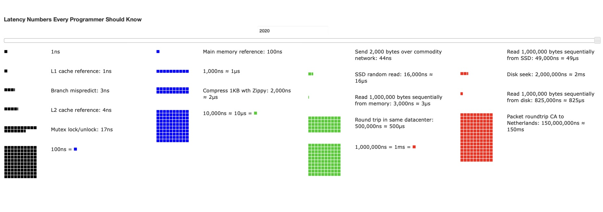

# My Software Engineering Notes

<details>
  <summary><h2 style='display: inline;'> Python </h2></summary>
  
### Decorators
Python decorators are a powerful feature that allows you to modify or extend the behavior of functions or methods without changing their actual code. They essentially allow you to wrap another function or method and execute code before and/or after the wrapped function runs. Decorators are typically denoted by the @ symbol followed by the decorator function name, placed just above the function definition.

Here's a basic example to illustrate how decorators work:

``` Python
def my_decorator(func):
    def wrapper():
        print("Something is happening before the function is called.")
        func()
        print("Something is happening after the function is called.")
    return wrapper

@my_decorator
def say_hello():
    print("Hello!")

say_hello()
```

In this example, my_decorator is a decorator function that takes another function func as its argument. Inside my_decorator, a nested function wrapper is defined, which wraps around the original function func. Inside wrapper, you can include code to be executed before and/or after calling func. Finally, the wrapper function is returned.

When you decorate the say_hello function with @my_decorator, Python essentially does this: say_hello = my_decorator(say_hello). So, when you call say_hello(), it actually calls the wrapper function created by my_decorator, which in turn calls the original say_hello function within it.

Some of the most common decorators used in Python include:

``` Python
@property # Used to define properties on classes, allowing you to define getter, setter, and deleter methods for attributes.

@classmethod # Declares a method within a class that takes the class itself as its first argument instead of the instance.

@staticmethod # Used to declare a method that belongs to the class but doesn't require access to the class or instance.

@abstractmethod # Used in abstract base classes to declare abstract methods, which must be implemented by subclasses.

@wraps # A decorator from the functools module used to preserve the metadata of the original function when creating wrapper functions. This is particularly useful for maintaining docstrings, function name, and other attributes.

@lru_cache # A decorator from the functools module that caches the results of a function, saving time when the same inputs occur again.
```

### Dunder Methods 

Dunder methods, short for "double underscore" methods, are special methods in Python that have names surrounded by double underscores, like `__init__`, `__repr__`, `__add__`, etc. They are also called magic methods or special methods.

These methods allow classes to define specific behavior that gets invoked in response to certain operations or interactions. For example, when you use the + operator with instances of a class, Python looks for the __add__ method to determine how to perform addition for those objects.

Here are some common dunder methods and their purposes:
``` Python
__init__(self, ...) # Constructor method that initializes a new instance of a class.
__repr__(self) # Method that returns a string representation of the object, used for debugging and logging.
__str__(self) # Method that returns a string representation of the object, used for informal representation to end-users.
__len__(self)# Method that returns the length of the object.
__getitem__(self, key) # Method that enables accessing elements of an object using square brackets, like obj[key].
```

### Iterators

An iterator in Python is an object that is used to iterate over iterable objects like lists, tuples, dicts, and sets. The Python iterators object is initialized using the `iter()` method. It uses the `next()` method for iteration.
``` Python
__iter__() # The iter() method is called for the initialization of an iterator. This returns an iterator object
__next__() # The next method returns the next value for the iterable. When we use a for loop to traverse any iterable object, internally it uses the iter() method to get an iterator object, which further uses the next() method to iterate over. This method raises a StopIteration to signal the end of the iteration.
```

``` Python
string = "GFG"
ch_iterator = iter(string)
 
print(next(ch_iterator)) # -> G
print(next(ch_iterator)) # -> F
print(next(ch_iterator)) # -> G
```

### Generators

A `Generator` in Python is a function that returns an iterator using the `Yield` keyword. In this article, we will discuss how the generator function works in Python.


### Yield 
`Generators` are a special type of iterable that allow you to iterate over a sequence of values lazily, meaning that they produce values on-the-fly as they are requested rather than generating the entire sequence upfront and storing it in memory.

When you use `yield` inside a function, it turns that function into a generator function. Instead of using return to return a single value and exit the function, yield is used to yield a value to the caller while suspending the state of the function. This allows the function to be resumed from where it left off the next time it is called.

Here's a simple example:
``` Python
def count_up_to(n):
    count = 1
    while count <= n:
        yield count
        count += 1

# Using the generator function
counter = count_up_to(5)
print(next(counter))  # Output: 1
print(next(counter))  # Output: 2
print(next(counter))  # Output: 3
```

In this example, count_up_to is a generator function that yields numbers from 1 up to n. When you call next(counter), it starts or resumes execution of the generator function until the next yield statement, where it yields the value and pauses execution. The function retains its state, so subsequent calls to next() continue from where it left off.

Using yield allows for memory-efficient iteration over large sequences, as only one value needs to be stored in memory at a time, unlike with lists where the entire sequence is stored. Additionally, it enables lazy evaluation, meaning that values are generated only when needed, which can improve performance in certain scenarios.

### Serialization
Serialization in Python refers to the process of converting complex data structures, such as objects or data collections, into a format that can be easily stored or transmitted and later reconstructed back into its original form. This process is essential for tasks like saving data to a file, sending data over a network, or storing data in a database.

Python provides several built-in modules for serialization, such as:

- pickle: This module can serialize Python objects into a binary format. It can handle almost any Python object, including custom classes and functions.

- json: This module serializes Python objects into a human-readable format called JSON (JavaScript Object Notation). JSON is commonly used for transmitting data between a server and a client over a network.

- marshal: This module is similar to pickle but is more restricted in terms of the types of objects it can serialize. It is primarily used for serializing Python code objects.

- shelve: This module provides a simple interface for persistently storing Python objects in a dictionary-like format.

Serialization is particularly useful for tasks like data storage, data exchange between different systems or languages, and caching. However, it's essential to consider security implications, especially when deserializing data, as it can lead to security vulnerabilities if not handled properly.


</details>
<details>
  <summary><h2 style='display: inline;'> Django </h2></summary>
  
### One-to-many Relations

- Use `ForeignKey`

- Related name makes it so that when you want to access an authors book set (by default RELATEDCLASSNAME_SET [book_set]) you use the provided related name 'books' instead of the default 'book_set'.

```class Books
    author = models.ForeignKey(Author, on_delete=models.CASCADE, null=True, related_name='books') # Can be null if no value is provided
```

### Many-to-many Relations
    
- Use `ManyToManyField`

```
# In this case, related_name is used to get all the books of a country by using 'books' (in this case) instead of 'book_set'
class Book
    published_countries = models.ManyToManyField(Country, related_name='books')
```

### One-to-One Relations    
    
- Use `OneToOneField`

- Related name is not needed here since Django automatically will link authors to the Address object it belongs to. This means you can access an author object from its adress like 'Address.objects.all()[0].author'

```
class Author
    address = models.OneToOneField(Address, on_delete=models.CASCADE, null=True)
```
</details>
<details>
  <summary><h2 style='display: inline;'> System Design </h2></summary>
  
### Fundamentals

<details>
  <summary><h4 style="display: inline;">Functional vs Non-Functional Requirements</h4></summary><br>

| Functional Requirements          | Non-Functional Requirements              |
|---------------------------------|-----------------------------------------|
| A functional requirement defines a system or its component. | A non-functional requirement defines the quality attribute of a software system. |
| It specifies “What should the software system do?” | It places constraints on “How should the software system fulfill the functional requirements?” |
| Functional requirement is specified by User. | Non-functional requirement is specified by technical peoples e.g. Architect, Technical leaders and software developers. |
| It is mandatory. | It is not mandatory. |
| It is captured in use case. | It is captured as a quality attribute. |
| Defined at a component level. | Applied to a system as a whole. |
| Helps you verify the functionality of the software. | Helps you to verify the performance of the software. |
| Functional Testing like System, Integration, End to End, API testing, etc are done. | Non-Functional Testing like Performance, Stress, Usability, Security testing, etc are done. |
| Usually easy to define. | Usually more difficult to define. |
| **Example**                      | **Example**                             |
| 1) Authentication of user whenever he/she logs into the system. | 1) Emails should be sent with a latency of no greater than 12 hours from such an activity. |
| 2) System shutdown in case of a cyber attack. | 2) The processing of each request should be done within 10 seconds |
| 3) A Verification email is sent to user whenever he/she registers for the first time on some software system. | 3) The site should load in 3 seconds when the number of simultaneous users are > 10000 |

</details>

### Napkin Math

- **1 Byte** = **8 bits** 
- **1 IPV4** Addresss = **4 Bytes**
- **1 IPV6** Address = **16 Bytes**
- **1 Unix Timestamp** = **4 Bytes**
- SSD: Solid State Drive

<details>
  <summary><h5 style="display: inline;">Latency Numbers Every Programmer Should Know</h5></summary><br>

[Latency Numbers Every Programmer Should Know](https://colin-scott.github.io/personal_website/research/interactive_latency.html)

This website is really useful so you can get an idea (it's a little outdated, 2020) of the latency (how much time it takes an operation to perform) when working with data.

[](https://github.com/CenturySturgeon/Notes/blob/main/images/LatencyNumbers.jpg)

</details>

#### Concepts I Found Interesting

<details>
  <summary><h5 style="display: inline;">CPU Cache Mutex Lock/Unlock</h5></summary><br>

In the context of CPU cache, mutex lock and unlock operations typically refer to synchronization mechanisms used in multi-threaded programming to control access to shared resources.

1. Mutex Lock:

- When a thread wants to access a shared resource (such as a region of memory or a data structure) that is cached in CPU cache, it first acquires a mutex lock associated with that resource.
- Acquiring a mutex lock ensures that only one thread can access the shared resource at a time. If the resource is already locked by another thread, the thread attempting to lock it will wait until the lock is released.

2. Mutex Unlock:

- Once a thread has finished using the shared resource, it releases the mutex lock by invoking the unlock operation.
- Releasing the mutex lock allows other threads to acquire the lock and access the shared resource.
- Mutex locks and unlocks help prevent race conditions and ensure that concurrent access to shared resources is properly coordinated, thereby avoiding data corruption and inconsistency.

In the context of CPU cache, when a thread acquires a mutex lock before accessing a shared resource that resides in the cache, it ensures that only one thread can access that resource at a time, even if multiple threads are running concurrently on different CPU cores. This helps maintain data integrity and consistency in multi-threaded applications.

</details>

### Software Technologies You Should Know

<details>
  <summary><h4 style="display: inline;">Redis</h4></summary><br>


Redis, **RE**mote **DI**ctionary **S**erver, is an open-source, in-memory data structure store used as a database, cache, and message broker. It supports various data structures such as strings, hashes, lists, sets, sorted sets with range queries, bitmaps, hyperloglogs, geospatial indexes, and streams. Redis is known for its high performance, flexibility, and rich set of features.

##### Key Features:

- **In-Memory Storage**: Redis primarily stores data in RAM, which allows for extremely fast data access and retrieval.
- **Data Structures**: It supports various data structures, enabling users to store and manipulate data efficiently.
- **Persistence**: Redis offers different persistence options to ensure data durability, including snapshotting and append-only file (AOF) persistence.
- **Replication and High Availability**: Redis supports replication and clustering, allowing for data redundancy and high availability.
- **Pub/Sub Messaging**: Redis can be used as a message broker through its publish/subscribe functionality.
- **Lua Scripting**: Users can extend Redis functionality using Lua scripting.
- **Transactions**: Redis supports transactions, allowing users to execute a group of commands as a single atomic operation.

##### Alternatives:

1. **Memcached**: Memcached is a distributed memory caching system that also stores key-value pairs. It is known for its simplicity and high-performance caching capabilities.

4. **Amazon DynamoDB**: DynamoDB is a fully managed NoSQL database service provided by Amazon Web Services (AWS). It offers seamless scalability, high performance, and built-in security features.

</details>

### Designing Systems & Components
<details>
  <summary><h4 style="display: inline;">Rate Limiter</h4></summary><br>

##### Requirements

1. Take 1 Billion (1x10^9 or 1,000,000,000) users.
2. Must be as general use as possible (multiple services use it).

Components you ended up using:
- Reddis: Sorted sets 
- Memcache
- Consistent Hashing

##### Algorithms

###### Fixed Window Algorithm for Rate limiters

We set a fix window of time, lets say every minute a user can send 100 requests, so everytime a new minute encompasses we refresh his available requests total to 100.

- Benefit: Since we're storing counts inside of the key value store in our memory, this is a very simplistic approach to take. We don't have to take into account when the requests were made exactly, we just care that they happened in the window -> we would just need to include the minute when checking for the availability.

- Issue with refresh rate of the algorithm: With a requests/per minute of a 100; if the user sends a request at 0:59 and then at 1:00 the valid window refreshes, the user could send another 100 requests at 1:01: in total 200 requests in a matter of 2 seconds

###### Sliding window

Any time a user makes a request we check if it is inside the invalid window, every second we shift this valid window by one second so the user can't take advantage of the refresh rate of the fixed window Algo.

- Benefit: Here we're checking if the user has expired his total amout of requests in the previous 60 seconds so we don't have the same refresh rate issue as the Fixed widow.

- Downside: We have to store the exact time-stamp when the user attempted to perform his requests. This increases our memory requirements since one Unix timestamp per request per user:

$4 \text{ Bytes} \times \text{Max\_No.Of\_Requests} \times \text{No\_Of\_Users} -> 4 * 100 * 1000000000 = 400GB$ 

##### Other Algorithms

- Token bucket
- Sliding Window Counter (Balance between Fixed Window and Sliding Window Algorithms)

##### Data Schemas

**Identify User and his count**
key -> Value
User_Id/Ip -> Count (Enforces count using rule)
*Redis can set data to expire

**Identify rule (youtube rate limiter rules may be different than gmail's)**

**Rule DB Schema**
| Parameeter | Type |
|----------|----------|
| Id   | String   |
| API To forward the request to   | Cell 4   |
| Operation/Endpoint   | String   |
| TimeUnit   | String   |
| Request   | Int   |

</details>

</details>
<details>
  <summary><h2 style='display: inline;'> Git </h2></summary>
  
### Connecting a new PC to your GitHub profile

1. Generate a token using the instructions from [Creating a personal access token](https://docs.github.com/en/authentication/keeping-your-account-and-data-secure/managing-your-personal-access-tokens):
   - GitHub profile -> Settings -> Developer Settings -> Personal access tokens

2. Open your git bash and set up the token using the following commands:

    ```bash
    git config --global credential.https://github.username <your_username>
    git config --global credential.https://github.com.token <your_token>
    ```

**REMEMBER:** Don't forget to set the token's permissions, even for public repositories!

### Removing a file added with `git add`

Just use `git reset <file>` and the file will be removed from the current index (the "about to be committed" list) without changing anything else.

To unstage **all files** from the current stage set use `git reset`

### Ignoring a previously tracked file

`.gitignore` will prevent untracked files from being added (without an add -f) to the set of files tracked by Git. However, Git will continue to track any files that are already being tracked.

To stop tracking a file, we must remove it from the index:
```bash
git rm --cached <file>
```

To remove a folder and all files in the folder recursively:
```bash
git rm -r --cached <folder>
```

The removal of the file from the head revision will happen on the next commit.

**WARNING**: While this will not remove the physical file from your local machine, it will remove the files from other developers' machines on their next git pull.

</details>
