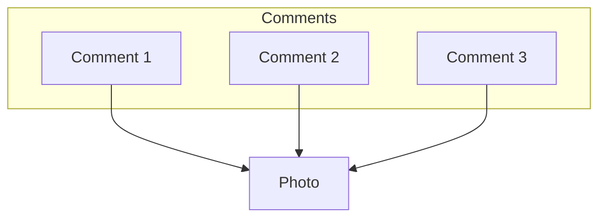

# My Software Engineering Notes
<details>
  <summary><h2 style='display: inline;'> Python </h2></summary>
  
### Decorators

---

Python decorators are a powerful feature that allows you to modify or extend the behavior of functions or methods without changing their actual code. They essentially allow you to wrap another function or method and execute code before and/or after the wrapped function runs. Decorators are typically denoted by the @ symbol followed by the decorator function name, placed just above the function definition.

Here's a basic example to illustrate how decorators work:

``` Python
def my_decorator(func):
    def wrapper():
        print("Something is happening before the function is called.")
        func()
        print("Something is happening after the function is called.")
    return wrapper

@my_decorator
def say_hello():
    print("Hello!")

say_hello()
```

In this example, my_decorator is a decorator function that takes another function func as its argument. Inside my_decorator, a nested function wrapper is defined, which wraps around the original function func. Inside wrapper, you can include code to be executed before and/or after calling func. Finally, the wrapper function is returned.

When you decorate the say_hello function with @my_decorator, Python essentially does this: say_hello = my_decorator(say_hello). So, when you call say_hello(), it actually calls the wrapper function created by my_decorator, which in turn calls the original say_hello function within it.

Some of the most common decorators used in Python include:

``` Python
@property # Used to define properties on classes, allowing you to define getter, setter, and deleter methods for attributes.

@classmethod # Declares a method within a class that takes the class itself as its first argument instead of the instance.

@staticmethod # Used to declare a method that belongs to the class but doesn't require access to the class or instance.

@abstractmethod # Used in abstract base classes to declare abstract methods, which must be implemented by subclasses.

@wraps # A decorator from the functools module used to preserve the metadata of the original function when creating wrapper functions. This is particularly useful for maintaining docstrings, function name, and other attributes.

@lru_cache # A decorator from the functools module that caches the results of a function, saving time when the same inputs occur again.
```

### Dunder Methods 

---

Dunder methods, short for "double underscore" methods, are special methods in Python that have names surrounded by double underscores, like `__init__`, `__repr__`, `__add__`, etc. They are also called magic methods or special methods.

These methods allow classes to define specific behavior that gets invoked in response to certain operations or interactions. For example, when you use the + operator with instances of a class, Python looks for the __add__ method to determine how to perform addition for those objects.

Here are some common dunder methods and their purposes:
``` Python
__init__(self, ...) # Constructor method that initializes a new instance of a class.
__repr__(self) # Method that returns a string representation of the object, used for debugging and logging.
__str__(self) # Method that returns a string representation of the object, used for informal representation to end-users.
__len__(self)# Method that returns the length of the object.
__getitem__(self, key) # Method that enables accessing elements of an object using square brackets, like obj[key].
```

### Iterators

---

An iterator in Python is an object that is used to iterate over iterable objects like lists, tuples, dicts, and sets. The Python iterators object is initialized using the `iter()` method. It uses the `next()` method for iteration.
``` Python
__iter__() # The iter() method is called for the initialization of an iterator. This returns an iterator object
__next__() # The next method returns the next value for the iterable. When we use a for loop to traverse any iterable object, internally it uses the iter() method to get an iterator object, which further uses the next() method to iterate over. This method raises a StopIteration to signal the end of the iteration.
```

``` Python
string = "GFG"
ch_iterator = iter(string)
 
print(next(ch_iterator)) # -> G
print(next(ch_iterator)) # -> F
print(next(ch_iterator)) # -> G
```

### Generators

---

`Generators` are a powerful feature that allow you to iterate over a sequence of items without storing them all in memory at once. They are implemented using a special type of function using `yield` expressions.

Here are key points about Python generators:

- Lazy Evaluation: Generators generate values on-the-fly as they are requested instead of generating them all at once and storing them in memory. This is achieved using the yield statement instead of return.

-Memory Efficiency: Since generators produce values one at a time, they are memory efficient especially for large datasets or infinite sequences.

- Iteration Support: Generators support iteration automatically, which means you can use them in loops or any other context that expects an iterable.

- State Maintenance: The state of local variables in a generator function is remembered between calls. This allows you to write complex iterative algorithms.

- Syntax: Generators are defined using a function that contains one or more yield statements. When called, they return a generator object, which can be iterated over using a for loop or by explicitly calling next() on it.

Here’s a simple example of a generator function that generates squares of numbers up to a given limit:

```Python
def square_generator(n):
    for i in range(n):
        yield i ** 2

# Using the generator
gen = square_generator(5)
for num in gen:
    print(num)

# Output:
# 0
# 1
# 4
# 9
# 16
```

Generators are specially handy when you want to access an array of values but don't want to store them in memory at once (like that API implementation problem you once saw).

### Yield 

---

`Generators` are a special type of iterable that allow you to iterate over a sequence of values lazily, meaning that they produce values on-the-fly as they are requested rather than generating the entire sequence upfront and storing it in memory.

When you use `yield` inside a function, it turns that function into a generator function. Instead of using return to return a single value and exit the function, yield is used to yield a value to the caller while suspending the state of the function. This allows the function to be resumed from where it left off the next time it is called.

Here's a simple example:
``` Python
def count_up_to(n):
    count = 1
    while count <= n:
        yield count
        count += 1

# Using the generator function
counter = count_up_to(5)
print(next(counter))  # Output: 1
print(next(counter))  # Output: 2
print(next(counter))  # Output: 3
```

In this example, count_up_to is a generator function that yields numbers from 1 up to n. When you call next(counter), it starts or resumes execution of the generator function until the next yield statement, where it yields the value and pauses execution. The function retains its state, so subsequent calls to next() continue from where it left off.

Using yield allows for memory-efficient iteration over large sequences, as only one value needs to be stored in memory at a time, unlike with lists where the entire sequence is stored. Additionally, it enables lazy evaluation, meaning that values are generated only when needed, which can improve performance in certain scenarios.

### Zip

---

The zip() function in Python is used to combine multiple iterables (lists, tuples, etc.) element-wise. It takes in two or more iterables as arguments and returns an iterator that generates tuples of corresponding elements from each iterable.

Here's a basic example:

```python
list1 = [1, 2, 3]
list2 = ['a', 'b', 'c']

zipped = zip(list1, list2)

for item in zipped:
    print(item)
# Output:

(1, 'a')
(2, 'b')
(3, 'c')
```

In this example, zip() pairs the first element of list1 with the first element of list2, the second element of list1 with the second element of list2, and so on.

One important thing to note about zip() is that it stops generating tuples as soon as one of the input iterables is exhausted. For example:

```python
list1 = [1, 2, 3]
list2 = ['a', 'b']

zipped = zip(list1, list2)

for item in zipped:
    print(item)
# Output:

(1, 'a')
(2, 'b')
```

Here, since list2 has only two elements, the third element of list1 is ignored.

If you want to get a list of tuples instead of an iterator, you can use the list() function to convert the iterator returned by zip() into a list:

```python
list1 = [1, 2, 3]
list2 = ['a', 'b', 'c']

zipped = list(zip(list1, list2))

print(zipped)
# Output:

[(1, 'a'), (2, 'b'), (3, 'c')]
```

zip() is commonly used in scenarios where you need to iterate over multiple lists simultaneously, especially when the lists are related and you want to process their elements together.

### Serialization

---

Serialization in Python refers to the process of converting complex data structures, such as objects or data collections, into a format that can be easily stored or transmitted and later reconstructed back into its original form. This process is essential for tasks like saving data to a file, sending data over a network, or storing data in a database.

Python provides several built-in modules for serialization, such as:

- pickle: This module can serialize Python objects into a binary format. It can handle almost any Python object, including custom classes and functions.

- json: This module serializes Python objects into a human-readable format called JSON (JavaScript Object Notation). JSON is commonly used for transmitting data between a server and a client over a network.

- marshal: This module is similar to pickle but is more restricted in terms of the types of objects it can serialize. It is primarily used for serializing Python code objects.

- shelve: This module provides a simple interface for persistently storing Python objects in a dictionary-like format.

Serialization is particularly useful for tasks like data storage, data exchange between different systems or languages, and caching. However, it's essential to consider security implications, especially when deserializing data, as it can lead to security vulnerabilities if not handled properly.

### Lambda Functions

---

Lambda functions in Python are small, anonymous functions defined using the lambda keyword. They are often used when you need a short function for a short period of time and don't want to define a full function using def.

#### Syntax
The syntax of a lambda function is:

```Python
lambda arguments: expression
```
- lambda is the keyword used to define a lambda function.
- arguments are the input parameters for the function.
- expression is a single expression that gets evaluated and returned as the result of the function.
#### Examples

##### Basic Example:

```Python
square = lambda x: x ** 2
print(square(5))  # Output: 25
```

Here, lambda x: x ** 2 defines a lambda function that takes one argument x and returns its square.

##### Using Multiple Arguments

```Python
add = lambda x, y: x + y
print(add(3, 4))  # Output: 7
```

This lambda function lambda x, y: x + y takes two arguments x and y and returns their sum.

##### In List Sorting
Lambda functions are often used in conjunction with built-in functions like sorted() or filter():

```Python
points = [(1, 2), (3, 1), (5, 4), (2, 7)]
points_sorted = sorted(points, key=lambda x: x[1])
print(points_sorted)  # Output: [(3, 1), (1, 2), (5, 4), (2, 7)]
```

Here, lambda x: x[1] specifies that the list should be sorted based on the second element of each tuple in points.

##### As an Argument to map()

```Python
numbers = [1, 2, 3, 4, 5]
squared = list(map(lambda x: x ** 2, numbers))
print(squared)  # Output: [1, 4, 9, 16, 25]
```

The lambda function lambda x: x ** 2 is applied to each element in numbers using map() to compute their squares.

#### Benefits of Lambda Functions
- Conciseness: They reduce the amount of code when a simple function is needed.
- Readability: Lambda functions can make code more readable when used appropriately, such as within map(), filter(), or sorted().
#### Limitations
- Single Expression: Lambda functions are restricted to a single expression, making them unsuitable for complex logic.
- No Statements: They cannot contain statements like return, pass, or assert.

Lambda functions are particularly useful in functional programming contexts where functions are treated as first-class citizens and are passed around as arguments or returned from other functions
</details>
<details>
  <summary><h2 style='display: inline;'> Django </h2></summary>
  
### One-to-many Relations

- Use `ForeignKey`

- Related name makes it so that when you want to access an authors book set (by default RELATEDCLASSNAME_SET [book_set]) you use the provided related name 'books' instead of the default 'book_set'.

```class Books
    author = models.ForeignKey(Author, on_delete=models.CASCADE, null=True, related_name='books') # Can be null if no value is provided
```

### Many-to-many Relations
    
- Use `ManyToManyField`

```
# In this case, related_name is used to get all the books of a country by using 'books' (in this case) instead of 'book_set'
class Book
    published_countries = models.ManyToManyField(Country, related_name='books')
```

### One-to-One Relations    
    
- Use `OneToOneField`

- Related name is not needed here since Django automatically will link authors to the Address object it belongs to. This means you can access an author object from its adress like 'Address.objects.all()[0].author'

```
class Author
    address = models.OneToOneField(Address, on_delete=models.CASCADE, null=True)
```
</details>
<details>
  <summary><h2 style='display: inline;'> System Design </h2></summary>
  
### Fundamentals

<details>
  <summary><h4 style="display: inline;">Functional vs Non-Functional Requirements</h4></summary><br>

| Functional Requirements          | Non-Functional Requirements              |
|---------------------------------|-----------------------------------------|
| A functional requirement defines a system or its component. | A non-functional requirement defines the quality attribute of a software system. |
| It specifies “What should the software system do?” | It places constraints on “How should the software system fulfill the functional requirements?” |
| Functional requirement is specified by User. | Non-functional requirement is specified by technical peoples e.g. Architect, Technical leaders and software developers. |
| It is mandatory. | It is not mandatory. |
| It is captured in use case. | It is captured as a quality attribute. |
| Defined at a component level. | Applied to a system as a whole. |
| Helps you verify the functionality of the software. | Helps you to verify the performance of the software. |
| Functional Testing like System, Integration, End to End, API testing, etc are done. | Non-Functional Testing like Performance, Stress, Usability, Security testing, etc are done. |
| Usually easy to define. | Usually more difficult to define. |
| **Example**                      | **Example**                             |
| 1) Authentication of user whenever he/she logs into the system. | 1) Emails should be sent with a latency of no greater than 12 hours from such an activity. |
| 2) System shutdown in case of a cyber attack. | 2) The processing of each request should be done within 10 seconds |
| 3) A Verification email is sent to user whenever he/she registers for the first time on some software system. | 3) The site should load in 3 seconds when the number of simultaneous users are > 10000 |

</details>

### Napkin Math

- **1 Byte** = **8 bits** 
- **1 IPV4** Addresss = **4 Bytes**
- **1 IPV6** Address = **16 Bytes**
- **1 Unix Timestamp** = **4 Bytes**
- SSD: Solid State Drive

<details>
  <summary><h5 style="display: inline;">Latency Numbers Every Programmer Should Know</h5></summary><br>

[Latency Numbers Every Programmer Should Know](https://colin-scott.github.io/personal_website/research/interactive_latency.html)

This website is really useful so you can get an idea (it's a little outdated, 2020) of the latency (how much time it takes an operation to perform) when working with data.


</details>

#### Concepts I Found Interesting

<details>
  <summary><h5 style="display: inline;">CPU Cache Mutex Lock/Unlock</h5></summary><br>

In the context of CPU cache, mutex lock and unlock operations typically refer to synchronization mechanisms used in multi-threaded programming to control access to shared resources.

1. Mutex Lock:

- When a thread wants to access a shared resource (such as a region of memory or a data structure) that is cached in CPU cache, it first acquires a mutex lock associated with that resource.
- Acquiring a mutex lock ensures that only one thread can access the shared resource at a time. If the resource is already locked by another thread, the thread attempting to lock it will wait until the lock is released.

2. Mutex Unlock:

- Once a thread has finished using the shared resource, it releases the mutex lock by invoking the unlock operation.
- Releasing the mutex lock allows other threads to acquire the lock and access the shared resource.
- Mutex locks and unlocks help prevent race conditions and ensure that concurrent access to shared resources is properly coordinated, thereby avoiding data corruption and inconsistency.

In the context of CPU cache, when a thread acquires a mutex lock before accessing a shared resource that resides in the cache, it ensures that only one thread can access that resource at a time, even if multiple threads are running concurrently on different CPU cores. This helps maintain data integrity and consistency in multi-threaded applications.

</details>

### Software Technologies You Should Know

<details>
  <summary><h4 style="display: inline;">Redis</h4></summary><br>


Redis, **RE**mote **DI**ctionary **S**erver, is an open-source, in-memory data structure store used as a database, cache, and message broker. It supports various data structures such as strings, hashes, lists, sets, sorted sets with range queries, bitmaps, hyperloglogs, geospatial indexes, and streams. Redis is known for its high performance, flexibility, and rich set of features.

##### Key Features:

- **In-Memory Storage**: Redis primarily stores data in RAM, which allows for extremely fast data access and retrieval.
- **Data Structures**: It supports various data structures, enabling users to store and manipulate data efficiently.
- **Persistence**: Redis offers different persistence options to ensure data durability, including snapshotting and append-only file (AOF) persistence.
- **Replication and High Availability**: Redis supports replication and clustering, allowing for data redundancy and high availability.
- **Pub/Sub Messaging**: Redis can be used as a message broker through its publish/subscribe functionality.
- **Lua Scripting**: Users can extend Redis functionality using Lua scripting.
- **Transactions**: Redis supports transactions, allowing users to execute a group of commands as a single atomic operation.

##### Alternatives:

1. **Memcached**: Memcached is a distributed memory caching system that also stores key-value pairs. It is known for its simplicity and high-performance caching capabilities.

4. **Amazon DynamoDB**: DynamoDB is a fully managed NoSQL database service provided by Amazon Web Services (AWS). It offers seamless scalability, high performance, and built-in security features.

</details>

### Designing Systems & Components
<details>
  <summary><h4 style="display: inline;">Rate Limiter</h4></summary><br>

##### Requirements

1. Take 1 Billion (1x10^9 or 1,000,000,000) users.
2. Must be as general use as possible (multiple services use it).

Components you ended up using:
- Reddis: Sorted sets 
- Memcache
- Consistent Hashing

##### Algorithms

###### Fixed Window Algorithm for Rate limiters

We set a fix window of time, lets say every minute a user can send 100 requests, so everytime a new minute encompasses we refresh his available requests total to 100.

- Benefit: Since we're storing counts inside of the key value store in our memory, this is a very simplistic approach to take. We don't have to take into account when the requests were made exactly, we just care that they happened in the window -> we would just need to include the minute when checking for the availability.

- Issue with refresh rate of the algorithm: With a requests/per minute of a 100; if the user sends a request at 0:59 and then at 1:00 the valid window refreshes, the user could send another 100 requests at 1:01: in total 200 requests in a matter of 2 seconds

###### Sliding window

Any time a user makes a request we check if it is inside the invalid window, every second we shift this valid window by one second so the user can't take advantage of the refresh rate of the fixed window Algo.

- Benefit: Here we're checking if the user has expired his total amout of requests in the previous 60 seconds so we don't have the same refresh rate issue as the Fixed widow.

- Downside: We have to store the exact time-stamp when the user attempted to perform his requests. This increases our memory requirements since one Unix timestamp per request per user:

$4 \text{ Bytes} \times \text{Max\_No.Of\_Requests} \times \text{No\_Of\_Users} -> 4 * 100 * 1000000000 = 400GB$ 

##### Other Algorithms

- Token bucket
- Sliding Window Counter (Balance between Fixed Window and Sliding Window Algorithms)

##### Data Schemas

**Identify User and his count**
key -> Value
User_Id/Ip -> Count (Enforces count using rule)
*Redis can set data to expire

**Identify rule (youtube rate limiter rules may be different than gmail's)**

**Rule DB Schema**
| Parameeter | Type |
|----------|----------|
| Id   | String   |
| API To forward the request to   | Cell 4   |
| Operation/Endpoint   | String   |
| TimeUnit   | String   |
| Request   | Int   |

</details>

</details>
<details>
  <summary><h2 style='display: inline;'> Algorithms </h2></summary>
  
### Big O Notation
***


#### Static Arrays
***


| Operation | Big-O Time | Notes                                                                 |
|-----------|------------|-----------------------------------------------------------------------|
| Reading   | O(1)       | Reading an element by index is constant time.                         |
| Insertion | O(n)*      | Insertion at the end of the array 'push( )' is typically O(1) on average. However, resizing may occasionally lead to O(n) time complexity. |
| Deletion  | O(n)*      | Deletion from the end of the array 'pop( )' is typically O(1) on average. However, resizing may occasionally lead to O(n) time complexity. |

#### Dynamic Arrays (Python Lists)
***

| Operation | Big-O Time | Notes                                                                                           |
|-----------|------------|-------------------------------------------------------------------------------------------------|
| Reading   | O(1)       | Reading an element by index is constant time, similar to regular arrays.                         |
| Insertion | O(1)*      | Insertion at the end of the list ('append()' operation) is typically O(1) on average. However, inserting in the middle requires shifting, leading to O(n) time complexity. |
| Deletion  | O(1)*      | Deletion from the end of the list ('pop()' operation) is typically O(1) on average. However, deleting from the middle requires shifting, leading to O(n) time complexity. |

**Notes**: Insertion and deletion at the end of a Python list (using methods like 'append()' and 'pop()') are also usually O(1) because Python dynamically manages memory for the list and avoids resizing the array too often. However, as mentioned in the notes, if insertion or deletion happens in the middle of the list, it requires shifting elements, resulting in an O(n) time complexity due to the need to move subsequent elements.

#### Stacks
***

| Operation | Big-O Time | Notes                                                                                           |
|-----------|------------|-------------------------------------------------------------------------------------------------|
| Push      | O(1)       |                                                                                                 |
| Pop       | O(1)*      | Check if the stack is empty first.                                                              |
| Peek/Top  | O(1)*      | Retrieves without removing.                                                                     |

#### Linked Lists (1 Direction)
***

| Operation | Big-O Time | Notes                                                     |
|-----------|------------|-----------------------------------------------------------|
| Access    | O(n)       |                                                           |
| Search    | O(n)*      |                                                           |
| Insertion | O(1)*      | Assuming you have the reference to the desired position.  |
| Deletion  | O(1)*      | Assuming you have the reference to the desired position.  |

#### Linked List (2 Directions)
***

| Operation | Big-O Time | Notes                                                     |
|-----------|------------|-----------------------------------------------------------|
| Access    | O(n)       |                                                           |
| Search    | O(n)*      |                                                           |
| Insertion | O(1)*      | Assuming you have the reference to the desired position.  |
| Deletion  | O(1)*      | Assuming you have the reference to the desired position.  |

#### Queues
***


| Operation | Big-O Time | Notes                                                     |
|-----------|------------|-----------------------------------------------------------|
| Enqueue   | O(1)       |                                                           |
| Dequeue   |  O(1)      |                                                           |

#### Binary Trees
***

| Operation       | Big-O Time | Notes                                              |
|-----------------|------------|----------------------------------------------------|
| Search          | O(log n)   | Depends on the height of the binary tree           |
| Insertion       | O(log n)   | Depends on the height of the binary tree           |
| Deletion        | O(log n)   | Depends on the height of the binary tree           |
| Traversal       | O(n)       | In-order, Pre-order, Post-order traversals         |
| Finding height  | O(n)       | Worst case if the tree is unbalanced               |
| Finding depth   | O(n)       | Worst case if the tree is unbalanced               |
| Finding minimum | O(log n)   | Traverse left until you reach the leftmost leaf    |
| Finding maximum | O(log n)   | Traverse right until you reach the rightmost leaf  |

#### Heaps
***

| Operation        | Big-O Time | Notes                                       |
|------------------|------------|---------------------------------------------|
| Insertion        | O(log n)   | Heapify up operation                        |
| Deletion (Root)  | O(log n)   | Heapify down operation                      |
| Search           | O(n)       | Linear search through the array             |
| Extract Minimum  | O(log n)   | Removal of the root followed by heapify down |
| Extract Maximum  | O(log n)   | Removal of the root followed by heapify down |
| Peek Minimum     | O(1)       | Accessing the root                           |
| Peek Maximum     | O(1)       | Accessing the root                           |
| Heapify          | O(n)       | Building a heap from an unsorted array       |
| Merge            | O(n log n) | Building a new heap from two existing heaps  |

#### Hashmaps
***

| Operation       | Average Case | Worst Case  | Notes                                               |
|-----------------|--------------|-------------|-----------------------------------------------------|
| Insertion       | O(1)         | O(n)        | Depends on load factor and collision resolution    |
| Deletion        | O(1)         | O(n)        | Depends on load factor and collision resolution    |
| Search          | O(1)         | O(n)        | Depends on load factor and collision resolution    |
| Access          | O(1)         | O(n)        | Depends on load factor and collision resolution    |
| Collision Avoid.| -            | O(n)        | Depends on implementation and hashing algorithm    |
| Rehashing       | O(n)         | O(n)        | Depends on the number of elements and load factor  |


#### Sorting algorithms
***

| Algorithm    | &nbsp; &nbsp; &nbsp; &nbsp; &nbsp; &nbsp; &nbsp; &nbsp; &nbsp; &nbsp; &nbsp; Time Complexity  &nbsp; &nbsp; &nbsp; &nbsp; &nbsp; &nbsp; &nbsp; &nbsp;| Space Complexity |
|--------------|--------------------------------------------|------------------|

|                | Best       | Average    | Worst      | Worst            |
|----------------|------------|------------|------------|------------------|
| Mergesort      | O(n log n) | O(n log n) | O(n log n) | O(n)             |
| Quicksort      | O(n log n) | O(n log n) | O(n^2)     | O(log n) - O(n)  |
| Insertion Sort | O(n)       | O(n^2)     | O(n^2)     | O(1)             |
| Bucket Sort    | O(n+k)     | O(n+k)     | O(n^2)     | O(n)             |


### Saved for later

#### Prefix Sum with Dictionary
https://leetcode.com/problems/continuous-subarray-sum/solutions/5276981/prefix-sum-hashmap-patterns-7-problems
</details>
<details>
  <summary><h2 style='display: inline;'> SQL </h2></summary>
  
Standard Query Language

To run PostgreSQL online use [pg-sql](https://pg-sql.com)

### Notes
- In SQL, keywords are written in capital letters (like `SELECT`) while variables are written in lower-case (like a column name).
- SQL doesn't execute queries from left to right. It's important to understand this when writing queries so you comprehend what's going on behing the scenes as its very useful when writing complicated queries.
- NULL value means that specific table cell is empty.


### Key Concepts

- **Schema**: The blueprint of a table. It's a set of instructions that define the data relationships between tables, the columns of a table, its value types, constraints, etc.
- **Index**:
- **Primary Key**: Uniquely identifies this record in this table. Commonly an integer or a UUID.
- **Foregin key**: Identifies a record (usually in another table) that this row is associated with. Like a photo mapped to a user_id.
- **Keywords**: Tell the database that we want to do something. Always written in capital letters (`CREATE TABLE` are some examples).
- **Identifiers**: Tell the database what thing we want to act on. Always written in lower 
case letters.

| Relationship | Hint                                                                     |
|--------------|--------------------------------------------------------------------------|
| One-To-Many  | "A user has many photos".                                                |
| Many-To-One  | "Many photos belong to a user".                                          |
| Many-To-Many | "Many students have many classes" <-> "Many classes have many students". |
| One-To-One   | "A boat has a single captain" <-> "A captain belongs to a single boat".  |

| FK ON DELETE Option | Description                                                               |
|---------------------|---------------------------------------------------------------------------|
| `NO ACTION`         | **The default option**; raises an error if there are dependent rows.      |
| `RESTRICT`          | Similar to `NO ACTION`; raises an error if there are dependent rows.      |
| `CASCADE`           | Deletes all rows that have a foreign key referencing the deleted row.     |
| `SET NULL`          | Sets the foreign key column in the referencing rows to `NULL`.            |
| `SET DEFAULT`       | Sets the foreign key column in the referencing rows to its default value. |


### Comparisson Math Operators

Comparisson Math Operators are very useful when filtering out information (I.E when using the `WHERE` key word).

| Operator | Description                  |
|----------|------------------------------|
| =        | Equal                        |
| <>       | Not equal                    |
| >        | Greater than                 |
| <        | Less than                    |
| >=       | Greater than or equal        |
| <=       | Less than or equal           |
| NOT IN   | Value isn't present          |
| IN       | Is value present ?           |
| BETWEEN  | Value in between two others? |
| AND      | Used to join logical ops     |
| OR       | Used to join logical ops     |


### Functions

Here's a markdown table listing some common PostgreSQL functions formatted in uppercase:

| Function                   | Description                                                            |
|----------------------------|------------------------------------------------------------------------|
| ||                         | Concatenates two strings                                               |
| CONCAT(string1, string2, ...) | Concatenates strings                                                |
| UPPER(string)              | Converts string to uppercase                                           |
| LOWER(string)              | Converts string to lowercase                                           |
| LENGTH(string)             | Returns the length of a string                                         |
| ABS(expression)            | Absolute value                                                         |
| AVG(expression)            | Average value of a set of numbers                                      |
| COUNT(expression)          | Number of rows in a result set or number of times an expression occurs |
| MAX(expression)            | Maximum value of a set of numbers                                      |
| MIN(expression)            | Minimum value of a set of numbers                                      |
| SUM(expression)            | Sum of a set of numbers                                                |
| ROUND(expression, precision) | Rounds a numeric value to a specified precision                      |
| COALESCE(expression1, expression2, ...) | Returns the first non-null expression in the list         |
| SUBSTRING(string FROM start FOR length) | Extracts substring from a string                          |
| NOW()                      | Current date and time                                                  |
| DATE_PART('unit', timestamp) | Extracts a specific part (e.g., year, month) from a timestamp        |

### Agregate Functions


---


### PostgreSQL Column Types

| Data Type                  | Description                            | Capacity/Range                                                                                     |
|----------------------------|----------------------------------------|----------------------------------------------------------------------------------------------------|
| `bigint`                   | Signed eight-byte integer              | -9,223,372,036,854,775,808 to 9,223,372,036,854,775,807                                            |
| `bigserial`                | Autoincrementing eight-byte integer    | 1 to 9,223,372,036,854,775,807                                                                     |
| `bit(n)`                   | Fixed-length bit string                | Up to 1,048,576 bits (131,072 bytes)                                                               |
| `bit varying(n)`           | Variable-length bit string             | Up to 1,048,576 bits (131,072 bytes)                                                               |
| `boolean`                  | Logical Boolean (true/false)           | true or false                                                                                      |
| `box`                      | Rectangular box on a plane             | Represented by two points                                                                          |
| `bytea`                    | Binary data ("byte array")             | Up to 1 GB                                                                                         |
| `character(n)`             | Fixed-length character string          | Up to 1 billion characters                                                                         |
| `character varying(n)`     | Variable-length character string       | Up to 1 billion characters                                                                         |
| `cidr`                     | IPv4 or IPv6 network address           | IPv4: 0.0.0.0/0 to 255.255.255.255/32<br>IPv6: ::/0 to ffff:ffff:ffff:ffff:ffff:ffff:ffff:ffff/128 |
| `circle`                   | Circle on a plane                      | Defined by a center (point) and a radius                                                           |
| `date`                     | Calendar date (year, month, day)       | 4713 BC to 5874897 AD                                                                              |
| `double precision`         | Double precision floating-point number | 15 decimal digits precision                                                                        |
| `inet`                     | IPv4 or IPv6 host address              | IPv4: 0.0.0.0 to 255.255.255.255<br>IPv6: :: to ffff:ffff:ffff:ffff:ffff:ffff:ffff:ffff            |
| `integer`                  | Signed four-byte integer               | -2,147,483,648 to 2,147,483,647                                                                    |
| `interval`                 | Time interval                          | -178000000 years to 178000000 years                                                                |
| `json`                     | JSON data format                       | 1 GB                                                                                               |
| `jsonb`                    | Binary JSON data format                | 1 GB                                                                                               |
| `line`                     | Infinite line on a plane               | Defined by a point and a direction vector                                                          |
| `lseg`                     | Line segment on a plane                | Defined by two points                                                                              |
| `macaddr`                  | MAC (Media Access Control) address     | 6 bytes, formatted as XX:XX:XX:XX:XX:XX                                                            |
| `money`                    | Currency amount                        | -922,337,203,685,477.5808 to +922,337,203,685,477.5807                                             |
| `numeric(p, s)`            | Exact numeric of selectable precision  | Up to 131,072 digits before the decimal point; up to 16,383 digits after the decimal point         |
| `path`                     | Geometric path on a plane              | Sequence of points                                                                                 |
| `pg_lsn`                   | Log sequence number                    | 64-bit unsigned integer                                                                            |
| `point`                    | Geometric point on a plane             | Coordinate (x, y)                                                                                  |
| `polygon`                  | Closed geometric path on a plane       | Sequence of points forming a closed loop                                                           |
| `real`                     | Single precision floating-point number | 6 decimal digits precision                                                                         |
| `smallint`                 | Signed two-byte integer                | -32,768 to 32,767                                                                                  |
| `smallserial`              | Autoincrementing two-byte integer      | 1 to 32,767                                                                                        |
| `serial`                   | Autoincrementing four-byte integer     | 1 to 2,147,483,647                                                                                 |
| `text`                     | Variable-length character string       | Up to 1 billion characters                                                                         |
| `time`                     | Time of day (no time zone)             | 00:00:00 to 24:00:00                                                                               |
| `timestamp`                | Date and time (no time zone)           | 4713 BC to 294276 AD                                                                               |
| `timestamp with time zone` | Date and time (including time zone)    | 4713 BC to 294276 AD                                                                               |
| `tsquery`                  | Text search query                      | Sequence of lexemes                                                                                |
| `tsvector`                 | Text search document                   | Sequence of lexemes                                                                                |
| `txid_snapshot`            | User-level transaction ID snapshot     | Varies                                                                                             |
| `uuid`                     | Universally unique identifier          | 128-bit number (UUID)                                                                              |
| `xml`                      | XML data                               | Unlimited size                                                                                     |

### Relationship Types

#### One-To-Many

One-to-many relationships can be easilly identified by the frase "has many" as in the following examples:

- A classroom `has many` students.
- An office `has many` workers.
- A house `has many` people living in it.

#### Many-To-One

Many-to-one relationships are the same as one-to-many, they're just viewed from the other side of the relationship.

- Many students `have one` classroom.
- Many workers `have one` office.
- Many people live in a house.

#### One-To-One 

One-to-one relationships are the simplest to understand and identify as they express one way roads between to objects.

- One company `has one` CEO.
- One country `has one` capitol.
- One person `has one` drivers license.

#### Many-To-Many

Many-to-many relationships are the most complex to identify because they imply that multiple records from one entity can be related to multiple records from another entity. These relationships are typically identified by the use of `many-to-many` or `have many` keywords, which must be applied from both perspectives.

- Movies `have many` actors. <-> Many actors `have many` movies.
- Many conference calls `have many` employees. <-> Many employees `have many` conference calls.
- A google doc can be edited by `many` users at the same time. <-> A single user can edit `many` different documents.

The last example from Google Docs might be easier to understand, as its opposite would be a one-to-one relationship: `A document can only be edited by a single user. <-> A user can only edit a single document`.
Another example is building a database for an E-Commerce application where you need to track which users purchase which product categories. In this context, many-to-many relationships are evident because `Users can purchase products from many different categorys. <-> Each kind of product can be purchased by many different users.`


---


### Primary Keys

- Primary Keys uniquely identify a record in a table, 
- They are usually an integer or an UUID. 
- **There can't be two rows with the same primary key in a table**.

Below is an example of how a primary key `PK` looks like in a table.

#### Users Table

| id INTEGER, PK | username VARCHAR (50) | email VARCHAR (50) |
|----------------|-----------------------|--------------------|
| 1              | user1                 | user1@example.com  |
| 2              | user2                 | user2@example.com  |
| 3              | user3                 | user3@example.com  |
| ...            | ...                   | ...                |

As you can see, the `id` field on each table is a **Primary Key**, and the `user_id` field on the `Photos` table is a **Foreign Key**

##### Notes:
- Even when you delete or modify records **the primary key will not change**, which ensures that all records can be consistently accessed using the PK.
- **Primary Key (PK)**: `id` columns are marked as primary keys ensuring each row has a unique identifier.


### Foreign Keys

Foreign keys in a relational database are columns (or combinations of columns) that establish and enforce a link between data in two tables. They create a parent-child relationship between the tables, where the child table contains values that match values in the primary key column(s) of the parent table.

- Rows can  **only have this if they belong to another record**.
- Many rows can have the same foreign key.
- Name varies, usually called something like **"xyz_id"**.
- **Exactly equal to the primary key of the referenced row**.
- Changes if the relationship changes.

You might find it easier to understand by thinking how Instagram handles its comments. Each comment belongs to a photo were it was written, so in the comments table you would have a foreign key for each comment pointing at its photo (the one where the comment was written into).



Another great example comes from the tables below, notice how the `photos` table records reference a specific user using it's `id` (the Foreign Key).

#### Users Table

| id INTEGER, PK | username VARCHAR (50) | email VARCHAR (50) |
|----------------|-----------------------|--------------------|
| 1              | user1                 | user1@example.com  |
| 2              | user2                 | user2@example.com  |
| 3              | user3                 | user3@example.com  |
| ...            | ...                   | ...                |

#### Photos Table

| id INTEGER, PK | url VARCHAR (50) | user_id (FK, points to users record) |
|----------------|------------------|--------------------------------------|
| 1              | [url_1]          | 1                                    |
| 2              | [url_2]          | 3                                    |
| 3              | [url_3]          | 2                                    |
| ...            | ...              | ...                                  |

As you can see, the `id` field on each table is a **Primary Key**, and the `user_id` field on the `Photos` table is a **Foreign Key**

##### Notes:
- Even when you delete or modify records **the primary key will not change**, which ensures that all records can be consistently accessed using the PK.
- **Primary Key (PK)**: `id` columns are marked as primary keys (`PK`) in both tables, ensuring each row has a unique identifier.
- **Foreign Key (FK)**: In the `photos` table, `user_id` is a foreign key that references the `id` column in the `users` table, establishing a relationship between photos and users.
- **Data Types**: `url` and `email` are specified as `varchar(50)`, indicating the expected character limits for these columns.
  
These tables provide a basic structure for modeling photos and users in a database schema, demonstrating the use of primary keys, foreign keys, and column data types as per your requirements. Adjustments can be made based on specific database management system requirements or additional constraints.

```SQL
-- Create the users table
CREATE TABLE users (
  -- Serial means it auto-generates a value when a record is addedALTER
  -- Primary Key adds special performance benefits when looking for records
  id SERIAL PRIMARY KEY,
  user_name VARCHAR(50)
);
-- Insert some data into the users table
INSERT INTO users (user_name) VALUES ('Juan'), ('Jose'), ('Luis'), ('x123');

-- Create photos table
CREATE TABLE photos (
    id SERIAL PRIMARY KEY,
    url VARCHAR(50),
    -- Name the column as 'user_id' which holds the link to the users table
    -- References keyword is used to specify the table and the column for the Foreign Key relationship
    user_id INTEGER REFERENCES users(id)
);

-- Insert values into the photos table using the foregin key
INSERT INTO photos (url, user_id) VALUES ('http://one.jpg', 4), ('http://tg3223.jpg', 3),
('http://two.jpg', 2), ('http://on234e.jpg', 1), ('http://o23.jpg', 1);
```

Below are some examples of some queries that show how to use the foreign key constraints in a useful way:

```SQL
-- Select all photos that were posted by the user whos id is 4.
SELECT * FROM photos WHERE user_id = 1;

-- List all photos with details about the associated user for each
SELECT * FROM photos JOIN users ON users.id = photos.user_id;

-- Note in this variation of the above query, columns of both tables are available thanks to the JOIN
-- url exists on the photos table while user_name exists on the user table
SELECT url, user_name FROM photos JOIN users ON users.id = photos.user_id;
```

#### ON DELETE Options

When deleting records that have children rows pointing at them (via the foreign key), it's necessary to specify the behavior this child row should have as its foreign key value will become inexistent. Here's where `ON DELETE` options come into play; **they define the actions that take place when the refered record of a foreign key column gets deleted**.

- These `ON DELETE` options **must be placed inside the table schema that has the foreign key sentence**.

| FK ON DELETE Option     | Description                                                               |
|-------------------------|---------------------------------------------------------------------------|
| `ON DELETE NO ACTION`   | **The default option**; raises an error if there are dependent rows.      |
| `ON DELETE RESTRICT`    | Similar to `NO ACTION`; raises an error if there are dependent rows.      |
| `ON DELETE CASCADE`     | Deletes all rows that have a foreign key referencing the deleted row.     |
| `ON DELETE SET NULL`    | Sets the foreign key column in the referencing rows to `NULL`.            |
| `ON DELETE SET DEFAULT` | Sets the foreign key column in the referencing rows to its default value. |

```SQL
-- Create photos table
CREATE TABLE photos (
    id SERIAL PRIMARY KEY,
    url VARCHAR(50),
    -- Set the ON DELETE action for this foreign key column
    -- If the user_id row gets deleted this record will be deleted as well
    user_id INTEGER REFERENCES users(id) ON DELETE CASCADE
);
```

These delete options are very useful in day-to-day applications like blogs. If you delete a blog post you probably don't want to keep around its comments in your DB (**ON DELETE CASCADE**). In some cases you might want to keep the information, like in Reddit that when a user gets deleted his comments remain there but with a `deleted` user tag (**ON DELETE SET NULL**).


### Joins


---


### Common Queries

#### Create Table

```SQL
CREATE TABLE table_name (
    column_title COLUMN_TYPE(optional_value)
);
```

#### Insert Single/Multiple Values Into A Table

To insert a single value just write a single set of parenthesis with column values.

```SQL
INSERT INTO table_name (column_name1, column_name2) VALUES 
(column1_value1, column2_value1)
(column1_value2, column2_value2)
(column1_value3, column2_value3),
;
```

#### Retrieving Information From A Table

Select all records from table:
```SQL
SELECT * FROM table_name;
```

Select specific columns from table:
```SQL
SELECT column_name, column2_name FROM table_name;
```
**Note**: The order of the columns is the order of their printing. You can also print the same column multiple times.

You can perform operations between columns when retrieving information:
```SQL
SELECT column_1, column_2 / column_3 FROM table_name;
```
**Note**: If your operation's result goes beyond what the column can store you will get an error. For example, if you use INTEGER as the column type and the result of a multiplication of two columns goes over its capacity (2,147,483,648) you will get an `Integer out of range` error.

When performing operations on retrieval, new columns will come out with weird names. To rename the result column:
```SQL
SELECT column_1, column_2 * column_3 AS result_column_name FROM table_name;
```

Concatenating column values as strings:
```SQL
SELECT column_1 || ', ' || column_2  AS concatenated_column_name FROM table_name;
```

The same as above but using CONCAT() instead of '||':
```SQL
SELECT CONCAT(column_1, ', ', column_2) FROM table_name;
```

#### Filtering Out Records

Use the WHERE key word to filter data by using it in pair with comparisson or math operators.

```SQL
SELECT column_1, column_2 WHERE column_1 > 5000 FROM table_name;
```


```SQL
SELECT column_1, column_2 FROM table_name WHERE column_1 BETWEEN 5 AND 10;
```

Below you'll find a neat trick; using a list of possible values for an IN check in a query:

```SQL
SELECT column_1, column_2 FROM table_name WHERE column_1 IN (possible_value_1, possible_value_2, ...);
```

You could also use a negative filter to get all records whose column_1 is not in the list by using the `NOT IN` key words. Note that you can chain as many AND and OR operators as you want.

```SQL
SELECT column_1, column_2 FROM table_name WHERE column_1 IN (possible_value_1, possible_value_2) AND column_2 = 'arbitrary_value';
```

#### Updating & Deleting Records

To update records you use the `UPDATE` and `SET` key words.

```SQL
UPDATE table_name SET column_1 = 5000 WHERE column_2 = 'arbitrary_value';
```

To delete records you use the `DELETE` key word. Be sure to **NEVER FORGET THE `FROM` STATEMENT**!

```SQL
DELETE FROM table_name WHERE column_1 = 5;
```

### Query Examples

```SQL
CREATE TABLE movies (
    title VARCHAR(60),
    box_office INTEGER
);
```

```SQL
INSERT INTO movies (title, box_office)
VALUES 
    ('The Avengers', 1500000000),
    ('Batman v Superman', 873000000);
```

```SQL
SELECT title, box_office FROM movies;
```

### Excercises
</details>
<details>
  <summary><h2 style='display: inline;'> Git </h2></summary>
  
### Connecting a new PC to your GitHub profile

1. Generate a token using the instructions from [Creating a personal access token](https://docs.github.com/en/authentication/keeping-your-account-and-data-secure/managing-your-personal-access-tokens):
   - GitHub profile -> Settings -> Developer Settings -> Personal access tokens

2. Open your git bash and set up the token using the following commands:

    ```bash
    git config --global credential.https://github.username <your_username>
    git config --global credential.https://github.com.token <your_token>
    ```

**REMEMBER:** Don't forget to set the token's permissions, even for public repositories!

### Removing a file added with `git add`

Just use `git reset <file>` and the file will be removed from the current index (the "about to be committed" list) without changing anything else.

To unstage **all files** from the current stage set use `git reset`

### Ignoring a previously tracked file

`.gitignore` will prevent untracked files from being added (without an add -f) to the set of files tracked by Git. However, Git will continue to track any files that are already being tracked.

To stop tracking a file, we must remove it from the index:
```bash
git rm --cached <file>
```

To remove a folder and all files in the folder recursively:
```bash
git rm -r --cached <folder>
```

The removal of the file from the head revision will happen on the next commit.

**WARNING**: While this will not remove the physical file from your local machine, it will remove the files from other developers' machines on their next git pull.

</details>
